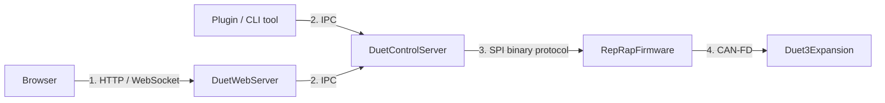
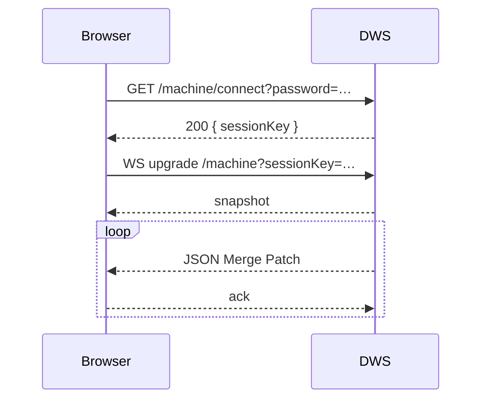
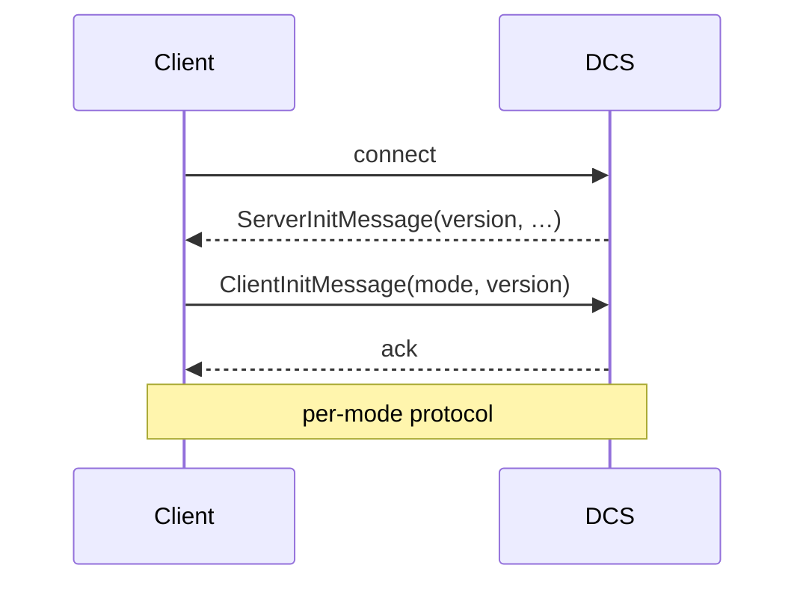
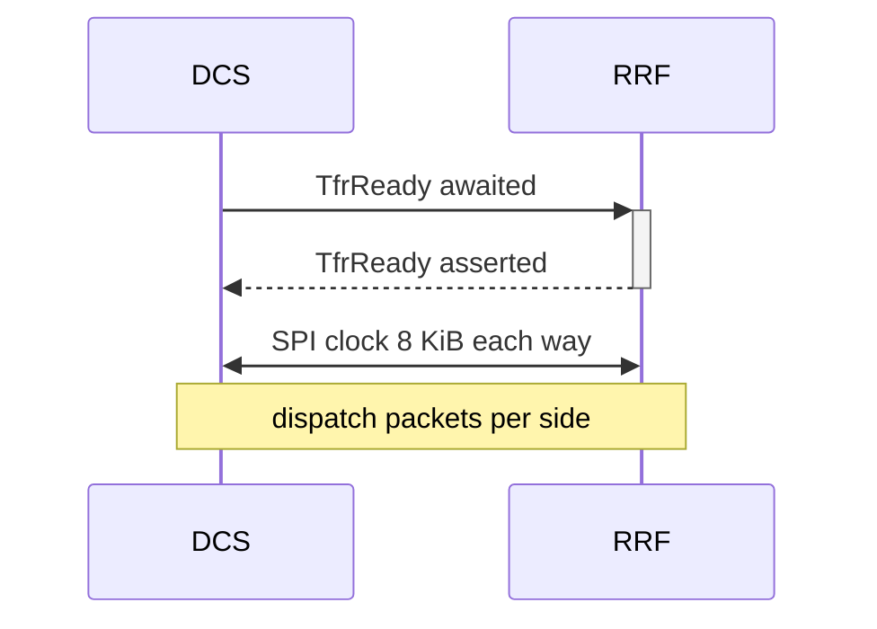
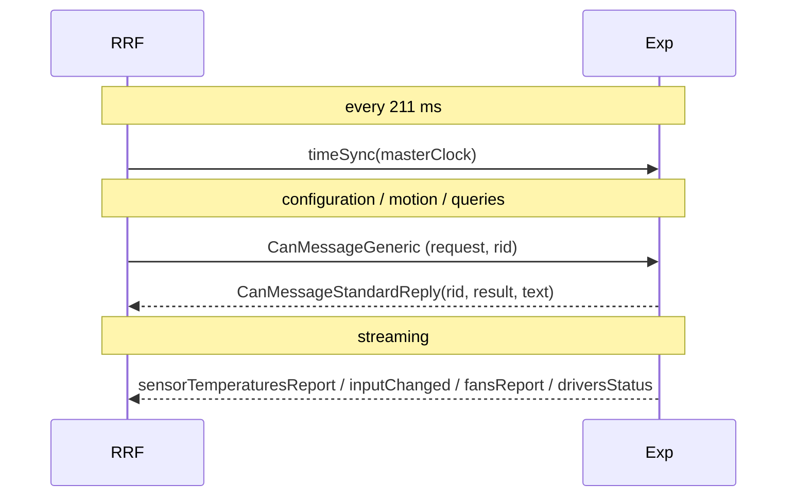

# Communication Protocols (cross-repo reference)

Four distinct protocol stacks knit the Duet3D system together. This document is a side-by-side reference. For deep dives, follow the per-repo links.

## 1. HTTP / WebSocket — Browser ↔ DWS

| Property | Value |
|---|---|
| Direction | Bidirectional. Push notifications via WebSocket. |
| Transport | TCP, optionally TLS (recommended via reverse proxy). |
| Wire format | JSON (REST), JSON Merge Patch (WebSocket). |
| Auth | `X-Session-Key` header / `?sessionKey=` query string. Sessions opened via `/machine/connect`. |
| Versioning | Documented in [`OpenAPI.yaml`](../../OpenAPI.yaml); current `apiLevel` baked into RRF and visible in `boards[0].apiLevel`. |
| Reference | [HTTP_API.md](../devel/HTTP_API.md), [`OpenAPI.yaml`](../../OpenAPI.yaml). |

Two URL families coexist: the modern `/machine/*` and the legacy `rr_*` (preserved for older DWC and 3rd-party tools).

## 2. IPC — Unix-domain socket to DCS

| Property | Value |
|---|---|
| Path | `/var/run/dsf/dcs.sock` |
| Direction | Bidirectional, JSON-framed. |
| Auth | OS-level: directory permissions on `/var/run/dsf`. Members of the `dsf` group only. |
| Modes | `Command`, `Intercept`, `Subscribe`, `CodeStream`, `PluginService` ([Modes/ConnectionMode.cs](../../src/DuetAPI/Connection/Modes/ConnectionMode.cs)). |
| Versioning | Server `MinimumProtocolVersion` (currently 7) gates client compatibility. |
| Reference | [IPC_PROTOCOL.md](../devel/IPC_PROTOCOL.md). |

Library: [`DuetAPIClient`](../../src/DuetAPIClient) provides typed connection classes for .NET; for Python/Node a plain socket + JSON works.

## 3. SPI binary protocol — DCS ↔ RRF

| Property | Value |
|---|---|
| Transport | SPI master (DCS) ↔ SPI slave (RRF). Plus a TransferReady GPIO that RRF toggles. |
| Wire format | Fixed-size 8 KiB transfers in each direction. `TransferHeader` + N `Packet`s. |
| Direction | Both sides exchange data on **every** transfer. |
| Auth | None — physical interface, single point-to-point. |
| Versioning | `SbcProtocolVersion` (currently **7**) on RRF must equal `Defaults.ProtocolVersion` in DSF. CRC mismatches trigger resend. |
| Reference | [DSF SPI_LINK.md](../devel/SPI_LINK.md), [RRF SBC_INTERFACE.md](https://github.com/Duet3D/RepRapFirmware/blob/3.7-docker/docs/devel/SBC_INTERFACE.md). |

Packet types (all defined in [`SbcMessageFormats.h`](https://github.com/Duet3D/RepRapFirmware/blob/3.7-docker/src/SBC/SbcMessageFormats.h) and mirrored in [`Link/Protocol/`](../../src/DuetControlServer/Link/Protocol)):

- **DCS → RRF (`SbcRequest`)** — codes, OM queries, file results, IAP, locks, variables.
- **RRF → DCS (`FirmwareRequest`)** — OM patches, replies, file requests, macro execution, evaluation results.

## 4. CAN-FD — RRF ↔ expansion / tool boards

| Property | Value |
|---|---|
| Transport | CAN-FD bus, 2 Mbps data phase typical. |
| Wire format | CANlib message structs (single source of truth in `CANlib/src/CanMessageFormats.h`). |
| Addressing | Master at 0; slaves up to `CanId::MaxCanAddress`. |
| Direction | Master-initiated for commands; slaves push streaming data and replies. |
| Auth | None — physical bus. |
| Versioning | CANlib commit identity. Both firmwares **must** be built from a compatible CANlib version. |
| Reference | [RRF CAN_BUS.md](https://github.com/Duet3D/RepRapFirmware/blob/3.7-docker/docs/devel/CAN_BUS.md), [Duet3Expansion CAN_PROTOCOL.md](https://github.com/Duet3D/Duet3Expansion/blob/3.7-docker/docs/devel/CAN_PROTOCOL.md). |

Message families summarised: setup / discovery, time-sync, configuration, motion, I/O, generic forwarded, telemetry. See the per-repo docs for the complete table.

## 5. Bridges between protocols

| Bridge | Where it lives | What it does |
|---|---|---|
| HTTP `/machine/code` → IPC `Code` | [DWS MachineController](../../src/DuetWebServer/Controllers/MachineController.cs) | Translates an HTTP code request into an IPC Code command. |
| IPC `Code` → SPI `SbcRequest.Code` | [DCS pipeline Firmware stage](../../src/DuetControlServer/Codes/Pipelines/Firmware.cs) | Final pipeline stage packs binary code into an SPI packet. |
| SPI `Code` → CAN forward | [RRF GCodes2.cpp](https://github.com/Duet3D/RepRapFirmware/blob/3.7-docker/src/GCodes/GCodes2.cpp) + [RRF CanInterface](https://github.com/Duet3D/RepRapFirmware/blob/3.7-docker/src/CAN/CanInterface.cpp) | Codes addressed to a remote board are forwarded as `CanMessageGeneric`. |
| `seqs` push → IPC subscribe → WS patch | [DCS Model.UpdateService](../../src/DuetControlServer/Model/UpdateService.cs) | RRF's sequence numbers drive what DCS requests, what subscribers receive, and what DWC re-renders. |
| File proxy | [RRF SBC file ops](https://github.com/Duet3D/RepRapFirmware/blob/3.7-docker/src/SBC/SbcInterface.cpp) ↔ [DCS FilePathResolver](../../src/DuetControlServer/Files/FilePathResolver.cs) | Maps RRF-side `0:/sys/config.g` to host `/opt/dsf/sd/sys/config.g` and back. |

## 6. Backpressure and reliability

| Layer | Mechanism |
|---|---|
| HTTP / WS | Standard TCP windowing; WS ack frames provide application-level pacing. |
| IPC | Connection-local buffer; `CodeStream` uses an explicit buffer-size cap. |
| SPI | CRC over data + header, resend mechanism via `resendPacketId`; per-channel buffer-space accounting (`CodeBufferUpdate`). |
| CAN | Hardware retransmits within the silicon; multi-frame messages discard on missing fragments and rely on application-level retry (e.g. `SendRequestAndGetStandardReply` timeout). |

## 7. Diagnostics

Every layer surfaces stats:

- HTTP/WS — counted by ASP.NET Core; logs in `journalctl -u duetwebserver`.
- IPC — `M122` against DCS reports per-connection stats.
- SPI — `M122` reports transfers/sec, codes/sec, max delays, resend count.
- CAN — `M122 P1` and `M122 B<addr>` report bus stats and per-board stats; `boards[N]` in the OM tracks last-seen.

## 8. Where this connects to the rest of the documentation

- [SYSTEM_ARCHITECTURE.md](SYSTEM_ARCHITECTURE.md) — overview.
- [GCODE_FLOW.md](GCODE_FLOW.md) — example of all four protocols in sequence.
- [DEPLOYMENT_MODES.md](DEPLOYMENT_MODES.md) — how the active set of protocols changes with the deployment.
- Per-repo dives are linked from each protocol section above.
