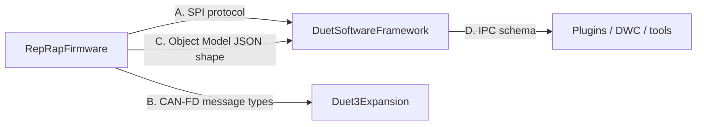
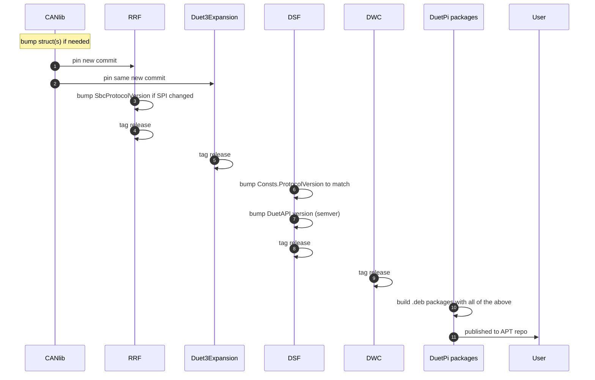

# Cross-Repo Version Compatibility

A working Duet3D system is the intersection of three independently-versioned repositories. This document lists the compatibility contracts between them, where they live in source, and how a release coordinator (or a developer staging local changes) keeps them in sync.

## 1. The four contracts



| Contract | Hosts | Implication of mismatch |
|---|---|---|
| A. SPI protocol | RRF `SbcProtocolVersion`, DSF `Defaults.ProtocolVersion`, buffer size constants. | DCS exits with code 502 ("Incompatible DCS version") at first contact. |
| B. CAN-FD message types | CANlib submodule pinned in both RRF and Duet3Expansion. | Silent on-wire misinterpretation. Hard to diagnose without M122 P1. |
| C. Object Model schema | RRF descriptor tables ↔ DSF `DuetAPI.ObjectModel` C# classes. | Missing fields silently dropped; type mismatches log warnings. |
| D. IPC schema | DSF `IPC.Server.MinimumProtocolVersion` ↔ client libraries. | Older client refused at IPC handshake. |

## 2. Where the contracts live in source

### A. SPI protocol

| Side | File | Symbol |
|---|---|---|
| RRF | [src/SBC/SbcMessageFormats.h](../../../RepRapFirmware/src/SBC/SbcMessageFormats.h) | `SbcProtocolVersion`, `SbcTransferBufferSize`, `SbcFormatCode` |
| DSF | [src/DuetControlServer/Link/Protocol/Shared/Consts.cs](../../src/DuetControlServer/Link/Protocol/Shared/Consts.cs), [src/DuetAPI/Connection/Defaults.cs](../../src/DuetAPI/Connection/Defaults.cs) | `Consts.ProtocolVersion`, `Consts.BufferSize` |

A bump on either side without the other = first-contact failure.

### B. CAN-FD types

The CANlib submodule is **the** source of truth. Both RRF and Duet3Expansion vendor the same commit:

```
RepRapFirmware/CANlib  →  same commit as
Duet3Expansion/CANlib
```

Any struct change must be made in CANlib and both firmwares must be rebuilt against the new submodule SHA. The build-system check is implicit: each firmware's binary embeds CANlib types verbatim, and a struct mismatch produces wrong field offsets at runtime.

### C. Object Model

| Side | Where | Mechanism |
|---|---|---|
| RRF | descriptor tables in `*.cpp` files (e.g. [Move.cpp](../../../RepRapFirmware/src/Movement/Move.cpp), [Heat.cpp](../../../RepRapFirmware/src/Heating/Heat.cpp)) | macro-defined `objectModelTable[]` |
| DSF | C# classes in [DuetAPI.ObjectModel](../../src/DuetAPI/ObjectModel) | typed properties; source generator builds JSON serialisation |

A new field needs both sides updated; the source generator regenerates the JSON glue automatically. A deletion needs both sides; transitional `[ObsoleteAttribute]` on the C# side helps third parties migrate.

### D. IPC schema

| Side | File | Symbol |
|---|---|---|
| DSF server | [src/DuetControlServer/IPC/Server.cs](../../src/DuetControlServer/IPC/Server.cs) | `Server.MinimumProtocolVersion` |
| DSF client lib | [src/DuetAPI/Connection/Defaults.cs](../../src/DuetAPI/Connection/Defaults.cs) | `Defaults.ProtocolVersion` |

Older clients (lower than `MinimumProtocolVersion`) are refused at handshake. Newer clients targeting a server that doesn't have a feature get a graceful "command not supported" reply.

## 3. The compatibility table

The exact compatibility matrix is published with each DSF release. As a rule:

| RRF | Compatible DSF | Compatible Duet3Expansion |
|---|---|---|
| 3.4.x | 3.4.x | 3.4.x (CANlib commit aligned with RRF 3.4.x) |
| 3.5.x | 3.5.x | 3.5.x |
| 3.6.x | 3.6.x | 3.6.x |
| 3.7.x | 3.7.x | 3.7.x |

Within a major.minor, all three repos are released together to ensure compatibility. Mixing RRF 3.5 with DSF 3.4 is not supported.

## 4. Release process at a glance



Bumping CANlib or `SbcProtocolVersion` is a **major** trigger event — every component above is republished.

## 5. Local development

If you are working across repos:

- Keep all three checked out as siblings:
  ```
  Duet3D/
  ├── RepRapFirmware
  ├── Duet3Expansion
  └── DuetSoftwareFramework
  ```
- Pin RRF and Duet3Expansion's CANlib submodule to the same commit on a shared branch.
- For SPI changes, increment the version constants in lockstep on both sides before merging either.
- For OM changes, add the field on both sides (RRF + DSF C#) in the same change; CI in DSF runs the source generator and the unit tests will fail loudly if a JSON tag is missing.

## 6. Detecting a mismatch in the field

| Symptom | Likely contract |
|---|---|
| DCS exits with code 502 at startup | A. SPI protocol mismatch |
| Random "bad packet CRC" or "bad data length" floods | A. SPI buffer-size mismatch |
| Expansion board appears in `boards[]` but motion is wrong | B. CAN message struct mismatch |
| DWC shows blank fields where data should be | C. OM schema (DSF lacks the property) |
| External tool refused at `connect` with `IncompatibleVersionException` | D. IPC schema |

`M122` against the running system surfaces all of these:

- DCS dump shows the SPI / IPC versions.
- RRF dump shows `SbcProtocolVersion` and CAN bus error counters.
- Expansion-board dumps (`M122 B<addr>`) show their CANlib build identity.

## 7. Where this connects to the rest of the documentation

- [SYSTEM_ARCHITECTURE.md](SYSTEM_ARCHITECTURE.md) — the system overview.
- Per-repo build matrix — [RRF BUILD_VARIANTS](../../../RepRapFirmware/docs/devel/BUILD_VARIANTS.md), [Duet3Expansion BUILD_VARIANTS](../../../Duet3Expansion/docs/devel/BUILD_VARIANTS.md), [DSF BUILD_VARIANTS](../devel/BUILD_VARIANTS.md).
- The protocol versions in the wild — [DSF SPI_LINK.md](../devel/SPI_LINK.md), [RRF SBC_INTERFACE.md](../../../RepRapFirmware/docs/devel/SBC_INTERFACE.md).
