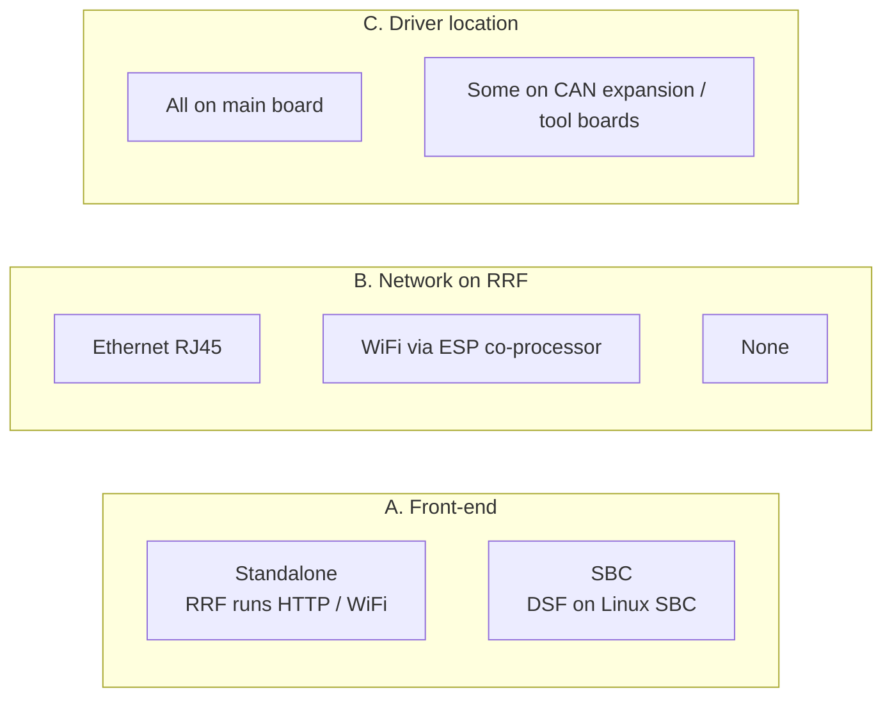
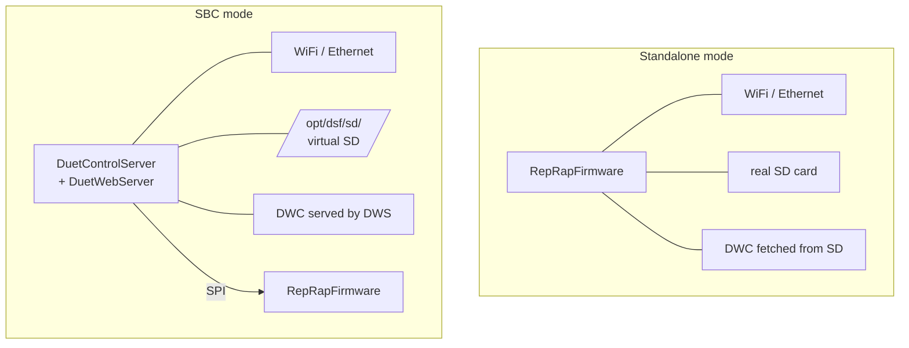
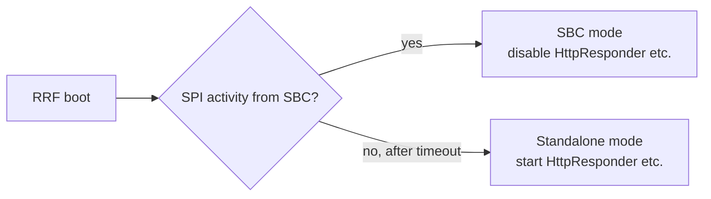
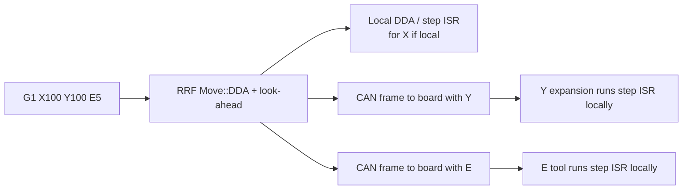
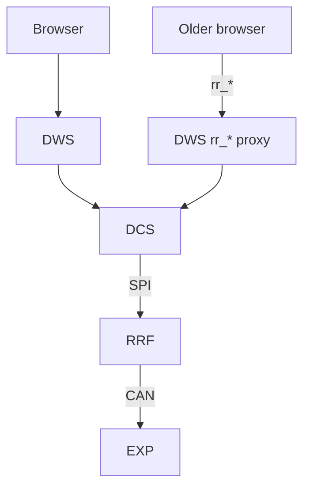

# Deployment Modes

A single Duet 3 board supports several deployment topologies. This document lists what is supported, what changes between them, and where the per-mode code branches live.

## 1. The three axes of choice

The active configuration is the cartesian product of three independent axes:

Three axes, but not every combination is sensible. A printer can be:

| Mode | Notes |
|---|---|
| **Standalone, no CAN** | Smallest footprint; Duet 2 Maestro / Mini 5+ entry-level. RRF owns everything: HTTP, file system, motion, heat, fans. |
| **Standalone + CAN** | Common Duet 3 setup without an SBC. RRF still owns HTTP and file system; some drivers / sensors live on CAN. |
| **SBC, no CAN** | Duet 3 Mini 5+ with Pi attached. DSF owns HTTP and file system; all motion is local to the main board. |
| **SBC + CAN** | The reference Duet 3 setup. DSF on the Pi; CAN tool board + expansion board. The full stack as described in [SYSTEM_ARCHITECTURE.md](SYSTEM_ARCHITECTURE.md). |

## 2. What changes when DSF appears

| Subsystem | Standalone owner | SBC mode owner |
|---|---|---|
| HTTP server | RRF [`HttpResponder`](../../../RepRapFirmware/src/Networking/HttpResponder.cpp) | DSF [`DuetWebServer`](../../src/DuetWebServer) |
| File system | FAT on Duet SD card | ext4 on SBC, mapped via [DSF FilePathResolver](../../src/DuetControlServer/Files/FilePathResolver.cs) |
| Network stack | LwIP / W5500 / WiFi-coproc on RRF | Linux kernel network stack on SBC |
| FTP / Telnet | RRF [`FtpResponder`](../../../RepRapFirmware/src/Networking/FtpResponder.cpp), [`TelnetResponder`](../../../RepRapFirmware/src/Networking/TelnetResponder.cpp) | (replace with system-level services on SBC) |
| MQTT | RRF [`MQTT`](../../../RepRapFirmware/src/Networking/MQTT) | DSF [`Utility.MQTT`](../../src/DuetControlServer/Utility/MQTT.cs) |
| Plugin runtime | not available | DSF `DuetPluginService` |
| OM consumer for DWC | DWC in browser polls `M409` via `rr_*` URLs | DWC in browser opens WebSocket to DWS, receives JSON Merge Patches |

The firmware binary is the **same** in both modes; the difference is whether it sees the SPI link come up. `HAS_SBC_INTERFACE` is set at compile time on Duet 3 boards, but the SBC task simply remains idle in standalone mode.

## 3. Detection

The handshake is the SPI format-code byte: `0x5F` (`SbcFormatCode`) means "DSF is here", `0x60` means "running standalone". RRF interprets the format code on its first transfer:

- If DSF is present, RRF tells DSF to take over.
- If RRF is alone, it brings up its own network stack.

## 4. What changes when CAN expansion appears

A move addressed to a remote driver fans out to that driver's board over CAN:

Without CAN, the same code path simply produces only local DDA / step pulses. From a user's perspective, `M584 Y0.1` (Y on board 1) and `M584 Y4` (Y on local driver 4) work identically — the abstraction is owned by `DriverId`.

## 5. Combining modes

The four modes are not exclusive — they layer:

In SBC + CAN mode, the standalone `HttpResponder` / `FtpResponder` paths inside RRF are dormant — DWS provides the equivalent endpoints, and the legacy `rr_*` URLs are proxied by [`RepRapFirmwareController`](../../src/DuetWebServer/Controllers/RepRapFirmwareController.cs).

## 6. Switching modes

| Switch | Steps |
|---|---|
| Standalone → SBC | Power off, attach SBC. Set up DuetPi. Boot — DSF auto-takes-over on first SPI handshake. SD-card files are not migrated automatically; copy them to `/opt/dsf/sd`. |
| SBC → Standalone | Stop / disable `duetcontrolserver.service`. Detach SBC. Reset Duet — RRF will fall back to its own HTTP server. Restore SD card content. |
| Add a CAN board | Power on the new board. Run `M952 P<old-addr> A<new-addr>` to assign an address. The new board appears in `boards[]`. Configure drivers/sensors with `M584` etc. that reference its driver IDs (`<addr>.<drv>`). |

The mode change does not require firmware changes — these are runtime decisions.

## 7. Limitations of each mode

| Limitation | Affects |
|---|---|
| No plugin runtime in standalone | Anything that needed a Linux process; many DWC plugins still work because they're pure browser-side. |
| No real file system in standalone | Storage limited to SD card, no macros / packages. |
| Slower DWC start in standalone | DWC bundle is served from FAT-on-SD; slower than DWS reverse-proxy. |
| Lower throughput without burst mode | Some lower-end SBCs (Pi Zero 2 W) can't sustain burst mode at 50 codes/sec; SBC mode without burst limits to ~20 codes/sec. |
| No M998 / checksums in DSF | Documented incompatibility — DSF doesn't replicate that legacy gate. |

## 8. Where this connects to the rest of the documentation

- Detailed list of feature flags that select compile-time variants — [RRF BUILD_VARIANTS](../../../RepRapFirmware/docs/devel/BUILD_VARIANTS.md), [Duet3Expansion BUILD_VARIANTS](../../../Duet3Expansion/docs/devel/BUILD_VARIANTS.md), [DSF BUILD_VARIANTS](../devel/BUILD_VARIANTS.md).
- The SPI link's "format code" handshake — [DSF SPI_LINK.md](../devel/SPI_LINK.md), [RRF SBC_INTERFACE.md](../../../RepRapFirmware/docs/devel/SBC_INTERFACE.md).
- The CAN handshake / address assignment — [Duet3Expansion CAN_PROTOCOL.md](../../../Duet3Expansion/docs/devel/CAN_PROTOCOL.md).
