# Execution Call Diagrams

This document maps the major execution paths through **RepRapFirmware in standalone mode** and through the **DSF + RRF + Duet3Expansion stack in SBC mode**.

It is intentionally complete at the **class/module and major function boundary** for the user-visible paths listed below. It does **not** try to expand every low-level helper, math routine, or vendor-library call inside those boundaries. The focus is on the code that decides control flow, owns state, or crosses task/process/board boundaries.

Covered paths:

1. Single G-code execution from Duet Web Control
2. Printing a G-code file
3. Running a macro
4. Requesting the object model
5. Evaluating meta G-code
6. Expansion board configuration
7. Expansion board status update

## 1. Reading the diagrams

| Boundary type | Meaning |
|---|---|
| HTTP / WebSocket | Browser-to-server boundary. In standalone this terminates in RRF. In SBC mode it terminates in DWS. |
| IPC | `DuetWebServer`, plugins, and tools talking to `DuetControlServer` over the DSF Unix socket. |
| SPI / USB SBC link | `DuetControlServer` talking to RRF through `SbcInterface`. |
| CAN-FD | RRF talking to Duet3Expansion boards. |
| RTOS task / ISR | A transition from cooperative logic into a dedicated task or interrupt-driven execution path. |
| Repo box / subgraph | Sequence-diagram boxes and flowchart subgraphs show whether a participant belongs to DSF, RRF, or Duet3Expansion. |

## 2. Core Class And Module Maps

### 2.1 Standalone RepRapFirmware Core

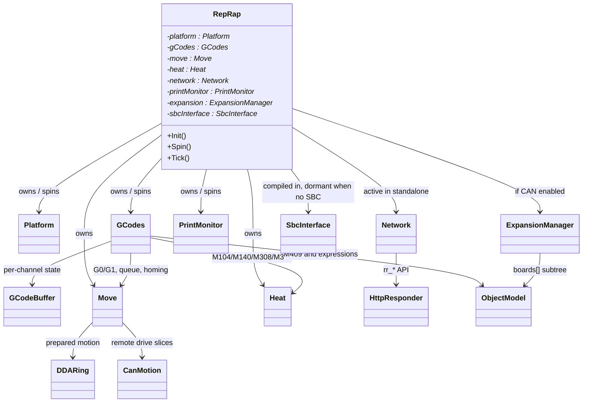

### 2.2 SBC Stack: DWS + DCS + RRF + Duet3Expansion

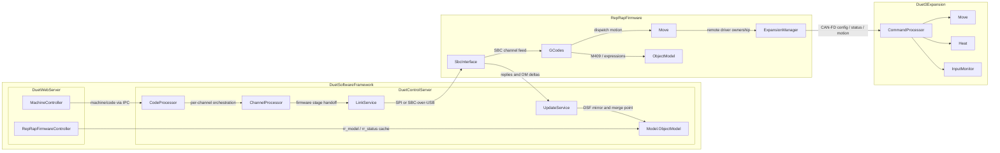

### 2.3 Detailed SBC Ownership And Execution Map

This map is anchored in [Program.cs](../../src/DuetControlServer/Program.cs), [LinkService.cs](../../src/DuetControlServer/Link/LinkService.cs), [UpdateService.cs](../../src/DuetControlServer/Model/UpdateService.cs), and [CodeProcessor.cs](../../src/DuetControlServer/Codes/CodeProcessor.cs) on the DSF side; [RepRap.h](https://github.com/Duet3D/RepRapFirmware/blob/3.7-docker/src/Platform/RepRap.h), [RepRap.cpp](https://github.com/Duet3D/RepRapFirmware/blob/3.7-docker/src/Platform/RepRap.cpp), [GCodes.cpp](https://github.com/Duet3D/RepRapFirmware/blob/3.7-docker/src/GCodes/GCodes.cpp), [SbcInterface.h](https://github.com/Duet3D/RepRapFirmware/blob/3.7-docker/src/SBC/SbcInterface.h), and [CanInterface.cpp](https://github.com/Duet3D/RepRapFirmware/blob/3.7-docker/src/CAN/CanInterface.cpp) on the RRF side; and [Tasks.cpp](https://github.com/Duet3D/Duet3Expansion/blob/3.7-docker/src/Platform/Tasks.cpp), [CommandProcessor.cpp](https://github.com/Duet3D/Duet3Expansion/blob/3.7-docker/src/CommandProcessing/CommandProcessor.cpp), [Move.cpp](https://github.com/Duet3D/Duet3Expansion/blob/3.7-docker/src/Movement/Move.cpp), and [Heat.cpp](https://github.com/Duet3D/Duet3Expansion/blob/3.7-docker/src/Heating/Heat.cpp) on the Duet3Expansion side. Every node below corresponds to a direct ownership edge, task root, dispatch point, or protocol crossover that is visible in the current source.

```mermaid
flowchart TB
  Browser["DWC or other HTTP and WebSocket client"]

  subgraph DSF["DuetSoftwareFramework"]
    direction TB

    subgraph DWS["DuetWebServer"]
      direction TB
      DwsStartup["Startup.ConfigureServices and Configure"]
      MachineCtrl["MachineController\nmachine endpoints including machine/code"]
      RrfCtrl["RepRapFirmwareController\nrr_gcode rr_model rr_status"]
      WsCtrl["WebSocketController\nmachine patch stream"]
      CmdConn["DuetAPIClient.CommandConnection"]
      SubConn["DuetAPIClient.SubscribeConnection"]

      DwsStartup --> MachineCtrl
      DwsStartup --> RrfCtrl
      DwsStartup --> WsCtrl
      MachineCtrl -->|BuildConnection and PerformSimpleCodeAsync| CmdConn
      RrfCtrl -->|BuildConnection and PerformSimpleCodeAsync| CmdConn
      RrfCtrl -->|GetObjectModelAsync| CmdConn
      WsCtrl -->|ConnectAsync SubscriptionMode.Patch| SubConn
    end

    subgraph DCS["DuetControlServer"]
      direction TB
      DcsProgram["Program.cs host builder"]
      AddCodes["AddCodes"]
      AddLink["AddLink"]
      AddLinkAdapter["AddLinkAdapter"]
      AddModel["AddModel"]

      CodeProcessor["CodeProcessor"]
      ChannelProcessor["ChannelProcessor"]
      Pipeline["Start / Pre / ProcessInternally / Post / Firmware / Executed"]

      ChannelManager["Link.Channel.Manager"]
      LinkChannel["Link.Channel.Processor per valid channel"]
      LinkInterface["LinkInterface\nModelQueryRequests\nMessagesToSend\nFirmwareUpdateLock"]
      LinkService["LinkService.Execute\nchannels.Spin\nWriteGetObjectModel\nHandleOpen Read Write DeleteFile"]
      Adapter["Adapter.SPI or Adapter.USB"]

      DsfModel["Model.ObjectModel"]
      Observer["Observer"]
      UpdateSvc["UpdateService"]
      PeriodicSvc["PeriodicUpdateService"]
      TriggerSvc["SbcTriggerService"]

      DcsProgram --> AddCodes
      DcsProgram --> AddLink
      DcsProgram --> AddLinkAdapter
      DcsProgram --> AddModel

      AddCodes --> CodeProcessor
      AddCodes --> ChannelProcessor
      CodeProcessor --> ChannelProcessor
      ChannelProcessor --> Pipeline
      CodeProcessor -->|firmware stage state| LinkChannel

      AddLink --> ChannelManager
      ChannelManager --> LinkChannel

      AddLinkAdapter --> LinkInterface
      AddLinkAdapter --> LinkService
      LinkService --> ChannelManager
      LinkChannel --> LinkInterface
      LinkService -->|consumes queued model queries and outbound messages| LinkInterface
      LinkService --> Adapter

      AddModel --> DsfModel
      AddModel --> Observer
      AddModel --> UpdateSvc
      AddModel --> PeriodicSvc
      AddModel --> TriggerSvc

      UpdateSvc -->|RequestObjectModel and merge firmware JSON| LinkInterface
      UpdateSvc --> DsfModel
      PeriodicSvc -->|host network volume updates and internal M550 M552 M905| CodeProcessor
      Observer -->|subscribes to OM property changes| DsfModel
      TriggerSvc -->|OnPropertyPathChanged watchers| Observer
      TriggerSvc -->|fires M581.1 trigger codes via CodeFactory| CodeProcessor
    end
  end

  subgraph RRF["RepRapFirmware main board"]
    direction TB
    RepRapInit["RepRap::Init"]
    RepRapSpin["RepRap::Spin"]
    PlatformRRF["Platform"]
    NetworkRRF["Network not activated in SBC mode"]
    GCodes["GCodes"]
    NormalInput["Normal input\nGetNormalInput FillBuffer"]
    FileInput["File input\nReadFromFile and FillBuffer"]
    PrintMon["PrintMonitor"]
    FilamentMon["FilamentMonitor"]
    HeatRRF["Heat"]
    RemoteHeater["RemoteHeater"]
    MoveRRF["Move"]
    MoveLoopRRF["Move::MoveLoop\nstepsTimer.SetCallback Move::TimerCallback"]
    StepTimerRRF["StepTimer"]
    CanMotion["CanMotion"]
    CanInterfaceRRF["CanInterface"]
    CanClockRRF["CanClockLoop"]
    CanReceiverRRF["CanReceiverLoop"]
    ExpansionMgr["ExpansionManager"]
    SbcIf["SbcInterface\nTaskLoop FillBuffer\nOpen Read Write DeleteFile"]
    DataTransfer["DataTransfer"]
    LedMgrRRF["Platform ledStripManager"]
    LocalLedRRF["Local LED strip implementations"]
    RemoteLedRRF["RemoteLedStrip"]
    OmRRF["Object model descriptors\nRepRap Platform Move Heat Expansion"]

    RepRapInit --> PlatformRRF
    RepRapInit --> NetworkRRF
    RepRapInit --> SbcIf
    RepRapInit --> GCodes
    RepRapInit --> MoveRRF
    RepRapInit --> HeatRRF
    RepRapInit --> PrintMon
    RepRapInit --> ExpansionMgr
    RepRapInit --> CanInterfaceRRF

    PlatformRRF --> LedMgrRRF
    LedMgrRRF --> LocalLedRRF
    LedMgrRRF --> RemoteLedRRF

    RepRapSpin --> PlatformRRF
    RepRapSpin --> GCodes
    RepRapSpin --> PrintMon
    RepRapSpin --> FilamentMon
    RepRapSpin --> ExpansionMgr

    GCodes --> NormalInput
    GCodes --> FileInput
    GCodes --> SbcIf
    GCodes --> HeatRRF
    GCodes --> MoveRRF
    GCodes --> LedMgrRRF
    GCodes --> OmRRF

    SbcIf --> DataTransfer
    SbcIf -->|SBC channel feed and file proxy callbacks| GCodes
    SbcIf --> OmRRF

    HeatRRF --> RemoteHeater
    RemoteHeater --> CanInterfaceRRF

    MoveRRF --> MoveLoopRRF
    MoveLoopRRF -->|arms callback timer| StepTimerRRF
    StepTimerRRF -->|runs callback list including Move::TimerCallback| MoveRRF
    MoveRRF --> CanMotion
    CanMotion --> CanInterfaceRRF

    CanInterfaceRRF --> CanClockRRF
    CanInterfaceRRF --> CanReceiverRRF
    CanClockRRF -->|time sync and movementDelay| StepTimerRRF
    CanReceiverRRF -->|ProcessReceivedMessage| ExpansionMgr
    ExpansionMgr --> CanInterfaceRRF
    RemoteLedRRF -->|m950Led and writeLedStrip| CanInterfaceRRF
  end

  subgraph D3E["Duet3Expansion board"]
    direction TB
    TasksD3E["Platform Tasks.cpp\nStepTimer::Init\nHeat::Init\nInputMonitor::Init\nmoveInstance = new Move and moveInstance->Init"]
    MainTaskD3E["MainTask loop"]
    PlatformD3E["Platform::Spin"]
    CommandProcD3E["CommandProcessor::Spin"]
    InputMonD3E["InputMonitor"]
    HeatTaskD3E["Heat::TaskLoop"]
    HeatD3E["Heat handlers\nSetTemperature ProcessM307 ProcessM308 ConfigureHeater"]
    MoveInstD3E["moveInstance : Move"]
    MoveTaskD3E["Move::TaskLoop"]
    StepTimerD3E["StepTimer"]
    CanInterfaceD3E["CanInterface"]
    CanClockD3E["CanClockLoop"]
    CanReceiverD3E["CanReceiverLoop"]
    LedMgrD3E["LedStripManager namespace"]
    NeoPixelD3E["NeoPixelLedStrip"]
    FansD3E["FansManager"]
    GpioD3E["GpioPorts"]

    TasksD3E --> MainTaskD3E
    TasksD3E --> InputMonD3E
    TasksD3E --> MoveInstD3E
    TasksD3E --> StepTimerD3E
    TasksD3E --> HeatTaskD3E

    MainTaskD3E --> PlatformD3E
    MainTaskD3E --> CommandProcD3E
    MainTaskD3E --> InputMonD3E
    PlatformD3E --> CanInterfaceD3E

    MoveInstD3E --> MoveTaskD3E
    MoveTaskD3E -->|ScheduleNextStepInterrupt| StepTimerD3E
    StepTimerD3E -->|dedicated step interrupt| MoveInstD3E

    CanInterfaceD3E --> CanClockD3E
    CanInterfaceD3E --> CanReceiverD3E
    CanClockD3E -->|timeSync receive| StepTimerD3E

    CommandProcD3E --> HeatD3E
    CommandProcD3E --> MoveInstD3E
    CommandProcD3E --> LedMgrD3E
    CommandProcD3E --> FansD3E
    CommandProcD3E --> GpioD3E

    LedMgrD3E --> NeoPixelD3E
    HeatTaskD3E -->|sensor fan driver board status broadcasts| CanInterfaceD3E
    HeatTaskD3E -->|movementDelay reports| StepTimerD3E
  end

  Browser -->|HTTP API| MachineCtrl
  Browser -->|rr compatibility API| RrfCtrl
  Browser -->|WebSocket patch stream| WsCtrl

  CmdConn -->|IPC code execution| CodeProcessor
  CmdConn -->|IPC object model reads| DsfModel
  SubConn -->|IPC patch subscription| DsfModel

  LinkInterface -->|queued model requests and outbound messages| LinkService
  LinkService -->|SPI or SBC over USB packets\ncode object model and file proxy| SbcIf

  CanInterfaceRRF -->|CAN-FD motion config heater LED and status traffic| CanInterfaceD3E
  CanInterfaceD3E -->|queued command packets| CommandProcD3E
  CanInterfaceD3E -->|queued movement packets| MoveTaskD3E
```

Key points that were easy to over-assume and are therefore called out explicitly:

- Duet3Expansion is not organised around a `RepRap` root object. The verified runtime roots are `Platform/Tasks.cpp`, the `MainTask` loop, `moveInstance`, `Heat::TaskLoop`, and the CAN receive and timing code.
- In SBC mode, RepRapFirmware still allocates `Network`, but the SBC branch in `RepRap::Init()` does not call `network->Activate()` after `usingSbcInterface` becomes true.
- File parsing in SBC mode is split across the repos: DSF serves file operations in `LinkService`, while RRF still performs the actual G-code file parsing via `GetFileInput()->ReadFromFile()` and `FillBuffer()` inside `GCodes`.

## 3. Module Purpose Reference

### 3.1 DuetSoftwareFramework Modules And Classes

| Module or class | Representative files | Purpose |
|---|---|---|
| `MachineController` | [MachineController.cs](../../src/DuetWebServer/Controllers/MachineController.cs) | DWS entry point for DSF-native machine actions such as sending a code. |
| `RepRapFirmwareController` | [RepRapFirmwareController.cs](../../src/DuetWebServer/Controllers/RepRapFirmwareController.cs) | DWS compatibility layer for `rr_*` requests such as `rr_gcode`, `rr_model`, and `rr_status`. |
| `CodeProcessor` | [CodeProcessor.cs](../../src/DuetControlServer/Codes/CodeProcessor.cs) | Top-level DCS pipeline coordinator for a code traveling through Start, Pre, ProcessInternally, Post, Firmware, and Executed stages. |
| `ChannelProcessor` | [ChannelProcessor.cs](../../src/DuetControlServer/Codes/ChannelProcessor.cs) | Per-channel orchestration and state handling around the code pipeline. |
| `LinkService` | [LinkService.cs](../../src/DuetControlServer/Link/LinkService.cs) | Firmware-facing transport owner inside DCS. Owns the live link to RRF. |
| `UpdateService` | [UpdateService.cs](../../src/DuetControlServer/Model/UpdateService.cs) and [PeriodicUpdateService.cs](../../src/DuetControlServer/Model/PeriodicUpdateService.cs) | Maintains the DSF-side machine model from firmware updates and polls. |
| `Model.ObjectModel` | [ObjectModel.cs](../../src/DuetControlServer/Model/ObjectModel.cs) | DSF-side mirror and merge point for RRF machine state plus DSF-owned state. |
| `Expressions` | [Expressions.cs](../../src/DuetControlServer/Codes/Meta/Expressions.cs) | DSF-side pre-processing of meta G-code expressions before firmware handoff when possible. |

### 3.2 RepRapFirmware Modules And Classes

| Module or class | Representative files | Purpose |
|---|---|---|
| `HttpResponder` | [HttpResponder.cpp](https://github.com/Duet3D/RepRapFirmware/blob/3.7-docker/src/Networking/HttpResponder.cpp) | Standalone HTTP entry point for `rr_*` requests. |
| `GCodes` | [GCodes.cpp](https://github.com/Duet3D/RepRapFirmware/blob/3.7-docker/src/GCodes/GCodes.cpp) and [GCodes2.cpp](https://github.com/Duet3D/RepRapFirmware/blob/3.7-docker/src/GCodes/GCodes2.cpp) | Central parser, dispatcher, and channel scheduler for G/M/T-code. |
| `GCodeBuffer` | [GCodeBuffer/](https://github.com/Duet3D/RepRapFirmware/tree/3.7-docker/src/GCodes/GCodeBuffer) | Per-channel parser and execution context, including binary and string parsing. |
| `ExpressionParser` | [ExpressionParser.cpp](https://github.com/Duet3D/RepRapFirmware/blob/3.7-docker/src/GCodes/GCodeBuffer/ExpressionParser.cpp) | Evaluates meta G-code expressions against the object model and variable scopes. |
| `Move` | [Move.cpp](https://github.com/Duet3D/RepRapFirmware/blob/3.7-docker/src/Movement/Move.cpp) | Motion planning, DDA generation, look-ahead, and handoff to local and remote execution paths. |
| `DDARing` and `StepTimer` | [DDARing.cpp](https://github.com/Duet3D/RepRapFirmware/blob/3.7-docker/src/Movement/DDARing.cpp), [StepTimer.cpp](https://github.com/Duet3D/RepRapFirmware/blob/3.7-docker/src/Movement/StepTimer.cpp) | Prepared-move queue and main-board step-timing path. |
| `PrintMonitor` | [PrintMonitor.cpp](https://github.com/Duet3D/RepRapFirmware/blob/3.7-docker/src/PrintMonitor/PrintMonitor.cpp) | Print-progress, layer, and ETA tracking. |
| `ObjectModel` | [ObjectModel.cpp](https://github.com/Duet3D/RepRapFirmware/blob/3.7-docker/src/ObjectModel/ObjectModel.cpp) | Live reflected machine state used by M409, meta G-code, DSF replication, and DWC. |
| `SbcInterface` | [SbcInterface.cpp](https://github.com/Duet3D/RepRapFirmware/blob/3.7-docker/src/SBC/SbcInterface.cpp) | Firmware-side SBC protocol implementation over SPI or SBC-over-USB. |
| `CanInterface`, `CanMotion`, `ExpansionManager` | [CanInterface.cpp](https://github.com/Duet3D/RepRapFirmware/blob/3.7-docker/src/CAN/CanInterface.cpp), [CanMotion.cpp](https://github.com/Duet3D/RepRapFirmware/blob/3.7-docker/src/CAN/CanMotion.cpp), [ExpansionManager.cpp](https://github.com/Duet3D/RepRapFirmware/blob/3.7-docker/src/CAN/ExpansionManager.cpp) | CAN master transport, motion packing, and remote-board state tracking. |

### 3.3 Duet3Expansion Modules And Classes

| Module or class | Representative files | Purpose |
|---|---|---|
| `CommandProcessor` | [CommandProcessor.cpp](https://github.com/Duet3D/Duet3Expansion/blob/3.7-docker/src/CommandProcessing/CommandProcessor.cpp) | Main entry point for CAN-delivered commands on an expansion board. |
| `CanInterface` | [CanInterface.cpp](https://github.com/Duet3D/Duet3Expansion/blob/3.7-docker/src/CAN/CanInterface.cpp) | Expansion-board CAN receive/transmit plumbing. |
| `Move` | [Move.cpp](https://github.com/Duet3D/Duet3Expansion/blob/3.7-docker/src/Movement/Move.cpp) | Remote-board motion execution for the slice assigned by RRF. |
| `Heat` | [Heat.cpp](https://github.com/Duet3D/Duet3Expansion/blob/3.7-docker/src/Heating/Heat.cpp) | Expansion-board thermal resources and periodic status generation. |
| `InputMonitor` | [InputMonitor.cpp](https://github.com/Duet3D/Duet3Expansion/blob/3.7-docker/src/InputMonitors/InputMonitor.cpp) | Expansion-board local input observation and reporting. |

## 4. Execution Paths

### 4.1 Single G-code Execution From DuetWebControl

#### Standalone Mode

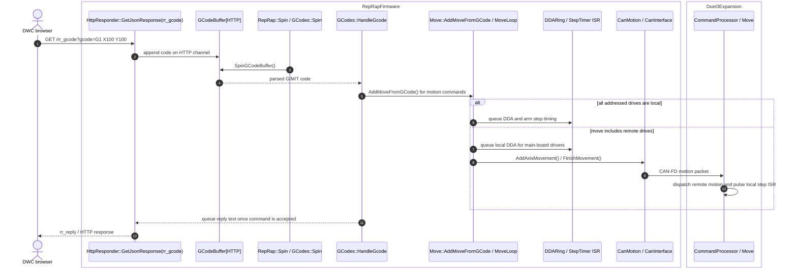

Modules hit in this path: `HttpResponder`, `GCodes`, `GCodeBuffer`, `Move`, `DDARing`, `StepTimer`, and optionally `CanMotion`, `CanInterface`, `Duet3Expansion::CommandProcessor`, and `Duet3Expansion::Move`.

#### SBC Mode

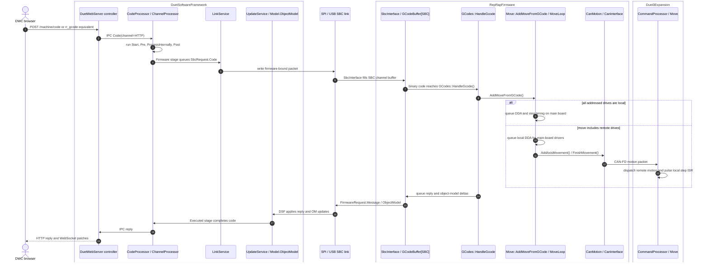

Modules hit in this path: DWS controller, DCS pipeline, `LinkService`, RRF `SbcInterface`, RRF `GCodes`, RRF `Move`, and optionally the full CAN-to-Duet3Expansion motion path.

### 4.2 Printing A G-code File

#### File Feed And Print Control Path

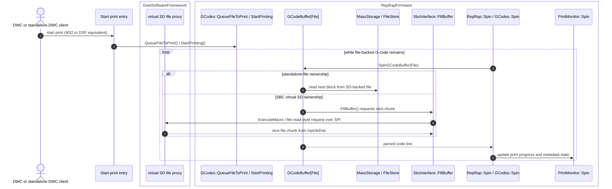

Modules hit in this path: front-end control entry, `GCodes`, `GCodeBuffer[File]`, `MassStorage` / `FileStore` in standalone, `SbcInterface` plus DCS file proxy in SBC mode, and `PrintMonitor` in both.

#### Motion Planning And Step Generation For Main Board And Expansion Board

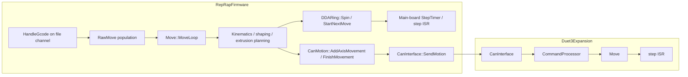

This is the key print-execution split: RRF always plans the whole move, then local drives go through the main-board DDA and step ISR while remote drives are packaged and executed on expansion boards.

### 4.3 Running A Macro

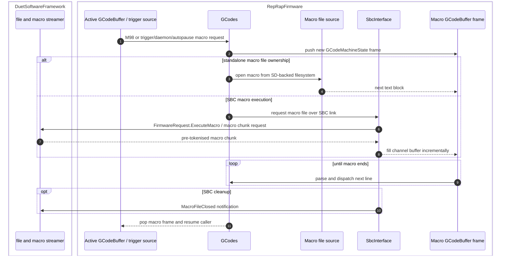

Modules hit in this path: `GCodes`, `GCodeBuffer` frame management, storage or `SbcInterface` depending on mode, and DCS file/macro streaming in SBC mode.

### 4.4 Requesting The Object Model

#### Standalone Mode

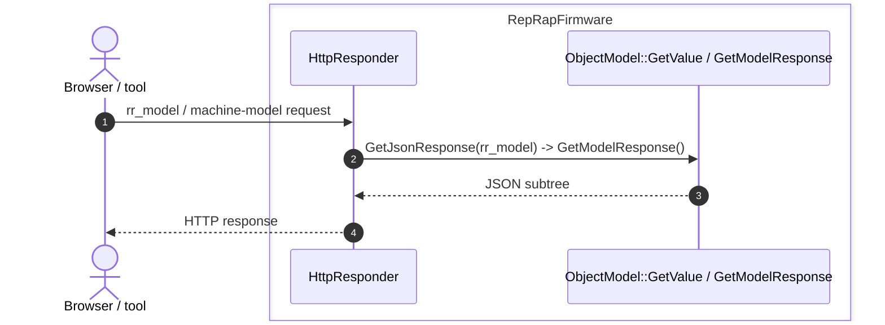

#### SBC Mode

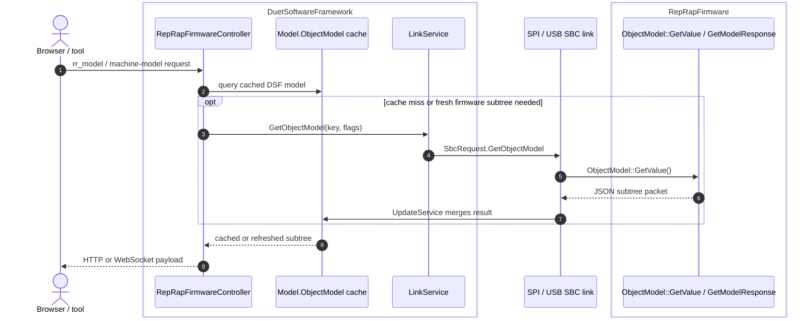

Modules hit in this path: standalone `HttpResponder` plus RRF `ObjectModel`, or DWS compatibility/controller logic plus DCS model cache, link service, and RRF `ObjectModel` when DSF needs a fresh subtree.

### 4.5 Evaluating Meta G-code

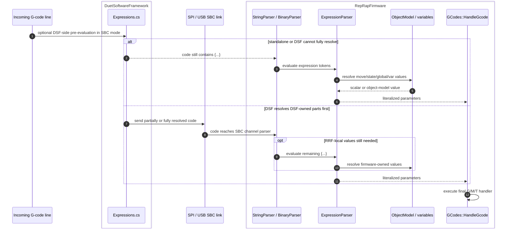

Modules hit in this path: DSF `Expressions` pre-processor in SBC mode, then RRF `StringParser` or `BinaryParser`, `ExpressionParser`, `ObjectModel`, and finally `GCodes` dispatch.

### 4.6 Expansion Board Configuration

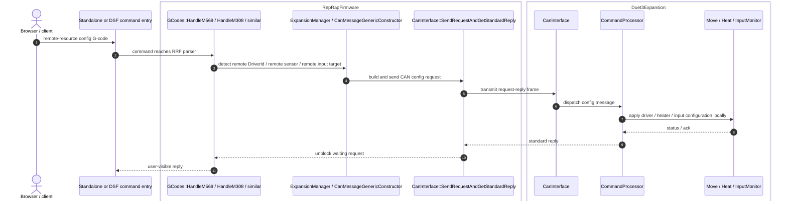

Modules hit in this path: the front-end path appropriate to the deployment mode, then RRF `GCodes`, `ExpansionManager` or related CAN message builder, `CanInterface`, and on the expansion side `CanInterface`, `CommandProcessor`, and the owning local subsystem.

### 4.7 Expansion Board Status Update

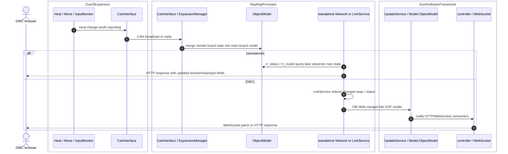

Modules hit in this path: Duet3Expansion local subsystem, Duet3Expansion `CanInterface`, RRF `CanInterface` and `ExpansionManager`, RRF `ObjectModel`, then either standalone networking or the DSF model-sync and browser-notification path.

## 5. What Changes Between Standalone And SBC

The diagrams above show the same pattern repeatedly:

- **RRF always owns machine-time decisions** such as motion planning, heater control, and the CAN master role.
- **Standalone mode keeps the browser, HTTP, file, and object-model surface inside RRF** through `Networking`, `Storage`, and `ObjectModel`.
- **SBC mode moves the browser, network, plugin, and virtual-SD surface into DSF** while RRF exposes the same machine behavior through `SbcInterface`.
- **Duet3Expansion never becomes a direct DSF peer**. Every expansion-board path still flows through RRF first.

## 6. Related Docs

- [SYSTEM_ARCHITECTURE.md](SYSTEM_ARCHITECTURE.md)
- [GCODE_FLOW.md](GCODE_FLOW.md)
- [DEPLOYMENT_MODES.md](DEPLOYMENT_MODES.md)
- [COMPONENT_INTERACTION_MATRIX.md](COMPONENT_INTERACTION_MATRIX.md)
- [RRF STANDALONE_VS_SBC.md](https://github.com/Duet3D/RepRapFirmware/blob/3.7-docker/docs/devel/STANDALONE_VS_SBC.md)
- [RRF GCODE_PROCESSING.md](https://github.com/Duet3D/RepRapFirmware/blob/3.7-docker/docs/devel/GCODE_PROCESSING.md)
- [RRF SBC_INTERFACE.md](https://github.com/Duet3D/RepRapFirmware/blob/3.7-docker/docs/devel/SBC_INTERFACE.md)
- [RRF CAN_BUS.md](https://github.com/Duet3D/RepRapFirmware/blob/3.7-docker/docs/devel/CAN_BUS.md)
