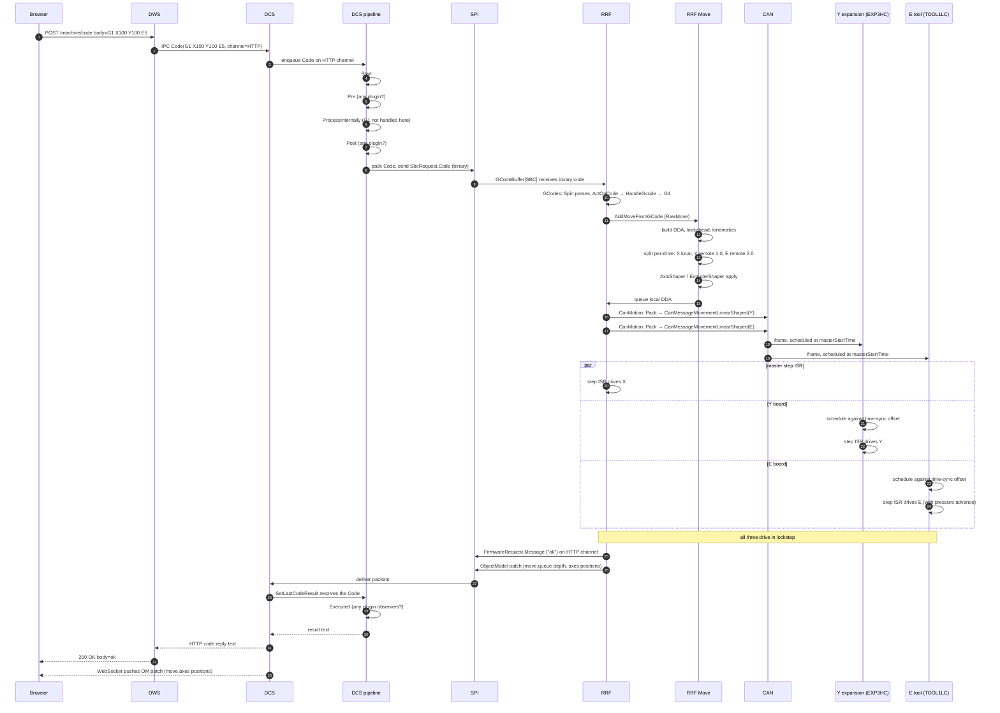

# Life of a G-code

A worked end-to-end trace of a single user-issued G-code: `G1 X100 Y100 E5` typed into Duet Web Control on a printer running the full SBC + CAN deployment, with the X axis driver on the main board, Y on an EXP3HC expansion, and the extruder on a TOOL1LC tool board.

This is the most useful single example to read because every cross-process layer is involved at least once.

## 1. The full picture

## 2. Hop-by-hop with file references

### Hop 1: Browser → DWS

The browser sends `POST /machine/code` with the code in the body. DWS routes it through [`MachineController`](../../src/DuetWebServer/Controllers/MachineController.cs). Authentication happens via `X-Session-Key`. If valid, DWS uses the cached `DuetAPIClient` connection to forward the code as an IPC `Code` command.

### Hop 2: DWS → DCS (IPC)

A `Code` command on the `HTTP` channel reaches DCS via the IPC socket. DCS deserialises it and hands it to the channel processor for `HTTP` ([`Codes/ChannelProcessor.cs`](../../src/DuetControlServer/Codes/ChannelProcessor.cs)). The code now enters the **6-stage pipeline**.

### Hop 3: DCS pipeline — Start, Pre, ProcessInternally, Post

The pipeline stages are documented in [CODE_PIPELINE.md](../devel/CODE_PIPELINE.md). For a `G1`:

- **Start** ([Pipelines/Start.cs](../../src/DuetControlServer/Codes/Pipelines/Start.cs)) — the code is registered on the channel; locks are taken if needed.
- **Pre** ([Pipelines/Pre.cs](../../src/DuetControlServer/Codes/Pipelines/Pre.cs)) — any plugin connected in `InterceptionMode.Pre` gets to react. None typically intercept `G1`.
- **ProcessInternally** ([Pipelines/ProcessInternally.cs](../../src/DuetControlServer/Codes/Pipelines/ProcessInternally.cs)) — `G1` is not a DCS-handled code, so it falls through.
- **Post** ([Pipelines/Post.cs](../../src/DuetControlServer/Codes/Pipelines/Post.cs)) — same, plugins get a chance.

### Hop 4: DCS → SPI

The **Firmware** stage ([Pipelines/Firmware.cs](../../src/DuetControlServer/Codes/Pipelines/Firmware.cs)) hands the code to the [`Channel.Manager`](../../src/DuetControlServer/Link/Channel/Manager.cs) which packs it as binary (saving RRF the parser cost) using [`Protocol.Writer.WriteCode`](../../src/DuetControlServer/Link/Protocol/Writer.cs) and queues it for the next SPI transfer.

### Hop 5: SPI → RRF

The next full transfer carries the `Code` packet (`SbcRequest::Code`). On RRF's side ([src/SBC/SbcInterface.cpp](https://github.com/Duet3D/RepRapFirmware/blob/3.7-docker/src/SBC/SbcInterface.cpp)) it is dropped into `GCodeBuffer[SBC]` as a binary code. `GCodes::Spin` notices it on the next pass.

### Hop 6: RRF parses and dispatches

`ActOnCode` → `HandleGcode` ([src/GCodes/GCodes2.cpp](https://github.com/Duet3D/RepRapFirmware/blob/3.7-docker/src/GCodes/GCodes2.cpp)) for `G1`. Parameters are decoded from the binary form. `GCodes::DoStraightMove` builds a [`RawMove`](https://github.com/Duet3D/RepRapFirmware/blob/3.7-docker/src/Movement/RawMove.cpp), and calls `Move::AddMoveFromGCode`.

### Hop 7: RRF Move builds the DDA

[`Move`](https://github.com/Duet3D/RepRapFirmware/blob/3.7-docker/src/Movement/Move.cpp) allocates a fresh [`DDA`](https://github.com/Duet3D/RepRapFirmware/blob/3.7-docker/src/Movement/DDA.cpp), runs the active kinematics ([Kinematics](https://github.com/Duet3D/RepRapFirmware/tree/3.7-docker/src/Movement/Kinematics)) to convert (X, Y, E) → motor steps for each driver, applies look-ahead linkage, jerk / acceleration limits, and (depending on `M593`) input shaping ([AxisShaper](https://github.com/Duet3D/RepRapFirmware/blob/3.7-docker/src/Movement/AxisShaper.cpp)) and pressure advance ([ExtruderShaper](https://github.com/Duet3D/RepRapFirmware/blob/3.7-docker/src/Movement/ExtruderShaper.cpp)).

The DDA produces per-drive `MoveSegment` chains.

### Hop 8: RRF splits local vs remote

`X` is local — its `MoveSegment` chain goes to a `DriveMovement` consumed by the local step ISR.

`Y` and `E` are remote (board addresses 1 and 2). [`CanMotion`](https://github.com/Duet3D/RepRapFirmware/blob/3.7-docker/src/CAN/CanMotion.cpp) packs each remote board's slice of the move into one `CanMessageMovementLinearShaped` and tags it with the master step-clock time at which the move starts.

### Hop 9: CAN → expansion / tool boards

The CAN-FD frames arrive at addresses 1 and 2. On each, [`CommandProcessor::Spin`](https://github.com/Duet3D/Duet3Expansion/blob/3.7-docker/src/CommandProcessing/CommandProcessor.cpp) dispatches the message into `Move::AddRemoteMove`, which converts the master-clock start time to a local-clock start time using the time-sync offset ([CAN_PROTOCOL.md#time-synchronisation](https://github.com/Duet3D/Duet3Expansion/blob/3.7-docker/docs/devel/CAN_PROTOCOL.md#time-synchronisation)).

### Hop 10: Step ISRs run in lockstep

At the calculated start instant on each board, the [step ISR](https://github.com/Duet3D/Duet3Expansion/blob/3.7-docker/src/Movement/StepTimer.cpp) starts pulsing local STEP/DIR pins. The X stepper on the main board, Y on board 1, and E on board 2 all step in time.

For E specifically, pressure advance has been folded into the `MoveSegment` chain so the extruder commands include the appropriate pre-acceleration extrusion.

### Hop 11: Reply from RRF → DSF

When `G1` is queued (it is *queued*, not waited on — non-blocking) RRF reports `ok` via a `FirmwareRequest.Message` on the HTTP channel and updates `move.axes[*].userPosition` etc. in the Object Model. The `seqs.move` counter bumps.

### Hop 12: DSF resolves and notifies

DCS routes the reply to the right outstanding code on the HTTP channel ([`Channel.Manager`](../../src/DuetControlServer/Link/Channel/Manager.cs)) and resolves it. The pipeline advances to **Executed** and notifies any `InterceptionMode.Executed` plugins.

The reply text travels back: DCS → DWS → 200 response to the browser.

### Hop 13: Object Model push to subscribers

In parallel with hop 12, DCS notices `seqs.move` changed in the most recent transfer's `seqs` payload, requests the changed subtree (`GetObjectModel("move", "f")`), merges it into [`Model.ObjectModel`](../../src/DuetControlServer/Model/ObjectModel.cs), computes a JSON Merge Patch, and pushes it to every subscriber — including DWC's WebSocket. DWC's reactive store updates and the on-screen position display shifts.

## 3. Wall-clock budget (typical Pi 4 + Duet 3 MB6HC)

Approximate, with everything healthy:

| Hop | Latency |
|---|---|
| Browser → DWS (LAN) | ~1–5 ms |
| DWS → DCS IPC | sub-ms |
| DCS pipeline | <1 ms (no plugins) |
| SPI transfer queueing | up to one transfer cycle (~25 ms idle, ~2 ms in burst mode) |
| RRF parse + DDA add | sub-ms |
| RRF DDA prepare (look-ahead) | depends on queue, ~ms |
| Reply back to browser | symmetric |

End-to-end "ok" turnaround for a single code is typically 30–50 ms idle, ~5 ms in burst mode. Move execution itself depends on the move duration and queue depth.

## 4. Where this connects to the rest of the documentation

- [SYSTEM_ARCHITECTURE.md](SYSTEM_ARCHITECTURE.md) — the whole system at a glance.
- [COMMUNICATION_PROTOCOLS.md](COMMUNICATION_PROTOCOLS.md) — protocol-by-protocol reference.
- Per-repo deeper dives:
  - HTTP — [DSF HTTP_API.md](../devel/HTTP_API.md).
  - IPC — [DSF IPC_PROTOCOL.md](../devel/IPC_PROTOCOL.md).
  - DCS pipeline — [DSF CODE_PIPELINE.md](../devel/CODE_PIPELINE.md).
  - SPI — [DSF SPI_LINK.md](../devel/SPI_LINK.md), [RRF SBC_INTERFACE.md](https://github.com/Duet3D/RepRapFirmware/blob/3.7-docker/docs/devel/SBC_INTERFACE.md).
  - RRF G-code — [RRF GCODE_PROCESSING.md](https://github.com/Duet3D/RepRapFirmware/blob/3.7-docker/docs/devel/GCODE_PROCESSING.md).
  - RRF motion — [RRF MOTION_PIPELINE.md](https://github.com/Duet3D/RepRapFirmware/blob/3.7-docker/docs/devel/MOTION_PIPELINE.md).
  - CAN — [RRF CAN_BUS.md](https://github.com/Duet3D/RepRapFirmware/blob/3.7-docker/docs/devel/CAN_BUS.md), [Duet3Expansion CAN_PROTOCOL.md](https://github.com/Duet3D/Duet3Expansion/blob/3.7-docker/docs/devel/CAN_PROTOCOL.md).
  - Expansion motion — [Duet3Expansion MOTION.md](https://github.com/Duet3D/Duet3Expansion/blob/3.7-docker/docs/devel/MOTION.md).
