# The Object Model, End to End

The Object Model is the single biggest contract in the Duet3D system. It is the shape that RRF generates, that DSF mirrors, that DWC reactively consumes, and that PanelDue / plugins / external tooling rely on. This document follows one field through every layer.

The per-repo documents:

- [RRF OBJECT_MODEL.md](../../../RepRapFirmware/docs/devel/OBJECT_MODEL.md) — descriptor tables, sequence numbers, JSON serialiser.
- [DSF OBJECT_MODEL.md](../devel/OBJECT_MODEL.md) — typed C# mirror, differ, subscriber delivery.

## 1. Worked example: the temperature on a tool board

Imagine a thermistor wired to a TOOL1LC board. Its current temperature appears in the model at:

```
sensors.analog[3].lastReading
```

How does it get there? Six layers, each with its own update mechanism.

```mermaid
flowchart LR
    HW[(Thermistor on tool board)] --> ADC[Tool board ADC + AveragingFilter]
    ADC --> Sensor[Heat sensor on tool board]
    Sensor -- CAN<br/>sensorTemperaturesReport --> RRF
    RRF --> RRF_OM[RRF Heat module<br/>updates internal state]
    RRF_OM --> RRF_OMtable[Object Model descriptor walk]
    RRF_OM --> Seq[seqs.sensors bumped]
    Seq --> SPI
    SPI --> DCS_seq[DCS notices changed seq]
    DCS_seq --> SPIget[GetObjectModel sensors]
    SPIget --> DCS_OM[DCS Model.ObjectModel<br/>typed property setter]
    DCS_OM --> Differ[Differ on lock release]
    Differ --> WS[WebSocket Merge Patch]
    WS --> Browser[DWC reactive store]
    Browser --> UI[temperature gauge]
```



Each arrow is documented in detail; you can navigate from this diagram into any per-repo document.

## 2. Layer-by-layer

### Layer 1 — Hardware
The thermistor is a resistor whose value changes with temperature. The MCU's ADC, oversampled and decimated by an [`AveragingFilter`](../../../Duet3Expansion/src/Platform/AveragingFilter.h), produces a stable raw reading every millisecond.

### Layer 2 — Sensor abstraction (Duet3Expansion)
The `Heat::Sensor` instance for that channel ([Duet3Expansion Sensors](../../../Duet3Expansion/src/Heating/Sensors)) converts raw → °C using its calibration. It exposes the result via `TryGetTemperature`.

### Layer 3 — CAN push
The board's heat task batches readings and sends `CanMessageSensorTemperatures` to the master at ~5 Hz (or on change). See [Duet3Expansion CAN_PROTOCOL.md](../../../Duet3Expansion/docs/devel/CAN_PROTOCOL.md#message-families).

### Layer 4 — Master receives (RRF)
[`CommandProcessor`](../../../RepRapFirmware/src/CAN/CommandProcessor.cpp) decodes the frame and calls into `Heat::SetSensorReading(boardAddr, sensorIdx, value, error)`. The local `RemoteSensor` instance caches the value. RRF's `Heat::Spin` notices the change and bumps `seqs.sensors`.

### Layer 5 — Object Model descriptor walk
On the next demand for `sensors.analog[3]` (or `seqs`), the descriptor walker in [`ObjectModel`](../../../RepRapFirmware/src/ObjectModel/ObjectModel.cpp) emits JSON keys and values by calling each `OBJECT_MODEL_FUNC(...)` lambda. The relevant entry returns `lastReading` for sensor 3.

### Layer 6 — SPI subscription
DCS's [`Model.UpdateService`](../../src/DuetControlServer/Model/UpdateService.cs) holds a long-running subscription to `seqs`. Every full SPI transfer carries the latest `seqs`. When `seqs.sensors` changed, DCS issues a `GetObjectModel("sensors", "f")` SBC request. RRF returns the JSON. DCS deserialises into the typed mirror under the OM write lock.

### Layer 7 — Patch generation
On lock release, the DCS [Differ](../../src/DuetControlServer/Model/Observer) walks the changed properties and produces a JSON Merge Patch — only the fields that changed.

### Layer 8 — Browser delivery
DWS holds a long-running `Subscribe` IPC connection. The patch is forwarded via WebSocket (or written into the next `/machine/status` poll). DWC's reactive store applies it; Vue re-renders the temperature gauge.

## 3. Where the schema is defined

The same JSON shape appears in three places:

- The **descriptor tables** in RRF's `*.cpp` files (e.g. `Move.cpp`, `Heat.cpp`, `Tool.cpp`) — the **canonical source**.
- The **C# typed classes** in [`DuetAPI.ObjectModel`](../../src/DuetAPI/ObjectModel) — the typed mirror.
- The **TypeScript types** in DuetWebControl — generated from the C# (separate repo).

Adding a field requires touching the first two; the third is regenerated from the second.

## 4. Sequence-number protocol — the watchdog

`seqs` is a small subtree at the root of the OM. Every key in `seqs` is a uint32 counter that increments whenever its named subtree changes. Snapshot:

```json
{
  "seqs": {
    "boards":   8,
    "directories": 0,
    "fans":     1,
    "global":   0,
    "heat":    23,
    "inputs":   3,
    "job":     17,
    "ledStrips": 0,
    "move":  17251,
    "network":  0,
    "scanner":  0,
    "sensors": 142,
    "spindles": 0,
    "state":   71,
    "tools":    4,
    "userVariables": 0,
    "volumes":  0
  }
}
```

`move` ticks fastest (typically dozens of times per second during a print). `state` ticks on print state transitions. `sensors` ticks at the sensor sampling cadence. `network` rarely changes.

DSF only fetches subtrees whose `seqs` value changed since the last fetch. This is what makes the SPI link bandwidth track *change* rather than *model size*.

## 5. Two query modes

The same shape can be retrieved two ways:

| Method | Typical caller | Round-trip |
|---|---|---|
| `M409 K"sensors.analog[3]"` | user typing in DWC console | parser → ProcessInternally → DCS answers from mirror — **no SPI** |
| `M409 K"sensors.analog[3]" F"f"` | continuous live query | as above; flag `f` includes "live" fields |
| `GetObjectModel` IPC command | a plugin | direct — DCS answers from mirror |
| `GetObjectModel` SPI request | DCS itself | hits RRF's descriptor walk |

In SBC mode, the *user-visible* `M409` is answered by DSF, not RRF, so there is no SPI traffic just to query. The SPI traffic happens in the background when `seqs` changes.

## 6. What can break

- **Field rename** in RRF without C# update — DSF receives a JSON property it doesn't know about; serialiser ignores it; DWC never sees the field. Fix: add the matching C# property (and rebuild the source generator).
- **Type change** — RRF sends `int`, C# expects `string`. Deserialiser logs a warning and keeps the previous value. Fix: bump both sides in lockstep.
- **Missing `seqs` bump** — RRF changes a field but doesn't call `reprap.XxxUpdated()`. DSF never refetches; subscribers see stale data. Fix: every state change must bump the right seq.
- **Wrong filter** — a subscriber filter excludes the field. The OM has the value, but the subscriber never sees it. Fix: widen filter, or add a custom filter scheme.

## 7. Where this connects to the rest of the documentation

- [SYSTEM_ARCHITECTURE.md](SYSTEM_ARCHITECTURE.md) — the model is shown as the central datum.
- [GCODE_FLOW.md](GCODE_FLOW.md) — same layers, but for *commands* rather than *state*.
- [COMMUNICATION_PROTOCOLS.md](COMMUNICATION_PROTOCOLS.md) — protocol-by-protocol reference.
- Per-repo deeper dives — [RRF OBJECT_MODEL.md](../../../RepRapFirmware/docs/devel/OBJECT_MODEL.md), [DSF OBJECT_MODEL.md](../devel/OBJECT_MODEL.md).
