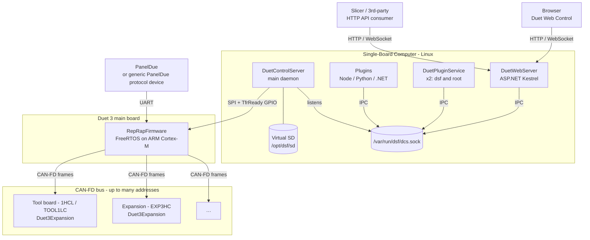
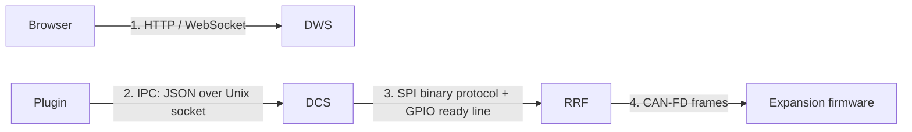
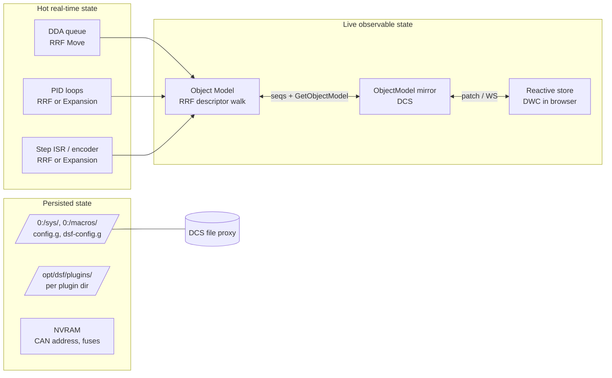
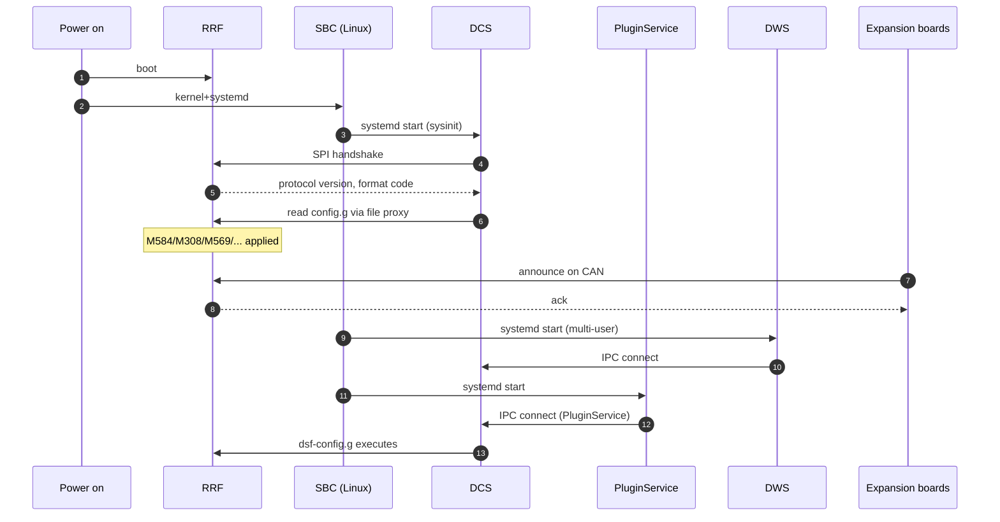

# System Architecture

This document is the entry point to the cross-repository documentation. It draws the whole Duet3D system as a single diagram and gives the role of every component.

## 1. The big picture

A maximal Duet 3 deployment with all three repositories at play looks like this:

The same printer can run *without* the SBC (RRF speaks HTTP / WiFi itself) and *without* the CAN bus (just local drivers on the main board) — see [DEPLOYMENT_MODES.md](DEPLOYMENT_MODES.md). The diagram above is the full picture.

## 2. Repository ownership

| Repository | Hosts | Process / firmware | Deployed to |
|---|---|---|---|
| `RepRapFirmware` | C++ MCU code | `Duet3Firmware_*.bin` | Duet 3 main board flash |
| `Duet3Expansion` | C++ MCU code | `Duet3Firmware_*.bin` (different boards) | tool / expansion board flash, via OTA over CAN from the main board |
| `DuetSoftwareFramework` | .NET 8/9 | `DuetControlServer`, `DuetWebServer`, `DuetPluginService`, plugin executables, CLI tools | SBC `/opt/dsf/bin/` |
| `DuetWebControl` | Vue 3 SPA | Static bundle at `0:/www/` (virtual SD) | Served by DWS, or by RRF in standalone mode |

Note: DWC (Duet Web Control) is a separate repo not in scope of these architecture documents. It is a pure consumer of the Object Model, the HTTP API, and the WebSocket subscription stream.

## 3. Communication protocols

| # | Protocol | Layer in stack | Reference |
|---|---|---|---|
| 1 | HTTP + WebSocket | Browser ↔ DWS | [`OpenAPI.yaml`](../../OpenAPI.yaml), [HTTP_API.md](../devel/HTTP_API.md) |
| 2 | JSON over UNIX socket | Plugins / DWS / tools ↔ DCS | [IPC_PROTOCOL.md](../devel/IPC_PROTOCOL.md) |
| 3 | SPI binary, 8 KiB transfers, packet-based | DCS ↔ RRF | [SPI_LINK.md](../devel/SPI_LINK.md) and [RRF SBC_INTERFACE.md](https://github.com/Duet3D/RepRapFirmware/blob/3.7-docker/docs/devel/SBC_INTERFACE.md) |
| 4 | CAN-FD with shared CANlib message structs | RRF ↔ expansion firmware | [RRF CAN_BUS.md](https://github.com/Duet3D/RepRapFirmware/blob/3.7-docker/docs/devel/CAN_BUS.md) and [Duet3Expansion CAN_PROTOCOL.md](https://github.com/Duet3D/Duet3Expansion/blob/3.7-docker/docs/devel/CAN_PROTOCOL.md) |

A single G-code may traverse all four; see [GCODE_FLOW.md](GCODE_FLOW.md).

## 4. Where state lives

Authoritative locations:

The Object Model is the contract that lets plugins, DWC and PanelDue all see the same machine state without each having to know about each other.

## 5. Process / boot ordering

`config.g` runs **before** plugin services or DWS are up — anything in it touches only base hardware. `dsf-config.g` runs *after* DPS+DWS so it can rely on plugins / endpoints existing.

## 6. Worked use cases

| Scenario | How it unfolds (cross-component) |
|---|---|
| User clicks "Home All" in DWC | Browser → HTTP `POST /machine/code` → DWS → IPC `Code` → DCS pipeline → SPI → RRF → motion / CAN → expansion → step ISR. |
| Heater fault on a tool board | Expansion `Heat` task detects fault → CAN `inputChanged` / sensor report → RRF `Heat` flags fault, bumps `seqs.heat` → DCS pulls subtree → patch sent to all subscribers → DWC shows fault toast. |
| User installs a plugin | Browser → HTTP `POST /machine/plugins/install` → DWS → IPC `Install` → DCS extracts to `/opt/dsf/plugins/<id>/`, indexed by `DuetPluginService` → on next `Start`, DPS execs the plugin process under sandbox. |
| OTA firmware update | DWC upload → DWS → DCS receives ZIP → unpacks `Duet3Firmware_*.bin` files → DCS flashes RRF over SPI (IAP) → RRF flashes each expansion over CAN. |

## 7. Where to go next

- [GCODE_FLOW.md](GCODE_FLOW.md) walks one G-code through every component.
- [EXECUTION_CALL_DIAGRAMS.md](EXECUTION_CALL_DIAGRAMS.md) expands that into the major standalone and SBC call paths with class/module and function-level diagrams.
- [COMMUNICATION_PROTOCOLS.md](COMMUNICATION_PROTOCOLS.md) cross-references all four protocol stacks.
- [DEPLOYMENT_MODES.md](DEPLOYMENT_MODES.md) lists the supported combinations of these components.
- [OBJECT_MODEL_END_TO_END.md](OBJECT_MODEL_END_TO_END.md) traces a single field from sensor to browser.
- [COMPATIBILITY.md](COMPATIBILITY.md) lists the version contracts you must keep in sync.
