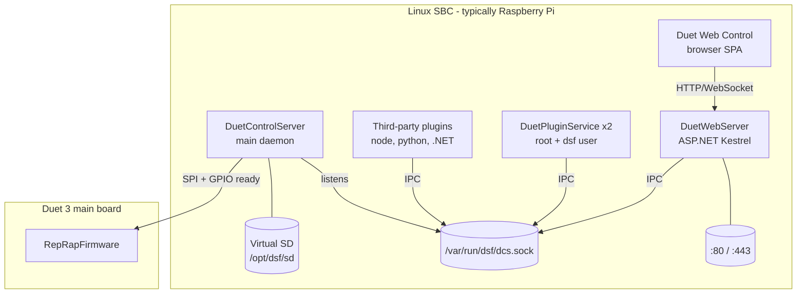
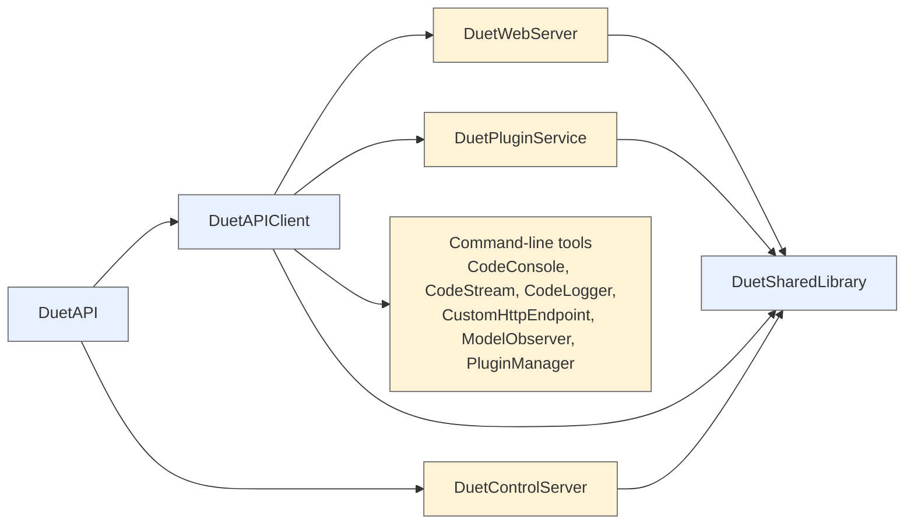
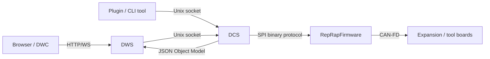
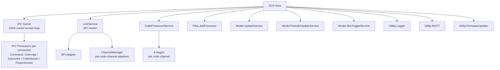
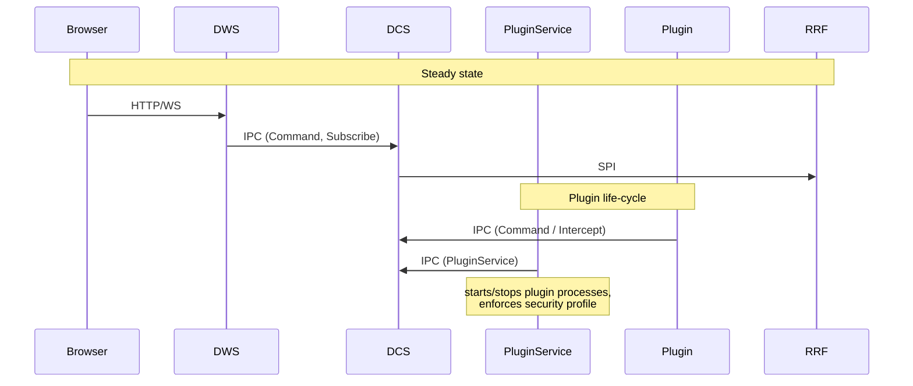
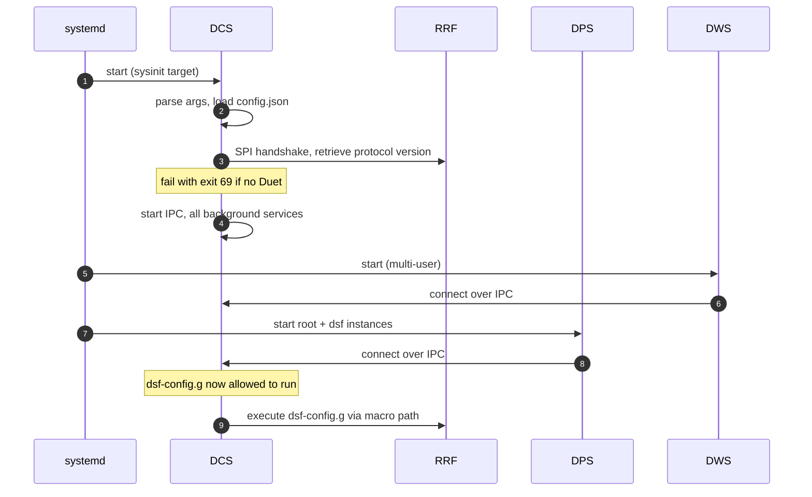

# DuetSoftwareFramework Architecture

This document maps out the DSF code base at component level. Every other document under this directory dives deeper into one of the boxes drawn here.

## 1. What runs on the SBC



The four .NET processes:

| Process | Type | Owner | Started by |
|---|---|---|---|
| `DuetControlServer` (DCS) | console daemon | `dsf` | systemd `duetcontrolserver.service`, sysinit-target |
| `DuetWebServer` (DWS) | ASP.NET Kestrel | `dsf` | systemd `duetwebserver.service` |
| `DuetPluginService` (root) | console daemon | `root` | systemd `duetpluginservice@root.service`, multi-user-target |
| `DuetPluginService` (dsf) | console daemon | `dsf` | systemd `duetpluginservice.service`, multi-user-target |

DCS is the heart — it owns the SPI link, the IPC socket, the object model, the code pipeline, the job processor, the file system mapping, and firmware update. Everything else is built on top of it.

## 2. Source-tree map

The DSF solution lives under [src/](../../src) and is composed of these C# projects:



| Project | Purpose |
|---|---|
| [DuetAPI](../../src/DuetAPI) | Public types — Object Model, commands, connection modes, exceptions. Versioned independently. |
| [DuetAPIClient](../../src/DuetAPIClient) | Convenience client library wrapping the IPC protocol. Used by DWS, plugins, command-line tools, third-party code. |
| [DuetSharedLibrary](../../src/DuetSharedLibrary) | Internal helpers shared between DSF processes (defaults, version helper, log-level helper). |
| [DuetAPI.SourceGenerators](../../src/DuetAPI.SourceGenerators) | Roslyn source generators that produce JSON serialisation / model boilerplate. |
| [DuetControlServer](../../src/DuetControlServer) | The DCS daemon. |
| [DuetWebServer](../../src/DuetWebServer) | The HTTP / WebSocket server. |
| [DuetPluginService](../../src/DuetPluginService) | Plugin lifecycle manager, runs as root and as `dsf`. |
| [DuetHttpClient](../../src/DuetHttpClient) | A standalone .NET HTTP client for Duet boards (used outside DSF, e.g. uploaders). |
| [DuetPiManagementPlugin](../../src/DuetPiManagementPlugin) | Bundled plugin that exposes DuetPi-specific M-codes (network config, hostname, …). |
| [DocGen](../../src/DocGen) | Generates the OpenAPI / DocFX documentation. |
| [Documentation](../../src/Documentation) | DocFX project that produces the `docs/` static site. |
| [UnitTests](../../src/UnitTests) | NUnit suite. |
| [CodeConsole](../../src/CodeConsole), [CodeLogger](../../src/CodeLogger), [CodeStream](../../src/CodeStream), [CustomHttpEndpoint](../../src/CustomHttpEndpoint), [ModelObserver](../../src/ModelObserver), [PluginManager](../../src/PluginManager) | CLI helper tools. |

## 3. Data flow at a glance



The four protocol layers are documented separately:

- Browser ↔ DWS — [HTTP_API.md](HTTP_API.md).
- DWS / plugins / tools ↔ DCS — [IPC_PROTOCOL.md](IPC_PROTOCOL.md).
- DCS ↔ RRF — [SPI_LINK.md](SPI_LINK.md). (Mirrored from RRF's [SBC_INTERFACE.md](../../../RepRapFirmware/docs/devel/SBC_INTERFACE.md).)
- RRF ↔ expansion — see [Duet3Expansion's CAN docs](../../../Duet3Expansion/docs/devel/CAN_PROTOCOL.md).

## 4. The DCS process

DCS is a `Microsoft.Extensions.Hosting` `Host` that registers many `BackgroundService`s. Each service has a single responsibility; their lifetimes are managed by the host.



Services (annotated with `[DiagnosticsPriority(N)]`) implement `IDiagnostics`, contributing to the M122-equivalent diagnostics dump.

## 5. Inter-process roles



Even though DWS *could* talk to RRF directly via a shared SPI, it deliberately doesn't — *all* writes to the SPI link are serialised through DCS so the link state machine has a single owner.

## 6. The four "kinds" of state

Mental model of where state lives:

| State | Who owns it | How it's updated |
|---|---|---|
| **Object Model** (live machine state) | DCS `Model.ObjectModel` | RRF pushes diffs over SPI, DCS merges. Subscribed by DWS, plugins. |
| **Plugin manifest / store** | `DuetPluginService` | Manipulated by plugin `install` / `start` / `stop` commands. |
| **Sessions** | DWS `SessionStorage` singleton | Created on `/machine/connect`, expired by `SessionExpiry` service. |
| **Job state** | DCS `Files.JobProcessor` | Driven by file processing of the active print. |

## 7. Filesystem layout

```
/opt/dsf/
├── bin/                  ← all DSF binaries
├── conf/
│   ├── config.json       ← DCS settings
│   └── http.json         ← DWS settings
├── plugins/              ← installed plugins (one dir per id)
└── sd/                   ← virtual SD seen by RRF
    ├── 0:/sys/
    ├── 0:/macros/
    ├── 0:/gcodes/
    ├── 0:/firmware/
    ├── 0:/menu/
    └── 0:/www/

/var/run/dsf/
└── dcs.sock              ← UNIX socket for IPC

/var/log/dsf/             ← log files
```

Path resolution from RRF-side names like `0:/sys/config.g` to host paths is handled by [`Files.FilePathResolver`](../../src/DuetControlServer/Files/FilePathResolver.cs). See [FILES.md](FILES.md).

## 8. Boot sequence



The careful staging is so that plugins and DWS are running before `dsf-config.g` (which may launch plugins) executes on RRF.

## 9. Where this connects to the rest of the system

- The matching firmware-side document is [RepRapFirmware/docs/devel/ARCHITECTURE.md](../../../RepRapFirmware/docs/devel/ARCHITECTURE.md).
- The cross-protocol path "browser request → motor pulse" is in [../architecture/GCODE_FLOW.md](../architecture/GCODE_FLOW.md).
