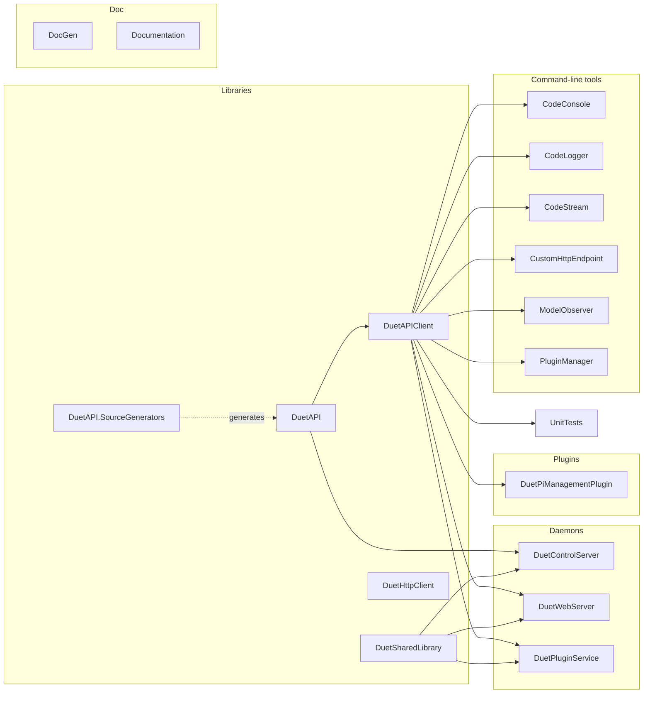

# Build Variants & Packaging

This document describes how DSF is laid out at the project level, what gets built, and how the published packages are produced.

## 1. Solution and projects

The whole framework is a single Visual Studio solution: [`DuetSoftwareFramework.sln`](../../src/DuetSoftwareFramework.sln). Most executable projects target .NET 10, the reusable libraries multi-target where required, and the source-generator project targets `netstandard2.0`.

Each project directory under [`src/`](../../src) also carries a local `README.md` with project-specific architecture notes, interfaces, runtime expectations, and verification guidance.



## 2. Build with `make`

The top-level [`Makefile`](../../Makefile) uses `dotnet publish` per project and stages outputs under `pkg/`. `make` builds everything; sub-targets build a single project.

Useful targets:

| Target | Effect |
|---|---|
| `make` | Build all daemons, libraries, tools, and plugins. |
| `make package` | Build everything plus the `.deb` packages under `pkg/`. |
| `make clean` | Remove build outputs. |
| `make doc` | Run DocGen + DocFX to regenerate the `docs/` static site. |

## 3. Packages

DSF ships as a set of Debian packages staged in [`pkg/`](../../pkg). Each package is a self-contained component:

| Package | Provides |
|---|---|
| `duetcontrolserver` | DCS daemon + systemd unit. |
| `duetwebserver` | DWS daemon + systemd unit. |
| `duetpluginservice` | Plugin services + systemd units. |
| `duetruntime` | Shared .NET runtime files. |
| `duettools` | Command-line tools (`CodeConsole`, `CodeStream`, `ModelObserver`, `PluginManager`, …). |
| `duetsd` | Initial virtual SD content (config.g, dsf-config.g, etc.). |
| `duetsoftwareframework` | Meta-package depending on the above. |
| `duetwebcontrol` | Built DWC bundle (pulled in from the [DuetWebControl](https://github.com/Duet3D/DuetWebControl) repo at release time). |
| `reprapfirmware` | Firmware blobs for the Duet board, used by `--update`. |

These are the packages the [DuetPi](https://github.com/Duet3D/DuetPi) image installs from the Duet APT repo. Bumping a package version triggers a coordinated release across DSF, DWC, RRF, and Duet3Expansion firmware.

## 4. Running locally for development

For dev iteration, run the daemons directly without the systemd machinery:

```sh
sudo /opt/dsf/bin/DuetControlServer -l debug -r
```

`-l debug` switches the log level; `-r` keeps DCS alive across `M999` so reloading firmware doesn't kill the daemon.

Stop the production unit first:

```sh
sudo systemctl stop duetcontrolserver
```

DWS and the plugin services follow the same pattern.

## 5. Generated documentation

DocFX (driven by [`src/Documentation/docfx.json`](../../src/Documentation/docfx.json)) reads:

- `articles/*.md` (hand-written guides, including this directory's developer docs once exported).
- The XML doc comments from `DuetAPI`, `DuetAPIClient`, `DuetControlServer`, `DuetWebServer`.

The output is published to [`docs/`](../) at the repo root and served at https://duet3d.github.io/DuetSoftwareFramework/.

> Note: the generated `docs/` directory contains DocFX output — these developer docs (under `docs/devel/` and `docs/architecture/`) are hand-written and live alongside it. Regenerating DocFX does not delete them, but if the project's `docfx.json` is later configured to clean the destination, the developer docs would need to move under `src/Documentation/articles/` to be ingested.

## 6. Compatibility contracts

DSF carries hard version contracts to the other repositories:

| Contract | Constant / location | Must match |
|---|---|---|
| SPI protocol version | `Defaults.ProtocolVersion` | RRF's `SbcProtocolVersion` |
| SPI buffer size | `Settings.SbcBufferSize` | RRF's `SbcTransferBufferSize` |
| IPC protocol minimum | `IPC.Server.MinimumProtocolVersion` | client libraries / plugins |
| Object Model schema | `DuetAPI.ObjectModel` classes | RRF descriptor tables |
| `rr_*` URL family | `RepRapFirmwareController` | RRF `HttpResponder` |

Bump a contract on one side without the other → first contact fails (DCS exits with `502` for SBC mismatch; clients are rejected at IPC handshake for IPC mismatch).

## 7. Where this connects to the rest of the system

- For RRF's matching matrix see [RepRapFirmware/docs/devel/BUILD_VARIANTS.md](../../../RepRapFirmware/docs/devel/BUILD_VARIANTS.md).
- For the integration-level cross-version compatibility table see [../architecture/COMPATIBILITY.md](../architecture/COMPATIBILITY.md).
