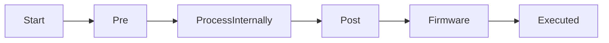
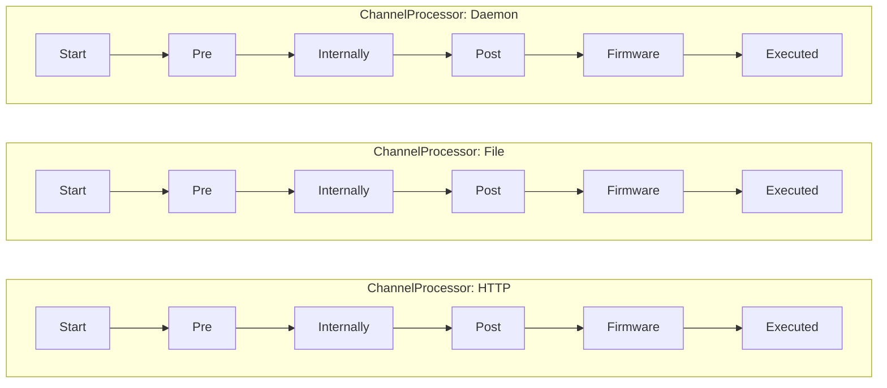
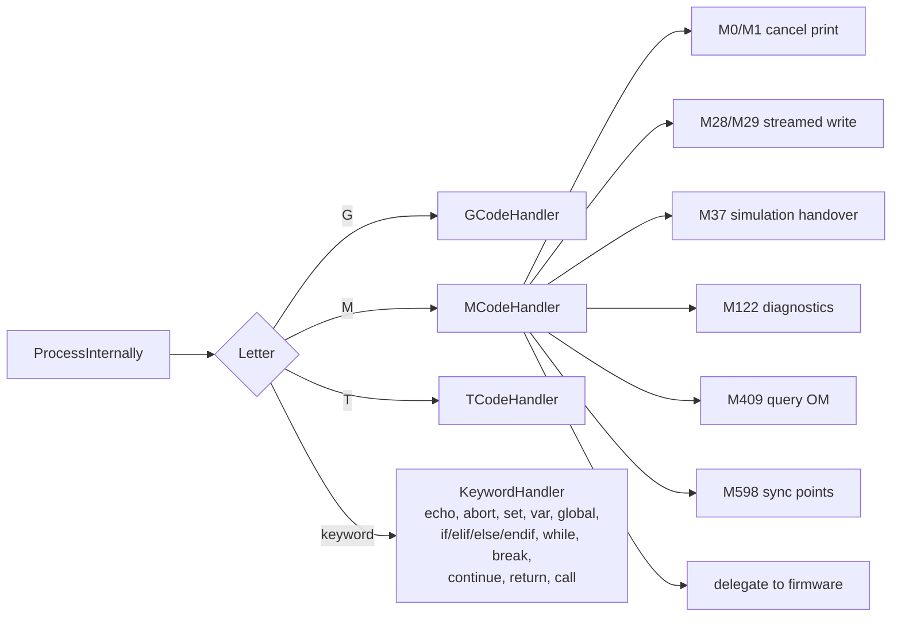
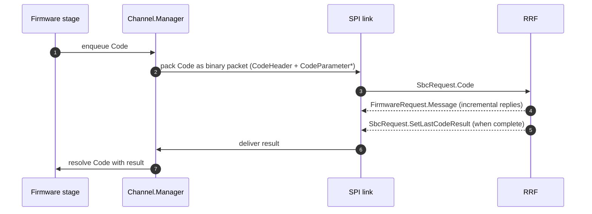
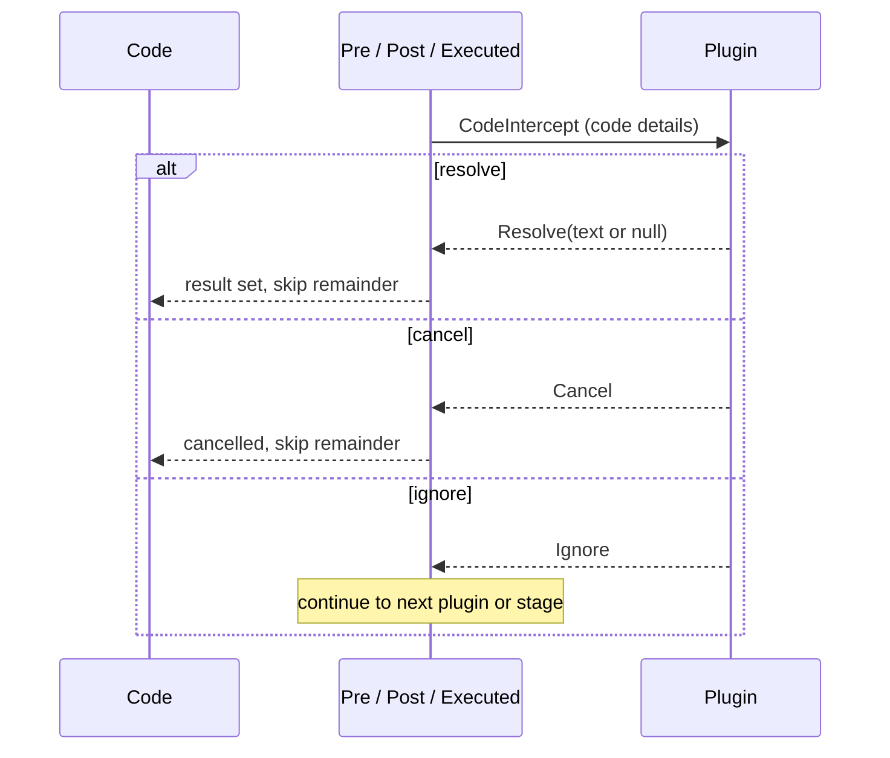

# Code Pipeline

This document describes how a single G/M/T-code travels through DCS — from arrival on a code channel to a final result. The pipeline is the central control loop of DSF; understanding it makes plugin authoring, code intercepting, and DSF debugging straightforward.

## 1. The six stages

Defined in [`Codes/Pipelines/PipelineStage.cs`](../../src/DuetControlServer/Codes/Pipelines/PipelineStage.cs):

| Stage | Role | Code |
|---|---|---|
| **Start** | Code created, locks acquired, dependencies resolved. | [Start.cs](../../src/DuetControlServer/Codes/Pipelines/Start.cs) |
| **Pre** | Third-party plugins may intercept (`InterceptionMode.Pre`). | [Pre.cs](../../src/DuetControlServer/Codes/Pipelines/Pre.cs) |
| **ProcessInternally** | DCS-side handlers (M0/M1/M28/M29/M37/M122/M409/...). May resolve the code without going to firmware. | [ProcessInternally.cs](../../src/DuetControlServer/Codes/Pipelines/ProcessInternally.cs) |
| **Post** | Third-party plugins again (`InterceptionMode.Post`), with the chance to override the result. | [Post.cs](../../src/DuetControlServer/Codes/Pipelines/Post.cs) |
| **Firmware** | Code is forwarded over SPI to RRF. Awaits firmware reply. | [Firmware.cs](../../src/DuetControlServer/Codes/Pipelines/Firmware.cs) |
| **Executed** | Final stage. Plugins observe the result (`InterceptionMode.Executed`). | [Executed.cs](../../src/DuetControlServer/Codes/Pipelines/Executed.cs) |

## 2. Per-channel pipelines

Each `CodeChannel` (see [GCodeChannel.h](../../../RepRapFirmware/src/GCodes/GCodeChannel.h)) has its own pipeline so that codes on different channels can execute concurrently. Implementation: [`ChannelProcessor`](../../src/DuetControlServer/Codes/ChannelProcessor.cs) — one per channel, holding 6 `PipelineStage` workers.

Codes in **different** channels are independent; codes within the **same** channel are serialised — that's the same FIFO contract that RRF enforces inside its `GCodeBuffer`.

## 3. PipelineStackItem — macro and conditional context

Within a single channel a code may run *inside* a macro (`M98 P"foo.g"`), inside a conditional block (`if … else …`), or inside a job. Each frame on the channel's stack is a [`PipelineStackItem`](../../src/DuetControlServer/Codes/Pipelines/PipelineStackItem.cs) tracking the current `CodeFile`, the active conditional state, the captured variables, and so on.

The stack is mirrored on RRF's side as the `GCodeMachineState` chain inside its `GCodeBuffer`. The two are kept in step by `MacroStarted`, `MacroCompleted`, `InvalidateChannel`, `SetVariable` and `DeleteLocalVariable` SPI requests — see [SPI_LINK.md](SPI_LINK.md).

## 4. Internal handlers (`ProcessInternally`)

A code can be *fully* satisfied inside DSF and never reach RRF. The dispatch table is in [`Codes/Handlers/`](../../src/DuetControlServer/Codes/Handlers):

Codes that DSF resolves entirely include:

- **`M0` / `M1`** — cancel job (job processor)
- **`M28` / `M29`** — streamed writes (DSF stores the bytes)
- **`M30`** — delete file
- **`M32`** — start print of file
- **`M37`** — simulation control
- **`M38`** — file SHA1
- **`M409`** — object model query (DSF serves from its mirror)
- **`M122`** — diagnostics (DSF appends its own dump)
- **`M587` / `M588` / `M589`** — Wi-Fi list / forget / configure (DuetPi only)
- **DSF-only meta-codes** — e.g. plugin install/start/stop wrappers.

The keyword handler also runs entirely inside DSF — `if`, `while`, `set`, `echo`, etc. operate on the cached object model and the stack-frame variables.

## 5. The Firmware stage

For codes that *do* go to RRF:

The match between code submission and result is by `CodeChannel` — codes on a channel are FIFO so the next `SetLastCodeResult` always pertains to the next outstanding code on that channel. Macros that themselves run codes on the same channel introduce a stack the firmware tracks.

## 6. Plugin interception

Plugins connect to DCS in `Intercept` mode declaring which stages and which channels they want to see. When a code reaches the matching stage, the plugin gets a chance to:

- Pass through (do nothing).
- **Resolve** the code with a custom result (skipping later stages).
- **Cancel** the code (resolves with cancellation, skipping later stages).
- **Ignore** the code (does nothing — the plugin saw it but did not act).

Multiple plugins may intercept the same stage; they are visited in priority order. See [`IPC.Processors.CodeInterception`](../../src/DuetControlServer/IPC/Processors/CodeInterception.cs) for the connection processor and [PLUGINS.md](PLUGINS.md) for plugin lifecycle.

## 7. The "Executed" stage

`Executed` is purely informational — by the time a code reaches it, the result is final. It exists so that plugins can observe completed codes (logging, metrics, post-processing UI updates). A plugin in `InterceptionMode.Executed` cannot change the result, only react to it.

## 8. Cancellation paths

A code can be cancelled at any stage:

- User-driven — `M0`, `M1`, `M112`, an emergency stop, a job cancel.
- Plugin-driven — `Cancel` from an intercept stage.
- Internal — file aborted, channel invalidated, fatal error.

Cancellation propagates via .NET `CancellationToken`s; any awaiting stage cleans up its locks, drops the code, and the `ChannelProcessor` advances to the next.

## 9. Where this connects to the rest of the system

- The matching firmware-side document — [RepRapFirmware/docs/devel/GCODE_PROCESSING.md](../../../RepRapFirmware/docs/devel/GCODE_PROCESSING.md).
- The wire protocol that carries codes from DSF to RRF — [SPI_LINK.md](SPI_LINK.md).
- The plugin interception API — [IPC_PROTOCOL.md](IPC_PROTOCOL.md) and [PLUGINS.md](PLUGINS.md).
- The full cross-process trace of a single G-code is in [../architecture/GCODE_FLOW.md](../architecture/GCODE_FLOW.md).
