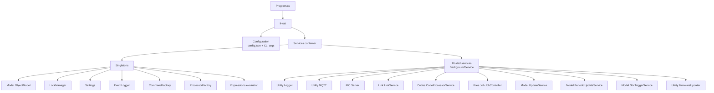
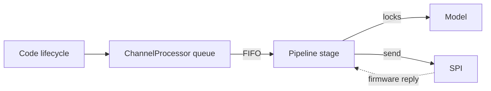
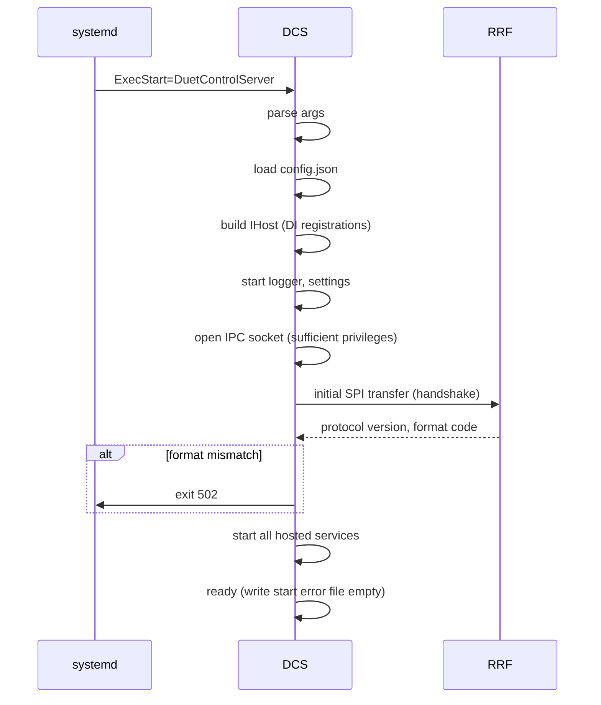

# DuetControlServer Internals

This document describes the structure of the DCS daemon — what services run inside it, how they cooperate, and where the threads / tasks live.

## 1. Process anatomy

DCS is a single .NET 8/9 process built on `Microsoft.Extensions.Hosting`. Its `Program.cs` configures dependency injection and starts the host; from there, every component is a `BackgroundService` or a singleton resolved into the services that need it.



Each hosted service is annotated with `[DiagnosticsPriority(N)]`; lower numbers print first when the user asks for diagnostics. The same priority is used to order startup logging.

## 2. The hosted services in one paragraph each

### `Link.LinkService` ([LinkService.cs](../../src/DuetControlServer/Link/LinkService.cs))

Owns the SPI link to RRF. Wraps an `ILinkAdapter` (`SPI` or `USB`). Runs the transfer state machine, decodes inbound packets, and dispatches them — file requests go to `Files`, code-related packets go to the `ChannelManager`, object-model patches go to `Model.UpdateService`. See [SPI_LINK.md](SPI_LINK.md).

### `Codes.CodeProcessorService` ([CodeProcessor.cs](../../src/DuetControlServer/Codes/CodeProcessor.cs))

Drives one `ChannelProcessor` per `CodeChannel` (HTTP, Telnet, File, USB, Aux, Trigger, Queue, LCD, SBC, Daemon, Aux2, Autopause, File2, Queue2, USB2). Each `ChannelProcessor` runs the 6-stage code pipeline (`Start`, `Pre`, `ProcessInternally`, `Post`, `Firmware`, `Executed`) for codes on its channel. See [CODE_PIPELINE.md](CODE_PIPELINE.md).

### `IPC.Server` ([IPC/Server.cs](../../src/DuetControlServer/IPC/Server.cs))

Listens on `/var/run/dsf/dcs.sock`, accepts connections, performs the JSON handshake, and creates the appropriate `Processor` (Command / Intercept / Subscribe / CodeStream / PluginService) for the connection's mode. Each connection runs as its own `Task`. See [IPC_PROTOCOL.md](IPC_PROTOCOL.md).

### `Files.Job.JobController` ([Files/Job/JobController.cs](../../src/DuetControlServer/Files/Job/JobController.cs))

Owns the active print job, as one task performing one declared transition at a time: it opens and
closes the file, decides what each of M0, M23, M24, M25, M26, M32, M37, M226 and M606 is allowed to
do from the phase the job is in, and publishes an immutable `JobState` that everything else reads
without a lock. What takes time - `start.g`, the pause, the resume, `cancel.g`, `stop.g` - runs as a
child task of the controller and reports back for it to settle, so `M112` never waits behind a
macro. `JobReader` reads one stream of the file and is told where to go rather than inferring it.
Separate from `CodeProcessor` because the job lifecycle is its own state machine, separate from the
per-code one. See [JOB_CONTROL_CONCURRENCY.md](JOB_CONTROL_CONCURRENCY.md) §7.

### `Model.UpdateService` ([Model/UpdateService.cs](../../src/DuetControlServer/Model/UpdateService.cs))

Applies inbound object-model deltas from RRF (received as `FirmwareRequest.ObjectModel`) into the local `Model.ObjectModel`, holding the appropriate write lock. Notifies subscribers afterwards.

### `Model.PeriodicUpdateService` ([Model/PeriodicUpdateService.cs](../../src/DuetControlServer/Model/PeriodicUpdateService.cs))

Updates fields that have to be polled (CPU usage, free memory, file system stats, etc.) — anything not pushed by RRF.

### `Model.SbcTriggerService` ([Model/SbcTriggerService.cs](../../src/DuetControlServer/Model/SbcTriggerService.cs))

Re-implements `M581`-style triggers for inputs that live on the SBC (e.g. SBC-attached GPIO).

### `Utility.Logger` ([Utility/Logger.cs](../../src/DuetControlServer/Utility/Logger.cs))

Records messages of selected types to a file under `/var/log/dsf/`. Configured by `M929`.

### `Utility.MQTT` ([Utility/MQTT.cs](../../src/DuetControlServer/Utility/MQTT.cs))

Publishes selected machine state to an MQTT broker; configured by `M586`.

### `Utility.FirmwareUpdater` ([Utility/FirmwareUpdater.cs](../../src/DuetControlServer/Utility/FirmwareUpdater.cs))

Performs a firmware update against RRF on demand or via the `--update` command-line flag.

## 3. The locking model

DCS is heavily concurrent. Two locks dominate:

- **Object Model lock** ([`LockManager`](../../src/DuetControlServer/IPC/LockManager.cs)) — async read/write lock around `Model.ObjectModel`. Reads are cheap (many at once); writes are serialised. The `LockWrapper` returned from `model.LockAsync` is `IAsyncDisposable` so `await using var l = await model.LockAsync()` is the idiom.
- **Per-channel pipeline locks** — each pipeline stage owns the `Code` for its lifetime in that stage. The `ChannelProcessor` queues / dequeues with FIFO semantics.

There is no job lock. The job is owned by one task and read as a snapshot, so nothing takes a lock to
ask what a job is doing and nothing holds one across a macro. The pairs that remain are taken in one
order everywhere — the object model first, then the planner or the file:

```
object model  ->  planner
object model  ->  file
```



There is no global mutex around code execution; multiple channels run their pipelines concurrently and only synchronise at the SPI gateway and at the model lock.

## 4. Startup and shutdown

### Startup



If RRF doesn't answer at all, DCS exits with code **69 (`EX_UNAVAILABLE`)** so systemd can decide whether to retry.

### Shutdown

`IHostApplicationLifetime.ApplicationStopping` cascades to every `BackgroundService.StopAsync`. The link service is the last to go because the others may still want to send a final `FirmwareRequest.Message` ("DCS is shutting down").

`M999` from any input causes DCS to gracefully shut RRF down and exit; running with `-r` keeps DCS alive across `M999` so it can be restarted manually.

## 5. Settings and configuration

The settings system ([Settings.cs](../../src/DuetControlServer/Settings.cs)) loads `/opt/dsf/conf/config.json` first, then overlays command-line arguments. Every setting is a typed property; relevant subsystems take an `IOptions<Settings>` from DI.

Important keys:

| Setting | Default | Purpose |
|---|---|---|
| `BaseDirectory` | `/opt/dsf/sd` | Root of the virtual SD card. |
| `SocketDirectory` / `SocketFile` | `/var/run/dsf` / `dcs.sock` | IPC socket location. |
| `SpiDevice`, `GpioChipDevice`, `TransferReadyPin` | `/dev/spidev0.0`, `/dev/gpiochip0`, 22 | SPI / GPIO pinning. |
| `SpiFrequency`, `SpiTransferMode` | hardware-dependent | SPI clock / mode. |
| `SbcBufferSize` | 8192 | Must match RRF's `SbcTransferBufferSize`. |
| `MaxBufferSpacePerChannel` | tuning knob | Per-code-channel queue depth. |
| `PluginsDirectory` | `/opt/dsf/plugins` | Where installed plugins live. |
| `PluginSupport` | true | Disable to start without plugin services. |

## 6. Diagnostics

Any service can implement `IDiagnostics` to contribute lines to the diagnostic dump. The dump is requested via:

- **`M122`** — sent over IPC; DCS appends its dump to RRF's. (`M122 P<n>` selects detailed sub-dumps.)
- **`/machine/code` with `M122`** — same path through HTTP.
- The `DiagnosticsProvider` also runs on shutdown for postmortem in the journal.

## 7. The Expressions evaluator

DCS understands meta-expressions (`{move.axes[0].userPosition}`) without a round-trip to RRF — useful for plugin-time and DSF-time expansions. [`Codes.Meta.Expressions`](../../src/DuetControlServer/Codes/Meta) is the parser, sharing semantics with RRF's expression parser. For values that only RRF knows (e.g. `move.axes[N].machinePosition` mid-move), the evaluator forwards the request via `Link.Requests.EvaluateExpressionRequest` and waits for the firmware to evaluate.

## 8. Where this connects to the rest of the system

- The pipeline that feeds CodeProcessor — [CODE_PIPELINE.md](CODE_PIPELINE.md).
- The link service that talks to RRF — [SPI_LINK.md](SPI_LINK.md).
- The IPC server that receives external clients — [IPC_PROTOCOL.md](IPC_PROTOCOL.md).
- The Object Model that the model services manage — [OBJECT_MODEL.md](OBJECT_MODEL.md).
- The job processor — [FILES.md](FILES.md).
