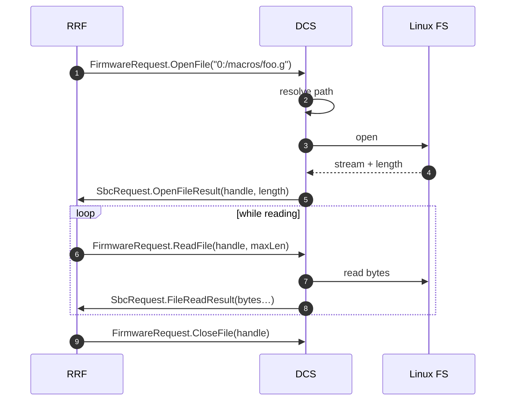
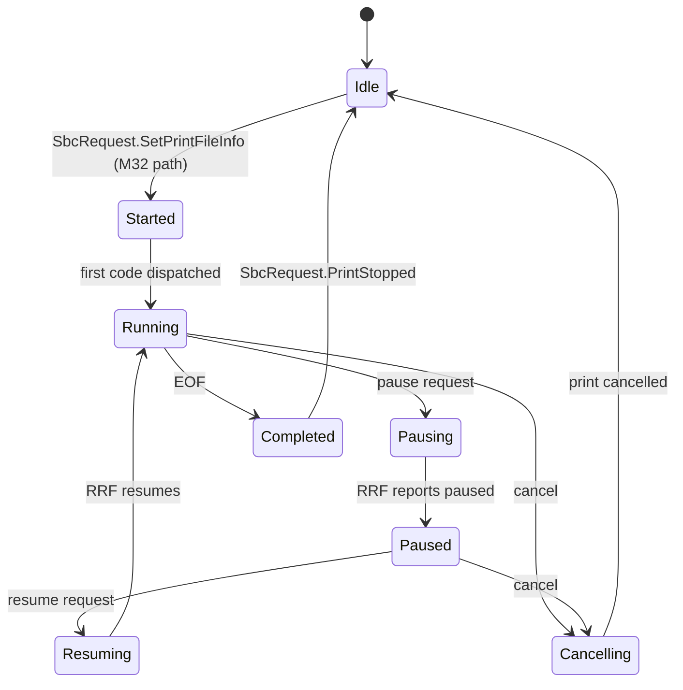
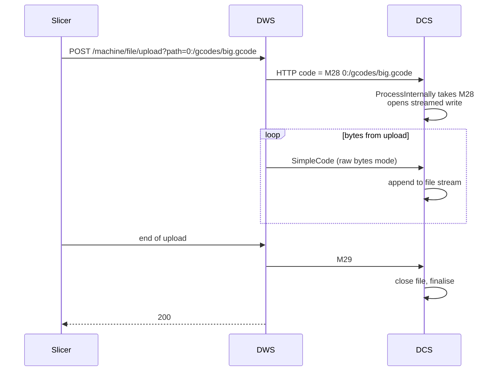

# Files & Job Processor

This document covers everything DSF does with files: the virtual SD card, path resolution, the job processor, the file parser, and how the firmware reaches files via SPI.

## 1. The virtual SD card

When DSF is in charge, RRF has no SD card of its own. Instead, files live on the SBC under a configurable root (`Settings.BaseDirectory`, default `/opt/dsf/sd`):

```
/opt/dsf/sd/
├── sys/                  ← config.g, dsf-config.g, *.g
├── macros/               ← user macros
├── gcodes/               ← print jobs
├── firmware/             ← Duet3Firmware_*.bin, Duet3Firmware_*-V*.bin (CAN expansion)
├── menu/                 ← PanelDue menus
├── filaments/            ← per-filament profiles
└── www/                  ← DWC bundle (when DWS serves static files)
```

These match the `Directories` subtree of the Object Model — a printer running standalone with a real SD card uses the same layout, just on FAT.

## 2. Path resolution

RRF refers to files using its volume-prefixed scheme: `0:/sys/config.g`, `0:/macros/foo.g`. DSF resolves these into host paths via [`FilePathResolver`](../../src/DuetControlServer/Files/FilePathResolver.cs):

```mermaid
flowchart LR
    RRFPath[0:/sys/config.g] --> Resolver[FilePathResolver]
    Resolver --> Trim[strip volume prefix]
    Trim --> Combine[combine with BaseDirectory]
    Combine --> Host[/opt/dsf/sd/sys/config.g]
```

For multi-volume systems (`1:`, `2:`, `3:`) the volume map is configured in `config.json`. Most installations use a single volume.

## 3. File operations from RRF

In SBC mode, RRF can't open files itself. Every file operation is delegated to DSF over SPI:



Handles are opaque tokens issued by DCS; DCS keeps a `Dictionary<FileHandle, Stream>` and reuses handles within the file mutex held in DCS.

The set of supported operations is listed in [SPI_LINK.md#5-packet-types](SPI_LINK.md).

## 4. The Job Processor

`Files.JobProcessor` ([Files/JobProcessor.cs](../../src/DuetControlServer/Files/JobProcessor.cs)) is the print-job state machine:



The processor:

- Opens the file and creates a [`CodeFile`](../../src/DuetControlServer/Files/CodeFile.cs) parser around it.
- Reads codes one at a time and submits them to the `File` (or `File2`) channel pipeline.
- Watches RRF's `state.status` and pause / cancel events for transitions.
- Pre-reads a few hundred lines for thumbnail / time / layer-height parsing, served back to DWC via the `job.file` Object Model entry.
- Records `pause.g` / `resume.g` / `cancel.g` execution and the relevant restore points.

## 5. File parser

[`FileInfoParser`](../../src/DuetControlServer/Utility/FileInfoParser.cs) (and the supporting [`Files/Parser/`](../../src/DuetControlServer/Files/Parser) classes) extract slicer metadata from an arbitrary G-code file:

- File size, last modified date.
- Slicer-emitted comments — print time, filament usage, layer height, simulated time, etc. (Per-slicer regexes — Cura, PrusaSlicer / SuperSlicer, OrcaSlicer, IdeaMaker, Simplify3D, KISSlicer.)
- Embedded thumbnail PNGs / JPEGs decoded by `ImageProcessing`.

Results are surfaced under `job.file` in the model. Slicers update their conventions over time; new ones are added in `FileInfoParser` as needed.

## 6. The Code parser

[`CodeFile`](../../src/DuetControlServer/Files/CodeFile.cs), [`MacroFile`](../../src/DuetControlServer/Files/MacroFile.cs), and [`CodeBlock`](../../src/DuetControlServer/Files/CodeBlock.cs) implement DSF-side G-code parsing — a streaming tokeniser that produces `Code` objects (the same type the IPC `Code` command builds). It understands:

- Standard `G`/`M`/`T` codes and parameters.
- Comments (`;` and `( ... )`).
- Conditional / meta-keywords (`if`/`elif`/`else`/`while`/`break`/`continue`/`return`/`abort`/`set`/`var`/`global`/`echo`).
- `M28`/`M29` streamed-write blocks.

Parsing in DSF (rather than RRF) is a major reason the SBC link can saturate: RRF receives binary, parsed codes and doesn't have to text-tokenise them.

## 7. M28 / M29 streamed writes

A common path for slicer uploads:



The `FilesBeingWritten` array on `CodeProcessor` tracks the open writer per channel.

## 8. Where this connects to the rest of the system

- The SPI request types — [SPI_LINK.md#7-file-proxy](SPI_LINK.md).
- Pipeline interaction (M28/M29 internal handlers) — [CODE_PIPELINE.md#4-internal-handlers-processinternally](CODE_PIPELINE.md).
- HTTP `/machine/file/*` and `/machine/files/*` endpoints — [HTTP_API.md](HTTP_API.md).
- Object Model fields under `job` and `directories` — [OBJECT_MODEL.md](OBJECT_MODEL.md).
