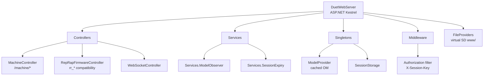
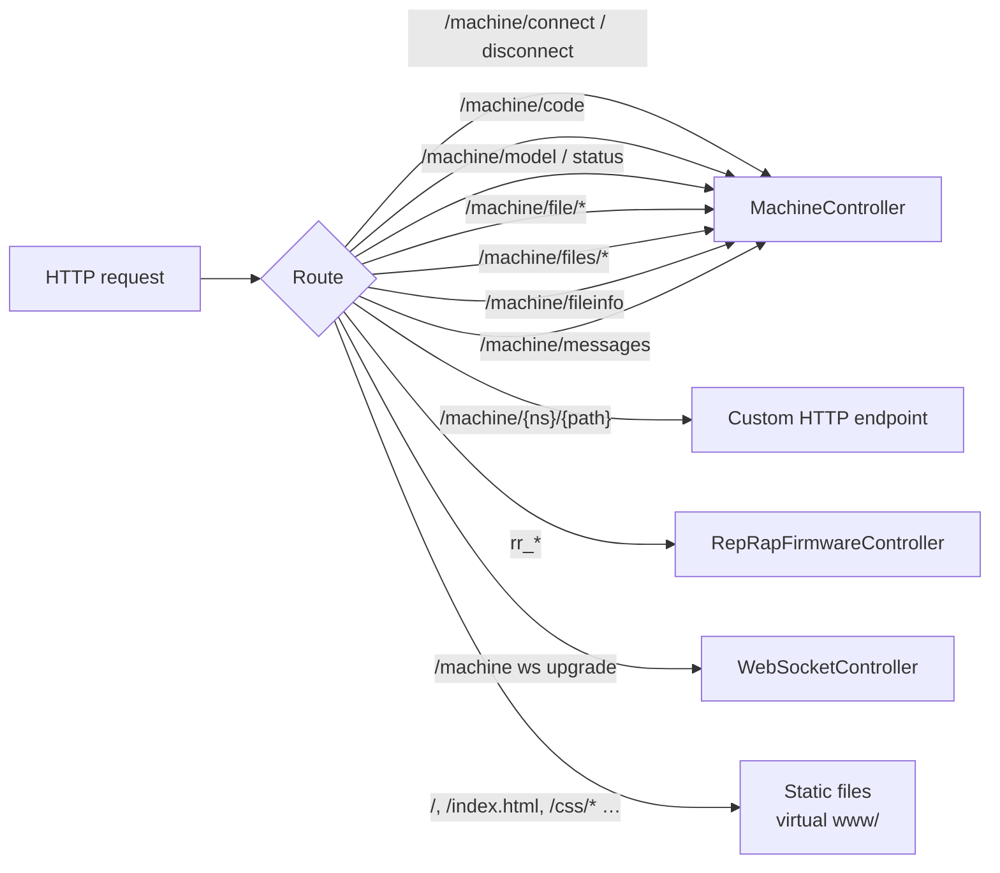
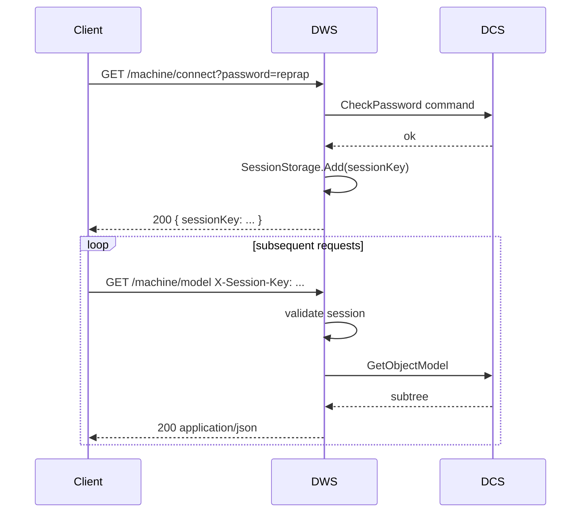
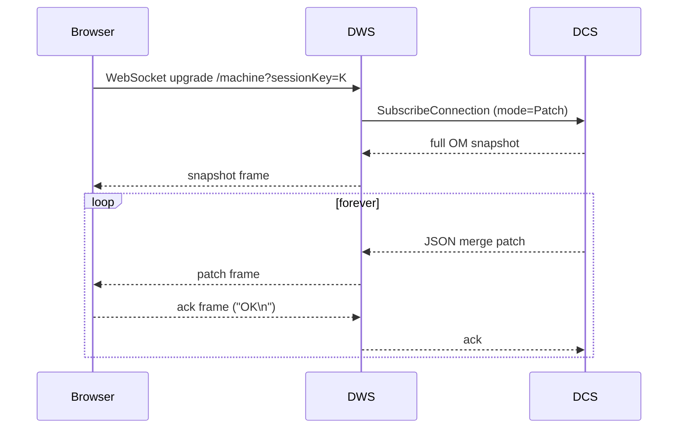
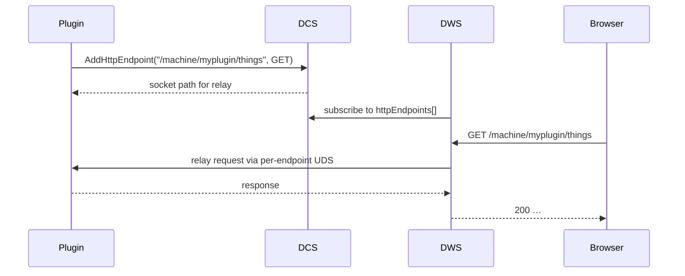
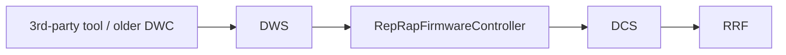

# HTTP API (DuetWebServer)

DuetWebServer (DWS) is the ASP.NET Core process that serves Duet Web Control (DWC) and exposes the HTTP / WebSocket API documented in [`OpenAPI.yaml`](../../OpenAPI.yaml). It is a thin layer over the IPC socket — almost everything DWS does ends up as a `DuetAPIClient` call into DCS.

## 1. Component layout

| File | Path |
|---|---|
| `Program.cs`, `Startup.cs` | [src/DuetWebServer/](../../src/DuetWebServer) |
| `MachineController` | [src/DuetWebServer/Controllers/MachineController.cs](../../src/DuetWebServer/Controllers/MachineController.cs) |
| `RepRapFirmwareController` | [src/DuetWebServer/Controllers/RepRapFirmwareController.cs](../../src/DuetWebServer/Controllers/RepRapFirmwareController.cs) |
| `WebSocketController` | [src/DuetWebServer/Controllers/WebSocketController.cs](../../src/DuetWebServer/Controllers/WebSocketController.cs) |

## 2. Routing

Two URL families exist for legacy reasons:

- **`/machine/*`** — modern DSF-native API. Documented in [OpenAPI.yaml](../../OpenAPI.yaml).
- **`rr_*`** — the legacy RRF HTTP API; preserved so that older DWC builds and third-party tools keep working. The `RepRapFirmwareController` proxies these calls through to DCS.

## 3. Sessions

Auth is session-based. A client calls `GET /machine/connect?password=…`, receives a `sessionKey`, and then includes it on every subsequent request as `X-Session-Key:` (or `?sessionKey=…` for WebSockets, since browsers can't add headers there).

Sessions are kept alive by:

- A WebSocket attached to that session.
- A long-running HTTP request (file upload, code execute).
- Periodic `noop` calls.

Inactive sessions expire via the `SessionExpiry` background service.

## 4. The WebSocket

`/machine` upgraded to a WebSocket gives the browser a push-style connection. It is wrapped around the `Subscribe` IPC mode:

WebSocket buffer size is configurable (`WebSocketBufferSize`), and the keep-alive ping interval is `KeepAliveInterval`. If DWS is running behind a reverse proxy, set `KeepAliveInterval` lower than the proxy's idle timeout.

## 5. Custom HTTP endpoints

A plugin (or the `CustomHttpEndpoint` CLI tool) can register a route at `/machine/{namespace}/{path}` for a chosen HTTP method or a WebSocket. DWS reads the registry from the object model (`httpEndpoints[]`) and dynamically maps incoming requests to whichever process has registered that endpoint, via a relay back through DCS to the plugin.

This is how plugins extend the API without DWS knowing anything about them.

## 6. Static files (DWC)

When `UseStaticFiles=true` (default), DWS serves files from `0:/www/` on the virtual SD as static content. This is the primary delivery path for DWC's HTML/CSS/JS bundle on a DuetPi install. If `false`, DWS expects DWC (or whatever) to be served by an external reverse proxy.

`MaxAge` controls cache headers. `DefaultWebDirectory` is a fallback if DCS is not reachable, so a freshly-installed system without DCS still serves a "DCS down" page.

## 7. Reverse-proxy mode

DWS deliberately doesn't do TLS itself; the recommended deployment in production is behind nginx or apache (see [README.md](../../README.md#operation-as-a-reverse-proxy)). DWS only listens on the bound Kestrel ports specified in `appsettings.json`/`http.json`'s `Kestrel` section.

For WebSockets through a reverse proxy, configure the proxy to allow long-lived connections and ensure `KeepAliveInterval` is shorter than the proxy's idle timeout.

## 8. The `rr_*` legacy API

Each legacy URL is mapped to the equivalent `/machine/*` operation. They cannot be removed because:

- Slicer plugins, OctoPrint adapters, and uploaders are pinned to them.
- They are used by the `rr_upload` tool inside this very repo and by the VS Code task `Upload Selected Target` for firmware deployment.

## 9. ModelObserver service

`Services.ModelObserver` ([Services/ModelObserver.cs](../../src/DuetWebServer/Services/ModelObserver.cs)) holds a single, long-lived `SubscribeConnection` to DCS and pushes updates into a singleton `ModelProvider`. Every controller that needs OM data reads from `ModelProvider` rather than re-subscribing — the live snapshot is shared across all in-flight HTTP requests.

This is also why DWS's tail latency is low: most `/machine/model` calls are answered from process-local memory, not from a fresh round-trip through DCS.

## 10. Where this connects to the rest of the system

- IPC commands DWS uses live in [IPC_PROTOCOL.md](IPC_PROTOCOL.md).
- The OpenAPI schema is the canonical reference for HTTP endpoints — [`OpenAPI.yaml`](../../OpenAPI.yaml).
- For the standalone-mode equivalent of this server (when there is no SBC, RRF runs HTTP itself), see [RepRapFirmware/docs/devel/NETWORKING.md](../../../RepRapFirmware/docs/devel/NETWORKING.md).
