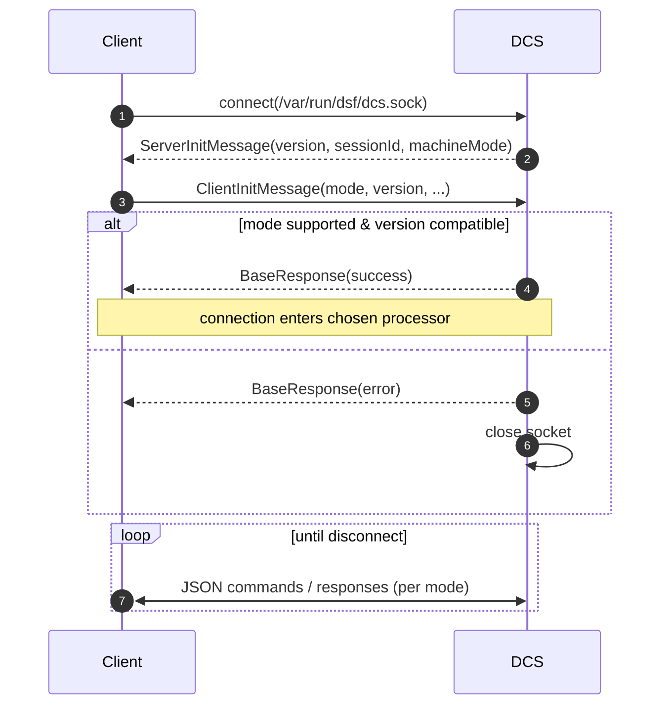
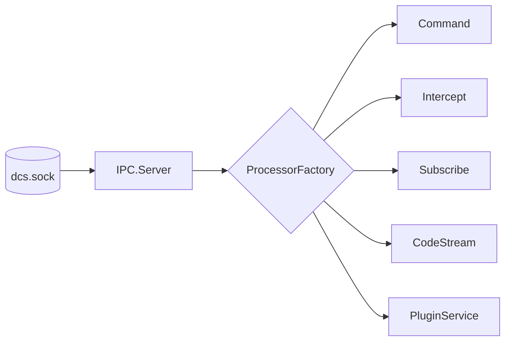
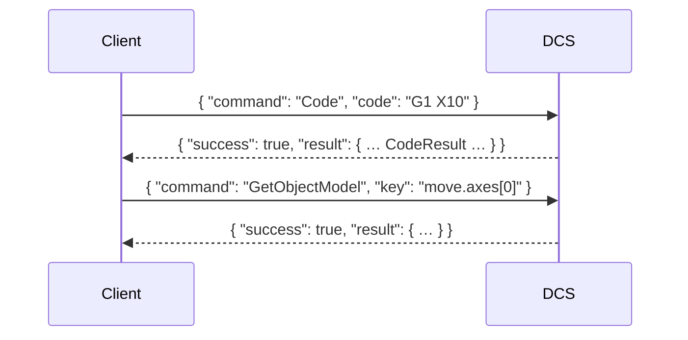
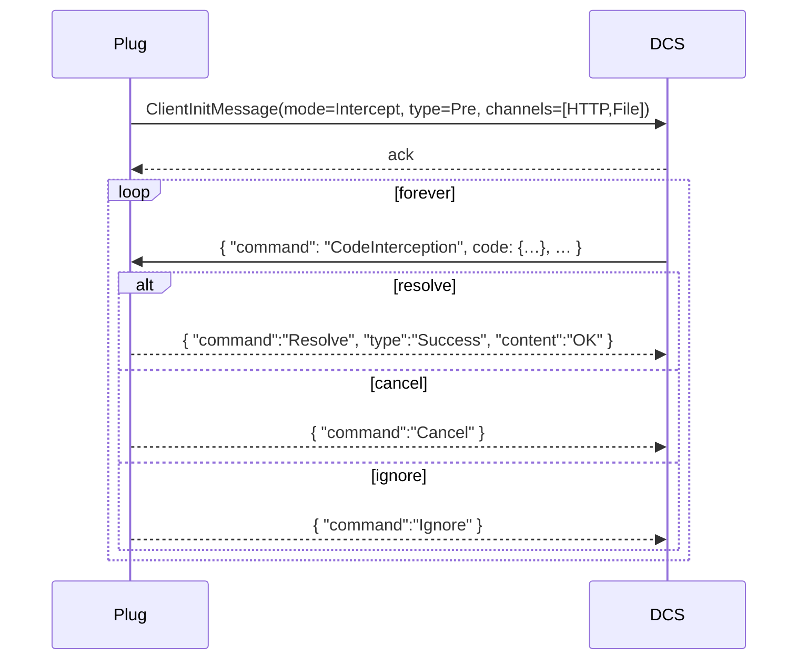
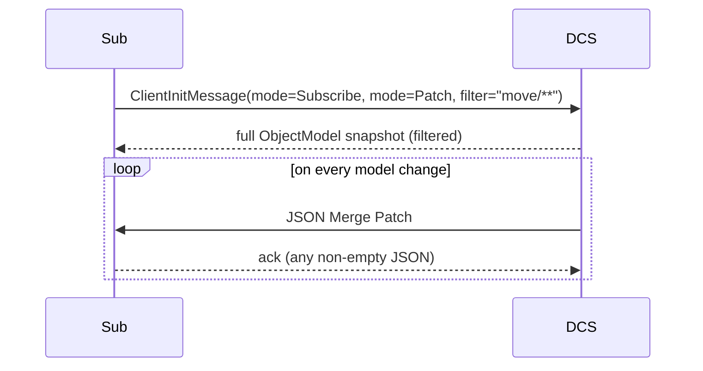
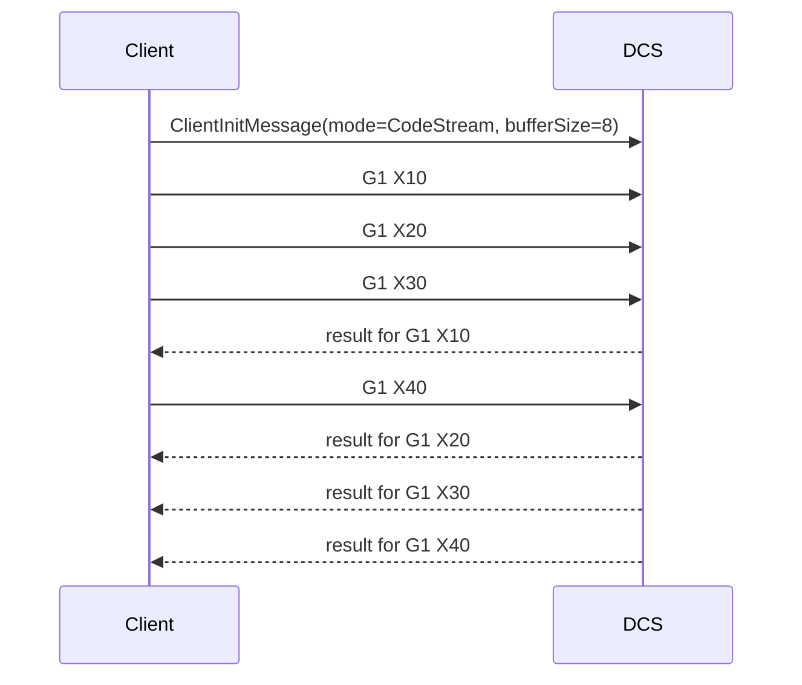

# IPC Protocol

DCS exposes a UNIX-domain socket for inter-process communication. **Every** non-DCS process that needs machine state or wants to influence behaviour talks to this socket — DWS, plugin services, plugins, command-line tools (`CodeConsole`, `CodeStream`, `ModelObserver`, `PluginManager`), third-party integrations.

The socket lives at `/var/run/dsf/dcs.sock` (override with `--socket-directory` / `--socket-file`).

## 1. Connection lifecycle



Init messages are `\n`-terminated JSON objects ([`InitMessage` hierarchy](../../src/DuetAPI/Connection/InitMessages)). Negotiation is mandatory — the server has a `MinimumProtocolVersion` (currently 7) and refuses older clients. After negotiation, the per-mode protocol takes over.

## 2. Connection modes

The `ConnectionMode` enum ([`Modes/ConnectionMode.cs`](../../src/DuetAPI/Connection/Modes/ConnectionMode.cs)):

| Mode | Purpose | Processor |
|---|---|---|
| `Command` | Issue commands (codes, file ops, M409, plugin install, etc.). Each command is an atomic request → response. | [`IPC.Processors.Command`](../../src/DuetControlServer/IPC/Processors/Command.cs) |
| `Intercept` | Receive codes at one of `Pre` / `Post` / `Executed` and resolve / cancel / ignore them. | [`IPC.Processors.CodeInterception`](../../src/DuetControlServer/IPC/Processors/CodeInterception.cs) |
| `Subscribe` | Receive object-model deltas (or full patches) push-style. | [`IPC.Processors.ModelSubscription`](../../src/DuetControlServer/IPC/Processors/ModelSubscription.cs) |
| `CodeStream` | Stream codes asynchronously without waiting for replies before sending the next. | [`IPC.Processors.CodeStream`](../../src/DuetControlServer/IPC/Processors/CodeStream.cs) |
| `PluginService` | Internal mode used only by the two `DuetPluginService` instances. | [`IPC.Processors.PluginService`](../../src/DuetControlServer/IPC/Processors/PluginService.cs) |



## 3. Command mode

Every interaction is `Command` → `Response`. Commands are JSON objects, dispatched by `CommandFactory` to one of the typed `Command` classes under [`Commands/`](../../src/DuetControlServer/Commands).



Important commands (full list in [`DuetAPI.Commands`](../../src/DuetAPI/Commands)):

| Command | Effect |
|---|---|
| `Code` | Run a single G/M/T-code through the pipeline. |
| `SimpleCode` | Run a code on a chosen channel (default `HTTP`). |
| `Flush` | Wait for all queued codes on a channel. |
| `GetObjectModel` | Retrieve a subtree of the object model. |
| `EvaluateExpression` | Evaluate an expression against the model. |
| `LockObjectModel` / `UnlockObjectModel` | Take the OM write lock from outside DCS. |
| `GetFileInfo` | Parse slicer metadata. |
| `Install`/`Start`/`Stop`/`Uninstall`/`SetPluginData` | Plugin life-cycle. |
| `WriteMessage` | Inject a message into the OM message log. |
| `AddHttpEndpoint` / `RemoveHttpEndpoint` | Custom HTTP endpoint registration (DWS picks them up). |
| `AddUserSession` / `RemoveUserSession` | Session management. |

## 4. Intercept mode

A plugin connects, declares which stage and which channels it cares about, and then receives codes one at a time. For each code the plugin must respond with one of `Resolve` / `Cancel` / `Ignore`.



The plugin must answer **every** code within a small timeout — dragging the pipeline is a deployment-blocking bug.

## 5. Subscribe mode

Two flavours:

- **`Full`** — DCS sends the entire object model at connection time, then on every change pushes the entire (changed) subtree.
- **`Patch`** — DCS sends a JSON Merge Patch describing only what changed. Lower bandwidth, recommended for DWC-style consumers.



A `filter` string narrows what the subscriber receives — a path expression with wildcards (`move/**`, `state/status`, `seqs`).

## 6. CodeStream mode

A throughput optimisation: instead of `Code` → `Response` ping-pong, the client opens a stream, sends codes as fast as it likes, and DSF replies whenever a code finishes. Used by [`CodeStream`](../../src/CodeStream) and by DWS for long lists of codes.



`bufferSize` caps how many codes can be in flight at once.

## 7. PluginService mode

Reserved for the two `DuetPluginService` daemons. They register themselves so that DCS knows where to route plugin commands (start/stop/install). The two services have different privilege levels (root and dsf user) — the root one only handles plugins that explicitly need root.

## 8. Authentication

The IPC socket is filesystem-protected — the directory `/var/run/dsf` is owned by `dsf:dsf` with mode 0770, so any client must be in the `dsf` group to connect. There is no password / token; identity is the OS user.

External authentication (sessions, passwords) is layered on top by DWS at the HTTP boundary, not at the IPC layer.

## 9. Library wrappers

Most clients use [`DuetAPIClient`](../../src/DuetAPIClient) instead of speaking the protocol directly:

```csharp
using var conn = new CommandConnection();
await conn.Connect();
var reply = await conn.PerformSimpleCode("M409 K\"move\"");
```

Specialised connection classes wrap each mode: `CommandConnection`, `InterceptConnection`, `SubscribeConnection`, `CodeStreamConnection`, etc.

For non-.NET languages, the protocol is plain JSON-over-Unix-socket — Python plugins just use `socket` + `json`.

## 10. Where this connects to the rest of the system

- Plugins live on top of `Intercept` and `Command` modes — see [PLUGINS.md](PLUGINS.md).
- DWS uses `Command` and `Subscribe` modes — see [HTTP_API.md](HTTP_API.md).
- Subscribe-mode delivery is built on the model differ — see [OBJECT_MODEL.md](OBJECT_MODEL.md).
- The full IPC schema (every command, every response, every init message) is generated as `OpenAPI.yaml` — see also `/api/` in the published DocFX site.
