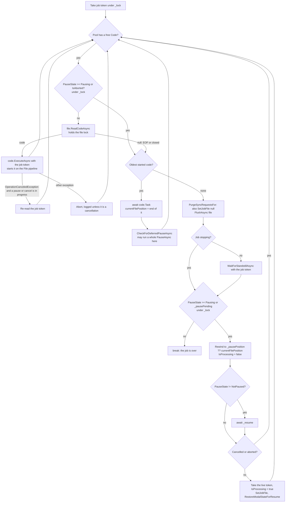
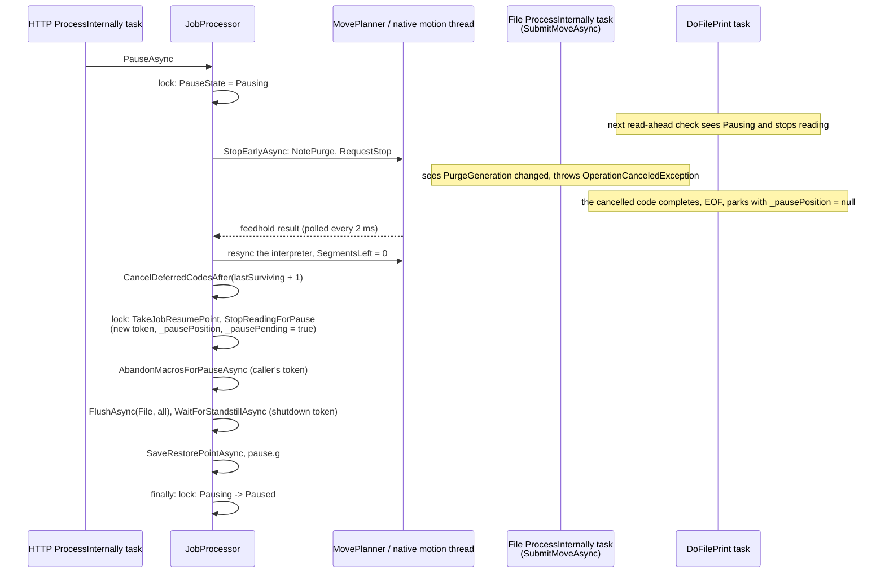
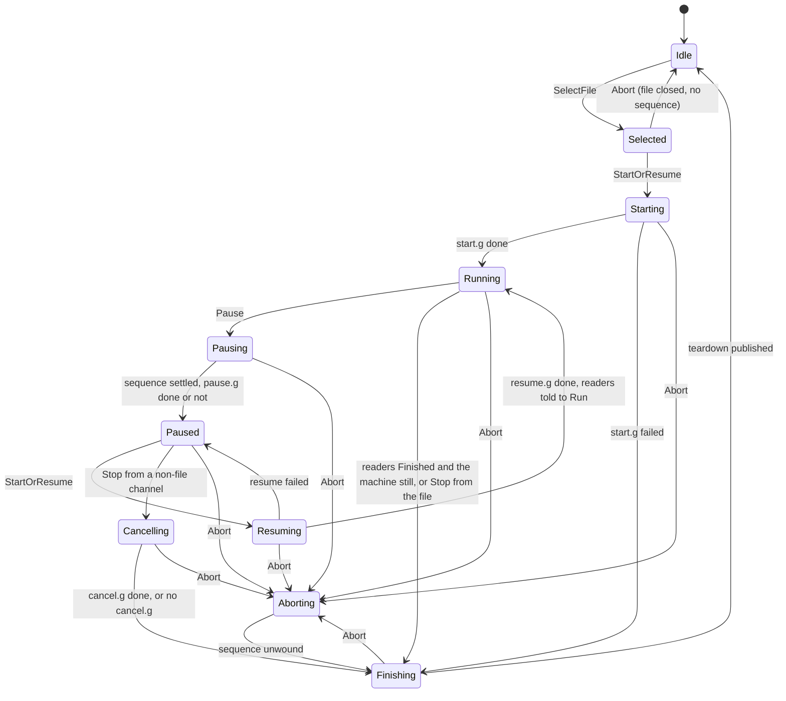
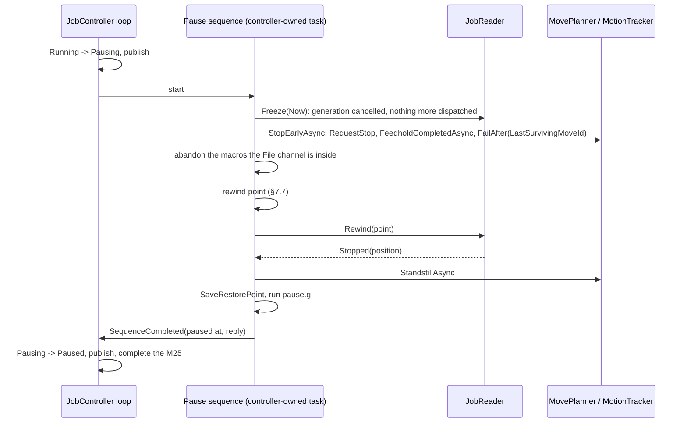

# Job control concurrency: how pause, resume and stop run today, and the plan to make them robust

[JOB_LIFECYCLE.md](JOB_LIFECYCLE.md) records what the job lifecycle has to do and the order it was
ported in. This document is about how the code that does it is *scheduled*: which threads and tasks
take part, what state they share, where the windows between them are, and why the same loop has
needed one race fix after another ([KNOWN_BUGS.md](KNOWN_BUGS.md) lists eight already fixed and
the open ones below, and the stepped pause sweep in `SystemTests` still fails). Section 5 is the
catalogue of the races that remain, each with the interleaving that produces it. Section 7 is the
replacement: a job actor written new in place of `JobProcessor`, with one owner for the
state, one message to the file reader, one rule for the resume point, and the flags that cover
ordering windows deleted along with the windows.

The code under discussion is [JobProcessor.cs](../../src/DuetControlServer/Files/JobProcessor.cs),
[JobProcessor.Lifecycle.cs](../../src/DuetControlServer/Files/JobProcessor.Lifecycle.cs),
[MovePlanner.cs](../../src/DuetControlServer/Motion/MovePlanner.cs) (`StopEarlyAsync`,
`TakeJobResumePoint`), [JobMoveIndex.cs](../../src/DuetControlServer/Motion/JobMoveIndex.cs),
`SubmitMoveAsync` in [GCodeHandler.cs](../../src/DuetControlServer/Codes/Handlers/GCodeHandler.cs),
the M0/M23/M24/M25/M226 handlers in
[MCodeHandler.cs](../../src/DuetControlServer/Codes/Handlers/MCodeHandler.cs), and the deferred-code
list in [PipelineBase.cs](../../src/DuetControlServer/Codes/Pipelines/PipelineBase.cs).

---

## 1. The actors

Everything below runs concurrently with everything else in the table. There is no thread that owns
the job; the job's state is a set of fields on `JobProcessor` that each actor reads and writes in
its own lock windows.

| Actor | What it is | Started by | Lives for | Touches the job through |
|---|---|---|---|---|
| `JobProcessor.ExecuteAsync` | Hosted-service task | Host startup | The process | Waits on `_resume` for a job to start, starts the file tasks, awaits them, runs the end-of-job stop, tears the job down |
| `DoFilePrint(File)` | Task, awaited only by `ExecuteAsync` | `ExecuteAsync` | One job run, across every pause of it | Reads the file ahead, starts each code on the `File` channel, tracks completion, parks and rewinds on a pause, runs the deferred-pause check |
| `DoFilePrint(File2)` | The same for a forked job | `ExecuteAsync` or `StartSecondJob` (`M606 S1`) | The fork | As above on `File2`; shares `_pausePending` with the first |
| Pipeline stage tasks | One task per stage (`Start`, `Pre`, `ProcessInternally`, `Post`, `Executed`) per stack level per channel, `Task.Factory.StartNew` in `PipelineStackItem` | `Push` | Until `Pop` | `ProcessInternally` runs every handler: `SubmitMoveAsync` for the job's moves, and the M0/M24/M25/M226 handlers that call into `JobProcessor` |
| Macro tasks | `Task.Run(MacroFile.RunAsync)` | `MacroRunner`, `M98`, tool changes, `pause.g`/`resume.g`/`stop.g`/`cancel.g` | Until the macro ends or is aborted | Reads the macro and starts its codes on the invoking channel, one stack level up |
| Deferred code tasks | `RunDeferredCodeAsync`, unawaited, one per Deferred-class code (`M106`, `M3`, ...) | The `File` channel's `ProcessInternally` stage | Until the anchor move retires and the handler runs | Own cancellation source, detached from the channel's; counted by the standstill wait, not by flushes |
| The pause, resume and stop sequences | Not tasks of their own: `PauseAsync`, `ResumeAsync` and `StopAsync` run inline on whichever task called them | The `ProcessInternally` task of the channel that issued `M25`/`M24`/`M0` (`HTTP` from DWC, `File` for a synchronous pause), `EventProcessor` for an event, `DoFilePrint` for a deferred pause, `ExecuteAsync` for the end-of-job stop | The call | Every field on `JobProcessor`, the planner, the code processor, the macro runner |
| `EventProcessor` | Hosted-service task | Host startup | The process | `PauseAsync` on `Autopause` for a heater fault, filament error or driver error |
| `MotionService` managed thread | `Thread`, highest priority | `MotionService.ExecuteAsync` | The process | Publishes `machinePosition` every 50 ms; nothing else |
| Native motion thread | `std::thread` in `libDuetSbcInterface` | `StartMotion` | The process | `SpinOnce` every 1 ms: `DrainFeedholds`, `DrainForcedPositions`, `DrainSubmissions`, then each ring's `Spin`. Acts on a stop request and publishes the result through a seqlock |
| `LinkService` dispatcher thread | `Thread` | `LinkService.ExecuteAsync` | The process | Turns `MoveCompleted` records into `MotionTracker.MoveCompleted`, which wakes the deferred codes waiting on that move |
| `MachineStatusService` | Hosted-service task | Host startup | The process | Every 250 ms derives `state.status` from `PauseState`, `IsProcessing` and `IsMoving`, without the job lock |
| `JobMonitor` | Hosted-service task | Host startup | The process | Every 200 ms reads `IsProcessing`, `PauseState`, `IsSimulating` under the job lock, then the file position under the object model write lock |
| IPC connection tasks | `Task.Run` per connection | `IPC.Server` | The connection | Where DWC's `M25` and `M24` enter, as codes on the `HTTP` channel |

Two consequences of the table drive everything in §5:

- **The sequences run on borrowed tasks.** `PauseAsync` for an `M25` from DWC runs on the `HTTP`
  channel's `ProcessInternally` task, under that code's cancellation token, while the `File`
  channel's stage tasks and `DoFilePrint` carry on. The pause and the thing being paused are peers;
  neither can assume the other is at a known point.
- **The file reader parks itself.** `DoFilePrint` decides when the job has stopped reading, where
  to rewind to and when to carry on, from fields the sequences set in separate lock windows. The
  reader infers the sequence's progress; the sequence never tells it.

---

## 2. The shared state and its locks

| State | Lock | Written by | Read by |
|---|---|---|---|
| `PauseState` | `JobProcessor._lock` | `PauseAsync` (`Pausing`, then `Paused` in its `finally`), `ResumeAsync` (`Resuming`, `NotPaused`), `StopAsync` (`Cancelling`, `NotPaused`), `Resume()`, `Cancel()`, `Abort()`, `SelectFileAsync`, the teardown in `ExecuteAsync` | `DoFilePrint` under the lock; `MachineStatusService`, `EventProcessor`'s pre-check and the M-code handlers partly without it |
| `IsProcessing` | `_lock` | `ExecuteAsync` at start and teardown, `DoFilePrint` when it parks and unparks | `PauseAsync`, `ResumeAsync`, `CheckForDeferredPauseAsync`, `StartSecondJob`, `MachineStatusService` (no lock), M23/M27/M37 handlers, `EventProcessor`, `JobMonitor` |
| `IsCancelled`, `IsAborted` | `_lock` | `Cancel()` (`IsCancelled = IsPaused`), `Abort()`, `SelectFileAsync` | `DoFilePrint`, `ExecuteAsync` |
| `_pausePending`, `_pausePosition`, `_pausePosition2`, `_pauseReason` | `_lock` | `StopReadingForPause`, `DoFilePrint` (clears the flag when it parks), `SelectFileAsync` | `DoFilePrint` |
| `_cancellationTokenSource` | `_lock` | Replaced, and the old one cancelled and disposed, by `StopReadingForPause`, `Cancel()` and `Abort()` | `DoFilePrint` captures the token at seven points and passes it to every code it starts |
| `_stopped` | `_lock` | `StopAsync`, `SelectFileAsync` | `StopAsync`, `ExecuteAsync` |
| `_deferredPause` | `_lock` | `TryDeferPause`, `CheckForDeferredPauseAsync`, `SelectFileAsync` | `CheckForDeferredPauseAsync`, `IsPauseDeferred` |
| `_pausedInMacro` | None | `PauseAsync` | `ResumeAsync` |
| `_resume`, `_finished` | `AsyncConditionVariable`s on `_lock`. A notify wakes only the tasks already waiting; one given before the wait is lost | `_resume`: `Resume()`, `Cancel()`, `Abort()`, `ResumeAsync`'s `finally`. `_finished`: the teardown | `ExecuteAsync` (a job to start), `DoFilePrint` (a pause to end), `SelectFileAsync` (the previous job to end) |
| `CodeFile.Position`, `NextFilePosition`, `ModalGCommand`, `FirstCommandAfterRestart` | The file's own `AsyncLock` | `ReadCodeAsync`, `SetFilePositionAsync`, `RestoreModalStateForResume`, `ApplyRestartStateAsync`, `ResumeAsync` | `ReadCodeAsync`, `GetFilePositionAsync`, `JobMonitor` |
| `CodeFile.IsClosed` | Volatile, no lock | `Cancel()`, `Abort()` | `ReadCodeAsync`, `ExecuteAsync` |
| `MovementState.CurrentJobMove`, `SegmentsLeft`, `MoveFractionToSkip`, `PurgeGeneration`, `RestorePoints[1]`, `RestartMoveFractionDone`, `RestartGCommandNumber` | `MovePlanner.Lock()` | `SubmitMoveAsync`, `StopEarlyAsync`, `TakeJobResumePoint`, `SaveRestorePointAsync`, `RestoreModalStateForResume`, `ApplyRestartStateAsync`, M26 | `SubmitMoveAsync`, `MoveInterpreter`, the resume |
| `MovePlanner.JobMoves` | `MovePlanner.Lock()` | `SubmitMoveAsync` (`Note` per segment), `TakeJobResumePoint` (`Clear`) | `TakeJobResumePoint` |
| The channel's stack, its job file and `_deferredCodes` | `lock (_stack)`, `lock (_deferredCodes)` | `Push`/`Pop`, `SetJobFile`, `DeferCode`, `Cancel...DeferredCodes` | Flushes, the standstill wait, `IsDoingMacro`, `CanRestartMacros` |
| `MotionTracker` waiters and completion counts | Its own `lock` | The `LinkService` dispatcher | Deferred codes, `ShouldDefer`, `IsMoving` |
| Native: the feedhold request queue, the feedhold result, the submission queue | Lock-free ring buffers and a seqlock | `RequestStop` from DCS; `DrainFeedholds` on the motion thread | `TryGetFeedholdResult` polled by `StopEarlyAsync` |

Lock order is not defined anywhere. The orders taken today, each by at least one path:

- `_lock` → object model write → planner (`SelectFileAsync`, `SaveRestorePointAsync` in reverse)
- `_lock` → file lock (`SetFilePositionAsync`, `GetFilePositionAsync` from M26/M27, `ResumeAsync`)
- file lock → object model read (`ReadCodeAsync`)
- object model write → file lock (`JobMonitor.PublishAsync`)
- object model → planner (everywhere; this pair is consistent)

`file → model` and `model → file` both exist, which deadlocks when the timing lands
(§5, R9).

---

## 3. The sequences as they run

### 3.1 Starting a job

`M32` or `M23`+`M24` on any channel. The handler holds `_lock` around `SelectFileAsync`, which
cancels and waits out any previous job, then `ResumeAsync` runs `start.g` on the `File` channel,
applies the M26 restart state, and calls `Resume()`, which sets `NotPaused` and notifies `_resume`.
`ExecuteAsync` wakes, sets `IsProcessing`, and starts `DoFilePrint`.

### 3.2 The reader



A cancel or abort that ends the pause wait does not leave the loop: it re-enters the fill loop,
reads null from the closed file, and reaches the park test a second time, which is the second pass
R7 depends on.

The loop reads up to `BufferedPrintCodes` (32) codes ahead of the oldest one still running. A
movement code completes when its move has been *submitted*, so `currentFilePosition` runs ahead of
the machine by the whole queue; for a short file it reaches the end of the file while the machine
is still on the first line.

### 3.3 An asynchronous pause

`M25` from DWC, or an event. The whole of this runs on the caller's task.



The two notes on `R` are the race in §5 R1: the reader can park before the fourth step has told it
where to rewind to.

### 3.4 A synchronous pause

`M25`, `M226`, `M600` or `M601` read from the job file. The handler flushes the stages ahead of the
code, then `PauseAsync(synchronous: true, pausingCode: code)` runs on the `File` channel's own
`ProcessInternally` task, under the job token. `StopEarlyAsync` is skipped. `StopReadingForPause`
cancels the job token, which is the token this very sequence was called with; the code's own
property is re-armed, but the sequence's local `cancellationToken` is only replaced *after*
`AbandonMacrosForPauseAsync` has been awaited with the cancelled one (§5, R4).

A deferred pause (`M25` while a non-restartable macro runs) is the same call made from
`DoFilePrint` after each job code completes, on the reader's task and token.

### 3.5 Resume

`M24` on any channel. `ResumeAsync` sets `Resuming` under the lock, then, without it, runs
`resume.g` on the caller's channel, queues the two restore moves and waits for standstill, restores
the channel's feed rate and distance modes, and in its `finally` sets `NotPaused` and notifies
`_resume` if the reader has parked (`!IsProcessing`). If the reader has not parked yet, the notify
is not given and the reader relies on finding `NotPaused` when it gets there. The reader then
rewinds (again) to `_pausePosition`, re-arms, and puts back the modal G command and the fraction
to skip from the restore point.

### 3.6 Stop and cancel

- **`M0` from the file**: the handler calls `Cancel()` (closes the file, replaces the token,
  `IsCancelled = IsPaused` which is false) and `StopAsync(NormalCompletion)`, which runs `stop.g`.
  The reader reaches EOF, waits for standstill, and exits; `ExecuteAsync` sees `_stopped` and skips
  the stop.
- **`M0` while paused**: `Cancel()` sets `IsCancelled` and notifies `_resume`; the parked reader
  wakes and exits; `StopAsync(UserCancelled)` sets `Cancelling` and runs `cancel.g`. Meanwhile
  `ExecuteAsync`'s teardown runs to completion and resets `PauseState` to `NotPaused`, `_file` to
  null, and notifies `_finished`, while `cancel.g` may still be running (§5, R7).
- **End of file**: the reader waits for standstill, exits; `ExecuteAsync` runs
  `StopAsync(NormalCompletion)` and tears down.
- **Abort**: `Abort()` from a code error, `AbortAllFilesAsync`, or `LinkService` shutting down.

---

## 4. What each mechanism is for, and the window it leaves

| Mechanism | Introduced to close | Window still open |
|---|---|---|
| `PauseState` ordering (`>= Pausing` stops the reader) | A second `M25` starting a second sequence | The reader stops on `Pausing`, which is set before the pause knows where to rewind to |
| `_pausePending` | A resume landing before the reader parked, which put the state back to `NotPaused` and made the reader read EOF as the job ending | Set in the same late lock window as the position, so it does not gate the park either; a second park after the resume then rewinds a second time (R1) |
| Re-reading the job token in six places | Codes read after a resume being cancelled by the token the pause had cancelled | Each re-read is a separate lock window; a cancel between two of them still hands the next code a dead token |
| `PurgeGeneration` | A segmented submission continuing to feed a ring that had just been emptied | It aborts the submission *before* the pause has recorded anything, which is what parks the reader early |
| `CurrentJobMove` taken by reference identity | A pause adopting a record left by a submission that ended on its own | A record released the moment the last segment is submitted, so a stop between full submission and execution has no record (R2) |
| `JobMoveIndex` keyed on move id | Mapping a purged move back to its line | Nothing purged but the submission queue discarded: no index lookup is made (R2) |
| `CancelDeferredCodesAfter(lastSurviving + 1)` | Deferred codes anchored to purged moves holding the standstill wait for ever | Runs before the read-ahead is cancelled, so a deferred code created in between anchors to a move that will never retire (R3) |
| `catch (OperationCanceledException)` around the deferred-pause check | A pause cancelling the token the check was made with and taking the reader down | The check itself calls `PauseAsync` with that token (R4) |
| `_stopped` | `stop.g` running twice for a file ending in `M0` | Never cleared after a job ends, so `M0` with no job runs nothing (R5) |
| `ResumeAsync`'s conditional `_resume.NotifyAll()` | Waking a reader that had not parked | The parked reader reports `IsProcessing = false` until it re-acquires the lock after the notify, and in that window the job can be selected over and cancelled (R16) |
| `_stopped` and `IsCancelled = IsPaused` | `stop.g` running twice; telling a cancel from a normal end | Neither is a state of the job: one is never cleared (R5), the other is a snapshot of `IsPaused` at an instant that `Cancel()`'s other callers do not control (R11, R14) |

---

## 5. The race catalogue

Each entry is an interleaving that the code admits today. "Evidence" names the scenario that shows
it or the log that was read. Every one is reproducible in the `SystemTests` bench once the stepped
timeline covers it; the plan in §7 starts by writing the missing ones.

### R1. The reader parks before the pause has published its rewind point

**Confirmed.** `SteppedPauseTests.AnAbsoluteJobEndsAtItsLastTargetFromEveryPausePoint` and the
relative sweep fail at 6 and 3 of 22 points respectively on this tree, with travel of 445 to
800 mm for a 400 mm job.

Interleaving, from the bench log of the absolute job paused at 120 mm:

1. `PauseAsync` sets `Pausing` and calls `StopEarlyAsync`, which raises `PurgeGeneration` before
   the stop request has even been acted on.
2. `SubmitMoveAsync`, part-way through the file's last line, sees the generation change and throws
   (`Abandoning 91 remaining segment(s) of G1 X400`). The code completes as cancelled.
3. `DoFilePrint` awaits that completion, finds `Pausing`, stops reading, reaches the end of the
   file, and parks: `Job on File has been paused at byte 44 (no fpos from firmware), reason 0`.
   `_pausePosition` is still null, so it rewinds to `currentFilePosition`, the end of the last
   *completed* code, which is the line before the interrupted one.
4. Only then does `PauseAsync` reach its second lock window: `Stopped the machine early, dropping
   23 queued move(s)`, `TakeJobResumePoint` names byte 28, `StopReadingForPause` stores it and
   sets `_pausePending`.
5. `M24`: the reader continues from byte 44 with the fraction and modal state of the line at
   byte 28. At the end of the file it finds `_pausePending` still set, rewinds to byte 28 (`Job on
   File has been paused at byte 28, reason User`), does not wait because the state is `NotPaused`,
   and runs the last three lines again: 800 mm travelled.

Whether step 3 or step 4 comes first depends on how long the motion thread takes to answer the
stop, which is why the same point passes on one run and fails on the next. The reader's park
condition is `PauseState >= Pausing || _pausePending`; the first half is true before the pause
knows anything, and the flag that was added to survive the *reverse* ordering does not gate this
one.

### R2. The resume point is chosen from what was purged, not from what survives

**Confirmed by reading.** `DDARing::Feedhold` may pick the last provisional DDA as the stopping
point, so `PurgeAfter` reports `stopped` with `movesPurged == 0`, and `DrainFeedholds` then
discards every move DuetControlServer had submitted for that ring but the motion thread had not
taken up (`DiscardSubmissionsFor(0)` runs whenever `stopped`; the discard is deliberate and documented on both sides). Those
moves are counted nowhere. `TakeJobResumePoint` branches on `MovesPurged` and never reads
`LastSurvivingMoveId`, the one number `FeedholdOutcome`'s own comment says is the boundary, so:

- with the interrupted code's record already released (`SubmitMoveAsync`'s `finally` clears
  `CurrentJobMove` once every segment is *submitted*), it returns null, the reader rewinds to
  `currentFilePosition`, the end of the file for a short job, and the discarded segments are never
  made: the job ends short. Pause points 365 and 380 in `SteppedPauseTests` aim at
  this window; the run above found nothing to purge at 380 and ended correctly, which says the
  window is narrow, not closed;
- with the record still live, `SegmentsQueued` counts the discarded segments and the fraction
  over-reports.

The same branch structure fails from the other side when the earliest purged move belongs to a
macro (tool-change or `M98` moves are never noted in `JobMoves`): the lookup misses, the result is
null, `JobMoves.Clear()` discards the entries of the job moves purged behind it, and the reader
falls back to `currentFilePosition`. That is *past* the macro invocation, because `M98` completes
when its macro has dispatched its codes and every job `G1` after it completes when submitted, so
the purged job lines are skipped on resume rather than re-read. The comment in
`TakeJobResumePoint` that the fallback "is the last job code that completed, which is the macro
invocation" holds only when no job code completed after the macro was invoked.

### R3. Read-ahead codes dispatched between the stop and the read-ahead cancel

**Confirmed by reading.** `StopEarlyAsync` returns, `CancelDeferredCodesAfter` runs, and only in the next lock
window does `StopReadingForPause` cancel the job token. In between, the `File` channel's
`ProcessInternally` task is free (the interrupted `SubmitMoveAsync` has just thrown) and dispatches
the next read-ahead code:

- a `G1` builds from the resynced position and `QueueMove` accepts it, so the machine moves again
  after the stop, and `WaitForStandstillAsync` waits for it; the restore point is then where that
  move ended, and the resume replays it;
- an `M106` defers with an anchor that the purge, or the discard of the submission queue, has made
  unretirable, under its own cancellation source that `CancelDeferredCodesAfter` has already run
  past. `MovePlanner._lastSubmittedMoveId` is never wound back after a purge and
  `MotionTracker.HasRetired` compares against the last *completed* id, so a purged id reads as in
  flight until some later, higher id retires; nothing posts `MoveFailed` for purged or discarded
  moves. `AbandonMacrosForPauseAsync` waits on `LastDeferredCodeTask()` before the standstill wait
  is even reached, so `M25` never returns and the state stays `Pausing`, from which `M24` is
  ignored and `M0` is refused. This is the hang recorded in `KNOWN_BUGS.md` ("A pause could wait
  for ever on codes the stop had orphaned"), reopened through a narrower window.

Nothing in the window stops the `File` pipeline: `DoFilePrint`'s `Pausing` test only stops *new*
reads, `PipelineStackItem` skips a code only if its token is already cancelled, and no handler
consults the job state. The usual trigger is a `G1` sleeping in its ring-full retry that wakes when
the purge frees the ring.

### R4. A synchronous or deferred pause runs its macro unwind under the token it has just cancelled

**Confirmed by reading.** `PauseAsync` is called with the code's token, which for `M226`, `M600`,
`M601` and `M25` from the job file is the job token (`Code.ProcessInternally` passes
`CancellationToken`, and `DoFilePrint` set that to the job token). `StopReadingForPause` cancels
it. `pausingCode.ResetCancellationToken()` re-arms the *code's* property; the sequence's local
`cancellationToken` is only replaced at the line after `AbandonMacrosForPauseAsync` has been
awaited with the cancelled one. `AbandonMacrosForPauseAsync` awaits `LastDeferredCodeTask()` with
that token, so a job file containing `M106 ...` followed by `M226` while moves are queued throws
`OperationCanceledException` at once: the `finally` settles `Paused`, but no flush, no standstill
wait, no restore point, no `pause.g`, no "Printing paused at" message, and `_pausedInMacro` is not
set. `M24` then travels to the previous pause's restore point. The deferred pause
(`CheckForDeferredPauseAsync`, reader's token, `pausingCode: null`) fails the same way and the
exception is swallowed at the call site.

### R5. `_stopped` is never cleared, so `M0` with no job runs nothing after any completed job

**Confirmed by reading.** `StopAsync` returns at once if `_stopped`, and sets
`_stopped = IsFileSelected` otherwise. The end-of-job stop runs while the file is still selected,
so `_stopped` becomes true, and only `SelectFileAsync` clears it. Every `M0` from a console
between two jobs, which the comment above the guard says must run `stop.g` every time, returns
without running it.

### R6. `M32` or `M23` from inside the job file deadlocks the job

**Confirmed by reading.** `HandleSelectFileAsync` allows a file-channel `M32` and calls `SelectFileAsync`,
which sees a selected file, calls `Cancel()` and awaits `_finished`. `_finished` is notified by
`ExecuteAsync` after `fileTask` completes; `fileTask` is `DoFilePrint`, which is awaiting
`code.Task` of the `M32` code; that completes when the handler returns from `SelectFileAsync`. The
`File` channel's `ProcessInternally` task is held for ever, and every later `M23`, `M32` and `M0`
from any channel blocks on the job lock or the same wait. The wait is on `ApplicationStopping`, so
cancelling the job token does not release it. An `M32` inside `stop.g` run by the end-of-job stop
hangs the same way, because that stop is awaited before `_finished` is notified. No scenario
issues `M32` from a file channel.

### R7. `M2` while paused leaves the reader parked and the job never torn down

**Confirmed by reading.** `HandleStopAsync` calls `Cancel()` (`NotPaused`, notify) and then
`StopAsync(UserCancelled)`, which sets `Cancelling` and runs `cancel.g`. The parked reader wakes on
the notify, exits the pause branch, reads the closed file, and reaches the park test again while
`Cancelling` is set: it parks a second time because `PauseState != NotPaused`. `StopAsync`'s
`finally` puts `NotPaused` back without a notify. `CodeExecutedAsync` calls `Resume()` for `M0` and
`M1` only, so after `M2` nothing wakes the reader: `ExecuteAsync` never passes `await fileTask`,
`job.file` is never cleared, `lastFileCancelled` is never written, and the status reads `idle`
with a job still selected until an `M23` cancels it again or an `M24` runs `start.g` on the dead
job. `CancelWhilePausedRunsCancelMacro` passes only because it uses `M0`, whose `Executed`-stage
hook is the sole wake-up.

The other ordering also fails: if the reader reaches its park test before `StopAsync` has set
`Cancelling`, it exits, and `ExecuteAsync`'s teardown runs to completion, disposing `_file` and
resetting `PauseState` to `NotPaused`, while `cancel.g` is still running on the `M0`'s channel.
`state.status` then reads `idle` during `cancel.g`, `StopAsync`'s `finally` finds nothing to
settle, and `HandleSelectFileAsync`'s refusal no longer refuses, so `M23`/`M32` from DWC selects a
new job while `cancel.g` is still moving the head. Nothing in `ExecuteAsync` awaits the
`StopAsync` the handler started.

### R8. `M24` during `Cancelling` starts the job

**Confirmed by reading.** `ResumeAsync` ignores `Pausing` and `Resuming` but not `Cancelling`, and
`PauseState == Paused` is false, so it takes the "start a selected file" path: `start.g` runs on
the `File` channel while `cancel.g` runs on the caller's, `Resume()` overwrites `Cancelling` with
`NotPaused`, the reader wakes and finishes on the closed file, and the teardown runs under the
still-executing `StopAsync`.

### R9. Lock-order inversion between the job monitor and the reader

**Confirmed by reading; a deadlock when the timing lands.** `JobMonitor.PublishAsync` holds the
object model write lock (a Nito `AsyncReaderWriterLock`, exclusive and writer-preferring) and then
takes the file lock through `GetFilePositionAsync`. `CodeFile.ReadCodeAsync` holds the file lock
and then takes the object model read lock to read `MachineMode`. Once per code read and once every
200 ms respectively; when the write lock is granted between the reader's two acquisitions, both
wait for ever, with the reader's token being `default`, and every other reader of the object model
stalls behind the writer that cannot proceed. (`ReadCodeAsync`'s block-end `FlushAsync(file)` is
outside its lock window, so the `M26` path does not add a second inversion.)

### R10. The deferred-pause decision is made outside the lock and stored after the last check

**Plausible.** `HandlePausePrintAsync` reads `IsProcessing`, `IsDoingMacro` and
`CanRestartMacros` without the job lock, then calls `TryDeferPause`. Between the read and the
store the macro can end and `DoFilePrint` can run `CheckForDeferredPauseAsync`, which finds
nothing. If the `M98` was the file's last code the check never runs again: `M25` reports success
and the job runs to completion. Otherwise the pause lands one code later than the point the
operator saw.

### R11. Cancelling a running job by selecting another reports it as finished

**Confirmed by reading.** `SelectFileAsync` calls `Cancel()`, which records `IsCancelled = IsPaused`. For a running job that
is false, so `ExecuteAsync` logs "Finished job file", runs `stop.g` rather than `cancel.g`, and
writes `lastFileCancelled = false` for a job the operator replaced. The reason is derived three
times (here, in the `M0` handler, and in the teardown) from different inputs.

### R12. The end-of-job `Resume()` hook can start a newly selected job without `start.g`

**Plausible.** `CodeExecutedAsync` calls `Resume()` after every successful `M0`/`M1`, guarded only by
`IsFileSelected && !IsProcessing`. If the teardown has finished and another channel has already
selected the next file, that is exactly the condition `ExecuteAsync`'s wait treats as "start the
job", and the job starts without `ResumeAsync` having run `start.g` or applied the M26 state. It
needs the `M23` to come from a channel other than the `M0`'s, which is the DWC case.

### R13. A pause is accepted while the end-of-job `stop.g` runs

**Confirmed by reading.** `PauseAsync`'s only liveness test is `IsProcessing`, and `IsProcessing`
stays true from the reader's final `break` until the teardown, across the awaited
`StopAsync(File, NormalCompletion)` that runs `stop.g`. An `M25` from DWC, or an event, while
`stop.g` is parking the head is accepted: the feedhold purges `stop.g`'s moves,
`StopReadingForPause` sets `_pausePending` with no reader left to consume it,
`AbandonMacrosForPauseAsync(File)` aborts `stop.g` part-way, `pause.g` runs, and `M25` reports
"Printing paused at". The teardown then sets `NotPaused` and `_file = null`, so `M24` answers
"Cannot print, because no file is selected!". An `M25` that finds `stop.g` non-restartable defers
instead, into a `_deferredPause` nothing will ever consume.

### R14. An abort or cancel during `Pausing` leaves the pause running against the stop

**Confirmed by reading.** `Abort()` and `Cancel()` test only `IsFileSelected` before writing
`NotPaused` and notifying `_resume`. Landing between `PauseAsync`'s first lock window and its
`finally`, they leave `pause.g` running on the commanding channel under `ApplicationStopping`
(which nothing cancels) while the woken reader exits and `ExecuteAsync` runs `StopAsync(Abort)`:
heaters and spindles off under a macro that is parking the head. `PauseAsync`'s `finally` finds
`NotPaused` and settles nothing. Reached from a read-ahead code failing with a non-cancellation
exception during a pause, from `LinkService` shutting down, or from a file-channel `M0` inside
`pause.g` when the pause was deferred (the `!IsPaused` refusal is skipped for file-channel codes,
and `IsCancelled = IsPaused` then records false).

### R15. A simulation before any job has finished never ends; one after a finished job takes that job's duration

**Confirmed by reading.** With `M37 F1` (the default) `ExecuteAsync` waits, after the file task,
for `job.lastDuration` to become non-null. `JobMonitor.FinishAsync` is the only writer, and it runs
only once `JobMonitor` observes `IsProcessing` false and `NotPaused`, which is what the teardown
*after* this wait clears, and nothing resets it to null. A simulation run before any job has finished therefore waits for ever (the `UpTime` wrap test
never fires), `_finished` is never notified, and every later `M23`, `M32` and `M37` is refused as
"already being printed". A simulation run after any finished job, simulated or not, exits on the
first model update with that job's `lastDuration` and writes it into the file. `M37SimulatesAFile` uses `F0` and skips the
wait; `M37WritesTheSimulatedTimeIntoTheFile` is tagged `KnownGap`.

### R16. The resume leaves a window in which the job looks like no job

**Plausible.** The parked reader holds `IsProcessing = false`. `ResumeAsync`'s `finally` sets
`NotPaused`, notifies and releases the lock; until the reader's continuation re-acquires it and
sets `IsProcessing = true`, every other lock holder sees `NotPaused` and not processing:
`HandleSelectFileAsync` accepts an `M23` from another channel, `SelectFileAsync` calls `Cancel()`
(`IsCancelled = IsPaused` is false) and waits on `_finished`; the reader wakes, resumes into a
closed file, reads null and exits; `ExecuteAsync` logs "Finished job file" and runs `stop.g`. The
paused-then-resumed print is lost with `lastFileCancelled = false`. In the same window
`PauseAsync` and the event pause answer "no file is being printed" and `MachineStatusService`
reports `idle`.

### R17. A pause that throws before its second lock window rewinds to the previous pause

**Confirmed by reading.** Between setting `Pausing` and `StopReadingForPause`, `PauseAsync` awaits
on the caller's channel token: the feedhold poll, the object model read lock, the job lock. If that
token is cancelled (`M112`, `M999`, the connection dropping) the sequence throws, the `finally`
promotes to `Paused`, but no resume point was taken, the job token was not cancelled, `_pausePending`
is false, and `_pausePosition` still holds the previous asynchronous pause's value, because only
`SelectFileAsync` clears it. The engine has meanwhile executed the queued stop. The reader stops
reading on `Pausing`, parks, and rewinds to the previous pause's position; `M24` then drives the
head to the previous pause's restore point.

### R18. The deferred pause skips the flush its synchronous flag assumes

**Plausible.** `CheckForDeferredPauseAsync` calls `PauseAsync(synchronous: true, pausingCode:
null)`. `synchronous` skips the feedhold and the `FlushAsync(File, flushAll)`, on the assumption
that the pausing code's handler flushed everything ahead of it. There is no pausing code: the
reader has up to 32 read-ahead codes dispatched, one possibly inside `SubmitMoveAsync`.
`StopReadingForPause` cancels them and the sequence goes straight to the standstill wait and
`SaveRestorePointAsync`; the cancelled `G1`'s `finally`, which puts the interpreter position back
with `SyncInterpreterToMachine`, has no ordering against `SavePosition` other than the two locks
they both take, so the restore point can be taken from a position at the end of a move that will
never be made.

### R19. A failed resume still resumes the reader

**Plausible.** If `resume.g` throws, the restore move is `Rejected`, or the caller's channel token
is cancelled, `ResumeAsync` skips `RestoreInterpreterStateAsync` but its `finally` still sets
`NotPaused` and notifies. The reader spends `MoveFractionToSkip` and re-reads the interrupted line
in whatever distance mode and feed rate the channel happens to hold, with the head wherever the
failure left it. The reader cannot tell a completed resume from an abandoned one because it did
not run it.

### R20. The standing cost of the structure when nothing races

Not races, but costs of the same structure, each confirmed from the code:

- `DoFilePrint` takes the job lock three times per `File` job code (before each read, after each
  completion, and inside the deferred-pause check; the `File2` stream runs no deferred-pause check
  and takes one), each to read two fields and copy a token: 3N acquisitions per N-line file, contending with every sequence that holds the lock across an
  await.
- The job lock is held across `_fileInfoParser.ParseAsync` and the `_finished` wait in
  `SelectFileAsync`, across `ApplyRestartStateAsync` and the file lock in `ResumeAsync`, and
  across `SetFilePositionAsync` in the reader's park.
- `WaitForStandstillAsync` polls every 5 ms with up to `1 + 2 × MaxRings` P/Invokes per poll, and
  `CodeProcessor.WaitForStandstillAsync` wraps it in a second loop over every channel;
  `StopEarlyAsync` polls every 2 ms, copying the rest endpoints across the boundary on each poll,
  into an array allocated per call; `MotionTracker` already receives the per-move completion
  events that could complete a task instead.
- The end-of-file flush in `DoFilePrint` runs *after* `PurgeSyncRequestsFor` has cleared the
  channel's job file, so `FlushAsync(file)` finds no stack item and returns false every time
  (`Failed to flush file codes on stage Start` at every job end in the bench log); the flush "in
  case plugins inserted codes at the end of a print file" is dead.
- The "cancel, dispose, recreate the linked source" sequence is written out in
  `StopReadingForPause`, `Cancel()` and `Abort()`, beside `CodeProcessor.CancelPending` which is
  the same three lines; the reader re-reads the resulting token in six places.
- `RestoreAxesAsync` is a copy of the queue-retry-standstill loop of the probe travel move, with
  a third variant in the probing handler and `SubmitMoveAsync`'s own, and `RingFullRetryDelay`
  declared in two classes; the feed-rate unit conversion is written out with its own `MmPerInch`
  and `SecondsPerMinute` in four classes (`MoveInterpreter.ModalFeedRateMmPerSec`, `GCodeHandler`
  for `G60`, `JobProcessor.Lifecycle` for the pause and the resume, `MCodeHandler.Motion`), so one
  rule has four copies. The pause and the resume do agree with each other.
- The reason a job ended is derived three times from different inputs: `Cancel()` stores
  `IsCancelled = IsPaused`, `HandleStopAsync` computes it from the channel, `ExecuteAsync` from
  the flags. They agree only because `M0` from a non-file channel is refused unless `IsPaused`.
- "Is a job in the way" is spelled `IsProcessing || IsPausedOrChanging` in three handlers,
  `IsProcessing || PauseState != NotPaused` in `JobMonitor` and negated in `EventProcessor`;
  `IsReallyPrinting` has no callers; the reader uses `PauseState >= Pausing` where everything else
  uses `!= NotPaused`.
- `HandlePausePrintAsync`'s remarks carry a `TODO` saying the deferred pause is not implemented,
  above the code that implements it.

---

## 6. Why the structure produces these

The fixes in `KNOWN_BUGS.md` are each correct and each local, and the reason the sweep still fails
is that the structure has seven properties that generate new windows as fast as old ones are closed:

1. **No single owner of the job state.** Nine fields on `JobProcessor` are written from seven
   call paths on five different tasks. Every writer takes the lock, but each takes it for one
   assignment at a time, so every reader sees intermediate combinations: `Pausing` with no pause
   position, `NotPaused` with `_pausePending`, `IsProcessing` false with the file open.
2. **The reader infers, it is not told.** `DoFilePrint` derives "stop reading", "park",
   "rewind to", "carry on" from the fields above. The pause sequence never sends it a message; it
   changes fields and the reader notices in whatever order its own loop happens to check them.
3. **The sequences run on borrowed tasks under borrowed tokens.** `PauseAsync` runs on the `HTTP`
   or `File` pipeline task and inherits that code's cancellation token, which for a synchronous
   pause is the very token the pause cancels. The reader's token is replaced by disposing the old
   source, so every holder of the old token has to notice and re-read.
4. **Cancellation is the signal.** "Stop the read-ahead" is expressed as cancelling a token that
   every read-ahead code, the standstill wait, the deferred-pause check and the file lock all
   share. The same exception therefore means "a pause landed", "a cancel landed", "the machine is
   shutting down" and "this code failed", and the reader's catch blocks re-derive which from the
   state fields.
5. **The resume point is assembled from three classes.** `SubmitMoveAsync` creates and releases
   the record, `StopEarlyAsync` purges and reports ids, `TakeJobResumePoint` chooses among three
   branches, `StopReadingForPause` stores the position, `DoFilePrint` falls back to its own
   `currentFilePosition`, and `SaveRestorePointAsync` copies the fraction. Each transfer is a
   separate lock window and the record's lifetime is tied to submission rather than execution.
6. **Polling everywhere the motion thread is involved.** The feedhold result (every 2 ms),
   standstill (every 5 ms, with `1 + 2 × MaxRings` native calls per poll, wrapped in a second loop
   over every channel's deferred codes), the ring having room (every 5 ms) and the machine status
   (every 250 ms) are all polled on timers by different tasks, so "the machine has stopped" is
   observed at different times by the pause, the reader and the status service, while
   `MotionTracker` already receives a completion event per move.
7. **The job lock on the reader's hot path.** The reader takes `_lock` three times per job code on
   the normal path (before each read, after each completion, and inside the deferred-pause check),
   only to copy two fields and a token; every acquisition queues behind whichever sequence is
   holding the lock across an await. A million-line file is three million acquisitions.

---

## 7. The replacement

Every property in §6 is a property of the *structure*, not of a line of code: the state is a set of
fields with many writers, the reader infers, the sequences borrow tasks and tokens, cancellation
carries four meanings, the resume point is assembled across four transfers, and the motion thread is
polled. None of them can be removed while
[JobProcessor.cs](../../src/DuetControlServer/Files/JobProcessor.cs) and
[JobProcessor.Lifecycle.cs](../../src/DuetControlServer/Files/JobProcessor.Lifecycle.cs) keep their
shape, so the plan is to write the job actor as a new set of files, delete both, and repoint their
callers. The behaviour the new code produces is the behaviour [JOB_LIFECYCLE.md](JOB_LIFECYCLE.md)
records, unchanged except where §7.14 says a current deviation from RepRapFirmware is being
corrected.

### 7.1 The rules the design holds to

1. **One task owns the job state.** A single `JobController` task performs every transition. No
   other code writes job state and no caller holds a job lock. Readers take an immutable snapshot
   from one volatile field, so a read cannot land inside a half-finished transition and cannot
   block anything.
2. **Every change is a declared transition.** A table of (phase, command) says what is accepted,
   what is refused and with which message, and what is held until later. The decision is made
   inside the loop from the phase it holds, never by a handler reading the phase first and then
   choosing which command to post. No state is reachable only by an interleaving.
3. **The reader is told, never infers.** `JobReader` has an input channel and an output event
   stream. It does not read the job state, does not choose a rewind point and does not decide when
   a job is over. The controller sends it a rewind point only once it holds one.
4. **Cancellation has one meaning per token.** One `CancellationTokenSource` per job run, cancelled
   once, at the end of the run, after every stream has closed. The read-ahead is cancelled through
   a *generation* token that only the reader owns, one per stretch of reading between a `Run` and
   the next `Freeze`; nothing outside the reader holds it, so nothing has to re-read it, and no
   sequence ever runs under it. The job-control codes the file itself can contain (`M0`, `M1`,
   `M2`, `M25`, `M226`, `M600`, `M601`, `M32`) execute under `ApplicationStopping` from handler
   entry, as prioritised codes do today, so a freeze they asked for cannot cancel their own reply.
5. **Every move id terminates.** After a stop, every id above the one the engine says survives is
   failed on the managed side in one sweep, so a wait on a move always ends and "the machine has
   stopped" is a comparison of two numbers rather than a poll.

### 7.2 The pieces

| File | Type | Responsibility |
|---|---|---|
| `Files/Job/JobController.cs` | `JobController : BackgroundService` | The command loop, the transition table, the state snapshot, the sequence in flight and its token |
| `Files/Job/JobState.cs` | `record JobState`, `record JobStream`, `record JobFile`, `enum JobPhase` | The immutable state and the projections callers read |
| `Files/Job/JobCommand.cs` | `abstract record JobCommand` and its cases, `record PauseRequest` | The commands, each carrying its reply completion |
| `Files/Job/JobSequences.cs` | The sequence bodies | `start.g`, the pause, the resume, `cancel.g`, `stop.g` and the teardown, the restore point |
| `Files/Job/JobReader.cs` | `JobReader` | One read-ahead loop per stream, driven by commands, reporting events |

`JobMoveIndex` keeps its API, notes macro moves under the job code that invoked the macro, and
changes its lifetime rule (§7.7). `MotionTracker` gains the retirement wait and the failure sweep
(§7.8); no new motion class is added. `JobMonitor` keeps its clock and is told when a job starts
and ends instead of watching for it (§7.6). `MachineStatusService.Derive` switches on `JobPhase`,
so `PauseState.cs` goes with `JobProcessor.cs` and `JobProcessor.Lifecycle.cs`.

### 7.3 The state

```csharp
internal sealed record JobState
{
    public JobPhase Phase { get; init; }
    public JobFile? File { get; init; }
    public ImmutableArray<JobStream> Streams { get; init; }
    public PrintStoppedReason? StopReason { get; init; }
    public PauseRequest? PendingPause { get; init; }  // held for a non-restartable macro
    public JobFile? NextFile { get; init; }           // an M32 read from the job file
}

internal sealed record JobFile(CodeFile File, GCodeFileInfo Info, bool IsSimulating, bool UpdateSimulatedTime);

internal sealed record JobStream(int Index, CodeChannel Channel, JobReader Reader,
                                 JobResumePoint? RewindPoint, bool AbandonedMacros);
```

`JobFile` wraps the existing `CodeFile` (its virtual and physical path, its length) and the parsed
`GCodeFileInfo`; the two flags are what `M37` sets today (`IsSimulating`, and `F` clearing
`UpdateSimulatedTime`). `JobStream` carries the rewind point the pause derived for that stream and
whether the pause abandoned macros the stream was inside, which is RepRapFirmware's
`pausedInMacro` and is what the resume sets `FirstCommandAfterRestart` from. The reader's file
position is not part of the record: the reader publishes it itself (§7.5).

`JobPhase` is `Idle`, `Selected`, `Starting`, `Running`, `Pausing`, `Paused`, `Resuming`,
`Cancelling`, `Finishing`, `Aborting`. Everything the rest of DCS asks about the job is a function
of this record: `IsProcessing` is `Phase is Starting or Running or Pausing or Resuming`, "a job is
in the way" is `Phase is not (Idle or Selected)`, and the reason a run ended is `StopReason`,
written once by the transition that ended it instead of being derived three times from three inputs
(R11, R14). `state.status` is RepRapFirmware's mapping: `Starting` and `Running` are `processing`
(`simulating` when `File.IsSimulating`), `Pausing`, `Paused`, `Resuming` and `Cancelling` are the
states of the same name, and `Finishing` and `Aborting` read as `busy` while their sequence runs,
which is what RRF reports during `stop.g` because `StopPrint` has already reset `pauseState` and
the print monitor. `Idle` and `Selected` leave the status to the motion-derived `busy`/`idle` rule
that exists today.

The controller publishes the new record into a `volatile JobState` field as the last act of each
transition. Callers read `controller.State`: one field read, no lock. No combination is ever
published that a single transition did not write, which is what removes the window in which the
job looks like no job (R16). The sequence in flight and its cancellation source are private fields
of the controller, not part of the snapshot: nothing outside the loop uses them, and a disposed
source has no business in a record that every reader keeps.

### 7.4 The transitions

The loop dequeues one command at a time. A command either completes inside the loop (a validation,
a refusal, a state change) or starts a *sequence*: a child task, owned by the controller, that runs
the macros and the motion steps. The loop keeps dequeuing while a sequence runs, so `M112` never
waits behind `pause.g`. A sequence writes no *job* state; it writes the planner, the object model
and the file position through the reader as its steps require, and posts `SequenceCompleted(outcome)`
for the loop to perform the settling transition. That discipline is what keeps single ownership
while a pause takes seconds.



`Finishing` is the end of every run. Its sequence runs `stop.g` (or switches the heaters and
spindles off when there is none) unless `Cancelling` has just run `cancel.g`, which replaces it, as
in RepRapFirmware; then the teardown: `lastFileName`, `lastFileCancelled`, `lastFileAborted`, the
simulated time when the reason is `NormalCompletion` and `UpdateSimulatedTime` is set, the file
closed, the run token cancelled and disposed, `Idle` published. `Abort` from `Finishing` cancels
the stop sequence and goes to `Idle` through the teardown only; the stop macro never runs twice.

| Command | From | Effect | Refused elsewhere with |
|---|---|---|---|
| `SelectFile` (`M23`, `M32`, `M37 P`) from a channel other than `File` | `Idle`, `Selected` | `Selected`; the file is parsed before the command is posted | "Cannot set file to print, because a file is already being printed" (`M37`: "to simulate") |
| `SelectFile` from the `File` channel (`M32` in a job file or in `stop.g`) | `Running` | Stored as `NextFile`, replied to at once, the run transitions to `Finishing` with `NormalCompletion` | as above |
| | `Finishing` | Stored as `NextFile`, replied to at once | |
| `StartOrResume` (`M24`, `M32`, `M37`) | `Selected` | `Starting`; sequence: `JobMonitor.Start`, `start.g`, the M26 restart state, then `Run` to each reader | |
| | `Paused` | `Resuming`; the resume sequence | |
| | `Starting`, `Running`, `Pausing`, `Resuming` | Replied to with an empty message; RRF ignores a resume of a job that is already going where it was asked | |
| | `Idle`, `Cancelling`, `Finishing`, `Aborting` | | "Cannot print, because no file is selected!" (R8: the file is closed in every one of these) |
| `Pause` asynchronous (`M25`, an event) | `Running`, the `File` channel not inside a non-restartable macro | `Pausing`; the pause sequence with the feedhold | `Pausing`, `Paused`, `Resuming`: "Printing is already paused!"; elsewhere "Cannot pause print, because no file is being printed!" |
| `Pause` asynchronous, the `File` channel inside a non-restartable macro | `Running` | Held as `PendingPause`, replied to at once; the reader is sent `Freeze(AfterCurrentCode)`. `CanRestartMacros` is read here, inside the loop, so there is one decision point; a macro that ends before the barrier arms leaves a boundary pause at the code that follows it | A second ordinary request while one is held: "Pausing is already pending" (a filament change replaces an ordinary held pause, RRF's priority) |
| `Pause` synchronous (`M226`, `M600`, `M601`, `M25` in the file) | `Running` | `Pausing`; the pause sequence without the feedhold | as the asynchronous row |
| `Stop` (`M0`, `M1`, `M2`) from the `File` channel | `Running` | `Finishing` with `NormalCompletion` | |
| `Stop` from a channel other than `File` | `Paused` | `Cancelling` with `UserCancelled` | `Selected`, `Starting`, `Running`, `Pausing`, `Resuming`: "Pause the print before attempting to cancel it" |
| | `Idle` | The stop sequence with no run: `stop.g` runs every time (R5) | |
| Any job-control code from `File2` | any | Replied to with an empty message; RRF's `StopPrint` and pause paths exit for a forked stream | |
| `Abort` (a code error, `abort`, link invalidation, shutdown) | `Selected` | The file is closed; `Idle`. No sequence: nothing was printing, so nothing is switched off (RRF guards `StopPrint`'s heater switch-off with `IsPrinting`) | |
| | `Starting`, `Running`, `Pausing`, `Paused`, `Resuming`, `Cancelling` | `Aborting`: cancel the sequence, wait for it to unwind, then `Finishing` with `Abort` | |
| | `Finishing` | Cancel the stop sequence, wait for it, `Idle` through the teardown | |
| | `Idle` | Nothing | |
| `SetFilePosition` (`M26`) | `Selected`, `Paused` | The stream's file position | "Not printing a file" |
| `Fork` (`M606 S1`) | `Running` | A second `JobStream`, its reader started by the same command | "No file is selected" |
| `ReaderStopped(stream, position)` | `Running` with a `PendingPause` held | `Pausing`; the pause sequence from its rewind point (§7.6), which is the reported position | |
| | `Pausing`, `Cancelling`, `Finishing`, `Aborting` | That stream has stopped; the last one continues the sequence | |
| `ReaderFinished(stream)` | `Running` | The last stream: the sequence waits for standstill, then `Finishing` with `NormalCompletion`. A `Pause` is accepted until standstill; if one lands, the finish is dropped and the pause runs, because the reader will report `Finished` again after the resume | |
| `ReaderFailed(stream, error)` | `Starting`, `Running`, `Resuming` | `Aborting` | |
| `SequenceCompleted(outcome)` | the phase that started it | The settling transition, or the failure transition | |

Every transition out of `Running` (`Pausing`, `Finishing`, `Aborting`) clears `PendingPause`, and
the ones that end the run reply to the held request that it was dropped. The consequences that
answer races in §5 with no expression here:

- A sequence that fails is a transition the controller chooses from the outcome, not a `finally`
  reading fields it did not write. A failed resume settles back to `Paused` and reports the error
  (R19). A pause settles to `Paused` on every outcome, as RepRapFirmware's `PauseSequenceAborted`
  does: its first steps (`Freeze`, the stop, `Rewind`) run under the sequence's own token and
  cannot be cancelled by the caller, so the reader is at a known point before anything that can
  fail is reached, and a failure after that (`pause.g` erroring, the restore point not written)
  leaves a stopped machine that must say so (R17). There is no `Pausing -> Running` edge.
- `Stop` and `Abort` during `Pausing` are transitions of the same machine, so they are ordered
  against the pause instead of racing it: `Abort` cancels the sequence and waits for it to unwind
  before `Aborting` is published (R14).
- `M32` from inside the job file stores `NextFile` and replies at once, so no handler waits for the
  run it is part of to finish (R6). The chained print starts from `Idle` after the teardown, by the
  same `SelectFile`/`StartOrResume` pair every other caller uses.
- The pause held for a non-restartable macro is a field of the state written by the same transition
  that decided to hold it, so the decision cannot be overtaken by the macro ending (R10). The macro
  ending is not something anyone has to observe: the reader arms a barrier in the dispatch path
  (§7.5), so the code after the macro is cancelled where it would have been started.

### 7.5 The reader

```csharp
// input
abstract record ReaderCommand
{
    sealed record Run(JobResumePoint From) : ReaderCommand;  // position, modal state, fraction, macro restart
    sealed record Freeze(FreezeAt At) : ReaderCommand;       // Now, or AfterCurrentCode
    sealed record Rewind(long ToPosition) : ReaderCommand;   // set the position, then report
    sealed record Close : ReaderCommand;
}

// output, posted to the controller
abstract record ReaderEvent
{
    sealed record Stopped(int Stream, long Position) : ReaderEvent;   // nothing of this stream's is running
    sealed record Finished(int Stream) : ReaderEvent;                 // the file ran out of codes
    sealed record Failed(int Stream, Exception Error) : ReaderEvent;
}
```

The reader owns its `CodeFile`, its code pool, its read-ahead window and the generation token of
§7.1 rule 4, and nothing else touches them. Every code it starts carries the current generation
token.

`Freeze(Now)` cancels the generation: nothing more is read, the codes not yet dispatched are dropped
before dispatch by the check `PipelineStackItem` already makes, and the codes inside a handler
abort as they do today, which is what lets a pause land during an `M109` (RepRapFirmware suspends
the file channel under a waiting code the same way; the rewind puts the code back). The reader then
waits for every code it started to complete, cancelled or not, and holds until `Rewind` or `Close`.
`Freeze(AfterCurrentCode)` stops reading and arms a barrier on the job file's own stack level
rather than cancelling the generation, so the job code already inside a handler, and the macro it
is running, are left to finish. The barrier is a flag on the job `CodeFile` that
`PipelineStackItem` consults beside the cancellation check it already makes, which puts it in the
dispatch path itself: a code whose stack level is the held file is cancelled instead of being
processed. The macro's own codes are a child stack item and are not held. The reader reports
`Stopped` at the position it has already published for the head code, so the boundary is the end of
the job code that was running, which is what the file position describes. The pause that follows is
synchronous, with no feedhold: nothing was submitted past that code's last move, so the ring drains
to rest at the boundary and the macro's moves are all made. The barrier is cleared by `Run` and by
`Close`. Cancelling rather than holding is what keeps a flush of that level from waiting on the
barrier, and the codes it cancels are the ones the rewind re-reads.

RepRapFirmware makes the same check in `StartNextGCode`, before it starts the next command from the
file, and has no read-ahead to get past. Here the window is one code wide: if the head code
completes and the next is picked up in the same instant the barrier is armed, that code runs. A
second macro started that way is one the pause must wait out, so the request stays held and lands
at the next boundary, as it does in RepRapFirmware when the deferred check finds the channel still
inside a macro. A boundary the reader missed is not a failure and is not reported as one.

`Freeze` and `Rewind` are separate because the rewind point is not known until the machine has
stopped. `Rewind` sets the file position and reports `Stopped` with it; a frozen reader answers
`Rewind` with `Stopped` whether or not it had reached the end of the file, and never posts
`Finished` after a `Freeze`. Because the controller sends `Rewind` only once it holds the point,
the reader cannot park at the wrong position (R1); because a stream counts as stopped only on
`Stopped`, there is no second park and no lost notification (R7); and because each stream carries
its own rewind point in `JobStream`, a forked job rewinds each stream to its own point, which the
single `_pausePending` flag cannot do today.

`Finished` says only that the file ran out of codes and the last of them completed. It carries no
motion condition: the controller's finish sequence waits for standstill (§7.6), because the moves
the file queued last have still to be made and a pause may land while they are (RRF keeps the
print open at this point for the same reason).

The reader publishes its file position after every completed code as a reference to an immutable
`ReaderPosition` record in a `volatile` field (`volatile long` does not compile, and a plain
`long` tears on the `linux-arm` target). `M27`, `M36` and `JobMonitor` read that field directly;
it is not a command.

### 7.6 The sequences

The pause. A synchronous pause skips the feedhold, and the deferred pause
(`Freeze(AfterCurrentCode)` has already reported `Stopped`) starts at the fourth step:



The macros are abandoned before `Rewind`, because a job `M98` or `T` counts as running until its
macro ends, and `Stopped` waits for it. A deferred pause abandons none: the barrier let the macro
finish, so the `File` channel is inside no macro by construction, the step is a no-op and
`AbandonedMacros` is false. Its standstill wait is what "the macro's moves were made" means, and it
is a wait on a ring that is draining rather than one that was stopped. No separate flush of the `File` channel is needed:
`Stopped` means every code the reader started has completed, and the standstill wait covers the
deferred codes anchored to moves. The restore point saves the `File` channel's feed rate, which is
the file buffer's in RRF (§7.14).

The resume sequence runs `resume.g`, the two restore moves and the interpreter state, and ends by
sending `Run(point)` to each reader with the stream's `RewindPoint` and `AbandonedMacros`, so there
is no window in which the job has been resumed and the reader has not been told, and none in which
the reader reads before the head is back.

The finish sequence, from `ReaderFinished`, waits for standstill and then posts its outcome; the
stop sequence of `Finishing` (§7.4) follows. The stop sequence runs once per run with the reason
the transition gave it, so the guard that is never cleared today (R5) has nothing to guard: `M0`
with no job selected is the same sequence from `Idle`.

`JobMonitor` is told, not left to notice: the start sequence calls `Start` and the stop sequence
calls `FinishAsync(reason)`, which returns the duration and writes `lastFileName`, the one writer
of that field. The simulated time is written from the returned duration, so the monitor no longer
decides for itself when a job has ended, which is what makes the current wait circular (R15) and
what lets a short simulation end before the monitor's poll has seen it start.

### 7.7 The resume point

The one number the engine reports that is always right when it stopped is `LastSurvivingMoveId`:
the last move it will make. `DDARing::PurgeAfter` sets it before it purges anything and reports
`stopped` afterwards, so it is valid in the case that has no branch today, a stop that purges
nothing from the ring while `DrainFeedholds` discards the submissions behind it (that discard is
deliberate and documented on both sides; the defect is only that `TakeJobResumePoint` branches on
`MovesPurged` and never reads the survivor).

The rules below are for a pause that asked the engine to stop. A boundary pause (§7.5) asked for
none: its point is the position the reader reported in `Stopped`, `AbandonedMacros` is false, and no
lookup is made. For the rest, in order:

1. **The engine did not stop** (`stopped == false`: no move was in the ring, or no boundary was far
   enough away to decelerate to). Every submitted move runs, but the submission in flight has
   already abandoned its remaining segments on the purge generation, so the rewind point is the
   index entry of `MovePlanner.LastSubmittedMoveId(ring)`, the next segment of that line.
2. **The survivor is a job move.** `JobMoveIndex[LastSurvivingMoveId]` gives `(origin, segment)`
   and the point is `origin.PointAt(segment + 1)`: the next segment of that line, or the next code
   when it was the last.
3. **The survivor is a move of a macro the job invoked** (a tool change, `M98`). The index notes
   such moves under the *invoking* job code, so the point is that code's start with
   `AbandonedMacros` set, and the resume re-runs the invocation with `FirstCommandAfterRestart`,
   which is RRF's `pausedInMacro` and `macroRestarted`. This is the case that rewinds *past* the
   invocation today (R2).
4. **The survivor is nobody's** (a move from another channel): the point is the position the reader
   reported in `Stopped`, the end of the last job code it completed.

The rule never asks what was dropped, only what survives, which is what makes it right in the four
cases that are wrong today (R2). Three changes support it:

- **The index is not cleared by a pause.** Its lifetime rule becomes its capacity, which is already
  twice a ring (2000 entries), so a lookup of a surviving move id always hits. It is cleared when a
  job is selected and when the link is invalidated, the two events after which a move id from the
  previous run means nothing. Clearing on a pause is what discards the entries the *next* lookup
  needs, and retiring an entry when its move completes would be worse: the surviving move has
  usually completed by the time DCS reads the feedhold result. `TakeJobResumePoint` goes with the
  clear; the rule above replaces it in the pause sequence in the same commit.
- **The index notes macro moves.** `IsJobFileCode` admits only codes read from the job file; the
  origin of a move made by a macro the file invoked becomes the invoking code, which is what case 3
  needs.
- **`CurrentJobMove` goes.** The record that today is handed over by reference identity, and
  released when the last segment is *submitted*, is not part of the rule: the index entry carries
  everything the resume point needs, for every submitted segment, whether or not the code that
  submitted it has finished.

The engine stops ring 0 only (`DrainFeedholds` says so, with a TODO for a second motion system),
`FeedholdOutcome` carries one survivor, and `File2` codes are not noted in the index. A forked
stream therefore freezes with the first and rewinds by case 4, to the end of its last completed
code; its ring is not stopped. Stopping every ring and reporting a survivor per ring is the
M596 work in [MOTION_SYNCHRONISED_ACTIONS.md](MOTION_SYNCHRONISED_ACTIONS.md), not this plan.

### 7.8 Cancellation and move ids that terminate

- **One `CancellationTokenSource` per run**, cancelled once, at the end of the teardown, after every
  stream has reported `Stopped` to `Close` and after every command that was posted from the file
  has had its reply. It is disposed then. There is no replacement, no disposal under a live code
  and no re-read, so a sequence cannot cancel the token it is running under (R4, R17) and no path
  can forget to refresh a local copy (R20).
- **One generation token per stretch of reading**, owned by the reader, linked to the run token,
  cancelled by `Freeze` and replaced on `Run`. It is the mechanism the read-ahead is stopped with:
  `PipelineStackItem` already drops a code whose token is cancelled before dispatch, on every stage,
  so no gate on the pipeline is needed and no stage is left holding codes the freeze did not see.
  Read-ahead is in file order, so everything cancelled is at or after the rewind point.
- **Sequences run under their own token**, linked to `ApplicationStopping`, created when the
  sequence starts and disposed in its `finally`. A handler that dies while awaiting its reply does
  not affect the sequence it asked for, so a pause requested from a dropped HTTP connection still
  finishes (R17).
- **The purge generation is captured when a code enters its handler**, not when it starts building
  its move. A code dispatched before the freeze then always sees the pre-purge value and aborts on
  the change, and a code dispatched after it does not exist. Between them there is no code that can
  queue a move onto a ring that has just been stopped (R3).
- **Every move id terminates, by a sweep rather than a report.** Purged DDAs and discarded
  submissions are reported to nobody today, so a waiter on such an id is released only if a later
  id happens to complete. The engine cannot fix that with one event per id: the inbound ring drops
  events when it fills, which is why `MotionTracker` already reconciles completions by a running
  total, and a purge of a whole ring is the moment it would fill. The boundary is already on the
  managed side in `FeedholdOutcome.LastSurvivingMoveId`, so `StopEarlyAsync` calls
  `MotionTracker.FailAfter(ring, lastSurvivingMoveId)` when the engine stopped, which fails every
  waiter above that id with the same signed-distance sweep `MoveCompleted` performs, the predicate
  `CancelDeferredCodesAfter` uses today. No protocol change, no per-id traffic. Ids that never
  reached the engine (a rejected build, an abandoned ring-full retry) need nothing: the last
  submitted id advances only on `Queued`, and anchors come from it. A deferred code anchored to a
  purged move then fails instead of hanging the pause (R3).
- **Standstill is a comparison.** `MotionTracker.WaitForRetirementAsync(ring, id)` completes when
  the id has completed or failed; standstill on a ring is that wait on
  `MovePlanner.LastSubmittedMoveId(ring)`, and `StandstillAsync` is the conjunction over rings,
  because move ids come from one counter and the two rings interleave them. It is meaningful after a
  `Freeze` or at the end of the file, not between the segments of one `G1`, which is where the
  `M400`-style callers of `CodeProcessor.WaitForStandstillAsync` already stand today. Liveness: the
  completion event of the last move can itself be dropped, and after the last move no later event
  sweeps it, so the native side adds a per-ring "idle since sequence N" word to the position
  snapshot it already publishes through a seqlock, read once per completion event and by a slow
  watchdog that logs when it is the one that fires. The 5 ms poll and its `1 + 2 × MaxRings`
  P/Invokes leave the reader's path and the pause; `MachineStatusService` derives `IsMoving` from
  the same two numbers, on the managed side, with no P/Invoke.
- **The feedhold stays a poll, made once.** No inbound event carries the feedhold result and this
  plan adds none: `StopEarlyAsync` keeps its 2 ms poll of the seqlock inside one method and exposes
  it as `FeedholdCompletedAsync`. That is one poll per pause, on the sequence's task, against the
  standing polls the rest of this section removes.

### 7.9 Locks and lock order

The controller has no lock, so the locks that remain are the object model (Nito
`AsyncReaderWriterLock`, through `AccessReadOnlyAsync`/`AccessReadWriteAsync`), the planner
(`System.Threading.Lock`, synchronous) and the file (Nito `AsyncLock`). The planner's lock is
synchronous and is never held across an `await`, so it is never nested *around* the file lock; the
pairs that exist are:

```
object model  ->  planner
object model  ->  file
```

Both are asserted in debug builds by one helper, `LockOrder` in
`src/DuetControlServer/Utility`, holding the current level in an `AsyncLocal`, entered at the three
acquisition sites; there is no common `Lock()` to put a check in, and a `Lock.Scope` is a ref struct
that cannot carry one.

`JobMonitor` reads the reader's published position and the controller's snapshot *before* it takes
the object model write lock, which removes the model-then-file order and R9 with it.
`CodeFile.ReadCodeAsync` reads `MachineMode` once, before it takes the file lock, rather than under
it for every code parsed, which removes the file-then-model order and one read lock acquisition per
code with it. Nothing takes a job lock from inside a flush, because there is no job lock, and the
reader's hot path costs no lock acquisition per code against three today for the `File` stream and
one for `File2` (R20).

### 7.10 The surface the rest of DCS sees

```csharp
internal interface IJobController
{
    JobState State { get; }                                     // snapshot, no lock
    long GetFilePosition(int stream);                            // the reader's published position, no command
    ValueTask<Message> SelectFileAsync(JobFile file, CodeChannel channel, CancellationToken ct);
    ValueTask<Message> StartOrResumeAsync(CodeChannel channel, bool runMacro, CancellationToken ct);
    ValueTask<Message> PauseAsync(PauseRequest request, CancellationToken ct);
    ValueTask<Message> StopAsync(CodeChannel channel, CancellationToken ct);
    ValueTask AbortAsync();
    ValueTask<Message> ForkAsync(CancellationToken ct);
    ValueTask<Message> SetFilePositionAsync(int stream, long position, CancellationToken ct);
}

internal sealed record PauseRequest(CodeChannel Channel, PrintPausedReason Reason, PauseMacro Macro,
                                    bool Synchronous, bool ReportPosition);
```

`PauseRequest` is the argument list of today's `PauseAsync` as a record; `PrintPausedReason` and
`PauseMacro` are the existing enums. `JobResumePoint` (position, fraction, modal G command, feed
rate, distance modes) is the modal state a `Run` carries; no new record is needed for it. Each
mutating method posts a command and awaits its reply, so a handler reads as one call with one
result and the refusal messages live in the transition table rather than in five handlers. Which
of start and resume, or of `stop.g` and `cancel.g`, applies is decided in the table from the phase
(rule 2), not by the handler.

What leaves the surface: `Lock()` and `LockAsync()` in all four forms, and with them the thirteen
call sites outside the class that take the job lock, most of them to read two fields; `Resume()`,
`Cancel()` and `Abort()` as public mutators; `StartSecondJob()`, which exists only because
`ForkAsync` cannot start the stream itself; `IsProcessing`, `IsCancelled`, `IsAborted`, `IsPaused`,
`IsPausedOrChanging`, `IsReallyPrinting`, `PauseState`, `NumJobStreams`, `FileLength`,
`IsSimulating`, `UpdateSimulatedTime`, `IsPauseDeferred`, `TryDeferPause` and
`CheckForDeferredPauseAsync`. The projections callers do use become properties of `JobState`
(`IsSimulating` is already a volatile read today; what the snapshot removes is the lock the other
projections take).

The cut-over therefore touches: `MCodeHandler` (M0/M1/M2, M23, M26, M27, M32, M36, M37, M25,
M226/M600/M601, M606, and the two `CodeExecutedAsync` hooks, which go), `GCodeHandler`
(`IsSimulating` for G92), `CodeProcessor` (the abort path and its service-locator resolution),
`LinkService` (abort on shutdown and on invalidation), `EventProcessor` (the autopause pre-check
becomes one call), `JobMonitor`, `MachineStatusService`, `DiagnosticsProvider` through
`IAsyncDiagnostics`, the doc comment on `MovementState` that names `SaveRestorePointAsync`, and
the DI registration in `Files/Extensions.cs`. No code outside `DuetControlServer` references
`JobProcessor`, so the API, DWC and the plugins are unaffected; the articles that name it are
listed in §7.13.

### 7.11 How each race is answered

| Race | Answered by |
|---|---|
| R1 reader parks before the rewind point exists | §7.5 the reader is told where to rewind and reports when it has |
| R2 resume point from what was purged | §7.7 from `LastSurvivingMoveId`, with the index kept across a pause and noting macro moves |
| R3 codes dispatched after the stop | §7.8 the generation cancelled before the stop, the purge generation captured at dispatch, ids failed by the sweep |
| R4 macro unwind under a cancelled token | §7.8 one run token, sequences on their own, the reader alone owning the generation |
| R5 `_stopped` never cleared | §7.6 one stop sequence per run, no guard flag |
| R6 `M32` from the job file deadlocks | §7.4 stored as `NextFile`, replied to at once |
| R7 `M2` leaves the reader parked | §7.4 and §7.5 `Cancelling` is a transition and the reader is told to close |
| R8 `M24` during `Cancelling` | §7.4 refused from every phase in which the file is closed |
| R9 monitor and reader lock inversion | §7.9 one order, asserted in debug builds |
| R10 deferred pause decided outside the lock | §7.4 the decision and the store are one transition; §7.5 the barrier is armed in the dispatch path, so no one polls for the boundary |
| R11 cancel reported as a normal end | §7.3 `StopReason` written once by the transition |
| R12 `Resume()` hook starts a new job | §7.10 the hook and the method are gone |
| R13 pause accepted during `stop.g` | §7.4 `Finishing` accepts no pause; the finish sequence still does until standstill |
| R14 abort during `Pausing` | §7.4 `Abort` cancels the sequence and waits for it |
| R15 first simulation never finishes | §7.6 the monitor is told, and asked for the duration |
| R16 the window where the job looks like no job | §7.3 one published record per transition |
| R17 pause throwing before its second window | §7.4 and §7.8 the pause settles to `Paused` on every outcome, under the sequence's own token |
| R18 deferred pause skips its flush | §7.5 and §7.6 the reader freezes at the boundary and reports `Stopped` before the sequence starts |
| R19 failed resume resumes anyway | §7.4 the outcome settles back to `Paused` |
| R20 the standing cost | §7.9 no hot-path lock, §7.8 no standing polls, §7.13 one copy of each rule |

### 7.12 Scenarios first

The scenarios come before the code (the rule the project holds to for every feature; the bench is
described in [SYSTEM_EMULATION.md](SYSTEM_EMULATION.md)). They are written against the current
tree, where they record the defect, and they are the acceptance test for the replacement. That
requires a bench whose results are a function of the scenario and of nothing else, which the
stepped timeline does not yet give: the same pause scenario stops somewhere different on every run,
and a fix cannot be told from a scheduling accident.
[DETERMINISTIC_BENCH.md](DETERMINISTIC_BENCH.md) is what makes it so, and its steps 1 to 5 land
before these scenarios are trusted; §7.13 step 1 depends on them.

Job control:

- The stepped sweep at every point in `SteppedPauseTests.PausePoints`, for the relative and the
  absolute job, reports an empty `wrong` list (R1, R2).
- A pause whose surviving move is a tool-change macro's, with job lines queued behind it: the job
  resumes at the invoking line with `macroRestarted` set, and the queued lines are re-read (R2).
- A pause the engine could not act on (`stopped == false`, nothing in the ring): the job resumes at
  the segment after the last one submitted, and nothing is skipped or repeated (R2, §7.7 case 1).
- `M226` from a job file with an `M106` anchored to a move still in flight: `pause.g` runs, the
  restore point is written, the job resumes (R4).
- `M25` landing while the reader is executing an `M106` between two moves: the pause returns within
  the standstill time, no deferred code is left owed, and the head does not move again before
  `pause.g` (R3).
- `M25` landing while a read-ahead `M109` is waiting for a heater: the pause completes without
  waiting for the temperature, and the resume re-reads the `M109`.
- `M25` after the reader has read past the end of a short file, while the machine is still making
  the queued moves: accepted, and the job resumes at the interrupted line (R13's other half).
- `M25` whose caller is cancelled after the pause started (`M112` from another channel, the
  connection dropped): the job is `paused` at the point the engine stopped, and `M24` resumes it
  from there, not from the previous pause (R17).
- `M0` from the console after a job has finished on its own: `stop.g` runs (R5).
- `M0` from the console with a file selected and not started, and with one running: refused with
  "Pause the print before attempting to cancel it" both times.
- `M24` while a job is running: an empty reply, nothing restarted.
- `M32` from inside a job file, and inside `stop.g`: the first job is torn down, the second starts,
  nothing hangs (R6).
- `M2` from DWC while paused: `cancel.g` runs, `stop.g` does not, the job is torn down,
  `lastFileCancelled` is written (R7, R11).
- `M23` from DWC during a running job, and during a paused one: refused with "Cannot set file to
  print, because a file is already being printed", and the job continues; no run is ever replaced
  without a stop, so its reason is never derived (R11).
- `M0` while paused with a slow `cancel.g`: `state.status` reads `cancelling` until it ends, and
  `M23` and `M24` during it are refused (R7, R8, R12).
- `M23` from another channel at the instant `M24` reports success: refused, the job resumes once,
  and `state.status` never reads `idle` between (R16).
- `M25` and a filament-out event while `stop.g` runs after the last line: both refused with "no file
  is being printed", and `stop.g` runs to its end (R13).
- A read-ahead code failing while `pause.g` runs: `pause.g` completes before the abort switches the
  heaters off (R14).
- A link invalidation with a file selected and not started: the file is closed and no heater is
  switched off. The same during `stop.g`: `stop.g` is cut short and does not run again.
- `start.g` failing: the job ends through `stop.g` with `lastFileAborted` set.
- `M37` with the default `F1` on a fresh bench: the simulated time is written and a second job can
  be selected (R15). `M37 F0`: the time is not written. `M37` after an ordinary job has completed:
  the time written is the simulation's, not the earlier job's.
- `M25` deferred into a non-restartable macro whose last code is followed by a segmented `G1`: the
  restore point is where the machine stopped and the macro's moves were all made (R18). With that
  macro as the file's last code: the job ends and the reply says the pause was dropped (R10). A
  second `M25` while one is held: "Pausing is already pending"; an `M600` while one is held
  replaces it.
- `M25` from DWC while a plain `M98` is running, with a second `M98` next in the file: the first
  macro's moves are all made, the second macro never starts, nothing is purged, and the job resumes
  at the second `M98`.
- The same with the `M25` arriving during the last code of the first macro: the second macro runs,
  the request stays held, the pause lands at the end of it, and the reply still reports a pause.
- A boundary pause whose macro has less motion left than any deceleration would need: no feedhold is
  issued, `movesPurged` is zero, and the restore point is the boundary.
- A boundary pause with a stream forked by `M606 S1`: only the `File` stream's level is held and
  `File2` reads on.
- `M24` with a `resume.g` that fails: the job stays paused and reports the error (R19).
- `M0`, `M25` and `M24` read from `File2`: empty replies, the job unaffected.
- A job of 100 000 short lines with `JobMonitor` running: completes, with a bench hook that delays
  `ReadCodeAsync` between its two lock acquisitions (R9).
- `M606 S1` and then a pause: both streams stop, the first rewinds to the engine's survivor and the
  second to the end of its last completed code, both resume.
- Object model: `job.file`, `job.filePosition`, `job.lastFileName`, `job.lastFileCancelled`,
  `job.lastFileAborted`, `job.duration`, `inputs[].state` and `state.status` asserted at each
  transition of the scenarios above, including `busy` during `stop.g` and `cancelling` during
  `cancel.g`.

Motion prerequisites (§7.13 step 2), each against `DuetSbcInterface` in the bench:

- A stop with `movesPurged == 0` and submissions discarded behind it: the feedhold outcome names
  the survivor, and a waiter on a discarded id is failed by the sweep, not left pending.
- A stop that purges a full ring: every waiter above the survivor is failed, none below.
- Standstill after the last move with its completion event dropped by the bench's inbound ring:
  `StandstillAsync` completes from the idle word, and the watchdog logs that it did.
- A pause, then a lookup of the surviving move id in `JobMoveIndex`: hits.
- The outgoing packets of a stop and the fields of `FeedholdOutcome` validated field by field, and
  the `PurgeAfter` and `DiscardSubmissionsFor` paths each exercised.

### 7.13 Build order

Steps 1 and 2 are additions that stand on their own; step 3 is the cut-over and is one commit. Each
step leaves the tree building and the bench no worse.

1. **The scenarios** of §7.12, tagged with the defect each shows. They fail on the current tree,
   which is the record of what is being fixed. They are only a record if the bench gives the same
   answer twice, so steps 1 to 5 of [DETERMINISTIC_BENCH.md](DETERMINISTIC_BENCH.md) land first.
2. **The motion prerequisites**, each useful on its own and each with its scenarios above:
   `MotionTracker.FailAfter` called from `StopEarlyAsync`; `WaitForRetirementAsync` and the
   per-ring idle word behind `StandstillAsync`, with the polls demoted to a logged watchdog;
   `FeedholdCompletedAsync` as the name of the one remaining poll; the purge generation captured at
   handler entry; `JobMoveIndex` noting macro moves under the invoking job code, cleared on job
   selection and link invalidation, with `TakeJobResumePoint` switched to the §7.7 rule in the same
   change, since its fallback branch depends on the clear it loses.
3. **The controller, the reader and the sequences**, written whole, and the cut-over: the DI
   registration, the call sites listed in §7.10, the dispatch barrier of §7.5 in
   `PipelineStackItem.cs` and its flag on `CodeFile`, the deletion of `JobProcessor.cs`,
   `JobProcessor.Lifecycle.cs` and `PauseState.cs`, and every document that names them, in the same
   commit: [JOB_LIFECYCLE.md](JOB_LIFECYCLE.md) §2.9, §3.1, §3.5 and decision 2 of §6,
   [DCS_INTERNALS.md](DCS_INTERNALS.md) §1, §2 and the lock order in §3,
   [MOTION_SYNCHRONISED_ACTIONS.md](MOTION_SYNCHRONISED_ACTIONS.md) §4 and its `DoFilePrint` and
   `PauseAsync` diagrams, [SYSTEM_EMULATION.md](SYSTEM_EMULATION.md)'s `InternalsVisibleTo` note,
   the `JobProcessor.Pause` rows of [EVENTS_MIGRATION.md](EVENTS_MIGRATION.md), and the articles
   `pause-and-resume.md`, `file-management.md`, `gcode-flow.md` and `object-model.md`, the last
   checked against the `state.status` mapping of §7.3. The sequence bodies are ported step for step
   from the current ones, which are the record of the RepRapFirmware behaviour; what changes is who
   runs them, in what order, and under which token.
4. **The removals** the cut-over makes dead, each into one shared helper: the queue-retry-standstill
   loop written out in `RestoreAxesAsync`, the probe travel move, the second probing loop and
   `SubmitMoveAsync`, with `RingFullRetryDelay` declared in two classes, becomes one `MovePlanner`
   method the four sites call; the feed-rate conversion written out with its own `MmPerInch` and
   `SecondsPerMinute` in `MoveInterpreter`, `GCodeHandler` (`G60`), `JobProcessor.Lifecycle` and
   `MCodeHandler.Motion` becomes `MoveInterpreter.ModalFeedRateMmPerSec` and its inverse, used by
   `G60`, the pause and the resume; the deferral predicate spelled out in three places; and the two
   comments and the stale `TODO` in R20's last entries.

Steps 1 and 2 can be worked in parallel with the writing of step 3, since they touch different
files.

### 7.14 What does not change, and what is corrected

The behaviour RepRapFirmware defines and [JOB_LIFECYCLE.md](JOB_LIFECYCLE.md) ported: which macros
run and on which channel, the feedhold, the two-move return to the restore point, the modal state a
resumed line is read with, the fraction composition across two stops inside one line, the deferred
pause, the simulation path, and every refusal message. This plan changes how the machine reaches
those outcomes, not the outcomes.

Two places where the current tree deviates from RepRapFirmware without a recorded decision are
corrected in the rewrite, and each needs confirming before step 3 lands:

- **The feed rate the pause saves.** Today `SaveRestorePointAsync` reads the feed rate of the
  channel the pause was commanded from (`HTTP` for DWC's `M25`, `Autopause` for an event) and the
  resume writes it into the `File` channel; the job record overrides it only when a resume point
  was found. RRF's `DoAsynchronousPause` saves the file buffer's. The rewrite saves the `File`
  channel's.
- **`state.status` during `stop.g`.** Today it reads `processing` because `IsProcessing` stays set
  until the teardown; RRF reads `busy`, because `StopPrint` resets the print monitor before the
  macro runs. The rewrite follows RRF (§7.3), which is also what makes the refusals of R13 correct.
