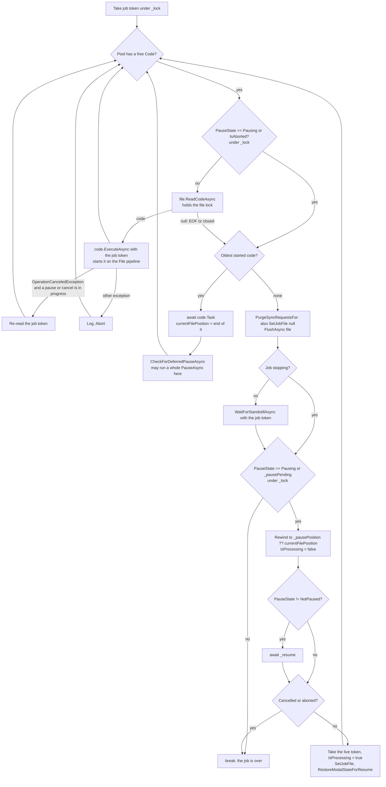
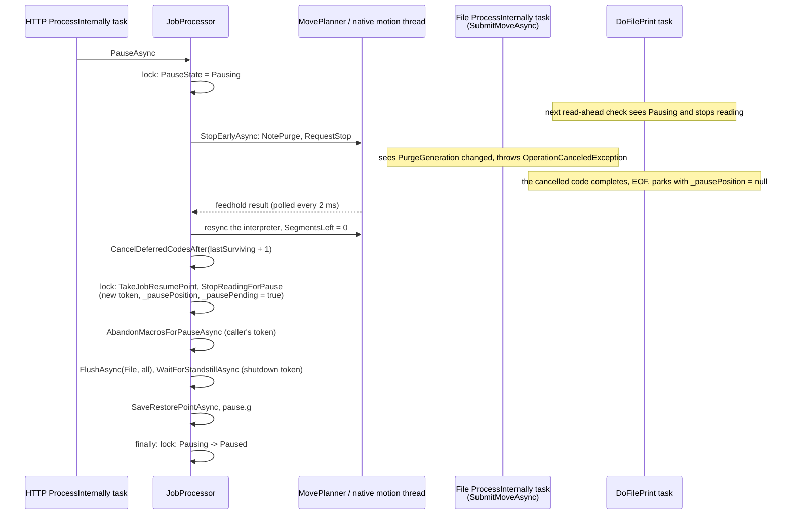

# Job control concurrency: how pause, resume and stop run today, and the plan to make them robust

[JOB_LIFECYCLE.md](JOB_LIFECYCLE.md) records what the job lifecycle has to do and the order it was
ported in. This document is about how the code that does it is *scheduled*: which threads and tasks
take part, what state they share, where the windows between them are, and why the same loop has
needed one race fix after another ([KNOWN_BUGS.md](KNOWN_BUGS.md) lists eight already fixed and
the open ones below, and the stepped pause sweep in `SystemTests` still fails). Section 5 is the
catalogue of the races that remain, each with the interleaving that produces it. Section 7 is the plan: one owner for the job state,
one message to the file reader, one rule for the resume point, and the flags that exist only to
cover ordering windows removed with the windows.

The code under discussion is [JobProcessor.cs](../../src/DuetControlServer/Files/JobProcessor.cs),
[JobProcessor.Lifecycle.cs](../../src/DuetControlServer/Files/JobProcessor.Lifecycle.cs),
[MovePlanner.cs](../../src/DuetControlServer/Motion/MovePlanner.cs) (`StopEarlyAsync`,
`TakeJobResumePoint`), [JobMoveIndex.cs](../../src/DuetControlServer/Motion/JobMoveIndex.cs),
`SubmitMoveAsync` in [GCodeHandler.cs](../../src/DuetControlServer/Codes/Handlers/GCodeHandler.cs),
the M0/M23/M24/M25/M226 handlers in
[MCodeHandler.cs](../../src/DuetControlServer/Codes/Handlers/MCodeHandler.cs), and the deferred-code
list in [PipelineBase.cs](../../src/DuetControlServer/Codes/Pipelines/PipelineBase.cs).

---

## 1. The actors

Everything below runs concurrently with everything else in the table. There is no thread that owns
the job; the job's state is a set of fields on `JobProcessor` that each actor reads and writes in
its own lock windows.

| Actor | What it is | Started by | Lives for | Touches the job through |
|---|---|---|---|---|
| `JobProcessor.ExecuteAsync` | Hosted-service task | Host startup | The process | Waits on `_resume` for a job to start, starts the file tasks, awaits them, runs the end-of-job stop, tears the job down |
| `DoFilePrint(File)` | Task, awaited only by `ExecuteAsync` | `ExecuteAsync` | One job run, across every pause of it | Reads the file ahead, starts each code on the `File` channel, tracks completion, parks and rewinds on a pause, runs the deferred-pause check |
| `DoFilePrint(File2)` | The same for a forked job | `ExecuteAsync` or `StartSecondJob` (`M606 S1`) | The fork | As above on `File2`; shares `_pausePending` with the first |
| Pipeline stage tasks | One task per stage (`Start`, `Pre`, `ProcessInternally`, `Post`, `Executed`) per stack level per channel, `Task.Factory.StartNew` in `PipelineStackItem` | `Push` | Until `Pop` | `ProcessInternally` runs every handler: `SubmitMoveAsync` for the job's moves, and the M0/M24/M25/M226 handlers that call into `JobProcessor` |
| Macro tasks | `Task.Run(MacroFile.RunAsync)` | `MacroRunner`, `M98`, tool changes, `pause.g`/`resume.g`/`stop.g`/`cancel.g` | Until the macro ends or is aborted | Reads the macro and starts its codes on the invoking channel, one stack level up |
| Deferred code tasks | `RunDeferredCodeAsync`, unawaited, one per Deferred-class code (`M106`, `M3`, ...) | The `File` channel's `ProcessInternally` stage | Until the anchor move retires and the handler runs | Own cancellation source, detached from the channel's; counted by the standstill wait, not by flushes |
| The pause, resume and stop sequences | Not tasks of their own: `PauseAsync`, `ResumeAsync` and `StopAsync` run inline on whichever task called them | The `ProcessInternally` task of the channel that issued `M25`/`M24`/`M0` (`HTTP` from DWC, `File` for a synchronous pause), `EventProcessor` for an event, `DoFilePrint` for a deferred pause, `ExecuteAsync` for the end-of-job stop | The call | Every field on `JobProcessor`, the planner, the code processor, the macro runner |
| `EventProcessor` | Hosted-service task | Host startup | The process | `PauseAsync` on `Autopause` for a heater fault, filament error or driver error |
| `MotionService` managed thread | `Thread`, highest priority | `MotionService.ExecuteAsync` | The process | Publishes `machinePosition` every 50 ms; nothing else |
| Native motion thread | `std::thread` in `libDuetSbcInterface` | `StartMotion` | The process | `SpinOnce` every 1 ms: `DrainFeedholds`, `DrainForcedPositions`, `DrainSubmissions`, then each ring's `Spin`. Acts on a stop request and publishes the result through a seqlock |
| `LinkService` dispatcher thread | `Thread` | `LinkService.ExecuteAsync` | The process | Turns `MoveCompleted` records into `MotionTracker.MoveCompleted`, which wakes the deferred codes waiting on that move |
| `MachineStatusService` | Hosted-service task | Host startup | The process | Every 250 ms derives `state.status` from `PauseState`, `IsProcessing` and `IsMoving`, without the job lock |
| `JobMonitor` | Hosted-service task | Host startup | The process | Every 200 ms reads `IsProcessing`, `PauseState`, `IsSimulating` under the job lock, then the file position under the object model write lock |
| IPC connection tasks | `Task.Run` per connection | `IPC.Server` | The connection | Where DWC's `M25` and `M24` enter, as codes on the `HTTP` channel |

Two consequences of the table drive everything in §5:

- **The sequences run on borrowed tasks.** `PauseAsync` for an `M25` from DWC runs on the `HTTP`
  channel's `ProcessInternally` task, under that code's cancellation token, while the `File`
  channel's stage tasks and `DoFilePrint` carry on. The pause and the thing being paused are peers;
  neither can assume the other is at a known point.
- **The file reader parks itself.** `DoFilePrint` decides when the job has stopped reading, where
  to rewind to and when to carry on, from fields the sequences set in separate lock windows. The
  reader infers the sequence's progress; the sequence never tells it.

---

## 2. The shared state and its locks

| State | Lock | Written by | Read by |
|---|---|---|---|
| `PauseState` | `JobProcessor._lock` | `PauseAsync` (`Pausing`, then `Paused` in its `finally`), `ResumeAsync` (`Resuming`, `NotPaused`), `StopAsync` (`Cancelling`, `NotPaused`), `Resume()`, `Cancel()`, `Abort()`, `SelectFileAsync`, the teardown in `ExecuteAsync` | `DoFilePrint` under the lock; `MachineStatusService`, `EventProcessor`'s pre-check and the M-code handlers partly without it |
| `IsProcessing` | `_lock` | `ExecuteAsync` at start and teardown, `DoFilePrint` when it parks and unparks | `PauseAsync`, `ResumeAsync`, `CheckForDeferredPauseAsync`, `StartSecondJob`, `MachineStatusService` (no lock), M23/M27/M37 handlers, `EventProcessor`, `JobMonitor` |
| `IsCancelled`, `IsAborted` | `_lock` | `Cancel()` (`IsCancelled = IsPaused`), `Abort()`, `SelectFileAsync` | `DoFilePrint`, `ExecuteAsync` |
| `_pausePending`, `_pausePosition`, `_pausePosition2`, `_pauseReason` | `_lock` | `StopReadingForPause`, `DoFilePrint` (clears the flag when it parks), `SelectFileAsync` | `DoFilePrint` |
| `_cancellationTokenSource` | `_lock` | Replaced, and the old one cancelled and disposed, by `StopReadingForPause`, `Cancel()` and `Abort()` | `DoFilePrint` captures the token at six points and passes it to every code it starts |
| `_stopped` | `_lock` | `StopAsync`, `SelectFileAsync` | `StopAsync`, `ExecuteAsync` |
| `_deferredPause` | `_lock` | `TryDeferPause`, `CheckForDeferredPauseAsync`, `SelectFileAsync` | `CheckForDeferredPauseAsync`, `IsPauseDeferred` |
| `_pausedInMacro` | None | `PauseAsync` | `ResumeAsync` |
| `_resume`, `_finished` | `AsyncConditionVariable`s on `_lock`. A notify wakes only the tasks already waiting; one given before the wait is lost | `_resume`: `Resume()`, `Cancel()`, `Abort()`, `ResumeAsync`'s `finally`. `_finished`: the teardown | `ExecuteAsync` (a job to start), `DoFilePrint` (a pause to end), `SelectFileAsync` (the previous job to end) |
| `CodeFile.Position`, `NextFilePosition`, `ModalGCommand`, `FirstCommandAfterRestart` | The file's own `AsyncLock` | `ReadCodeAsync`, `SetFilePositionAsync`, `RestoreModalStateForResume`, `ApplyRestartStateAsync`, `ResumeAsync` | `ReadCodeAsync`, `GetFilePositionAsync`, `JobMonitor` |
| `CodeFile.IsClosed` | Volatile, no lock | `Cancel()`, `Abort()` | `ReadCodeAsync`, `ExecuteAsync` |
| `MovementState.CurrentJobMove`, `SegmentsLeft`, `MoveFractionToSkip`, `PurgeGeneration`, `RestorePoints[1]`, `RestartMoveFractionDone`, `RestartGCommandNumber` | `MovePlanner.Lock()` | `SubmitMoveAsync`, `StopEarlyAsync`, `TakeJobResumePoint`, `SaveRestorePointAsync`, `RestoreModalStateForResume`, `ApplyRestartStateAsync`, M26 | `SubmitMoveAsync`, `MoveInterpreter`, the resume |
| `MovePlanner.JobMoves` | `MovePlanner.Lock()` | `SubmitMoveAsync` (`Note` per segment), `TakeJobResumePoint` (`Clear`) | `TakeJobResumePoint` |
| The channel's stack, its job file and `_deferredCodes` | `lock (_stack)`, `lock (_deferredCodes)` | `Push`/`Pop`, `SetJobFile`, `DeferCode`, `Cancel...DeferredCodes` | Flushes, the standstill wait, `IsDoingMacro`, `CanRestartMacros` |
| `MotionTracker` waiters and completion counts | Its own `lock` | The `LinkService` dispatcher | Deferred codes, `ShouldDefer`, `IsMoving` |
| Native: the feedhold request queue, the feedhold result, the submission queue | Lock-free ring buffers and a seqlock | `RequestStop` from DCS; `DrainFeedholds` on the motion thread | `TryGetFeedholdResult` polled by `StopEarlyAsync` |

Lock order is not defined anywhere. The orders taken today, each by at least one path:

- `_lock` → object model write → planner (`SelectFileAsync`, `SaveRestorePointAsync` in reverse)
- `_lock` → file lock (`SetFilePositionAsync`, `GetFilePositionAsync` from M26/M27, `ResumeAsync`)
- file lock → object model read (`ReadCodeAsync`)
- file lock → flush → any handler → `_lock` (`ReadCodeAsync` at the end of a block with local
  variables, waiting for codes that may be an `M226`)
- object model write → file lock (`JobMonitor.PublishAsync`)
- object model → planner (everywhere; this pair is consistent)

`file → model` and `model → file` both exist, which is a deadlock waiting for the right timing
(§5, R9).

---

## 3. The sequences as they run

### 3.1 Starting a job

`M32` or `M23`+`M24` on any channel. The handler holds `_lock` around `SelectFileAsync`, which
cancels and waits out any previous job, then `ResumeAsync` runs `start.g` on the `File` channel,
applies the M26 restart state, and calls `Resume()`, which sets `NotPaused` and notifies `_resume`.
`ExecuteAsync` wakes, sets `IsProcessing`, and starts `DoFilePrint`.

### 3.2 The reader



The loop reads up to `BufferedPrintCodes` (32) codes ahead of the oldest one still running. A
movement code completes when its move has been *submitted*, so `currentFilePosition` runs ahead of
the machine by the whole queue; for a short file it reaches the end of the file while the machine
is still on the first line.

### 3.3 An asynchronous pause

`M25` from DWC, or an event. The whole of this runs on the caller's task.



The two notes on `R` are the race in §5 R1: the reader can park before the fourth step has told it
where to rewind to.

### 3.4 A synchronous pause

`M25`, `M226`, `M600` or `M601` read from the job file. The handler flushes the stages ahead of the
code, then `PauseAsync(synchronous: true, pausingCode: code)` runs on the `File` channel's own
`ProcessInternally` task, under the job token. `StopEarlyAsync` is skipped. `StopReadingForPause`
cancels the job token, which is the token this very sequence was called with; the code's own
property is re-armed, but the sequence's local `cancellationToken` is only replaced *after*
`AbandonMacrosForPauseAsync` has been awaited with the cancelled one (§5, R4).

A deferred pause (`M25` while a non-restartable macro runs) is the same call made from
`DoFilePrint` after each job code completes, on the reader's task and token.

### 3.5 Resume

`M24` on any channel. `ResumeAsync` sets `Resuming` under the lock, then, without it, runs
`resume.g` on the caller's channel, queues the two restore moves and waits for standstill, restores
the channel's feed rate and distance modes, and in its `finally` sets `NotPaused` and notifies
`_resume` if the reader has parked (`!IsProcessing`). If the reader has not parked yet, the notify
is not given and the reader relies on finding `NotPaused` when it gets there. The reader then
rewinds (again) to `_pausePosition`, re-arms, and puts back the modal G command and the fraction
to skip from the restore point.

### 3.6 Stop and cancel

- **`M0` from the file**: the handler calls `Cancel()` (closes the file, replaces the token,
  `IsCancelled = IsPaused` which is false) and `StopAsync(NormalCompletion)`, which runs `stop.g`.
  The reader reaches EOF, waits for standstill, and exits; `ExecuteAsync` sees `_stopped` and skips
  the stop.
- **`M0` while paused**: `Cancel()` sets `IsCancelled` and notifies `_resume`; the parked reader
  wakes and exits; `StopAsync(UserCancelled)` sets `Cancelling` and runs `cancel.g`. Meanwhile
  `ExecuteAsync`'s teardown runs to completion and resets `PauseState` to `NotPaused`, `_file` to
  null, and notifies `_finished`, while `cancel.g` may still be running (§5, R7).
- **End of file**: the reader waits for standstill, exits; `ExecuteAsync` runs
  `StopAsync(NormalCompletion)` and tears down.
- **Abort**: `Abort()` from a code error, `AbortAllFilesAsync`, or `LinkService` shutting down.

---

## 4. What each mechanism is for, and the window it leaves

| Mechanism | Introduced to close | Window still open |
|---|---|---|
| `PauseState` ordering (`>= Pausing` stops the reader) | A second `M25` starting a second sequence | The reader stops on `Pausing`, which is set before the pause knows where to rewind to |
| `_pausePending` | A resume landing before the reader parked, which put the state back to `NotPaused` and made the reader read EOF as the job ending | Set in the same late lock window as the position, so it does not gate the park either; a second park after the resume then rewinds a second time (R1) |
| Re-reading the job token in six places | Codes read after a resume being cancelled by the token the pause had cancelled | Each re-read is a separate lock window; a cancel between two of them still hands the next code a dead token |
| `PurgeGeneration` | A segmented submission continuing to feed a ring that had just been emptied | It aborts the submission *before* the pause has recorded anything, which is what parks the reader early |
| `CurrentJobMove` taken by reference identity | A pause adopting a record left by a submission that ended on its own | A record released the moment the last segment is submitted, so a stop between full submission and execution has no record (R2) |
| `JobMoveIndex` keyed on move id | Mapping a purged move back to its line | Nothing purged but the submission queue discarded: no index lookup is made (R2) |
| `CancelDeferredCodesAfter(lastSurviving + 1)` | Deferred codes anchored to purged moves holding the standstill wait for ever | Runs before the read-ahead is cancelled, so a deferred code created in between anchors to a move that will never retire (R3) |
| `catch (OperationCanceledException)` around the deferred-pause check | A pause cancelling the token the check was made with and taking the reader down | The check itself calls `PauseAsync` with that token (R4) |
| `_stopped` | `stop.g` running twice for a file ending in `M0` | Never cleared after a job ends, so `M0` with no job runs nothing (R5) |
| `ResumeAsync`'s conditional `_resume.NotifyAll()` | Waking a reader that had not parked | The parked reader reports `IsProcessing = false` until it re-acquires the lock after the notify, and in that window the job can be selected over and cancelled (R16) |
| `_stopped` and `IsCancelled = IsPaused` | `stop.g` running twice; telling a cancel from a normal end | Neither is a state of the job: one is never cleared (R5), the other is a snapshot of `IsPaused` at an instant that `Cancel()`'s other callers do not control (R11, R14) |

---

## 5. The race catalogue

Each entry is an interleaving that the code admits today. "Evidence" names the scenario that shows
it or the log that was read. Every one is reproducible in the `SystemTests` bench once the stepped
timeline covers it; the plan in §7 starts by writing the missing ones.

### R1. The reader parks before the pause has published its rewind point

**Confirmed.** `SteppedPauseTests.AnAbsoluteJobEndsAtItsLastTargetFromEveryPausePoint` and the
relative sweep fail at 6 and 3 of 22 points respectively on this tree, with travel of 445 to
800 mm for a 400 mm job.

Interleaving, from the bench log of the absolute job paused at 120 mm:

1. `PauseAsync` sets `Pausing` and calls `StopEarlyAsync`, which raises `PurgeGeneration` before
   the stop request has even been acted on.
2. `SubmitMoveAsync`, part-way through the file's last line, sees the generation change and throws
   (`Abandoning 91 remaining segment(s) of G1 X400`). The code completes as cancelled.
3. `DoFilePrint` awaits that completion, finds `Pausing`, stops reading, reaches the end of the
   file, and parks: `Job on File has been paused at byte 44 (no fpos from firmware), reason 0`.
   `_pausePosition` is still null, so it rewinds to `currentFilePosition`, the end of the last
   *completed* code, which is the line before the interrupted one.
4. Only then does `PauseAsync` reach its second lock window: `Stopped the machine early, dropping
   23 queued move(s)`, `TakeJobResumePoint` names byte 28, `StopReadingForPause` stores it and
   sets `_pausePending`.
5. `M24`: the reader continues from byte 44 with the fraction and modal state of the line at
   byte 28. At the end of the file it finds `_pausePending` still set, rewinds to byte 28 (`Job on
   File has been paused at byte 28, reason User`), does not wait because the state is `NotPaused`,
   and runs the last three lines again: 800 mm travelled.

Whether step 3 or step 4 comes first depends on how long the motion thread takes to answer the
stop, which is why the same point passes on one run and fails on the next. The reader's park
condition is `PauseState >= Pausing || _pausePending`; the first half is true before the pause
knows anything, and the flag that was added to survive the *reverse* ordering does not gate this
one.

### R2. The resume point is chosen from what was purged, not from what survives

**Confirmed by reading.** `DDARing::Feedhold` may pick the last provisional DDA as the stopping
point, so `PurgeAfter` reports `stopped` with `movesPurged == 0`, and `DrainFeedholds` then
discards every move DuetControlServer had submitted for that ring but the motion thread had not
taken up (`DiscardSubmissionsFor(0)` runs whenever `stopped`, against the comment above it). Those
moves are counted nowhere. `TakeJobResumePoint` branches on `MovesPurged` and never reads
`LastSurvivingMoveId`, the one number `FeedholdOutcome`'s own comment says is the boundary, so:

- with the interrupted code's record already released (`SubmitMoveAsync`'s `finally` clears
  `CurrentJobMove` once every segment is *submitted*), it returns null, the reader rewinds to
  `currentFilePosition`, the end of the file for a short job, and the discarded segments are never
  made: the job ends short. The uncommitted pause points 365 and 380 in `SteppedPauseTests` aim at
  this window; the run above found nothing to purge at 380 and ended correctly, which says the
  window is narrow, not closed;
- with the record still live, `SegmentsQueued` counts the discarded segments and the fraction
  over-reports.

The same branch structure fails from the other side when the earliest purged move belongs to a
macro (tool-change or `M98` moves are never noted in `JobMoves`): the lookup misses, the result is
null, `JobMoves.Clear()` discards the entries of the job moves purged behind it, and the reader
falls back to `currentFilePosition`. That is *past* the macro invocation, because `M98` completes
when its macro has dispatched its codes and every job `G1` after it completes when submitted, so
the purged job lines are skipped on resume rather than re-read. The comment in
`TakeJobResumePoint` that the fallback "is the last job code that completed, which is the macro
invocation" holds only when no job code completed after the macro was invoked.

### R3. Read-ahead codes dispatched between the stop and the read-ahead cancel

**Confirmed by reading.** `StopEarlyAsync` returns, `CancelDeferredCodesAfter` runs, and only in the next lock
window does `StopReadingForPause` cancel the job token. In between, the `File` channel's
`ProcessInternally` task is free (the interrupted `SubmitMoveAsync` has just thrown) and dispatches
the next read-ahead code:

- a `G1` builds from the resynced position and `QueueMove` accepts it, so the machine sets off again
  after the stop, and `WaitForStandstillAsync` waits for it; the restore point is then where that
  move ended, and the resume replays it;
- an `M106` defers with an anchor that the purge, or the discard of the submission queue, has made
  unretirable, under its own cancellation source that `CancelDeferredCodesAfter` has already run
  past. `MovePlanner._lastSubmittedMoveId` is never wound back after a purge and
  `MotionTracker.HasRetired` compares against the last *completed* id, so a purged id reads as in
  flight until some later, higher id retires; nothing posts `MoveFailed` for purged or discarded
  moves. `AbandonMacrosForPauseAsync` waits on `LastDeferredCodeTask()` before the standstill wait
  is even reached, so `M25` never returns and the state stays `Pausing`, from which `M24` is
  ignored and `M0` is refused. This is the hang recorded in `KNOWN_BUGS.md` ("A pause could wait
  for ever on codes the stop had orphaned"), reopened through a narrower window.

Nothing in the window stops the `File` pipeline: `DoFilePrint`'s `Pausing` test only stops *new*
reads, `PipelineStackItem` skips a code only if its token is already cancelled, and no handler
consults the job state. The usual trigger is a `G1` sleeping in its ring-full retry that wakes when
the purge frees the ring.

### R4. A synchronous or deferred pause runs its macro unwind under the token it has just cancelled

**Confirmed by reading.** `PauseAsync` is called with the code's token, which for `M226`, `M600`,
`M601` and `M25` from the job file is the job token (`Code.ProcessInternally` passes
`CancellationToken`, and `DoFilePrint` set that to the job token). `StopReadingForPause` cancels
it. `pausingCode.ResetCancellationToken()` re-arms the *code's* property; the sequence's local
`cancellationToken` is only replaced at the line after `AbandonMacrosForPauseAsync` has been
awaited with the cancelled one. `AbandonMacrosForPauseAsync` awaits `LastDeferredCodeTask()` with
that token, so a job file containing `M106 ...` followed by `M226` while moves are queued throws
`OperationCanceledException` at once: the `finally` settles `Paused`, but no flush, no standstill
wait, no restore point, no `pause.g`, no "Printing paused at" message, and `_pausedInMacro` is not
set. `M24` then travels to the previous pause's restore point. The deferred pause
(`CheckForDeferredPauseAsync`, reader's token, `pausingCode: null`) fails the same way and the
exception is swallowed at the call site.

### R5. `_stopped` is never cleared, so `M0` with no job runs nothing after any completed job

**Confirmed by reading.** `StopAsync` returns at once if `_stopped`, and sets
`_stopped = IsFileSelected` otherwise. The end-of-job stop runs while the file is still selected,
so `_stopped` becomes true, and only `SelectFileAsync` clears it. Every `M0` from a console
between two jobs, which the comment above the guard says must run `stop.g` every time, returns
without running it.

### R6. `M32` or `M23` from inside the job file deadlocks the job

**Confirmed by reading.** `HandleSelectFileAsync` allows a file-channel `M32` and calls `SelectFileAsync`,
which sees a selected file, calls `Cancel()` and awaits `_finished`. `_finished` is notified by
`ExecuteAsync` after `fileTask` completes; `fileTask` is `DoFilePrint`, which is awaiting
`code.Task` of the `M32` code; that completes when the handler returns from `SelectFileAsync`. The
`File` channel's `ProcessInternally` task is held for ever, and every later `M23`, `M32` and `M0`
from any channel blocks on the job lock or the same wait. The wait is on `ApplicationStopping`, so
cancelling the job token does not release it. An `M32` inside `stop.g` run by the end-of-job stop
hangs the same way, because that stop is awaited before `_finished` is notified. No scenario
issues `M32` from a file channel.

### R7. `M2` while paused leaves the reader parked and the job never torn down

**Confirmed by reading.** `HandleStopAsync` calls `Cancel()` (`NotPaused`, notify) and then
`StopAsync(UserCancelled)`, which sets `Cancelling` and runs `cancel.g`. The parked reader wakes on
the notify, exits the pause branch, reads the closed file, and reaches the park test again while
`Cancelling` is set: it parks a second time because `PauseState != NotPaused`. `StopAsync`'s
`finally` puts `NotPaused` back without a notify. `CodeExecutedAsync` calls `Resume()` for `M0` and
`M1` only, so after `M2` nothing wakes the reader: `ExecuteAsync` never passes `await fileTask`,
`job.file` is never cleared, `lastFileCancelled` is never written, and the status reads `idle`
with a job still selected until an `M23` cancels it again or an `M24` runs `start.g` on the dead
job. `CancelWhilePausedRunsCancelMacro` passes only because it uses `M0`, whose `Executed`-stage
hook is the sole wake-up.

The other ordering is no better: if the reader reaches its park test before `StopAsync` has set
`Cancelling`, it exits, and `ExecuteAsync`'s teardown runs to completion, disposing `_file` and
resetting `PauseState` to `NotPaused`, while `cancel.g` is still running on the `M0`'s channel.
`state.status` then reads `idle` during `cancel.g`, `StopAsync`'s `finally` finds nothing to
settle, and `HandleSelectFileAsync`'s refusal no longer refuses, so `M23`/`M32` from DWC selects a
new job while `cancel.g` is still moving the head. Nothing in `ExecuteAsync` awaits the
`StopAsync` the handler started.

### R8. `M24` during `Cancelling` starts the job

**Confirmed by reading.** `ResumeAsync` ignores `Pausing` and `Resuming` but not `Cancelling`, and
`PauseState == Paused` is false, so it takes the "start a selected file" path: `start.g` runs on
the `File` channel while `cancel.g` runs on the caller's, `Resume()` overwrites `Cancelling` with
`NotPaused`, the reader wakes and finishes on the closed file, and the teardown runs under the
still-executing `StopAsync`.

### R9. Lock-order inversion between the job monitor and the reader

**Confirmed by reading; a deadlock when the timing lands.** `JobMonitor.PublishAsync` holds the
object model write lock (a Nito `AsyncReaderWriterLock`, exclusive and writer-preferring) and then
takes the file lock through `GetFilePositionAsync`. `CodeFile.ReadCodeAsync` holds the file lock
and then takes the object model read lock to read `MachineMode`. Once per code read and once every
200 ms respectively; when the write lock is granted between the reader's two acquisitions, both
wait for ever, with the reader's token being `default`, and every other reader of the object model
stalls behind the writer that cannot proceed. (`ReadCodeAsync`'s block-end `FlushAsync(file)` is
outside its lock window, so the `M26` path does not add a second inversion.)

### R10. The deferred-pause decision is made outside the lock and stored after the last check

**Plausible.** `HandlePausePrintAsync` reads `IsProcessing`, `IsDoingMacro` and
`CanRestartMacros` without the job lock, then calls `TryDeferPause`. Between the read and the
store the macro can end and `DoFilePrint` can run `CheckForDeferredPauseAsync`, which finds
nothing. If the `M98` was the file's last code the check never runs again: `M25` reports success
and the job runs to completion. Otherwise the pause lands one code later than the point the
operator saw.

### R11. Cancelling a running job by selecting another reports it as finished

**Confirmed by reading.** `SelectFileAsync` calls `Cancel()`, which records `IsCancelled = IsPaused`. For a running job that
is false, so `ExecuteAsync` logs "Finished job file", runs `stop.g` rather than `cancel.g`, and
writes `lastFileCancelled = false` for a job the operator replaced. The reason is derived three
times (here, in the `M0` handler, and in the teardown) from different inputs.

### R12. The end-of-job `Resume()` hook can start a newly selected job without `start.g`

**Plausible.** `CodeExecutedAsync` calls `Resume()` after every successful `M0`/`M1`, guarded only by
`IsFileSelected && !IsProcessing`. If the teardown has finished and another channel has already
selected the next file, that is exactly the condition `ExecuteAsync`'s wait treats as "start the
job", and the job starts without `ResumeAsync` having run `start.g` or applied the M26 state. It
needs the `M23` to come from a channel other than the `M0`'s, which is the DWC case.

### R13. A pause is accepted while the end-of-job `stop.g` runs

**Confirmed by reading.** `PauseAsync`'s only liveness test is `IsProcessing`, and `IsProcessing`
stays true from the reader's final `break` until the teardown, across the awaited
`StopAsync(File, NormalCompletion)` that runs `stop.g`. An `M25` from DWC, or an event, while
`stop.g` is parking the head is accepted: the feedhold purges `stop.g`'s moves,
`StopReadingForPause` sets `_pausePending` with no reader left to consume it,
`AbandonMacrosForPauseAsync(File)` aborts `stop.g` part-way, `pause.g` runs, and `M25` reports
"Printing paused at". The teardown then sets `NotPaused` and `_file = null`, so `M24` answers
"Cannot print, because no file is selected!". An `M25` that finds `stop.g` non-restartable defers
instead, into a `_deferredPause` nothing will ever consume.

### R14. An abort or cancel during `Pausing` leaves the pause running against the stop

**Confirmed by reading.** `Abort()` and `Cancel()` test only `IsFileSelected` before writing
`NotPaused` and notifying `_resume`. Landing between `PauseAsync`'s first lock window and its
`finally`, they leave `pause.g` running on the commanding channel under `ApplicationStopping`
(which nothing cancels) while the woken reader exits and `ExecuteAsync` runs `StopAsync(Abort)`:
heaters and spindles off under a macro that is parking the head. `PauseAsync`'s `finally` finds
`NotPaused` and settles nothing. Reached from a read-ahead code failing with a non-cancellation
exception during a pause, from `LinkService` shutting down, or from a file-channel `M0` inside
`pause.g` when the pause was deferred (the `!IsPaused` refusal is skipped for file-channel codes,
and `IsCancelled = IsPaused` then records false).

### R15. The first simulation since start-up never finishes

**Confirmed by reading.** With `M37 F1` (the default) `ExecuteAsync` waits, after the file task,
for `job.lastDuration` to become non-null. `JobMonitor.FinishAsync` is the only writer, and it runs
only once `JobMonitor` observes `IsProcessing` false and `NotPaused`, which is what the teardown
*after* this wait clears. The first simulation therefore waits for ever (the `UpTime` wrap test
never fires), `_finished` is never notified, and every later `M23`, `M32` and `M37` is refused as
"already being printed". A later simulation exits on the first model update with the *previous*
job's `lastDuration` and writes that into the file. `M37SimulatesAFile` uses `F0` and skips the
wait; `M37WritesTheSimulatedTimeIntoTheFile` is tagged `KnownGap`.

### R16. The resume leaves a window in which the job looks like no job

**Plausible.** The parked reader holds `IsProcessing = false`. `ResumeAsync`'s `finally` sets
`NotPaused`, notifies and releases the lock; until the reader's continuation re-acquires it and
sets `IsProcessing = true`, every other lock holder sees `NotPaused` and not processing:
`HandleSelectFileAsync` accepts an `M23` from another channel, `SelectFileAsync` calls `Cancel()`
(`IsCancelled = IsPaused` is false) and waits on `_finished`; the reader wakes, resumes into a
closed file, reads null and exits; `ExecuteAsync` logs "Finished job file" and runs `stop.g`. The
paused-then-resumed print is lost with `lastFileCancelled = false`. In the same window
`PauseAsync` and the event pause answer "no file is being printed" and `MachineStatusService`
reports `idle`.

### R17. A pause that throws before its second lock window rewinds to the previous pause

**Confirmed by reading.** Between setting `Pausing` and `StopReadingForPause`, `PauseAsync` awaits
on the caller's channel token: the feedhold poll, the object model read lock, the job lock. If that
token is cancelled (`M112`, `M999`, the connection dropping) the sequence throws, the `finally`
promotes to `Paused`, but no resume point was taken, the job token was not cancelled, `_pausePending`
is false, and `_pausePosition` still holds the previous asynchronous pause's value, because only
`SelectFileAsync` clears it. The engine has meanwhile executed the queued stop. The reader stops
reading on `Pausing`, parks, and rewinds to the previous pause's position; `M24` then drives the
head to the previous pause's restore point.

### R18. The deferred pause skips the flush its synchronous flag assumes

**Plausible.** `CheckForDeferredPauseAsync` calls `PauseAsync(synchronous: true, pausingCode:
null)`. `synchronous` skips the feedhold and the `FlushAsync(File, flushAll)`, on the assumption
that the pausing code's handler flushed everything ahead of it. There is no pausing code: the
reader has up to 32 read-ahead codes dispatched, one possibly inside `SubmitMoveAsync`.
`StopReadingForPause` cancels them and the sequence goes straight to the standstill wait and
`SaveRestorePointAsync`; the cancelled `G1`'s `finally`, which puts the interpreter position back
with `SyncInterpreterToMachine`, has no ordering against `SavePosition` other than the two locks
they both take, so the restore point can be taken from a position at the end of a move that will
never be made.

### R19. A failed resume still resumes the reader

**Plausible.** If `resume.g` throws, the restore move is `Rejected`, or the caller's channel token
is cancelled, `ResumeAsync` skips `RestoreInterpreterStateAsync` but its `finally` still sets
`NotPaused` and notifies. The reader spends `MoveFractionToSkip` and re-reads the interrupted line
in whatever distance mode and feed rate the channel happens to hold, with the head wherever the
failure left it. The reader cannot tell a completed resume from an abandoned one because it did
not run it.

### R20. The cost the structure carries even when nothing races

Not races, but the same structure's price, each confirmed from the code:

- `DoFilePrint` takes the job lock three times per job code (before each read, after each
  completion, and inside the deferred-pause check), each to read two fields and copy a token: 3N
  acquisitions per N-line file, contending with every sequence that holds the lock across an
  await.
- The job lock is held across `_fileInfoParser.ParseAsync` and the `_finished` wait in
  `SelectFileAsync`, across `ApplyRestartStateAsync` and the file lock in `ResumeAsync`, and
  across `SetFilePositionAsync` in the reader's park.
- `WaitForStandstillAsync` polls every 5 ms with up to `1 + 2 × MaxRings` P/Invokes per poll, and
  `CodeProcessor.WaitForStandstillAsync` wraps it in a second loop over every channel;
  `StopEarlyAsync` polls every 2 ms, copying the rest endpoints across the boundary on each poll,
  into an array allocated per call; `MotionTracker` already receives the per-move completion
  events that could complete a task instead.
- The end-of-file flush in `DoFilePrint` runs *after* `PurgeSyncRequestsFor` has cleared the
  channel's job file, so `FlushAsync(file)` finds no stack item and returns false every time
  (`Failed to flush file codes on stage Start` at every job end in the bench log); the flush "in
  case plugins inserted codes at the end of a print file" is dead.
- The "cancel, dispose, recreate the linked source" sequence is written out in
  `StopReadingForPause`, `Cancel()` and `Abort()`, beside `CodeProcessor.CancelPending` which is
  the same three lines; the reader re-reads the resulting token in seven places.
- `RestoreAxesAsync` is a copy of the queue-retry-standstill loop in `SubmitMoveAsync` and the
  probing move, with `RingFullRetryDelay` declared a second time; the feed-rate unit conversion is
  done with a second set of `MmPerInch`/`SecondsPerMinute` constants against
  `MoveInterpreter.ModalFeedRateMmPerSec`, so the pause saves under one rule and the resume
  restores under another.
- The reason a job ended is derived three times from different inputs: `Cancel()` stores
  `IsCancelled = IsPaused`, `HandleStopAsync` computes it from the channel, `ExecuteAsync` from
  the flags. They agree only because `M0` from a non-file channel is refused unless `IsPaused`.
- "Is a job in the way" is spelled `IsProcessing || IsPausedOrChanging` in three handlers,
  `IsProcessing || PauseState != NotPaused` in `JobMonitor` and negated in `EventProcessor`;
  `IsReallyPrinting` has no callers; the reader uses `PauseState >= Pausing` where everything else
  uses `!= NotPaused`.
- `HandlePausePrintAsync`'s remarks carry a `TODO` saying the deferred pause is not implemented,
  above the code that implements it.

---

## 6. Why the structure produces these

The fixes in `KNOWN_BUGS.md` are each correct and each local, and the reason the sweep still fails
is that the structure has seven properties that generate new windows as fast as old ones are closed:

1. **No single owner of the job state.** Nine fields on `JobProcessor` are written from seven
   call paths on five different tasks. Every writer takes the lock, but each takes it for one
   assignment at a time, so every reader sees intermediate combinations: `Pausing` with no pause
   position, `NotPaused` with `_pausePending`, `IsProcessing` false with the file open.
2. **The reader infers, it is not told.** `DoFilePrint` derives "stop reading", "park",
   "rewind to", "carry on" from the fields above. The pause sequence never sends it a message; it
   changes fields and the reader notices in whatever order its own loop happens to check them.
3. **The sequences run on borrowed tasks under borrowed tokens.** `PauseAsync` runs on the `HTTP`
   or `File` pipeline task and inherits that code's cancellation token, which for a synchronous
   pause is the very token the pause cancels. The reader's token is replaced by disposing the old
   source, so every holder of the old token has to notice and re-read.
4. **Cancellation is the signal.** "Stop the read-ahead" is expressed as cancelling a token that
   every read-ahead code, the standstill wait, the deferred-pause check and the file lock all
   share. The same exception therefore means "a pause landed", "a cancel landed", "the machine is
   shutting down" and "this code failed", and the reader's catch blocks re-derive which from the
   state fields.
5. **The resume point is assembled from three classes.** `SubmitMoveAsync` creates and releases
   the record, `StopEarlyAsync` purges and reports ids, `TakeJobResumePoint` chooses among three
   branches, `StopReadingForPause` stores the position, `DoFilePrint` falls back to its own
   `currentFilePosition`, and `SaveRestorePointAsync` copies the fraction. Each transfer is a
   separate lock window and the record's lifetime is tied to submission rather than execution.
6. **Polling everywhere the motion thread is involved.** The feedhold result (every 2 ms),
   standstill (every 5 ms, with `1 + 2 × MaxRings` native calls per poll, wrapped in a second loop
   over every channel's deferred codes), the ring having room (every 5 ms) and the machine status
   (every 250 ms) are all polled on timers by different tasks, so "the machine has stopped" is
   observed at different times by the pause, the reader and the status service, while
   `MotionTracker` already receives a completion event per move.
7. **The job lock on the reader's hot path.** The reader takes `_lock` three times per job code on
   the normal path (before each read, after each completion, and inside the deferred-pause check),
   only to copy two fields and a token; every acquisition queues behind whichever sequence is
   holding the lock across an await. A million-line file is three million acquisitions.

---

## 7. The plan

### 7.1 Design

**One job actor.** A `JobController` owns every field in §2's first eight rows and is the only
code that changes them. It runs on its own task and processes commands from a
`Channel<JobCommand>`: `Start`, `Pause(request)`, `Resume(options)`, `Cancel(reason)`, `Abort`,
`ReaderStopped(position)`, `ReaderFinished`, `SequenceFinished`. Every command handler is a
transition of one explicit state machine:

```
Idle -> Selected -> Starting -> Running -> Pausing -> Paused -> Resuming -> Running
                                   |                      |
                                   v                      v
                               Finishing              Cancelling -> Finishing -> Idle
```

with `Aborting` reachable from any of the running states. The state is one immutable record
(`JobState` plus the data the state carries: the rewind point, the reason, the pending deferred
pause), swapped atomically. `state.status`, `IsReallyPrinting` and the M-code refusals read that
record; there are no independent booleans to fall out of step with it.

M-code handlers and `EventProcessor` do not run the sequence. They post a command and await its
completion (`TaskCompletionSource<Message>` inside the command), which gives them the reply to
report. The sequence runs on the controller's task under the controller's own cancellation token,
linked to `ApplicationStopping` and nothing else. A synchronous pause from the job file posts the
same command and awaits it, after re-arming its own code so the wait is not cancelled by the
read-ahead being stopped.

**The reader is driven.** `JobReader` (today's `DoFilePrint`) has one input, a
`Channel<ReaderCommand>` with `Run(fromPosition, modalState)`, `StopReading(rewindTo)` and `Close`,
and one output, the events it posts back to the controller: `Stopped(position)` once it has
cancelled its read-ahead and rewound, `Finished` when the file ran out and the last move retired,
`Failed(error)`. It never reads `PauseState`; it never chooses a rewind position. The controller
sends `StopReading` only after it holds the rewind point, so the early park of R1 cannot occur, and
it counts the reader as stopped only when the reader says so, so the second park of R7 and the
window of R16 cannot occur. A sequence that fails part-way (R17, R19) is a transition back to the
state it started from, decided by the controller, not a `finally` guessing from the state it finds.

**The read-ahead is cancelled by file position, not by token.** The reader stops the codes it
has started whose `FilePosition >= rewindTo` through the `File` channel's pipeline, which already
knows every code's position; codes before the rewind point run to completion because their effects
are owed. Deferred codes use the same rule they use today, by anchor. No cancellation source is
replaced or disposed while codes hold its token; the job has one token for its whole run.

**The resume point comes from the move the machine finishes on.** The one number the engine
reports that is always right is `LastSurvivingMoveId`. `JobMoveIndex` maps it to
`(origin, segment)`, and the resume point is that origin at `segment + 1` (the next code if that is
the last segment), or the last completed job code if the move was not the job's. That rule covers
every branch of today's `TakeJobResumePoint`, including the one that has no branch (nothing purged
from the ring, the submission queue discarded), because it never asks what was *dropped*, only what
*survives*. For it to hold, the index keeps an origin until its moves have *retired*, not until they
have been submitted; the tracker's `MoveCompleted` is where entries are released. `CurrentJobMove`
and the reference-equality take go; `PurgeGeneration` stays, as the one thing that tells a
part-way submission to stop, and it is raised *after* the resume point is taken so the record it
reads is complete. The tracker is told the purge boundary too, so a wait on a purged or discarded
move fails at once rather than waiting for an id that will never retire.

**Signals, not polls, from the motion thread.** The native side already publishes the feedhold
result and the completed-move count; the `LinkService` dispatcher already turns move completions
into `MotionTracker` events. A `MotionEvents` object exposes `FeedholdResultAsync(sequence)` and
`StandstillAsync()` as awaitable completions raised from those events, and `StopEarlyAsync`,
`WaitForStandstillAsync` and the reader's end-of-job wait await them. `MachineStatusService`
subscribes to the controller's state changes instead of polling the fields.

**A lock order, written down and checked.** `JobController` → object model → planner → file.
`JobMonitor` reads the file position before it takes the model write lock; `ReadCodeAsync` reads
`MachineMode` before it takes the file lock; nothing takes the controller lock from inside a
flush. A debug assertion in each `Lock()` records the order and throws on an inversion.

### 7.2 What it removes

`_pausePending`, `_pausePosition`, `_pausePosition2`, `_pauseReason`, `_stopped`,
`_pausedInMacro`, the six token re-reads, the three CTS replacements, `Resume()`, the
`_resume`/`_finished` condition variables, `IsProcessing` as a stored field, the three-branch
`TakeJobResumePoint`, `CurrentJobMove`, the `catch (OperationCanceledException)` around the
deferred-pause check, and the `PauseState >= Pausing || _pausePending || IsCancelled || IsAborted`
compound tests. `PauseState` survives as the projection of the controller's state that the object
model and RepRapFirmware's refusals need.

### 7.3 Scenarios first

Per [system-tests-first](SYSTEM_EMULATION.md), each race in §5 gets a scenario before the code
moves, so the rewrite is measured against the same sweep the current code fails:

- The stepped sweep at every point in `SteppedPauseTests.PausePoints`, for the relative and the
  absolute job, must report an empty `wrong` list. This is the acceptance test for R1 and R2.
- A pause whose earliest purged move is a tool-change macro's, with job lines queued behind it:
  the purged job lines are re-read on resume (R2, second case).
- `M226` from a job file with an `M106` anchored to a move still in flight: `pause.g` runs, the
  restore point is written, the job resumes (R4).
- `M25` landing while the reader is executing an `M106` between two moves: the pause returns
  within the standstill time; no deferred code is left owed, and the head does not move again
  before `pause.g` (R3).
- `M0` from the console after a job has finished on its own: `stop.g` runs (R5).
- `M32` from inside a job file, and inside `stop.g`: the second job starts, the first is torn
  down, no hang (R6).
- `M2` from DWC while paused: `cancel.g` runs, the job is torn down, `lastFileCancelled` is
  written (R7).
- `M0` while paused, with a `cancel.g` that takes longer than the teardown: `state.status` reads
  `cancelling` until the macro ends, `M23` during it is refused, `M24` during it is ignored
  (R7, R8, R12).
- `M23` from another channel at the instant `M24` reports success: refused, the job resumes once,
  `state.status` never reads `idle` between (R16).
- `M25` and a filament-out event while `stop.g` is moving after the last line: both refused with
  "no file is being printed" and `stop.g` runs to its end (R13).
- A read-ahead code failing while `pause.g` runs: `pause.g` completes before the abort's heater
  switch-off (R14).
- `M37` with the default `F1` on a fresh bench: the simulated time is written and a second job
  can be selected (R15).
- `M25` deferred into a non-restartable macro whose last code is followed by a segmented `G1`:
  the restore point is where the machine stopped (R18).
- `M24` with a `resume.g` that fails: the job stays paused and reports the error (R19).
- A job of 100 000 short lines with `JobMonitor` running: completes (R9). The bench needs a
  deterministic way to force the two lock acquisitions to interleave; a hook that delays
  `ReadCodeAsync` between its two locks is acceptable for that one scenario.

### 7.4 Phases

Each phase leaves the tree working and the sweep no worse. Statuses are updated here in the commit
that moves them.

- [ ] **Phase 1: the local fixes.** `DoFilePrint` parks on `_pausePending` alone, and
      `PauseAsync` publishes the rewind point before anything can stop the reader (R1); the
      cancelled token is replaced before `AbandonMacrosForPauseAsync` (R4); `_stopped` is cleared
      in the teardown (R5); `CodeExecutedAsync` wakes the reader for `M2` as for `M0` (R7);
      `ResumeAsync` refuses `Cancelling` (R8); the simulated-time wait is a completion `JobMonitor`
      raises (R15); the end-of-file flush runs before the job file is cleared (R20). Each is small
      and each lands with its scenario from §7.3. The sweep is the test for the first.
- [ ] **Phase 2: the resume point from `LastSurvivingMoveId`.** `JobMoveIndex` entries live until
      retirement; `TakeJobResumePoint` becomes one lookup; `CurrentJobMove` goes;
      `_lastSubmittedMoveId` and the tracker learn the purge boundary so a purged anchor fails its
      waiter. Closes R2 and the deferred-code half of R3.
- [ ] **Phase 3: `JobController` and `JobReader`.** The state machine, the command channel, the
      reader as a driven component with `Stopped`/`Finished` events, the sequences moved onto the
      controller's task. Closes R6, R10, R11, R12, R13, R14, R16, R17, R18 and R19 by
      construction; the flags of §7.2 go with it, and phase 1's local fixes are absorbed.
- [ ] **Phase 4: cancellation by file position.** The job's single token; the read-ahead stopped
      through the pipeline by position. Closes the `G1` half of R3 and the token re-reads.
- [ ] **Phase 5: lock order and motion signals.** `JobMonitor` and `ReadCodeAsync` reordered;
      the debug-time lock-order check; `MotionEvents` replacing the three polls;
      `MachineStatusService` on state-change events; the lock taken once per read-ahead pass.
      Closes R9 and the rest of R20.
- [ ] **Phase 6: the documentation.** [JOB_LIFECYCLE.md](JOB_LIFECYCLE.md) §2.9 and §3.5 rewritten
      against the controller; `gcode-flow.md` and `object-model.md` in the articles for what a
      user can observe; [DCS_INTERNALS.md](DCS_INTERNALS.md) §3 gains the lock order.

### 7.5 What does not change

The behaviour RepRapFirmware defines and JOB_LIFECYCLE.md ported: which macros run and on which
channel, the feedhold, the two-move return to the restore point, the modal state a resumed line is
read with, the fraction composition across two stops inside one line, the deferred pause, and every
refusal message. The plan changes how the machine gets to those outcomes, not the outcomes.
