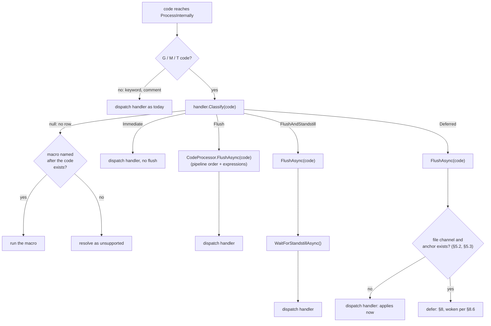
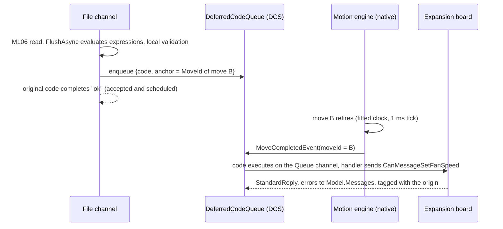
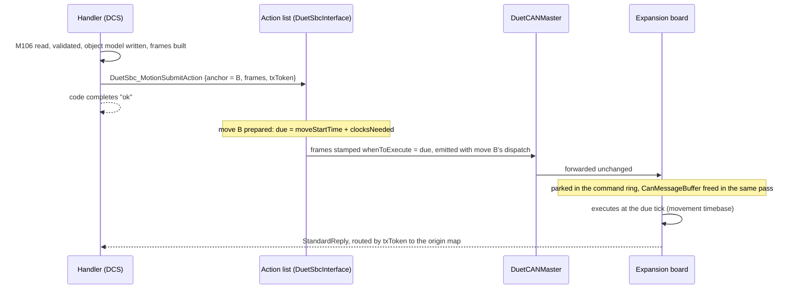
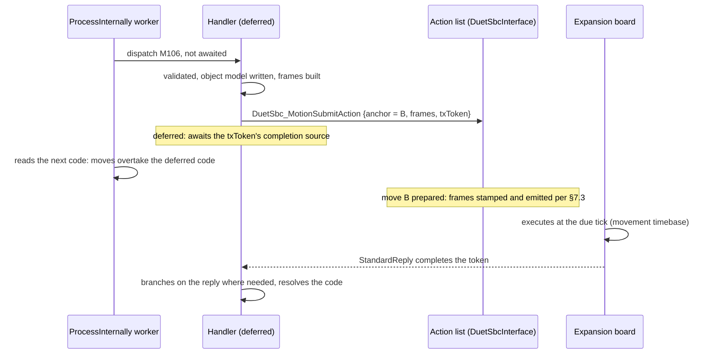
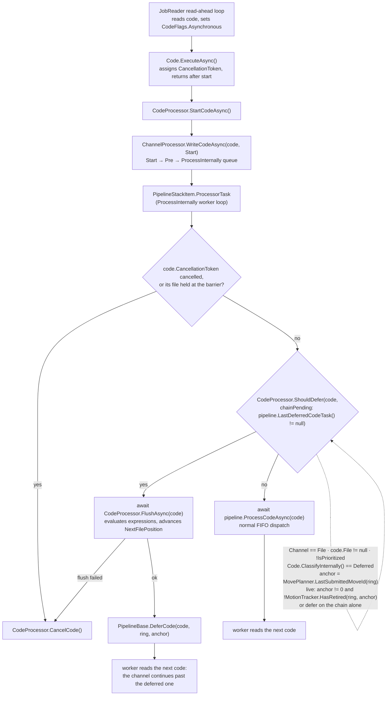
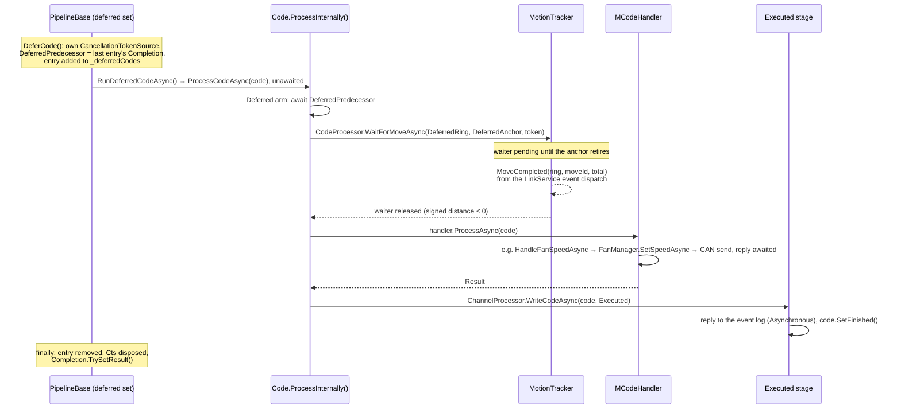
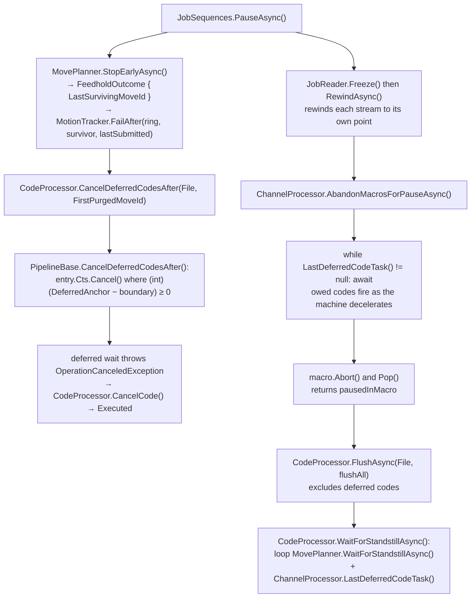
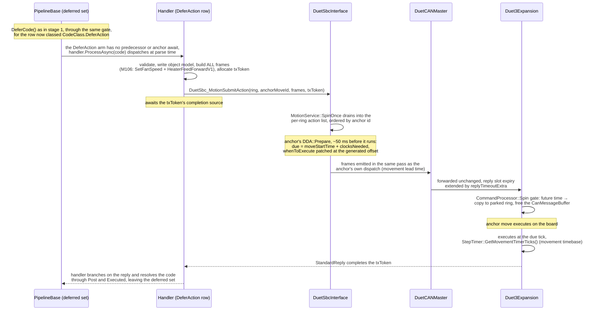

# Motion-synchronised actions

Plan for effects that are not motion, a fan speed, a heater setpoint, an output pin, but that must
happen where the G-code put them rather than as soon as DuetControlServer reads the line.

The companion to [MOTION_CONFIG_ORDERING.md](MOTION_CONFIG_ORDERING.md). That one solved *ordering*:
a value a queued move is going to read must not change underneath it, so the value travels on the
move. This one solves *timing*: an effect the machine performs must land at the point in the path
where the file placed it.

The worked example throughout:

```gcode
G1 X100 F3000   ; move A
G1 X200 F3000   ; move B
M106 S255       ; fan to full
G1 X300 F3000   ; move C
```

The fan must reach full as the head arrives at X200, without the machine stopping, and without the
fan going to full while move A is still running.

Three implementations are specified in full (§6, §7 and §8) and compared (§9). Implementation C is
chosen, delivered in two stages (§8.6): first the pipeline deferral, with every deferred code woken by
its anchor's retirement, a DuetControlServer-only change; then §7's timestamped transport, promoted
message type by message type. Everything in §5 is needed by every stage and lands first.

---

## 1. What happens today

A DuetControlServer handler has two tools, and both are wrong for this:

- **Apply it now.** The effect happens as the code reaches `ProcessInternally`, which may be a full
  queue ahead of where the machine physically is. `MCodeHandler.Fans.cs`, `MCodeHandler.Ports.cs` and
  `MCodeHandler.Heat.cs` call `FanManager.SetSpeedAsync`, `GpioManager.WriteAsync` and
  `HeatManager.SetTemperatureAsync` with no flush and no wait: in the example the fan reaches full
  during move A.
- **Wait for standstill first**, the FlushAndStandstill class of §5.1's table. Correct ordering, at the cost
  of stopping the machine: a blob, a ringing mark, a longer print.

The codes divide into four classes, and only one of them stops the machine:

| Class | Meaning | Examples | Mechanism |
| --- | --- | --- | --- |
| **Immediate** | no relation to motion, or the move carries the value (MOTION_CONFIG_ORDERING), so nothing needs holding back | M115, M409, M122, M201/203/204/205/566, M425, M592 | act now, without waiting for the channel's pending codes |
| **Flush** | reads what earlier codes are still completing: results, file positions, settings | M26/M27, M28/M29, M36, the file and settings codes | pipeline flush before dispatch |
| **Deferred** | the physical effect belongs at a point in the path | M106/107, M42, M280, M300, M150, M117, M3/M4/M5, M568, M104/140/141, M144, `G10` without axis letters (§10) | this document, from a job file or its macros only (§5.2) |
| **FlushAndStandstill** | changes what an already-queued move *means*, or needs the board's reply to produce its own | M92, M584, M350, M208, M669/M665, M574, M558, tool change, homing | flush, then standstill |

The class used to be implicit in whether a handler happened to call a flush, and nothing could
test that. §5.1 (implemented) makes it declarative: each handler's table names every code's class,
the pipeline enforces it before dispatch, and a unit test diffs the tables against this document.

M572 sits across the boundary. Its *value* already rides the move on the SBC side, but the
handler still pushes the coefficient to the drivers, so its row stays FlushAndStandstill, marked
`TODO` in the table. §7.7 explains why no implementation fully removes that wait and what
would.

---

## 2. What RepRapFirmware does

RepRapFirmware defers whole codes through `GCodeQueue`
([GCodes/GCodeQueue.cpp](../../lib/RepRapFirmware/src/GCodes/GCodeQueue.cpp)). The mechanism, verified
against the source:

- A `QueuedCode` is the raw command bytes (up to `BufferSizePerQueueItem` = 64) plus one number:
  `executeAtMove = GetScheduledMoves()`, the count of moves queued at the moment the code was read.
  There are `maxQueuedCodes` = 16 items; a full queue stalls the file channel, which retries.
- The gates (`GCodeBuffer::CanQueueCodes`, `ShouldQueueMCode`, the call sites in GCodes2.cpp):
  the channel is reading a file; the code contains no expression (it would be re-evaluated too late);
  the command has no fraction; it fits 64 bytes; moves are actually in flight
  (`GetScheduledMoves() != GetCompletedMoves()`); and `segmentsLeft == 0`, because a segment that
  turns out to command no movement is discarded and would throw the count out.
- The originating channel is answered `ok` immediately. The queue is the input of the dedicated
  `Queue` channel (`Queue2` for the second motion system), which executes the head entry once
  `completedMoves >= executeAtMove`. Replies go to `GenericMessage`, detached from the line that
  asked; empty replies are suppressed.
- **Firing is loose.** `completedMoves` is advanced by the Move task, whose wakeup interval is up to
  `StandardMoveWakeupInterval` = 500 ms unless the ring is full, and the queued code then waits for
  the main task's round robin. The effect lands somewhere inside the following move(s), not at the
  boundary.
- **Pause and rewind are coupled by one counter.** `DDARing::PausePrint` decrements `scheduledMoves`
  once per discarded DDA; `GCodeQueue::PurgeEntries` then drops every entry whose `executeAtMove`
  exceeds the reduced count. The file rewinds to the first discarded move's position, so the purged
  codes are exactly the ones the replay re-reads. Stop, abort and M112 call `Clear()`.
- **Standstill waits drain the queue.** `LockMovementSystemAndWaitForStandstill` requires
  `codeQueue->IsIdle()` and the Queue channel itself idle, so M400, M0/M1/M2, file end and
  M190/M191 all wait for deferred codes as well as for moves. The Queue channels skip that wait
  themselves, so a queued code cannot deadlock on its own queue.
- M291 is deliberately never queued: a non-blocking message box released late can overwrite a later
  blocking one.

One structural difference matters when porting any of this: on a Duet 3 running RepRapFirmware the
spindle pins, the buzzer and the PanelDue port are on the main board, so M3/M4/M5, M300 and M117 are
local writes. Here board 0 runs DuetCANMaster and has no ports of its own
(`CanAddresses.HasNoHardware`), so a spindle is up to three `CanMessageWriteGpio` sends and every
fan, heater and LED strip is remote by definition. M117 and M300 remain object-model writes.

---

## 3. Every message the main board sends

The universe every implementation works over, verified against RepRapFirmware and CANlib.
`CanMessageType` declares 63 values that travel main board to expansion board; RepRapFirmware sends
55 of them through the 33 layouts below. Sizes are `sizeof` for the target; a variable-length message
shows its maximum.

*RRF defers* means the generating code is in `ShouldQueueMCode`/`ShouldQueueG10`. *RRF standstill*
means the generating path calls a `WaitForStandstill` variant before sending. *Class here* is what
DSF should do: **defer** if a user expects the effect where they wrote it, **standstill** if it
changes what a queued move means or needs the board's reply to produce its own, **immediate** if it
has no relation to motion, and *n/a* where no code generates it.

| Message | Generated by | RRF defers | RRF standstill | Reply expected | Size | Class here |
| --- | --- | --- | --- | --- | --- | --- |
| `MovementLinearShaped` | every move with motion for that board, from `DDA::Prepare`; discarded for boards with none | never | n/a | none: motion FIFO | 60 max, trimmed to the drivers used | n/a: it is the motion, and carries its own time |
| `StopMovement` | an endstop or probe trigger stopping drivers mid-move (`CanMotion::StopDriverWhenExecuting`); **not** pause and not M112 | never | n/a | none: urgent buffer | 2 | n/a |
| `RevertPosition` | behind `StopMovement` when stopped drivers must wind back (probing) | never | n/a | none: urgent buffer | 40 max | n/a |
| `EmergencyStop` | M112, local M999, trigger 0, serial and SBC emergency stops; unicast to each running board, then a broadcast backstop | never | no | none | 1 | immediate, absolutely |
| `TimeSync` | periodic broadcast from `CanClockLoop` | n/a | n/a | none | 12/16/20 | n/a: defines the clock |
| `SetHeaterTemperatureV1` | M104, M109, M140, M141, M144, M190, M191, M568, `G10`, M562; heater-off from M0/M1/M81/M502 and print end (`Heat::SwitchOffAll`); suspend/unsuspend from pause, resume and probing with M558 B1 | M104, M140, M141, M144, M568, `G10` without axis letters | M109, M190, M191 and M116 wait *before* setting the target, then unlock so pausing still works | `StandardReply` | 9 | **defer** the queueable set; **standstill** for the waiting codes, whose block depends on the target being in force |
| `HeaterModelV3` | M307 (M501 via config-override.g), and M303 completion | never | no | `StandardReply` | 60 | immediate |
| `SetDefaultHeaterModel` | `Heater::SetFunction` when no model was set by the user: M140 H, M141 H, tool creation M563 | never | no | custom `HeaterModelReport`; `StandardReply` on error | 5 | immediate |
| `SetHeaterFaultDetectionParameters` | M570 | never | no | `StandardReply` | 16 | immediate |
| `SetHeaterMonitors` | M143 | never | no | `StandardReply` | 60 | immediate |
| `HeaterTuningCommand` | M303 | never | no | `StandardReply`; unsolicited `heaterTuningReport` follows | 22 | immediate |
| `HeaterFeedForwardV1` | M106/M107 on a fan mapped to the current tool; the planner's extrusion feedforward, from the Move task | with the M106/M107 that carries it | no | none: `SendMessageNoReplyNoFree` | 16 | **defer, to the same anchor as the fan speed it accompanies**; the extrusion terms belong to the move |
| `SetFanSpeed` | M106, M107 (all mapped-fan forms); M303 tuning fans; the display | M106, M107 | no | `StandardReply` | 8 | **defer**: the worked example |
| `FanParameters` | M106 carrying `T`, `B`, `L`, `X`, `H` or `C`, its only generator | always | no | `StandardReply` | 34 | **defer** |
| `WriteGpio` | M42 and M280, the only generators | always | no | `StandardReply` | 7 | **defer**; spindles (M3/M4/M5) land here too, see §2 |
| `CreateInputMonitorV1` | M574, M558, M950 J | never | M574 when setting; M558 and M950 J no | `StandardReply`, `extra` = input state | 64 max (trailing pin name) | **standstill** for M574/M558: no move that consults an endstop or probe may be queued or running, and both need the reply. Immediate for M950 J |
| `ChangeInputMonitorV1` | port replacement by the same three codes; endstop/probe priming for homing and probing moves; per-tap probe setup; pin-name reporting; M558.2/.3/.4 | never | teardown under M574's standstill; priming under the standstill `G1 H` takes; the rest no | `StandardReply`, `extra` = state | 9 | **standstill** where it deletes or reassigns; priming is part of its move |
| `ReadInputsRequest` | scanning-probe reads: M558 create, M558.1 calibration, G29 grid scan, the laser task | never | n/a | custom `ReadInputsReplyV0` to a callback | 8 | immediate: a read wants the value now |
| `CreateFilamentMonitor` | M591 | never | no | `StandardReply`; periodic `filamentMonitorsStatusReportV2` broadcasts follow | 5 | immediate |
| `DeleteFilamentMonitor` | M591 | never | no | `StandardReply` | 5 | immediate |
| `MultipleDrivesRequest<T>` (5 subtypes: driver states, motor currents, standstill current, steps/mm + microstepping, `setPressureAdvanceV2`) | M17/M18/M84, M92, M350, M572, M906/M913/M917, M584; driver states also from the idle timeout and `DDA::Prepare` on the Move task | never | yes, except: the power-fail script skips it, `M906 I` alone takes none, and the Move-task driver states cannot | `StandardReply`, except Move-task driver states: `CanRequestIdNoReplyNeeded`, motion FIFO | 20 to 52 by `T` | **standstill** for currents, steps, microstepping and enables. Pressure advance: §7.7 |
| `EnableStallEndstop` | priming and disarming stall homing (M574 S3) inside G28 / `G1 H1` | never | armed inside the homing sequence, itself a barrier | `StandardReply` | 8 | n/a: part of the homing move |
| `SetInputShapingV1` | M593 with parameters, to every board with drivers | never | yes when setting | `StandardReply` per board | 60 | **standstill**: queued moves were shaped with the old filter |
| `StartAccelerometer` | M956 | never | no | `StandardReply`; unsolicited `accelerometerData` | 12 | immediate |
| `StartClosedLoopDataCollection` | M569.5 | never | no | `StandardReply`; unsolicited `closedLoopData` | 11 | immediate |
| `ReturnInfo` | M115 B, M122 B, M997's board probe | never | only M997 | `StandardReply`, fragmented via `moreFollows`; `extra` = UF2 flag | 3 | immediate |
| `DiagnosticTest` | M122 P>1 | never | no | `StandardReply`, which "may not actually arrive if the test crashes the expansion board" | 20 | immediate |
| `Reset` | M999 B | never | **no** | `StandardReply`, sent before the reset | 2 | **standstill** here: a board must not reset with moves in its queue. RRF not waiting reads as a gap, not a precedent |
| `SetAddressAndNormalTiming` | M952 | never | **no** | `StandardReply` from the old address | 16 | **standstill** here: it changes the bus the moves travel on |
| `AcknowledgeAnnounce` | answers a board's `announce` | never | n/a | none | 1 | n/a |
| `UpdateYourFirmware` | M997 | never | yes: `UpdateFirmware` locks everything first | `StandardReply`, then the board's `firmwareBlockRequest` cycle | 4 | **standstill** |
| `FirmwareUpdateResponse` | answers `firmwareBlockRequest` | never | n/a | none: the next block request acknowledges | 64 max | n/a |
| `Generic` (19 subtypes: four `m950*`, `m308V1`, six `m569*`, `m915`, `m111`, `m655`, `accelerometerConfig`, `configureFilamentMonitor`, `setConnectionTimeout`, `testReport`, `writeLedStrip`) | M111, M122 P1, M150, M308, M569.x, M591, M655, M915, M950, M955, M959 | `writeLedStrip` (M150), when the strip needs no standstill | M569 setting `D/R/S/V`, M569.1 setting, M569.6 first call, M150 when `MustStopMovement`; the rest never | `StandardReply`, `extra` where asked | 64 max; actual = paramLength + 4 | **defer** for M150; **standstill** for M569 and M950 reassigning a driver or port a queued move may use; immediate for the rest |

Four observations the table forces:

- **The class is a property of the code, not the layout.** The same nine bytes of
  `SetHeaterTemperatureV1` carry a deferrable setpoint for M104 and a barrier for M109; no field in
  the message distinguishes them. The declaration in §5.1 is therefore keyed on codes.
- **M106 breaks one-message-per-code.** It emits `SetFanSpeed` plus `HeaterFeedForwardV1` (and
  `FanParameters` when it carries configuration), and feedforward that lands before the fan change
  has a heater compensating for a fan that is not running. A deferred unit is a *code's set of
  sends*, anchored once.
- **Deferred and FlushAndStandstill are disjoint in RRF**: no code both queues and waits for standstill, and
  where a layout shows both (the heater row, M150) the generating codes split cleanly.
- The 8 declared types RRF never sends (`startup`, `controlledStop`, `powerFailing`, `insertHiccup`,
  `setFastTiming`, `setDateTime`, `updateDeltaParameters`, `setPressureAdvanceV1`, the last
  receive-only) need nothing, but any generated per-type table (§7.1) must decide their entries
  explicitly.

---

## 4. What the motion side already provides

Both implementations anchor on the same facts about the tree:

- **Move ids.** `MovePlanner.QueueMove` assigns a per-ring monotonic `MoveId` (never zero) to every
  submitted move ([MovePlanner.cs:328](../../src/DuetControlServer/Motion/MovePlanner.cs)), and
  `JobMoveIndex` maps ids of job-file moves to file positions.
- **Retirement is predicted, and reported per move.** The native engine retires a move when the
  fitted step-clock model passes `moveStartTime + clocksNeeded`, on a 1 ms tick; endstop moves retire
  when their drives actually stop. Each retirement posts a `MoveCompletedEvent` carrying the
  `moveId`, which the DCS `LinkService` dispatcher receives immediately and records in
  `MotionTracker` ([MotionTracker.cs](../../src/DuetControlServer/Motion/MotionTracker.cs)), which
  currently has no reader.
- **A pause purges provisional moves only.** `DDARing::Feedhold` plans a deceleration among the
  *uncommitted* DDAs and `PurgeAfter` reports `FirstPurgedMoveId`
  ([DDARing.cpp](../../src/DuetSbcInterface/src/Motion/DDARing.cpp)); committed moves (segments
  generated and dispatched, up to `usualMinimumPreparedTime` = 50 ms ahead) always run to
  completion. Nothing is ever recalled from a board. The rewind point is computed from
  `FirstPurgedMoveId` (`MovePlanner.TakeJobResumePoint`).
- **Times on the wire are in the movement timebase**: master step-clock ticks less the shared
  movement delay. The SBC stamps `whenToExecute` from `GetMovementTimerTicks()`, and a board
  schedules at `whenToExecute + movementDelay + localTimeOffset`
  ([Duet3Expansion StepTimer.h:167](../../src/Duet3Expansion/src/Movement/StepTimer.h)), so
  everything timed this way slips with the path when the machine hiccups.
- **A committed move's duration is unbounded.** `CanAddMove` limits the total duration of
  *provisional* moves (2 s), but a single long move is prepared whole and dispatched ~50 ms before it
  starts. Anything waiting for that move's end waits its full duration.

---

## 5. Shared groundwork

Required by every implementation, and useful on its own.

### 5.1 The class table

Implemented. The class of every code is a declared fact: each handler declares the codes it
implements as a static `CodeTable<THandler>`
([Codes/CodeTable.cs](../../src/DuetControlServer/Codes/CodeTable.cs)), one entry per row, an
entry being the code number(s), the class
([Codes/CodeClass.cs](../../src/DuetControlServer/Codes/CodeClass.cs)) and the handler:

```csharp
internal static readonly CodeTable<MCodeHandler> Rows = new(CodeType.MCode)
{
    { [0, 1, 2],  CodeClass.Immediate, (h, c, ct) => h.HandleStopAsync(c, ct) },
    { 104,        CodeClass.Deferred,  async (h, c, ct) => await h.SetTemperaturesAsync(c, await h.CurrentToolHeatersAsync(c, ct), wait: false, ct) },
    { [569, (569, 1), (569, 2), (569, 4), (569, 6), (569, 7)],
                  CodeClass.FlushAndStandstill,   (h, c, ct) => h.HandleDriverConfigAsync(c, ct) },
    { [906, 913, 917], FlushAndStandstillWhenSettingDrives, (h, c, ct) => h.HandleMotorCurrentsAsync(c, ct) },
};
```

An entry names its code by major number (`104`), by `(major, minor)` for a fractional code, or by
a list of numbers sharing one row, which is how codes that shared a switch arm (`0 or 1 or 2`,
`17 or 18 or 84`) and a handler's internal minor switch (M569) are written; arms that passed
computed arguments (M104 and M109 differ only in `wait:`) became lambdas that pass them. Tables
exist only in `GCodeHandler` and `MCodeHandler`: `TCodeHandler` handles every T code the same way,
the tool number is a value with no number to key on, so it answers with expressions (Immediate for
the bare `T` report, FlushAndStandstill for a tool change), and `KeywordHandler` answers Immediate, keywords
are not classified.

The class is either fixed or a resolver for rows whose class depends on the parameters:
`M92/M350/M906/M913/M917` are FlushAndStandstill when a drive letter is present and Immediate when bare (a
report, which DWC polls mid-print; the guard is `SetsAnyDrive`, relocated from the handlers);
`M584` and `M593` are FlushAndStandstill only when setting; `M558` is FlushAndStandstill unless
bare or naming only `K`, a report; `M563` is FlushAndStandstill only with `P`, without it a
report; `M999` is FlushAndStandstill with `B` (§3); `G10` is FlushAndStandstill with an axis
letter and Deferred without. `G4` is the one code that needs a
standstill and cannot declare it: whether it waits depends on the channel asking rather than on the
parameters, so its row is Immediate and its handler waits, as the special move inside `G0`/`G1` does
(MCODE_MIGRATION.md §18). Every fractional code a handler
implements is its own row (M36.1/.2, M201.1, M505.1, M569.1/.2/.4/.6/.7, M581.1, M586.4), the
minor decided by the row's lambda as an argument, except M569, which keeps a switch over its valid
minors because each maps to a different CAN message type. A minor of zero is the fraction-less
form, as RepRapFirmware's `fraction > 0` gates read it: M569.0 is M569. Lookup is exact: a
fraction never falls back to the bare-major row. M150 has no handler yet; its row (a resolver on
the strip's `MustStopMovement` capability, FlushAndStandstill or Deferred) lands with M150 itself.

`ICodeHandler` gained `Classify(code)` beside its existing `ProcessAsync(code)`: the row's class,
resolved from the parameters where declared, or null for "no such code". `ProcessAsync` is the
simulation gate around `Rows.Invoke`, and a code the simulation gate is going to ignore classifies
Immediate, so simulation never waits for motion. `Classify` is side-effect free, nothing allocates
per code (struct keys, tables frozen on first lookup, singleton rows), and the class column
(`Rows.ClassColumn`) is readable without instantiating anything, which is what the tests read.

The enforcement is in `Code.ProcessInternallyAsync`
([Code.cs](../../src/DuetControlServer/Commands/Generic/Code.cs)), the body of the
ProcessInternally pipeline stage, which routes to the handler by letter as it always did, asks it
`Classify`, performs the class's synchronisation, and calls `ProcessAsync`; the standstill is
`CodeProcessor.WaitForStandstillAsync`. A prioritized code skips the synchronisation: it jumps
every queue by definition. A flush that reports "not ready" cancels and retries the code exactly
as the in-handler flushes did. A null class dispatches no handler: the code takes the existing
post-interception, then `TryRunCodeMacroAsync`, which builds `<letter><major>.<minor>.g` and
passes the code's parameters as `param.*`, then `Command is not supported`. That fallback used to
be dead code, because the `NotSupportedException` catch resolved unknown codes first; the order is
what RepRapFirmware's `default:` case does
([GCodes2.cpp:4789](../../lib/RepRapFirmware/src/GCodes/GCodes2.cpp)).
`MCodeHandler.FlushAndWaitForStandstillAsync` and its 12 call sites are deleted, along with the
first-thing standstill waits of M451-453 and M563 and the invalid-minor guards of M36, M201, M505,
M558, M569, M581 and M586. The mid-sequence waits of multi-phase codes (G28, G29, G30, the
special-move wait inside G0/G1, M505's guarded wait) remain: the pipeline's pre-dispatch wait
subsumes only a wait a handler performed first thing.



The Deferred branch's flush and anchor check land with the deferral implementation; today the
class is declared and the branch dispatches immediately, which is the previous behaviour.

**Tests** ([UnitTests/Codes/CodeTableTests.cs](../../src/UnitTests/Codes/CodeTableTests.cs)):
the `CodeTable` mechanism, exercised on a table built for the test rather than the handlers' own:
shared rows, resolver rows classifying from parameters, exact fractional lookup with no fallback
to the bare major (the M906.1-executes-as-M906 bug), a minor of zero reading as the fraction-less
form, null for a code with no row, dispatch running the row the minor selected, a duplicate row
refusing to register, and the class column. The handlers' tables themselves are declarations and
are not mirrored into an expected list: a row cannot exist without a handler, dispatch is the row,
and a duplicated class column would only turn every class change into a two-file edit.

**Behaviour changes against the switch-based dispatch**, each a declared class rather than a
discovery:

- the miss path: an unknown major or an unlisted fraction (`M906.1`, `M569.3`, M22, M998) runs the
  macro named after it when one exists and answers `Command is not supported` otherwise, where a
  fraction previously executed as its bare major and an unknown major resolved unsupported without
  the macro attempt;
- M409 lost the flush it never needed: a model query answers from the current model;
- M109, M116, M190 and M191 are FlushAndStandstill, barriers by definition (§10): they block later G-code on a
  condition derived from the target, so the target must be in force before the wait begins; they
  previously set targets while moves were still running;
- M558 and M593 gained the standstill §3 requires when they configure; M999 B and M952 gained the
  standstill RRF never took (§3); M997 locks as §3 requires;
- M201, M203, M204, M205/M566, M425 and M592 are Immediate: the move carries their values
  (MOTION_CONFIG_ORDERING), so they wait for nothing; the codes whose handlers flushed inline
  (M26-M30, M36, M38, M39, M470-M472, M501, M503, M505, M550-M552, M557, M586, M606, M929)
  are Flush class instead, the pipeline performing the same wait before dispatch;
- M451-453, and M563 with `P`, wait exactly as before but in the pipeline instead of the handler,
  so a parameter error now surfaces after the wait rather than before it, which is
  RepRapFirmware's order too.

M208 and the reassigning forms of M950 are declared Immediate although §1 and §3 argue
FlushAndStandstill:
neither handler waited before, and flipping them is recorded here as an open decision rather than
smuggled in.

### 5.2 Only job-file channels defer, macros included

A code is deferred only when it comes from the job file or a macro the job invoked. From every other
channel it applies immediately:

- `M106 S128` typed into DWC mid-print is a manual intervention; the operator means *now*.
- Only a file code can be replayed. Surviving a pause depends on the purged work being exactly what
  the rewind re-reads; a code with no file position behind it cannot be re-created.

A job streamed over IPC (an external host feeding codes) is therefore **not** deferred, and keeps
today's behaviour. That is a decision, recorded here: such a stream has no rewind to replay against,
so the purge rule cannot hold for it.

Macros are included because a layer-change macro's `M106` belongs where the macro was called.
A pause inside a macro abandons it (`AbandonMacrosForPauseAsync`) and the resume re-runs it whole, so
every side effect in a macro is at-least-once, deferred or not; deferral adds no new failure mode.
The guard is `state.macroRestarted`, implemented as RepRapFirmware computes it: the resume of a
pause that abandoned macros marks the job file's replayed command
(`CodeFile.FirstCommandAfterRestart`), as does starting a job from a saved position; a macro
started by a marked file inherits the mark; a command clears its file's mark as it finishes
executing; and the object model reports whether the file channel is inside a macro whose invoking
level is marked. A macro reads it to skip what must not repeat.

### 5.3 The anchor

The anchor of a deferred code is the `MoveId` of the last move submitted on the channel's ring when
the handler runs. `MovePlanner` gains a `LastSubmittedMoveId(ring)` property, set in `QueueMove`
under the planner lock. If no move is in flight (nothing submitted, or everything submitted has
completed), the code executes immediately: with an empty queue there is nothing to synchronise with.
Ids skip zero on wrap, so comparisons use signed distance.

Codes that produce endstop-terminated moves (homing, probing, `G1 H`) are FlushAndStandstill class and hold the
channel to standstill, so no deferred code can anchor to a move that may end early; §5.1's test
asserts that.

### 5.4 Purge and rewind are one number

`FeedholdOutcome.FirstPurgedMoveId` is already the source of the rewind point. It is also the
deferral purge boundary: deferred work anchored at or past it is dropped, because the rewind re-reads
those codes; work anchored before it is owed, because a feedhold never purges committed moves, so
those anchors will run.

| Pause purges | Deferred M106 anchored to B | Job rewinds to | Re-read? | Net |
| --- | --- | --- | --- | --- |
| C only | kept: B runs | C's position, after the M106 | no | fires once |
| B and C | dropped: B never runs | B's position, before the M106 | yes | fires once |

The awkward middle case, an anchor that ran but a code after the rewind point, cannot arise: the
rewind point *is* the first purged anchor. Stop, abort, M112 and `LinkService.Invalidate()` (link
loss, controller reset) discard everything pending; the moves the work was anchored to either drain
or no longer exist. Nothing pending is replayed on resume; machine state after a resume comes from
the restore point, which is the mechanism that already knows about tool state.

The safety invariant: **a purge must never be the reason the machine is unsafe.** Spindle and laser
shutdown belong to `stop.g` / `cancel.g`, which run afterwards, never to a deferred action the same
event just discarded.

### 5.5 M400 waits for deferred work

M400 is a FlushAndStandstill row, so the pipeline performs its flush and standstill before the handler runs,
and `MovePlanner.IsMoving` asks only about submissions and the ring counters. It gains a third
term: no deferred work pending. Without it,
`M106 S255` followed by `M400` returns before the fan changed, and M400 stops meaning "everything up
to here has happened". RepRapFirmware's standstill wait already includes `codeQueue->IsIdle()`.
The per-implementation mechanics are in §6, §7 and §8.

### 5.6 Validate early, deliver late

The handlers already validate locally before sending (`GpioManager.WriteAsync` fails "Output 5 is
not configured" before any CAN traffic). That split is kept: configuration and parameter errors fail
the code synchronously on its own line; only what the board alone can know arrives late. Late
outcomes are uniform in implementations A and B; in implementation C the code is still alive when
they arrive, so the first two below become its own result instead (§8.4):

- board acted but complained: `Model.Messages`, tagged with the originating code,
  `M106 S255 (deferred): fan 3 not configured`;
- delivery failure or no reply in time: a `MachineEvent`, the existing escalation path with a
  default action and a machine-overridable macro;
- a late continuation never writes the requested side of the object model: a later code may already
  have moved the same field.

For a deferred code, a successful reply means *accepted and scheduled*, not *done*, and
`fans[].requestedValue` means "requested and scheduled" rather than "requested and sent". The
requested/actual split the object model already carries absorbs this; it is stated here so it is a
decision rather than a discovery.

### 5.7 Emergency-stop output handling in Duet3Expansion

Verified current behaviour, and it is a prerequisite for deferring anything (and a gap today):

- `Platform::EmergencyStop` only schedules a deferred reset ~200 ms later
  ([Platform.cpp:1422](../../src/Duet3Expansion/src/Platform/Platform.cpp)); until the reset,
  `CommandProcessor::Spin` keeps executing arriving commands unconditionally.
- `ShutdownAll` switches off heaters and drivers only. **Fans and GPIO/PWM ports are never
  commanded off**; they hold their PWM until the processor reset returns the pins to reset state.

Work: on receiving `emergencyStop`, drive heaters, fans and GPIO outputs to their safe state
immediately, latch them so a command arriving in the window cannot undo the stop, and stop executing
command messages until the reset. This is needed whichever implementation is chosen, and it is
needed even if neither is.

---

## 6. Implementation A: the deferred-code queue

**Hold the whole code in DuetControlServer; run it when its anchor retires.** RepRapFirmware's
design rebuilt on this tree's primitives. No change outside DuetControlServer. Not chosen as a
whole: its release hook, run at the anchor's retirement, is stage 1's wake source inside C's
pipeline (§8.6).



### The pieces

- **`Codes/DeferredCodeQueue.cs`**: a per-ring FIFO of `{Code, anchorMoveId, origin}`. `origin` is
  the code's short form, channel and file position, for tagging late messages.
- **Insertion**, in the `ProcessInternally` stage before handler dispatch: if the class table says
  Deferred, the channel is `File`, and `LastSubmittedMoveId` names a move that has not completed,
  then `FlushAsync(code)` (this evaluates expressions, so the queued parameters are literals),
  clone the code with `Channel = CodeChannel.Queue` and `File = null` (the pipeline matches stack
  items by file; null targets the Queue channel's base item), enqueue the clone, and resolve the
  original as `ok`. The gate requires `Channel == File`, so a released code cannot re-queue itself.
- **Release**: a hook on `MotionTracker.MoveCompleted`. A worker drains the queue head while
  `anchorMoveId` is at or before the completed id, executing each clone via
  `CodeProcessor.StartCodeAsync` and awaiting it before the next, so deferred codes stay FIFO. The
  class table guarantees Deferred handlers never block on motion, so the worker cannot stall the
  queue; the Queue channel exists in the enum and already has a full pipeline
  ([CodeProcessor.cs:45](../../src/DuetControlServer/Codes/CodeProcessor.cs)), currently fed by
  nothing.
- **Replies**: the Queue channel's `Executed` stage routes errors to `Model.Messages`, prefixed from
  `origin`. The handler is alive when the board answers, so a handler that needs to branch on the
  reply still can, which is a capability implementation B gives up and implementation C restores
  (§8).
- **Purge**: after `StopEarlyAsync`, drop entries with `anchorMoveId >= FirstPurgedMoveId`
  (§5.4); on stop/abort/M112/`Invalidate()`, clear. A synchronous pause (M25/M226 in the file)
  purges nothing; the queue drains under the standstill it already takes.
- **M400**: the §5.5 term is `queue.IsEmpty && Queue channel idle`, checked in the
  `WaitForStandstillAsync` poll loop.

### Timing

Release fires at the anchor's *predicted* end on the fitted clock (1 ms retirement tick), then the
event hop, the handler (which takes the object-model lock), the outbound ring, one SPI transfer and
one CAN frame. Typically **2 to 10 ms after the path point, always late, never early**. The tail is
unbounded: a GC pause or lock contention lands the effect further into the following move. At
50 mm/s, 10 ms is 0.5 mm. Endstop-terminated anchors are handled correctly for free, because their
retirement follows the actual stop.

### Semantics accepted

- The code's own result is `ok` at parse; failures the board reports arrive detached (§5.6). This is
  identical in implementation B.
- Plugins and IPC clients see the code twice: once resolving on `File`, once executing on `Queue`.
  This was the visible behaviour of the RRF SBC era.
- `fans[].requestedValue` updates at fire time, so the requested side of the object model lags the
  parser by the queue depth.

---

## 7. Implementation B: timestamped effects, parked on the board

**Run the code now; give its CAN messages a `whenToExecute`; the board executes them at that tick.**
The mechanism moves already use, extended to effects. Touches the schema, DuetControlServer,
DuetSbcInterface, Duet3Expansion, and one field DuetCANMaster honors without parsing. This is
stage 2's transport (§8.6), with §7.2's completion-at-submission replaced by §8's deferred code.



### 7.1 Protocol

`Schema/can-messages.json` is the single source; the generators emit the CANlib header, the C#
mirror and the conformance harnesses on both sides, so this is one schema change:

- **`whenToExecute` (uint32, movement timebase) on the six layouts whose generators can defer**:
  `SetFanSpeed`, `WriteGpio`, `SetHeaterTemperatureV1`, `FanParameters`, `HeaterFeedForwardV1`,
  and `Generic` (for `writeLedStrip`). Messages that can never defer do not carry the field; the
  board's gate treats an absent entry as "execute on arrival".
- A named sentinel, `CanWhenToExecuteImmediate = 0`, meaning execute on arrival; the SBC never emits
  a computed due time of 0 (it bumps to 1).
- `CanMessageGeneric.Data` shortens from 60 to 56 bytes to make room; real instances are variable
  length and far smaller, so only a parameter table packing more than 56 bytes is affected.
- **A generated offset table**, message type to `whenToExecute` offset, emitted like
  `CanMessageGenericTables` for both languages, with explicit no-entry rows for every other type
  including the eight never-sent ones. The board's gate and the SBC's stamping both read it, so the
  offset cannot disagree with the layout.
- A new broadcast, `CanMessageDropParkedCommands` (1 byte), see §7.4.

Wire growth, against CAN-FD DLC quantisation (0-8, 12, 16, 20, 24, 32, 48, 64):

| Message | Now | +4 | Wire cost |
| --- | --- | --- | --- |
| `WriteGpio` | 7 | 11 | DLC 8 → 12 |
| `SetFanSpeed` | 8 | 12 | DLC 8 → 12 |
| `SetHeaterTemperatureV1` | 9 | 13 | DLC 12 → 16 |
| `HeaterFeedForwardV1` | 16 | 20 | DLC 16 → 20 |
| `FanParameters` | 34 | 38 | free (DLC 48) |
| `Generic` | 64 max | 64 max | free (array shortened) |

### 7.2 DuetControlServer

- A Deferred handler validates and writes the object model exactly as today, builds its CAN frames
  (all of them: M106's fan speed and feedforward are one action), allocates the txToken as
  `LinkInterface.SendCanMessageAsync` does now, and calls
  `planner.SubmitAction(ring, anchorMoveId, frames, txToken, origin)` instead of sending. The code
  then completes.
- A deferred txToken maps to an `origin`, not a `TaskCompletionSource`: nothing awaits it. The reply
  handler routes a matched late reply to §5.6's outcomes; no reply by
  `whenToExecute + UsualResponseTimeout` raises the delivery-failure event. On any purge the
  outstanding mappings are dropped locally, or they leak.
- Effects with no CAN message (M117, M300, object-model-only writes) cannot ride this path. They are
  applied on the anchor's `MoveCompletedEvent`, which is implementation A's release hook: a reduced
  form of the queue exists inside implementation B regardless.

### 7.3 DuetSbcInterface

- `DuetSbc_MotionSubmitAction(handle, ring, anchorMoveId, header, payload, length)`: a lock-free
  submission ring beside `SubmitMove`, drained by `MotionService::SpinOnce` into a per-ring action
  list ordered by anchor id.
- **Resolution at the anchor's `DDA::Prepare`**: due = `m_afterPrepare.moveStartTime +
  m_clocksNeeded`, the end of the anchor. The end of the preceding move is correct where the start
  of the next is not: across a gap in the queue, an `M107` must not wait for the next move to be
  issued. The timestamp is patched at the generated offset and the frame emitted down the same
  outbound ring, in the same pass as the anchor's own dispatch, so it inherits the movement path's
  lead time.
- An action whose anchor is already committed when it is submitted resolves immediately from the
  committed DDA's times; a due time already in the past goes out as-is (the board executes it on
  arrival). An action whose anchor no longer exists goes out with the sentinel.
- **Purge**: `DDARing::PurgeAfter` already knows the purged ids; entries whose anchor was purged are
  dropped from the list in the same operation. Nothing needs to reach the boards on a pause or stop:
  every action already sent has a committed anchor, committed moves always run (§4), so every parked
  command is owed and fires at its tick before the machine reaches standstill.
- **M400 term**: `DuetSbc_MotionActionsPending(ring)` = the list is non-empty, or the last emitted
  due time has not yet passed `GetMovementTimerTicks()`. The check lives here because only the
  native side has the movement-timebase clock.
- Discarded whole on link loss or controller reset, with the move ring.

### 7.4 Duet3Expansion

- **The gate**, at the top of `CommandProcessor::Spin`: look the message type up in the offset
  table; no entry or the sentinel or a past time means dispatch as today. A future time (signed
  comparison against `StepTimer::GetMovementTimerTicks()`, the same call the motion path uses, so
  parked commands slip with the path) means **copy into the parked ring and free the
  `CanMessageBuffer` in the same pass**. That is the invariant `Move::TaskLoop` already keeps for
  movement messages, and it is what protects the buffer pool: 40 buffers, 10 on a SAMC21, and a
  receiver that blocks rather than drops when the pool empties, after which the hardware FIFO (32
  deep, 16 on SAMC21) overruns silently.
- **The parked ring**: fixed depth `ParkedCommandRingSize` (16, 8 on SAMC21), each entry
  `{dueTime, msgType, requestId, dataLength, payload[64]}`. Every `Spin` pass executes entries whose
  due time has passed, in due order, ties broken by insertion order; the reply is built at execution
  from the entry. The ring's content at any instant is the actions inside the committed window, so depth
  is driven by action *rate*; a long move parks its trailing action for its whole duration
  (unbounded, §4), which consumes a slot but not more.
- **Overflow**: execute the parked entry with the nearest due time and park the arrival in its slot;
  if the arrival is itself nearest due, execute it and park nothing. Executing the *arrival* would be
  wrong: arrivals are normally the latest-due of the set, and firing one ahead of an earlier-due
  command that addresses the same output ends in a state no line of the file asked for
  (fan 100% due later overtaken by fan 50% due sooner ends at 50%). Nearest-due keeps the sequence;
  the error is one command early, the one closest to firing anyway. Early and late executions are
  counted and reported in M122.
- **`DropParkedCommands`**: empties the ring, idempotent, handled inline in the receiver task like
  `emergencyStop`. Sent (repeatedly, the bus guarantees nothing) only with an emergency stop, as
  belt and braces for the window before the board's reset; pauses never send it (§7.3).

### 7.5 DuetCANMaster

One change, and it stays ignorant of message layouts. `pendingRequests` (32 slots) expires a slot at
`whenStarted + UsualResponseTimeout` (1000 ms), so a reply to a command parked longer than a second
would be orphaned. `SendCanMessageHeader` has three spare padding bytes; two become
`uint16 replyTimeoutExtra` (units of 100 ms, 0 = today's behaviour), filled by DCS with the parked
lifetime it already knows. Slot expiry becomes `whenStarted + UsualResponseTimeout +
replyTimeoutExtra`. The transport honors a number without understanding the payload, and the struct
does not grow.

### 7.6 Timing

Exact: the effect lands on the step clock, in the movement timebase, immune to SBC scheduling, GC
and lock contention, because nothing on the SBC is in the firing path once the frame is sent.
The lead a board sees is the movement path's own (~50 ms, already measured by the boards'
`minAdvance`/`maxAdvance` diagnostics).

### 7.7 The M572 limit, in every implementation

The board bakes pressure advance into segments at message *arrival*
([Move.cpp:1158](../../src/Duet3Expansion/src/Movement/Move.cpp)), and movement messages arrive up to
the send-ahead horizon early. A PA push timed exactly at a move boundary therefore still misses every
move whose message already arrived: up to ~50 ms of motion. Implementation A's release a few
milliseconds after the boundary has the same property. So deferring the push shrinks M572's error
from "everything queued board-side" to "at most one horizon", in all implementations equally, and
removing its standstill is a separate decision: accept that staleness, or carry the coefficient on
the movement message as MOTION_CONFIG_ORDERING did on the SBC side. Until decided, the standstill
stays.

---

## 8. Implementation C: timestamped effects, the code deferred in the pipeline

**Implementation B's transport, with the code held open until the board answers: instead of
completing at submission, a deferred code stays in ProcessInternally awaiting the reply while its
channel continues past it.** The handler is alive when the reply arrives, which restores the
capability §7 gives up, and the board's complaint becomes the code's own result instead of a
detached message. Everything below §7.2 is unchanged: the protocol (§7.1), the action list with its
resolution and purge (§7.3), the parked ring and its gate (§7.4) and the CANMaster expiry field
(§7.5) carry over verbatim. The differences are confined to DuetControlServer. This is the chosen
implementation; §8.6 stages its delivery so the transport arrives after the pipeline.



### 8.1 The pipeline change

The ProcessInternally worker awaits every code today, strictly FIFO
([PipelineStackItem.cs](../../src/DuetControlServer/Codes/Pipelines/PipelineStackItem.cs)). It
gains one exception: a code whose §5.1 dispatch took the defer branch is dispatched without being
awaited; the worker records it in the pipeline's deferred set and reads the next code. The set
belongs to the channel's pipeline rather than to a stack level, as RepRapFirmware's queued codes
belong to the channel rather than to the macro that produced them: a macro may finish and pop
while a code it deferred is still owed, and the code must stay visible to the standstill wait and
to purge cancellation. Every other class is awaited as today, so at most one non-deferred code is
in flight per stack item, and dispatch order stays FIFO, which is what keeps submissions
anchor-ordered in §7.3's list.

A deferred txToken maps to a `TaskCompletionSource` the handler awaits, replacing §7.2's origin
map. The handler validates, writes the object model, builds all frames and submits exactly as §7.2
describes; after `SubmitAction` it awaits the token instead of completing. The reply completes
the token, the handler branches on it where it needs to, and the code resolves through Post and
Executed as normal, leaving the deferred set.

Effects with no CAN message (M117, M300) defer the same way, awaiting the anchor's
`MoveCompletedEvent` from `MotionTracker` instead of a reply, and perform their object-model write
on wake: one mechanism, two wake sources, and the reduced release-hook queue §7.2 kept from
implementation A disappears.

### 8.2 Pending splits into two predicates

`PipelineStackItem.Busy` is one bit, and every drain wait reads it. Deferred codes force a split:

- **Busy for flush** excludes deferred codes. The §5.1 pre-dispatch flush (including the one before
  the *next* deferred code), Flush-class codes, and the waits that pop a finished macro or job file
  read this predicate. Without the carve-out the second M106 waits for the first one's reply, so
  deferral serialises to one code per anchor; and a macro ending in a deferred code holds its
  parent until the anchor, the last submitted move, retires, so the planner starves and the machine
  decelerates at every such macro boundary.
- **Busy for standstill** includes them, across all channels (§5.2 makes that the file channel in
  practice). `WaitForStandstillAsync` reads this predicate, so every FlushAndStandstill code and
  M400 wait for deferred codes, and §5.5's term falls out for free: a deferred code resolves when the
  board's reply arrives, which is after the effect executed, so M400 returning means every deferred
  effect has happened. §7.3's `DuetSbc_MotionActionsPending` is not needed.

### 8.3 Completion is out of order

Later codes overtake a deferred one through Post and Executed: logging, the `CodeBeingExecuted`
diagnostics and IPC interception see completions out of order, though each code is still visible
exactly once. That is the row §9 trades against implementation A's visible-twice behaviour.

`CodeFile.NextFilePosition`, the fork point M596 copies
([CodeFile.cs](../../src/DuetControlServer/Files/CodeFile.cs)), survives the reordering as it
stands, verified against the code: it is a high-water mark of *commitment*, not completion,
advanced by `CodeProcessor.FlushAsync` before dispatch, so a deferred code moves it past itself
when the §5.1 defer branch flushes, before it is deferred; and a deferred code's effect is owed, so a fork
starting past it duplicates nothing. The Executed-stage update is a catch-up for codes that never
flush, and three existing guards absorb the late resolutions: the update only ever moves the mark
forward, a cancelled code (`Result == null`) never touches it, and the `Position` setter resets it
on the rewind seek, where a surviving deferred code cannot push past the rewind point because its
line precedes the first purged move's. No recalculation is needed.

### 8.4 Replies, purge and cancellation

- The board's reply is the code's result: an error reads `M106 S255: fan 3 not configured` on the
  originating line, not a detached `Model.Messages` entry. §5.6's other rules stand: no reply by
  `whenToExecute + UsualResponseTimeout + replyTimeoutExtra` resolves the code with the delivery
  error *and* raises the `MachineEvent`, because the machine response must not depend on a channel
  that may since have been aborted; and a late continuation still never writes the requested side
  of the object model.
- After a feedhold, deferred codes whose anchor is at or past `FirstPurgedMoveId` are cancelled: §7.3
  dropped their actions in the same operation, and the rewind re-reads their lines, so §5.4's
  fires-once invariant holds on the codes themselves. Deferred codes with committed anchors are owed,
  must survive the pause's cancellation of the channel's pending codes, and resolve when their
  replies arrive.
- Stop, abort, M112 and `Invalidate()` cancel every deferred code and drop the token map with them
  (§7.2's leak rule, unchanged).

### 8.5 The accepted limit: exactness for the first message only

The reply does not exist before the due tick, so a handler can only branch *after* the effect
executed. The frames submitted together all fire at the anchor exactly, §7.6's property; a send the
handler makes after inspecting the reply goes out immediately, milliseconds later, with
implementation A's timing and no timestamp. **Accepted**: a deferred code whose later sends depend
on an earlier send's reply gets exactness for the first message only. No design does better,
implementation A included: A's whole handler runs after the anchor retires, so its reply-dependent
send is later still.

Resource ceilings are §7's, unchanged: a parked command holds one of the 32 `pendingRequests`
slots for its parked lifetime (§7.5), and the board's parked ring depth (§7.4) bounds concurrent
actions. The DCS deferred set is bounded by the same argument as the ring: a code is deferred only with a
live anchor, so the set at any instant is the actions anchored inside the move queue, plus the
replies in flight.

### 8.6 Staging: every code anchored by move id first, timestamps per message type later

Implementation C arrives in two stages. Stage 1 is DuetControlServer only and defers every §10 code
the same way; stage 2 adds §7's transport and buys §7.6's exactness, message type by message type.
The boundary is drawn so that promotion is an increment, not a rewrite: §8.1's deferred set, §8.2's
predicates, §8.3's reordering rules and §8.4's purge are all stage 1, and none of them changes when
a code is promoted.

**Stage 1.** The worker flushes the code first and awaits that, because the flush freezes the
parameters and the code's place in the evaluation order, which must precede anything later on the
channel; then it records the code in the pipeline's deferred set and reads the next one. The deferred
code awaits the code deferred before it and then its anchor's retirement, the `MoveCompletedEvent`
that `MotionTracker` already receives (§4); the predecessor chain is what keeps effects in file
order even when they share an anchor, and a deferred code that arrives while earlier deferred codes
are still delivering defers on the chain alone, with no anchor, or it could overtake an effect
written before it. On wake the handler runs as it does today: validate, write the object model,
send the CAN messages, await the replies. This is RepRapFirmware's `executeAtMove` semantics (§2)
inside C's pipeline: one execution, the board's reply on the originating line, completion out of
order per §8.3. Two rows of §9 read as implementation A's until promotion: timing (2 to 10 ms
late, one-sided, the unbounded managed tail) and the requested object model (written at fire time,
so it lags the parser). §8.4 applies with one simplification: a cancelled deferred code has
dispatched nothing, so cancellation is complete in-process, there are no board-side actions to
drop, and no reply can arrive late; the handler awaits replies with today's timeout machinery, so
§7.5's expiry field is not needed until stage 2.

The dispatch path, as implemented:



The deferred code itself, from deferral to Executed:



And the pause, purge boundary and rewind point being one number:



**The deferral never knows its wake source.** The deferred set, both pending predicates, the purge rule
and the anchor definition are keyed on the code and its anchor id; what the code awaits is supplied
at deferral time. Stage 1 supplies a per-anchor completion from `MotionTracker`; a promoted code
supplies the reply token; M117 and M300 keep the retirement wake permanently (§8.1). Holding that
boundary is what makes stage 2 a set of local changes.

**Stage 2.** The transport lands once, behaviour-neutral until used: §7.1's schema field and offset
table, §7.3's `SubmitAction` and anchor resolution, §7.4's parked ring and gate, §7.5's expiry
field. Promoting a code then touches its handler and its table row only: the row's class changes
from `Deferred` to `DeferAction`, a value of its own because promotion changes when the handler
runs, which is what the classes name. A `DeferAction` code defers through the same gate into the
same deferred set, but without the predecessor and anchor waits: the handler dispatches at parse,
validates, writes the object model, builds all frames, calls `SubmitAction` with the anchor the
gate captured, and awaits the reply token, §8.1 as written. The two classes are one
answer to every other question (the gate, §5.2's channel rule, the flush, the predicates, the
purge comparison), so "is this code deferred" lives in one helper over both values and a test
forbids raw equality against `Deferred`, or a consumer will one day exclude promoted codes from
the gate by writing the shorter check. Promotion is two edits that must agree, the class flip and
the handler rewrite: a `DeferAction` row whose handler still sends directly fires its effect at
parse with no wait, so a check that such a code registered an action before completing belongs in
the stage 2 tests. Unpromoted codes keep the stage 1 wake unchanged, and §8.4's
owed-versus-cancelled distinction gains its board-side half, actions dropped from the list, only
for promoted codes.

A promoted code submits ahead and fires on the tick; waiting for the anchor's retirement would be
too late by definition, so nothing on the SBC is in the firing path and only the code itself keeps
waiting, on the reply token:



---

## 9. Comparison

| | A: deferred-code queue | B: board timestamps | C: B, code deferred (§8) |
| --- | --- | --- | --- |
| Accuracy | 2-10 ms late, one-sided; unbounded tail (GC, object-model lock) | exact to the step clock | exact for the submitted frames; a reply-dependent follow-up send has A's timing (§8.5) |
| Firing path | managed runtime, the process the native library exists to keep out of timing | board ISR-adjacent, nothing on the SBC in the path | as B |
| Handler can branch on the board's reply | yes, it is alive when the reply arrives | no: reply is attributed to the origin after the fact | yes, after the effect executed (§8.5) |
| Code's own result | `ok` at parse, late errors detached | identical | the board's reply: errors attach to the originating line |
| Plugins / IPC stream order | code visible twice (File, then Queue) | preserved: one code, one execution | one execution, completion out of order (§8.3) |
| Requested object model | written at fire time, lags the parser | written at parse, runs ahead of the machine | as B |
| Expressions | evaluated at parse, frozen into the queued code | evaluated at parse, frozen into the frames | as B |
| Endstop-terminated anchors | correct by construction (retirement follows the stop) | excluded by the FlushAndStandstill rule (§5.3) | as B |
| Local effects (M117, M300) | same mechanism as everything else | need A's release hook anyway | the deferred handler awaits the anchor's `MoveCompletedEvent` (§8.1) |
| M400 and drain waits | queue empty and Queue channel idle (§6) | `DuetSbc_MotionActionsPending` (§7.3) | free from the standstill predicate, but every drain wait must pick a predicate (§8.2) |
| Purge | one list, in-process | SBC list plus the estop broadcast plus the CANMaster expiry field | B's, plus cancellation of deferred codes (§8.4) |
| Codebases touched, one-time | DuetControlServer | schema, DuetControlServer, DuetSbcInterface, Duet3Expansion, DuetCANMaster (one field) | B's set; the additions over B are DuetControlServer only |
| Per new deferred code | DuetControlServer only | DuetControlServer only; plus a schema field if the message type lacks `whenToExecute` | as B |
| Multi-board simultaneity | no (N sends, serialised) | yes: same tick on every board; a broadcast "all fans off at T" is one frame | as B |
| Headroom | anything content with ~10 ms | per-segment effects (laser pixels, M42-triggered hardware), effects that must not jitter | as B |

What decided it:

1. **Does anything need better than ~10 ms, one-sided?** Everything in §10 today is content: a fan
   takes ~100 ms to spin up, a heater ramps over seconds, a servo transits in tens of milliseconds.
   The two candidates that would not be content are per-pixel laser data (open, §12) and `M42`
   triggering external hardware (hypothetical). If either becomes real, only the timestamped
   transport serves it, which is why stage 2 stays on the plan rather than being an option.
2. **Are managed-runtime tails acceptable in the firing path?** A GC pause moves an effect further
   into the following move. For a fan, invisible; as a matter of architecture, it re-enters the
   process the native split was designed to exclude. B and C keep the SBC out of the firing path;
   A does not.
3. **Does a handler need the board's reply?** B forfeits it and routes outcomes after the fact; A
   and C keep the handler alive. C additionally attaches late errors to the originating line, which
   A and B both detach (§5.6).
4. **Cost and blast radius.** A is one codebase and reversible; B is four plus the schema, and its
   lifecycle (parked rings, overflow, the estop window) is where the subtle cases live; C is B plus
   the pipeline concurrency change, whose subtle cases live in the drain waits (§8.2) and the purge
   cancellation (§8.4).

The designs compose, and the decision is built on that: C's pipeline ships first with A's wake
source driving every deferred code, so stage 1 comes from DuetControlServer alone with A's timing,
and B's transport is added later with individual codes promoted to exactness message type by
message type (§8.6). The class table is where a code's mechanism is recorded; A's release hook is
the stage 1 wake source and remains M117's and M300's permanently.

---

## 10. The codes to defer

RepRapFirmware's queue list, verified, as the reference to tick off. A code deferred here that RRF
applies immediately, or the reverse, is a chosen difference, not a gap.

| Code | RRF condition | What RRF sends | What DSF sends | Done |
| --- | --- | --- | --- | --- |
| M3 | only when not in laser mode | nothing: local spindle pins | up to three `WriteGpio` via `GpioManager` | ✅ |
| M4 | always | nothing: local pins | `WriteGpio` | ✅ |
| M5 | only when not in laser mode | nothing: local pins | `WriteGpio` | ✅ |
| M42 | always | `WriteGpio` when the port is remote | `WriteGpio` | ✅ |
| M104 | always | `SetHeaterTemperatureV1` per remote heater | the same | ✅ |
| M106 | always | `SetFanSpeed`, or `FanParameters` when it carries `T/B/L/X/H/C`, plus `HeaterFeedForwardV1` for a tool fan | the same, one anchor for the set | ✅ |
| M107 | always | `SetFanSpeed` pwm 0 (+ feedforward) | the same | ✅ |
| M117 | always | nothing: object model and PanelDue | nothing: object model, applied at the anchor | ⬜ |
| M140 | always | `SetHeaterTemperatureV1` | the same | ✅ |
| M141 | always | `SetHeaterTemperatureV1` | the same | ✅ |
| M144 | always | `SetHeaterTemperatureV1` | the same | ⬜ |
| M150 | when the strip does not need standstill | `Generic`/`writeLedStrip` when remote | the same, always remote | ⬜ |
| M280 | always | `WriteGpio` with `isServo` | the same | ✅ |
| M300 | always | nothing: local buzzer | nothing: `state.beep`, applied at the anchor | ⬜ |
| M568 | always | `SetHeaterTemperatureV1`; spindle RPM local | `SetHeaterTemperatureV1` + `WriteGpio` for the RPM | ✅ |
| `G10` | tool temperatures, no axis letter | `SetHeaterTemperatureV1` | the same | ✅ |

A ✅ row defers through the stage 1 branch; hardware verification is outstanding (§11, §12). M117,
M144, M150 and M300 have no handler yet, so their rows, and their deferral, land with their
handlers. M290 also carries a Deferred row although RepRapFirmware applies babystepping
immediately; the class table declared it without recording why, so it stands as a difference to
confirm rather than a documented decision.

RRF's remaining gates and their counterparts: `DoingFile()` is §5.2; `!ContainsExpression()` is not
needed (parameters are evaluated before the work is captured, §6/§7); the 64-byte limit is not
needed; `scheduledMoves != completedMoves` is the anchor-exists rule (§5.3); `segmentsLeft == 0`
falls out of anchoring by move id rather than by count. M291 does not exist here yet; RRF's reasons
for never queueing it are about deferring a *blocking* code and must be revisited when it lands.
M109, M190, M191 and M116 are barriers by definition: they block later G-code on a condition derived
from the target, so the target must be in force before the wait begins.

---

## 11. Verification

Shared, offline:

- the class table matches §3, asserted by a unit test, and the same code from a non-file channel is
  never deferred;
- purge equals rewind: for a pause at an arbitrary point, every deferred unit either fires once or
  is re-created by the replay, never both and never neither, driven by `FirstPurgedMoveId` from the
  existing `DdaRingTests` feedhold states;
- M400 does not return while deferred work is pending.

Stage 1 (§8.6), the pipeline against synthetic `MoveCompletedEvent`s:

- a deferred code's handler runs after its anchor's retirement and not before, and deferred codes
  sharing an anchor run in dispatch order;
- a deferred code blocks neither the dispatch of a second deferred code nor a Flush-class code, and
  dispatch order stays FIFO with deferred codes present;
- macro end and job end do not wait for a deferred code; M400 and every FlushAndStandstill code do;
- after a feedhold, deferred codes anchored at or past `FirstPurgedMoveId` are cancelled before any
  side effect fires and the others run to completion; stop, abort and M112 cancel all of them;
- a board error resolves the code with the message on the originating line;
- `NextFilePosition` with a code deferred equals its in-order value: a late resolution does not move
  it, a cancelled deferred code does not touch it, and after a rewind a surviving deferred code cannot
  push it past the rewind point (§8.3).

Stage 2, in `DdaRingTests` (no hardware, fake clock):

- an action resolves to its anchor's `moveStartTime + clocksNeeded` and is emitted in the anchor's
  own prepare pass;
- a third move chained after the anchor leaves the due time unchanged, and a *gap* before the third
  move also leaves it unchanged (this distinguishes end-of-anchor from start-of-next, which coincide
  for chained moves);
- an action submitted after the last move in the queue still resolves; an action whose anchor a stop
  purges is dropped, one whose anchor ran is not.

Stage 2, board side (`CommandProcessor` is ordinary C++): past/sentinel times dispatch on
arrival; a future time parks, frees the buffer in the same pass, and fires at its tick; a full ring
executes nearest-due and parks the arrival; two fan speeds end in the state the latest-due asked
for however the ring overflowed; the drop broadcast empties the ring and is idempotent.

Stage 2, per promoted code, against a fake link:

- the row's promoted dispatch runs the handler at parse and the code awaits the reply token;
  unpromoted rows keep the stage 1 behaviour unchanged;
- a reply timeout resolves the code with the delivery error and raises the event; stop cancels
  every deferred code and empties the token map;
- after a feedhold, a cancelled promoted code's actions were dropped from the list in the same
  operation (§7.3), and deferred codes with committed anchors resolve on their replies.

On hardware: `M106 S255` mid-print, confirming the machine does not pause and the fan changes at the
right point in the path.

---

## 12. Order of work and open decisions

1. **The class table and dispatch through it** (§5.1). Done: tables, enforcement, the miss path
   and the row flips are implemented; §5.1 lists the behaviour changes.
2. **Emergency-stop output handling in Duet3Expansion** (§5.7). A live gap independent of this
   plan; it does not gate stage 1, which parks nothing on the boards, and it must be in place
   before stage 2 does.
3. **`state.macroRestarted`** written on macro re-run after a pause (§5.2). Done: the resume marks
   the job file's replayed command, macros inherit the mark, and the file channel publishes the
   flag.
4. **Stage 1** (§8.6, DuetControlServer only). Implemented:
   - `MovePlanner.LastSubmittedMoveId` (§5.3) and the per-anchor wait on `MotionTracker`, with
     unit tests for the wake: immediate for a retired move, released by a later id when the
     move's own event was dropped, per ring, cancelled by its token and by `Invalidate`;
   - the defer branch: the worker flushes the code, defers it, and reads the next one; the deferred
     handler runs at the anchor's retirement, chained after the deferred code before it (§8.6);
   - the deferred set on the channel's pipeline and the two pending predicates (§8.2): flushes and
     the file-pop waits exclude deferred codes, `CodeProcessor.WaitForStandstillAsync` counts them,
     which gives M400 and every FlushAndStandstill code the §5.5 term, and the pause waits
     through it too;
   - purge cancellation (§8.4): each deferred code carries a cancellation source of its own, so a
     pause's channel-wide cancellation cannot claim an owed code; the feedhold cancels those
     anchored at or past `FirstPurgedMoveId`, the pause then drains the owed remainder before
     abandoning macros, an abort cancels them all, and link invalidation cancels the anchor
     waits;
   - conversion is the class table itself: every code with a Deferred row defers through the same
     branch, which is the ✅ rows of §10. Hardware verification (`M106 S255` mid-print, §11) is
     outstanding, and §11's pipeline tests need a hosted-pipeline harness the unit-test project
     does not have.
5. **Stage 2** (§8.6, exactness per message type):
   - the schema change and offset table (§7.1); the parked ring (§7.4); `SubmitAction` and
     resolution in DuetSbcInterface (§7.3); the CANMaster expiry field (§7.5);
   - the `DeferAction` class with the is-deferred helper and its guard test (§8.6);
   - promote codes, each a class flip and a handler rewrite, M106 and M107 together first: mixed
     wake sources reorder same-anchor effects, so codes addressing the same output promote as one
     unit.

Open decisions:

| | Question | Why it matters |
| --- | --- | --- |
| D1 | Do per-pixel laser segments need the action timeline, or does pixel data ride the move record? Laser *power* must scale with the move's actual top speed, so it belongs on the move either way (`MoveBuilder` carries a `TODO` for `controlLaserOrIoBits`); the question is the pixel stream. | If pixel data needs per-segment actions, it needs stage 2, and the parked ring (§7.4) must be sized for segment rate |
| D2 | M572: accept ≤ one horizon of stale pressure advance and drop the standstill, or carry the coefficient on the movement message (§7.7)? | Closes the `TODO` in `MCodeHandler.Motion.cs` |
| D3 | Two motion systems: deferred work belongs to one ring, and the feedhold today stops only ring 0 (a shared `TODO` with M596). | Answer together with M596, not separately |
