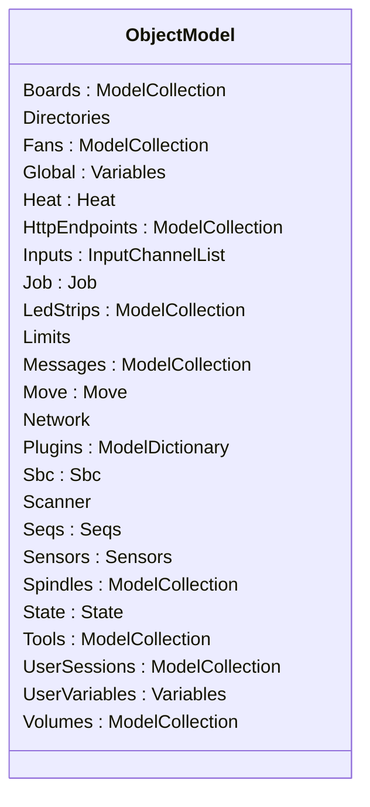
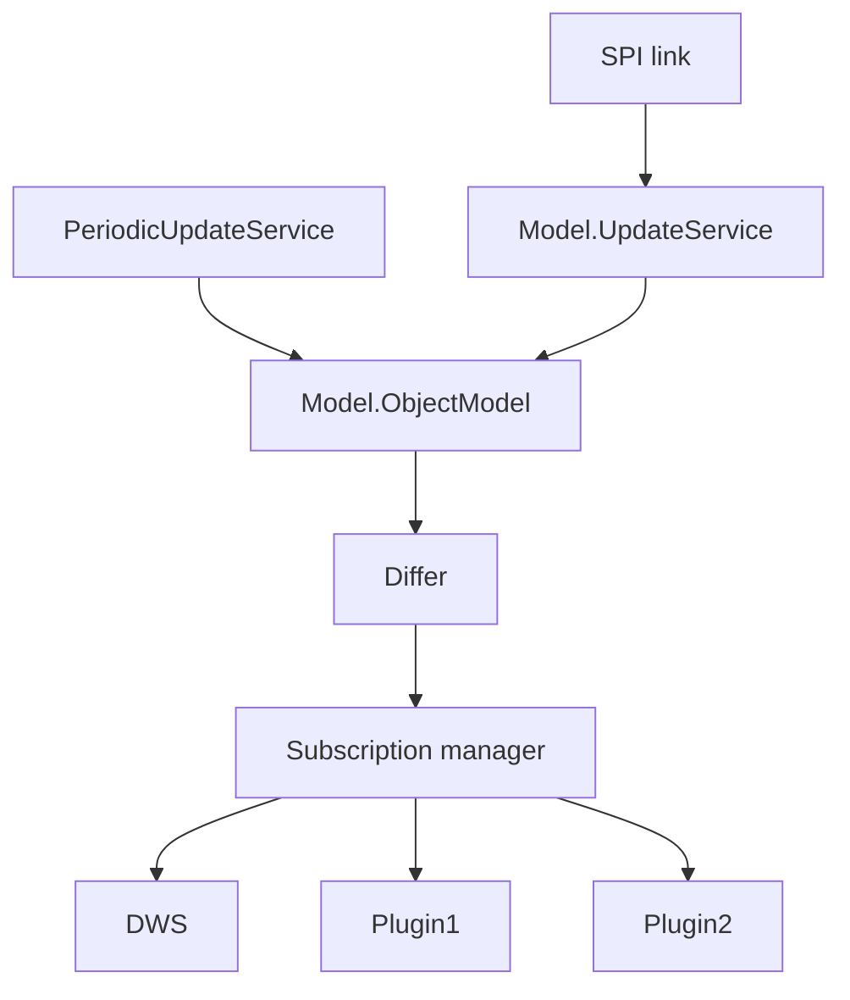
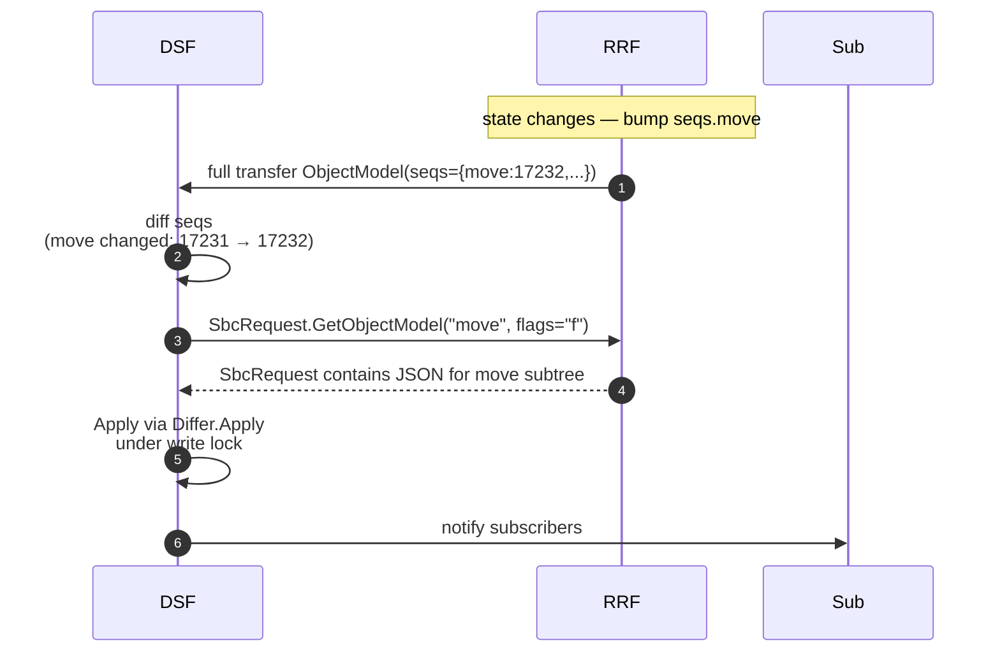
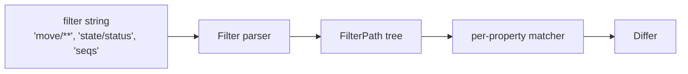
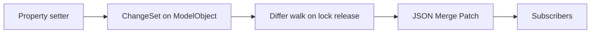

# Object Model (DSF side)

This document describes the DSF representation of the Object Model — how it is mirrored from RRF, how observers and subscribers consume it, and where the schema is defined.

The matching firmware-side document is [RepRapFirmware/docs/devel/OBJECT_MODEL.md](https://github.com/Duet3D/RepRapFirmware/blob/3.7-docker/docs/devel/OBJECT_MODEL.md). It is the source of truth — DSF replicates it; it does not invent any fields.

## 1. Where the schema lives

The C# class hierarchy in [`DuetAPI.ObjectModel`](../../src/DuetAPI/ObjectModel) mirrors the JSON shape produced by RRF's reflective serialiser. Every observable property in DSF/DWC has a typed property here.

Top-level shape:



Two notable additions over the RRF schema:

- **`sbc`** — DSF-specific subtree (DSF version, plugin support flag, etc).
- **`messages`**, **`userSessions`**, **`httpEndpoints`** — wholly owned by DSF.

The base classes `ModelObject`, `ModelCollection<T>`, `ModelDictionary<TValue>`, `Variables` provide change-tracking — every setter pushes into a per-instance change set used by the differ.

## 2. The DCS-side mirror

[`Model.ObjectModel`](../../src/DuetControlServer/Model/ObjectModel.cs) is the DCS-side **singleton** that holds the live model. It is wrapped by:

- **`LockManager`** — async read/write lock (multiple readers, exclusive writer).
- **`PeriodicUpdateService`** — fills in DSF-only fields (free RAM, cpu load, file system stats).
- **`UpdateService`** — applies the deltas pushed by RRF.



## 3. Sequence number protocol

The link between RRF and DSF is dominated by `seqs`. RRF's Object Model includes a small subtree:

```json
{
  "seqs": {
    "boards": 5, "fans": 1, "heat": 23, "move": 17231, "network": 0,
    "tools": 4, "global": 0, "sensors": 9, "state": 71, …
  }
}
```

Every full SPI transfer carries the latest `seqs`. DSF compares against the previous values and issues a `GetObjectModel` for every key whose number changed. This keeps SPI bandwidth proportional to *changes*, not to model size.



The `f` flag = "live fields only" — fields that are too expensive or too noisy to send every time but are interesting at high cadence (current axis position, queue depth, sensor readings, ...).

## 4. The Filter system

Subscribers can request a subset of the model via a filter expression — used both by the IPC `Subscribe` mode (per-client filter) and by DSF internally (e.g. DWS subscribes to nearly everything; PanelDue subscribes to a smaller set).



`Filter` ([Model/Filter.cs](../../src/DuetControlServer/Model/Filter.cs)) implements a path-based glob match. `**` recurses; `*` matches a single segment.

## 5. The Differ

When the model changes, DSF needs to deliver only what changed. The implementation is in [`Model/Observer/`](../../src/DuetControlServer/Model/Observer):



DSF maintains two delivery shapes:

- **Full** — the entire (filtered) object on every change. Simple, used for plugins that don't need patches.
- **Patch** — RFC 7396 JSON Merge Patch. Bandwidth-efficient, used by DWC over the WebSocket.

## 6. Locking

All access to `Model.ObjectModel` goes through `LockManager.LockAsync` (read or write). Writers may upgrade across `await` boundaries — the lock is fully async-aware.

Idiomatic DSF code:

```csharp
await using (await Provider.AccessReadOnlyAsync())
{
    var status = Provider.Get.State.Status;
    // …
}

await using (await Provider.AccessReadWriteAsync())
{
    Provider.Get.State.MachineMode = MachineMode.FFF;
    // setter pushes into ChangeSet; Differ runs on lock release
}
```

External processes can take the OM lock too via the IPC `LockObjectModel` / `UnlockObjectModel` commands — useful when a plugin needs an atomic read-modify-write sequence. Holding the lock blocks the SPI applier, so it should be brief.

## 7. Subscription manager

For each subscriber connected via IPC `Subscribe`:

1. Send the initial filtered snapshot.
2. After every model change, compute a patch (or full subtree) under the read lock.
3. Send it to the subscriber's queue.
4. Wait for an ack frame (any non-empty JSON) before sending the next.

The ack flow gives backpressure — a slow consumer can't make DSF queue infinite patches.

## 8. M409 in DSF mode

When a `M409` reaches the DSF code pipeline's `ProcessInternally` stage:

- DSF answers from its local mirror (no SPI round-trip).
- The reply is identical to what RRF would have produced for the same key/flags.

This is what makes `M409 K"…"` cheap inside DSF — it's a memory walk, not a firmware request.

## 9. Adding a field

To add a new field to the model end-to-end:

1. Add the C++ side in RRF — descriptor entry in the appropriate object's `objectModelTable` (see [RepRapFirmware/docs/devel/OBJECT_MODEL.md#10-adding-a-field](https://github.com/Duet3D/RepRapFirmware/blob/3.7-docker/docs/devel/OBJECT_MODEL.md#10-adding-a-field)).
2. Add the matching property to the C# class in [`DuetAPI.ObjectModel`](../../src/DuetAPI/ObjectModel). Use `[ObsoleteAttribute]` if it replaces an old one.
3. The source generator in `DuetAPI.SourceGenerators` will produce the JSON serialisation boilerplate — rebuild.
4. If your field is in a new subtree, ensure `Seqs` knows about it on both sides.
5. Update DWC if the field needs to be displayed.

## 10. Where this connects to the rest of the system

- The wire protocol carrying patches — [SPI_LINK.md](SPI_LINK.md).
- The IPC subscribe mode — [IPC_PROTOCOL.md](IPC_PROTOCOL.md).
- The RRF-side schema — [RepRapFirmware/docs/devel/OBJECT_MODEL.md](https://github.com/Duet3D/RepRapFirmware/blob/3.7-docker/docs/devel/OBJECT_MODEL.md).
- DWS reads the model via `ModelObserver`, see [HTTP_API.md](HTTP_API.md).
