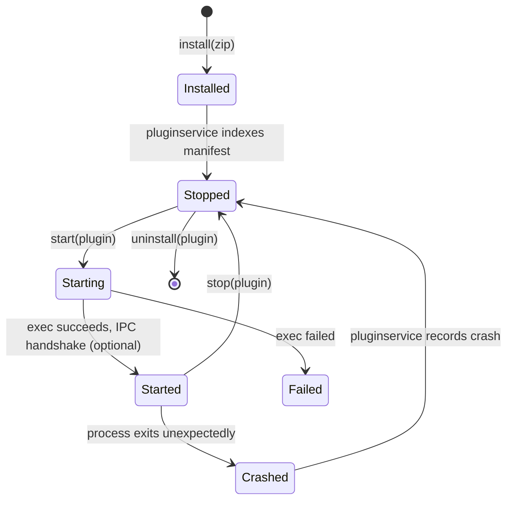
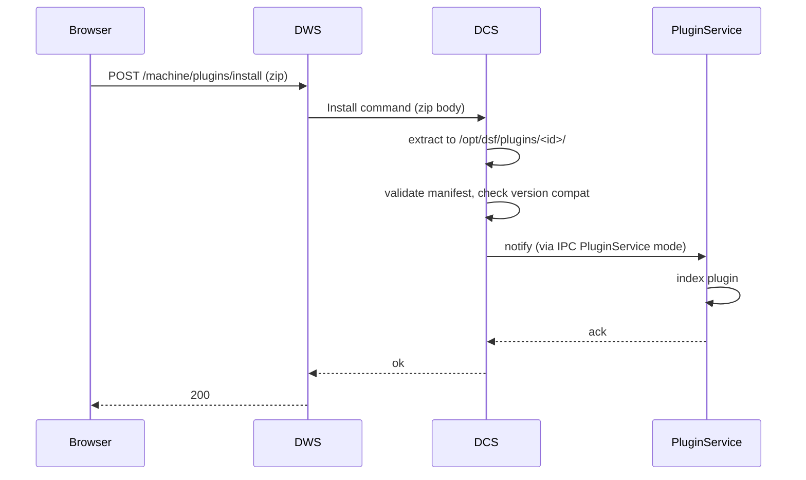

# Plugins

This document describes the plugin system in DSF — what a plugin is, how it is installed, started, and stopped, what privileges it has, and how it reaches into the rest of the system.

End-user / authoring documentation lives in [PLUGINS.md](../../PLUGINS.md) at the repo root. This file is the developer-side picture.

## 1. Process model

There are two `DuetPluginService` daemons on a DuetPi-style install:

| Service | systemd unit | User | Purpose |
|---|---|---|---|
| `duetpluginservice@dsf` | regular | `dsf` | Default home for plugins. Runs everything that doesn't ask for elevated privileges. |
| `duetpluginservice@root` | special | `root` | Runs plugins that explicitly require root (`SbcPermissionLevel.SuperUser`) — typically only `DuetPiManagementPlugin`. |

```mermaid
flowchart LR
    DCS --- IPC[(/var/run/dsf/dcs.sock)]
    DPS_root[DuetPluginService@root] -- IPC PluginService mode --> IPC
    DPS_dsf[DuetPluginService@dsf] -- IPC PluginService mode --> IPC
    DPS_root --> P_root[Root-needed plugin process]
    DPS_dsf --> P1[Plugin A process]
    DPS_dsf --> P2[Plugin B process]
    P1 -- IPC Command/Intercept --> IPC
    P2 -- IPC Command/Intercept --> IPC
```

Plugins themselves do not see DCS through the plugin services — they connect directly to the IPC socket using one of the public `ConnectionMode`s ([IPC_PROTOCOL.md](IPC_PROTOCOL.md)). The plugin services only manage the **plugin processes themselves** (start, stop, kill, sandbox).

## 2. Plugin manifest

Every plugin has a `plugin.json` ([`Plugin`](../../src/DuetAPI/ObjectModel/Plugins/Plugin.cs) class) that declares:

- Identity — `id`, `name`, `version`, `author`.
- Compatibility — `dwcVersion`, `rrfVersion`, `dsfVersion`.
- Code — `dwcFiles[]`, `dsfFiles[]`, `data{}`, `pid`.
- Runtime — `sbcExecutable`, `sbcExecutableArguments`, `sbcOutputRedirected`.
- Privileges — `sbcPermissions[]` (e.g. `commandExecution`, `manageUserSessions`, `superUser`).

The manifest is the source of truth: DSF refuses to start a plugin whose declared `sbcPermissions` would exceed what the running plugin service can provide.

## 3. Lifecycle



Driven by:

- `Install`/`Start`/`Stop`/`Uninstall` IPC commands — accepted by the `Command` processor in DCS, dispatched to the relevant plugin service.
- `SetPluginData` — write into the plugin's `data{}` (object-model exposed) for cross-plugin / cross-page communication.

## 4. Permission model

`SbcPermission` is a flag enum on the manifest. Examples:

| Permission | Effect |
|---|---|
| `commandExecution` | Plugin may submit any G/M/T-code. |
| `codeInterceptionRead` / `codeInterceptionWrite` | Allow `Intercept` IPC mode at certain stages. |
| `manageHttpEndpoints` | Register custom HTTP endpoints. |
| `manageUserSessions` | Add/remove user sessions. |
| `objectModelRead` / `objectModelReadWrite` | Subscribe / write to model. |
| `readFilaments` / `writeFilaments` | Filament configuration. |
| `readGCodes` / `writeGCodes` | GCode files. |
| `readMacros` / `writeMacros` | Macros. |
| `readSystem` / `writeSystem` | sys/. |
| `superUser` | Plugin runs as root. Reserved. |

Permissions are enforced in two places:

- At plugin start — by the right plugin service, which sets up the sandbox before exec.
- At each IPC command — the Command processor checks `Connection.Permissions`.

## 5. Installing a plugin



The install path:

```
/opt/dsf/plugins/<id>/
├── plugin.json
├── dsf/                     ← DSF-side files
│   ├── plugin.bin (or plugin.js, plugin.py)
│   └── …
└── dwc/                     ← DWC-side files (UI bundle)
    └── *.js / *.css
```

## 6. Plugin data

`plugin.data{}` is a free-form key-value store on every plugin in the object model. Plugins can store cross-process state there and DWC can read/write it. Permissions on it are implicit — only the plugin itself + appropriately privileged sessions can write.

## 7. The DuetPiManagementPlugin

[`DuetPiManagementPlugin`](../../src/DuetPiManagementPlugin) is the bundled root-running plugin that translates DuetPi-specific M-codes into Linux configuration changes:

- `M587`, `M588`, `M589` — WiFi list / forget / configure (calls `nmcli`).
- `M552` — IP / hostname configuration.
- `M911`, `M918`, `M999`, etc. with DuetPi-specific routing.

It's a regular plugin in shape but lives in the root plugin service; it intercepts these M-codes via `InterceptionMode.Pre` and resolves them by shelling out to system commands.

## 8. Custom HTTP endpoints

A plugin can register an HTTP endpoint via the `AddHttpEndpoint` command. The endpoint is then visible at `/machine/{namespace}/{path}` and DWS forwards calls to the plugin process via a per-endpoint UDS. See [HTTP_API.md#5-custom-http-endpoints](HTTP_API.md#5-custom-http-endpoints).

## 9. Where this connects to the rest of the system

- IPC modes a plugin uses — [IPC_PROTOCOL.md](IPC_PROTOCOL.md).
- Code interception, the most common plugin path — [CODE_PIPELINE.md#6-plugin-interception](CODE_PIPELINE.md).
- HTTP endpoint relay — [HTTP_API.md](HTTP_API.md).
- For end-user plugin authoring documentation, see [../../PLUGINS.md](../../PLUGINS.md).
