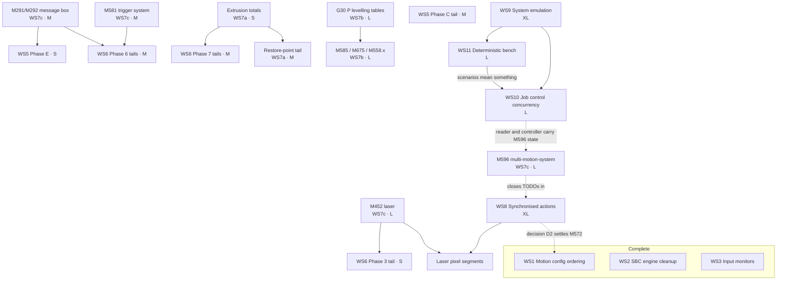

# Project overview: DSF architecture migration

A planning view of the work described in [docs/devel](README.md). It answers three questions and
deliberately no others: what is done, what is left and roughly how large it is, and what blocks what.
Technical detail (why a decision was taken, how a thing is built) stays in the plan it belongs to,
linked from each row.

**The programme.** The Duet firmware split its work between a Linux SBC running DuetSoftwareFramework
(DSF) and a Duet main board running RepRapFirmware (RRF), communicating over SPI. That split is being
removed: DSF takes over everything RRF did, `DuetCANMaster` becomes a thin SPI-to-CAN bridge, and the
expansion boards do the rest. In practice this means porting RepRapFirmware's G-code interpreter,
motion planner, heat, tool, and event subsystems into DuetControlServer, one subsystem at a time,
against the reference tree in `lib/RepRapFirmware`.

---

## 1. Status summary

| # | Workstream | Plan | Status | Tasks left | Blocked by |
|---|---|---|---|---|---|
| 1 | Motion config ordering | [MOTION_CONFIG_ORDERING.md](MOTION_CONFIG_ORDERING.md) | ✅ **Complete** | | |
| 2 | SBC motion engine cleanup | [SBC_MOTION_CLEANUP.md](SBC_MOTION_CLEANUP.md) | ✅ **Complete** | | |
| 3 | Input monitors | [INPUT_MONITORS.md](INPUT_MONITORS.md) | ✅ **Complete** | | |
| 4 | Stall detection | [STALL_DETECTION.md](STALL_DETECTION.md) | 🟢 8 of 9 phases | 1 × S | |
| 5 | Events migration | [EVENTS_MIGRATION.md](EVENTS_MIGRATION.md) | 🟢 4 of 5 phases | 1 × M, 1 × S | M291 (WS7) |
| 6 | Job lifecycle | [JOB_LIFECYCLE.md](JOB_LIFECYCLE.md) | 🟢 8 phases, 5 with tails | 2 × M, 6 × S | M291, M581, M452 (all WS7) |
| 7 | M-code / motion migration | [MCODE_MIGRATION.md](MCODE_MIGRATION.md) | 🟡 ~58% of inventory | 7 × L, 14 × M, 5 × S | see §3 |
| 8 | Synchronised actions | [MOTION_SYNCHRONISED_ACTIONS.md](MOTION_SYNCHRONISED_ACTIONS.md) | 🟡 stage 1 landed, verification 🔧 | 1 × M shared open, stage 2 (2 × L, 2 × M, 1 × S) | laser pixel data (§5) |
| 9 | System emulation test bench | [SYSTEM_EMULATION.md](SYSTEM_EMULATION.md) | 🟡 Stage 1 landed | 3 × L, 4 × M, 2 × S | |
| 10 | Job control concurrency | [JOB_CONTROL_CONCURRENCY.md](JOB_CONTROL_CONCURRENCY.md) | ⬜ not started | 1 × L, 2 × M, 1 × S | WS9 stage 1 (landed), WS11 steps 1 to 5 |
| 11 | Deterministic test bench | [DETERMINISTIC_BENCH.md](DETERMINISTIC_BENCH.md) | ⬜ not started | 1 × L, 4 × M, 2 × S | WS9 stage 1 (landed) |

Workstream 7 is the umbrella the others were carved out of, and is most of what remains. Workstream 8
is fully specified and independent; its groundwork and stage 1, deferral in the pipeline, are in,
and stage 2 promotes codes to timestamped dispatch, message type by message type.

**Reference documents, not work:** [DCS_INTERNALS.md](DCS_INTERNALS.md),
[HTTP_API.md](HTTP_API.md), and [SPI_LINK.md](SPI_LINK.md) describe the system as built and carry no
tasks.

### Effort key

Sizes are relative to each other, not calendar estimates, and are derived for this document by
reading each plan's scope; the plans themselves carry no sizing. They assume one engineer already
familiar with the tree. Convert them to a schedule against your own team's throughput rather than
reading a duration into them.

| | Meaning |
|---|---|
| **S** | A contained change: one seam, its test, done |
| **M** | Several files, or one small subsystem; a review's worth of surface |
| **L** | A subsystem port, or a change spanning DCS and one other codebase |
| **XL** | Too large to plan as one item; always decomposed into steps below |
| 🔧 | Needs verification on real hardware; schedule machine time |

The counts in §1 are the sum of the task tables in §3 and nothing else, so the two cannot disagree
without one of them being wrong. Workstream 7 dominates every count. Two items inside it, arcs and
the height-map / `G30 P` tables, are ports of RepRapFirmware subsystems whose size is known only
approximately until they start; they are the two most likely to grow.

---

## 2. Completed work

Recorded so the remaining list is read against what it sits on rather than as a fresh start.

| Workstream | Result |
|---|---|
| **Motion config ordering** (WS1) | Tuning values travel on each move instead of being pushed as shared configuration. Removes three unnecessary machine stalls (M425, M572, M593) and a class of defect where a setting applied retroactively to queued moves. |
| **SBC motion engine cleanup** (WS2) | The RepRapFirmware compatibility scaffolding is gone from the SBC motion engine. One deliberate omission: the lint CI job (§6.2) was dropped by decision. |
| **Input monitors** (WS3) | All five phases. Probes are told when they are probing, abandoned monitors release their pins, held input levels are cleared. The summary table at the head of that plan still shows ⬜ against every phase while the per-phase sections are all ✅; see §6. |
| **Stall detection** (WS4) | `M574 S3`/`S4` work: stop groups, the three stop actions, per-driver stall attribution, the motor-stall Z probe, and inputs already active when a move starts. |
| **Events migration** (WS5) | Variables and macro parameters; the event queue, processor, and all 13 event types; `M957`; the link-loss and reconnect events end to end. |
| **Job lifecycle** (WS6) | Pause, resume, cancel, and stop; the restore points; `pause.g`, `resume.g`, `stop.g`, `cancel.g`, `start.g`; the feedhold (a controlled deceleration replacing RRF's search for a sufficiently slow junction); job progress and time estimates. |
| **M-code migration** (WS7) | 109 of 187 in-scope M-codes fully ported. Motion, kinematics (all 7 geometries), compensation, probing, heat, fans, tools, and spindles are each essentially complete as subsystems. The G0/G1 audit's phases A to E, the endstop-correction move into DCS, and the kinematics ownership inversion have all landed. |

---

## 3. Remaining work

### WS4, stall detection

| Task | Size | Depends on |
|---|---|---|
| Phase 8: diagnostics counters and `M119` stall reporting | S | |

### WS5, events migration

| Task | Size | Depends on |
|---|---|---|
| Phase C tail: event numbering in the schema, deleting `DuetCANMaster`'s dead event queue, mapping a dropped CAN message back to its sender, example macros | M 🔧 | |
| Phase E: message box on a pausing event | S | **M291** (WS7) |

### WS6, job lifecycle

Five phases carry a named tail. None is large; three wait on a WS7 code.

| Task | Size | Depends on |
|---|---|---|
| Phase 3 tail: temperature-wait cancellation on stop | S | |
| Phase 3 tail: laser off on abort | S | **M452** (WS7) |
| Phase 4 tail: decide whether `M25.1` errors or stays an alias | S | decision, see §5 |
| Phase 5 tail: do not pause during a tool change | S | tool-change state tracking |
| Phase 6 tail: message box beside an event's pause | S | **M291** (WS7) |
| Phase 6 tail: `trigger<n>.g` and trigger 1's built-in pause | M | **M581** plain form (WS7) |
| Phase 7 tail: layer change detection, `job.layer`, `job.layers[]` | M | |
| Phase 7 tail: `job.rawExtrusion` for the filament time estimate | S | extrusion totals (WS7 §15.2) |

### WS7, M-code and motion migration

The largest workstream. It is not one queue: the four tracks below are largely independent of each
other and are the natural way to staff it.

#### 7a, motion pipeline gaps (G0/G1 audit, phase F)

| Task | Size | Depends on |
|---|---|---|
| Arc moves G2/G3, and resuming an arc part-way | L | |
| Coordinate rotation G68/G69 | M | |
| `G1 P` I/O bits; needs a field on the move and on the wire | M | |
| Extruder endstops (`G1 H1 E`) | M | |
| Restore-point tail: the `R` parameter and the virtual extruder position | M | extrusion totals |
| Axis scale factors (M579) in the transform | M | new object model field |
| M486 object cancellation, M597 collision checking, M599 keepout zones | L | new object model fields |
| Babystepping (M290) applied to already-queued moves | M | new native call |
| Publish real positions; `M114` and the object model report zeros today | S | |

The last row is small, unblocked, and user-visible: every position DuetWebControl displays is
currently zero.

#### 7b, probing and levelling

| Task | Size | Depends on |
|---|---|---|
| `G30 P`: probing into the bed levelling and mesh tables | L 🔧 | |
| M585, M675: probe against a workpiece | M 🔧 | `G30 P` |
| M558.1 / M558.2: scanning probe calibration | L 🔧 | probe read-back over CAN |

#### 7c, subsystem tails

| Task | Size | Depends on |
|---|---|---|
| Firmware retraction: M207, `G10` without P, `G11` | M | |
| Laser: M452 parameters, `M3` in laser mode, power on the move and on the wire, per-pixel segments | L 🔧 | per-segment hook (WS8) for pixel data |
| M291 / M292 message box | M | |
| M581 plain form and the pin-trigger system | M | |
| Filament codes M701 to M703 | M | filaments directory and macros |
| M200 volumetric extrusion, M404 / M407 filament width | M | reconcile one global width against per-extruder |
| Heat tail: M303 PID tuning (needs a state machine), M108, M144, M305, M309 | M | |
| Multi-motion-system: M595, M596, M597, M598, M599 | L | |
| Network tail: M540, M553, M554, M555, M575, M587 to M589 | M | |
| Miscellaneous tail: ~20 codes including M80/M81, M117, M150, M260/M261, M300, M905, M911/M916, M955/M956 | L | |

M596 is significant beyond its own row: three separate plans park a `// TODO` on it (the feedhold
stops only ring 0, `RawMove.OwnedDrives` is never set, and synchronised actions belong to one ring).
It is one task that closes gaps in three places.

#### 7d, audit findings that are code rather than documentation

Found by reading the plan back against the tree. Each is small and each is a live defect.

| Task | Size |
|---|---|
| The user-defined-code macro fallback (`sys/<code>.g`) is written but unreachable | S |
| `M98` does not pass its parameters | S |
| `M453 S` is silently ignored instead of erroring | S |
| Decide what `M21` / `M22` should mean when the volume is always mounted | S |

### WS8, synchronised actions

Performing an action at a point in the path without stopping the machine. Today a fan change or a
servo move mid-print either fires early or forces the machine to standstill. The plan chooses
implementation C, the code deferred in the pipeline, delivered in two stages (plan §8.6): stage 1
defers every code by move id and wakes it when its anchor retires, DuetControlServer only; stage 2
adds the timestamped transport and promotes codes to step-clock exactness message type by message
type. The shared groundwork lands first.

| Step | Task | Size | Notes |
|---|---|---|---|
| 1 | Declare which codes execute immediately and which defer, enforced in the pipeline | M | ✅ **Complete**: per-handler `CodeTable` rows, pipeline enforcement, macro-then-unsupported miss path; behaviour changes listed in §5.1 |
| 2 | Emergency-stop output handling in `Duet3Expansion` | M 🔧 | A live gap today: fans and GPIO survive an M112 until the board resets, and commands still execute in the pre-reset window. Does not gate stage 1; required before stage 2 parks commands on the boards |
| 3 | Write `state.macroRestarted` on macro re-run after a pause | S | ✅ **Complete**: the resume marks the job file's replayed command, macros inherit the mark, and it clears when the command finishes |
| S1 | `LastSubmittedMoveId`, the per-anchor wake on `MotionTracker`, the defer branch, the deferred set and pending predicates, purge cancellation | M | ✅ **Complete**: DCS only, wake covered by unit tests |
| S1 | Convert the deferred codes | M 🔧 | ✅ every code with a Deferred row is deferred (12 of the 16; M117/M144/M150/M300 wait on their handlers). Hardware verification outstanding |
| S2 | Schema: `whenToExecute`, the offset table, the drop broadcast | M | Regenerates both sides |
| S2 | Parked-command ring in `Duet3Expansion` | M | No behaviour change until something sends a future time |
| S2 | `SubmitAction` and anchor resolution in `DuetSbcInterface` | L | The mechanical core |
| S2 | The CANMaster reply-timeout field | S | |
| S2 | Promote the codes to timestamped dispatch | L 🔧 | Each a handler and table-row change; M106 first |

M572's standstill is no longer a WS8 step: the board applies pressure advance at message arrival, so
no stage makes a deferred push exact, and removing the wait is the plan's open
decision D2.

### WS9, system emulation test bench

Three stages, each a usable rig on its own: a scriptable fake controller first, then the real
DuetCANMaster firmware under Renode, then emulated expansion boards completing the chain. Stage 1
is landed: the socket transport, the fake endpoint and the `SystemTests` in-process host exist, and
the first scenarios cover boot, link recovery, motion and the pause/resume/cancel job lifecycle
against the real motion engine - which already surfaced and fixed three pause-path races in
`JobProcessor`, the job that ended before the moves it had queued were made, the dead
full-model-update wait that hung everything awaiting it (`M26` and `M27` among them), and four
defects in the stop path: a restore point taken from a position the machine never stopped at, a
resume running under the token the pause had cancelled, a stop that purged the ring but not the
moves already submitted to it, and a refused submission that put the planner back a whole queue of
moves behind where it belonged.

| Task | Size | Depends on |
|---|---|---|
| Stage 1: remaining scenarios (deferred codes, event pause, `MotionStopped`, resend) | M | |
| Stage 1: CI wiring for `SystemTests` and the host-built `libduet_sbc.so` | S | |
| Stage 2: MB6HC Renode platform and link peripheral for DuetCANMaster | L | the stage 1 framing |
| Stage 2: device-side socket transport in `DataTransfer` | M | the stage 1 framing |
| Stage 2: Bosch M_CAN peripheral model | L | |
| Stage 2: stub Duet3Expansion machine and the NUnit control channel | M | the M_CAN model |
| Stage 3: SAME51 EXP3HC Renode platform | L | the M_CAN model |
| Stage 3: multi-board identities and `CANHub` wiring | S | the EXP3HC platform |
| Stage 3: Robot Framework scenarios and CI wiring | M | |

The SAMC21 tool-board platform is in the plan but deferred until the EXP3HC platform has proven the
approach, so it is not counted here.

### WS10, job control concurrency

The pause, resume and stop paths of WS6 work, and the stepped pause sweep in `SystemTests` shows
they do not work from every stopping point: the file reader, the pause sequence and the motion
thread each act on the job's state in their own lock windows. The nineteen races catalogued in
[JOB_CONTROL_CONCURRENCY.md](JOB_CONTROL_CONCURRENCY.md) §5 come from that structure rather than
from any one line, so `JobProcessor` is replaced by a job actor written new: one task owns the
state, the reader is driven by commands and owns the only token the read-ahead is cancelled with,
and the resume point comes from the move the engine says survives. The sweep is the acceptance test.

| Task | Size | Depends on |
|---|---|---|
| The scenarios of §7.12, written against the current tree | M | WS11 steps 1 to 5 |
| ~~Motion prerequisites: ids above the survivor failed by one sweep, standstill as a comparison, the purge generation captured at handler entry, the move index noting macro moves and kept across a pause~~ done | M | |
| ~~`JobController`, `JobReader` and the sequences, written whole, the dispatch barrier a boundary pause freezes at, the cut-over that deletes `JobProcessor`, and every document that names it, in one commit~~ done; the stepped sweep is still owed as its acceptance test | L | the two above |
| The removals the cut-over makes dead: the queue-retry loop and the feed-rate conversion into one helper each | S | the cut-over |

### WS11, deterministic test bench

The stage 1 bench runs the whole stack, but its results are not a function of the scenario and its
suite is too slow to run while working: the stepped timeline buys progress with a millisecond of
real time per step, so how far the software gets is a property of the host's scheduler. The same
sweep, same binary, fails at different pause points on every run, and the two sweeps take a minute
each. [DETERMINISTIC_BENCH.md](DETERMINISTIC_BENCH.md) replaces the sleep with a settle: one clock
that everything reads, native threads pumped rather than run, and the timeline advanced only when
nothing is runnable. The same change removes the dwell that is most of the runtime.

| Task | Size | Depends on |
|---|---|---|
| `TimeProvider` through DuetControlServer and the bench, the pinned clock over the whole native side | M | |
| `DuetSbc_StepMotion` and `DuetSbc_StepLink`, the fake controller pumped by the test | S | |
| `Settle()` replacing the dwell, with quiescence on the managed side | M | the two above |
| Every scenario onto the timeline, `FreeRunningClock` deleted, a bench profile that starts fewer services | M | the settle |
| `scripts/test.sh`, sharding across processes, the per-test budget and the slow-count guard | S | the settle |
| The single-threaded scheduler for DCS's tasks, then `IBenchGate` and the interleaving scenarios | L | the settle |
| `StepTimer` state per handle, for in-process parallelism | M | |

---

## 4. Dependencies and sequencing

`WS5 Phase C tail` has no incoming edge because nothing blocks it. `WS9` gates `WS10` and `WS11`:
its stepped pause sweep, which stage 1 landed, is the acceptance test for the concurrency work, and
while its rig also verifies WS6 and WS8 behaviour that is otherwise 🔧, it gates nothing else.
`WS11` gates `WS10` for a narrower reason: the sweep fails at different pause points on every run
today, so the concurrency work cannot be judged by it until the bench's results are a function of
the scenario. Its first five tasks are what that needs; the scheduler and the gates are not on the
critical path.

**Five tracks can run in parallel immediately:**

| Track | Contents | Why it is independent |
|---|---|---|
| **A, synchronised actions** | All of WS8 | Nothing blocks it: the shared groundwork and stage 1 are DCS-only. Stage 2 touches the CAN schema and expansion firmware, so it overlaps least with the others |
| **B, unblocking codes** | M291, M581, M452, M596 | Four codes that between them release every blocked tail in WS5, WS6, and parts of WS7 |
| **C, motion pipeline** | WS7a, plus WS4 phase 8 | Self-contained DCS work; arcs are the longest item |
| **D, probing and levelling** | WS7b | Needs machine time; `G30 P` gates the other two |
| **E, system emulation** | WS9 stage 1 | New code only: a transport, a fake endpoint and a test project. Its rig then verifies the 🔧 items the other tracks produce |

**Start with these regardless of staffing:** the four WS7d audit findings and the `M114` / object
model position publishing. All are S, all are live defects, and one of them (positions reporting
zero) is visible to every user of the web interface.

**Track B is the sequencing decision with the most effect on the rest.** M291 alone unblocks three
tails across two workstreams, and M596 closes parked TODOs in three plans. Staffing track B early
shortens everything downstream of it.

---

## 5. Open decisions and risks

Items where the plans stop short of an answer and someone has to decide.

| | Decision | Owner needed | Impact if left |
|---|---|---|---|
| 1 | Should `M25.1` error, or stay an alias for `M25`? | Product | One line either way; a fraction is silently accepted today |
| 2 | What should `M21` / `M22` mean when the SD volume is always mounted? | Product | Asymmetric behaviour: `M22` refuses, `M21` succeeds |
| 3 | Nominal filament width: one global value (RRF) or one per extruder (object model)? | Engineering | Blocks M200, M404, and M407 |
| 4 | Firmware emulation mode (M555): global, or per input channel? | Engineering | Blocks M555 |
| 5 | What should detect an expansion board that lost its input monitors? | Engineering | A board that resets mid-job silently loses its endstops |
| 6 | Watchdog timing for the board sweep now that it runs on the SBC | Engineering | A board may be wrongly timed out just after a reconnect |
| 7 | Do per-pixel laser segments need WS8's action timeline, or does pixel data ride the move record? (WS8 decision D1) | Engineering | If pixel data needs per-segment actions, it needs WS8 stage 2, with the parked ring sized for segment rate |

**Risks**

- **Hardware verification is a shared bottleneck.** Six tasks across three workstreams are marked 🔧
  and each needs a real machine. Schedule them as a batch rather than per task.
- **WS8's stage 2 spans four codebases plus the CAN schema**; the shared groundwork and stage 1 are
  DCS-only. The shared steps 1 to 3 are behaviour-neutral and land first; the emergency-stop output
  handling must land before stage 2 parks commands on the boards. Preserve that ordering.
- **Status drift in the plans.** Two instances found while writing this: WS3's summary table
  contradicts its own phase sections, and WS7's group totals had gone stale before they were
  recounted. A status that reads ✅ wrongly is the expensive direction, because it is discovered at
  the machine.
- **Two RepRapFirmware refinements are deliberately not being ported** (hangprinter line buildup and
  flex compensation) because nothing in the object model can express them. Recorded so it reads as a
  decision rather than an omission.

---

## 6. Maintaining this document

This is a rollup. It holds no fact of its own; every number in it is derived from a plan in this
directory. When a phase is ticked in its own plan, update the row here in the same commit. If the two
disagree, the plan is correct, and the plan should be trusted over any status table including its
own summary. That is how WS3 came to show five ⬜ phases that had all landed.
