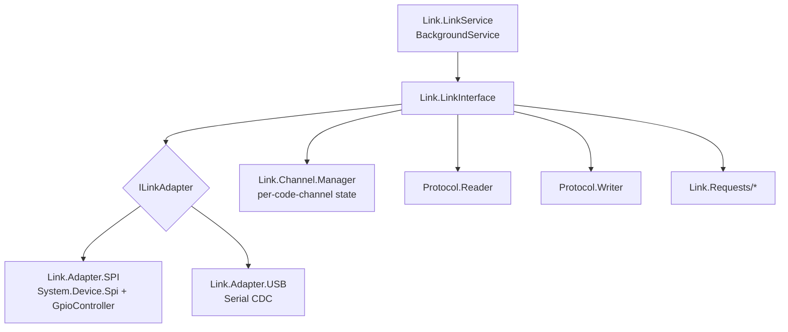
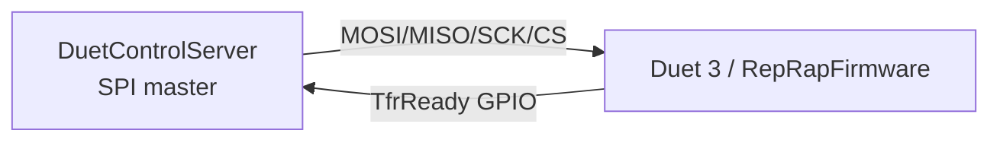
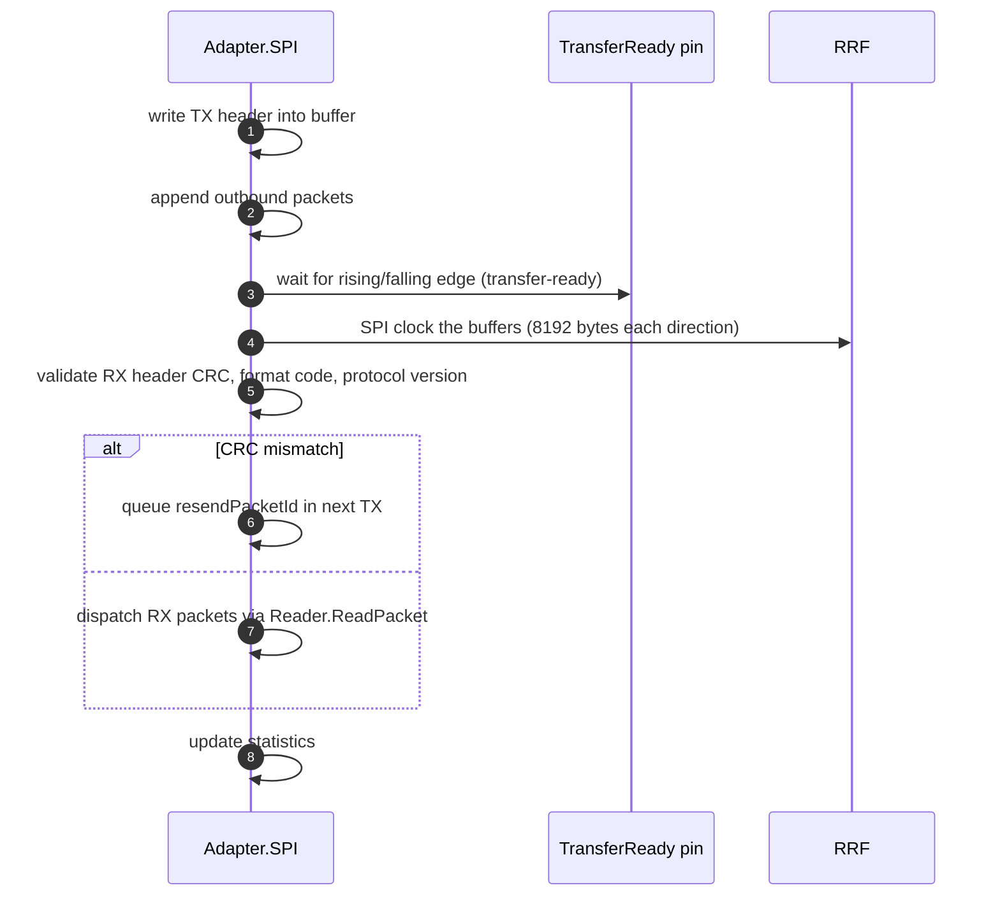
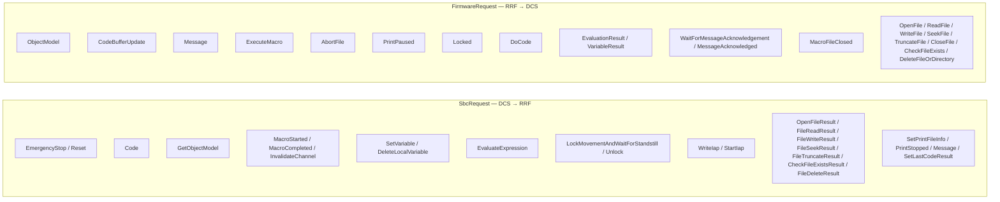
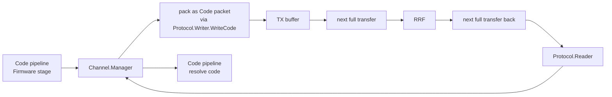
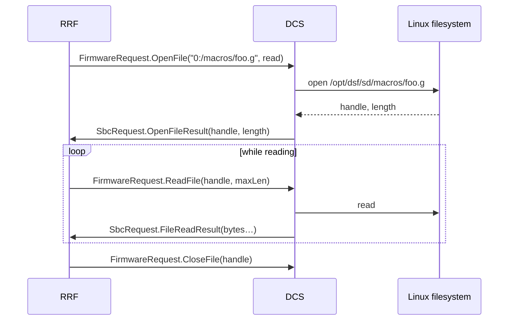
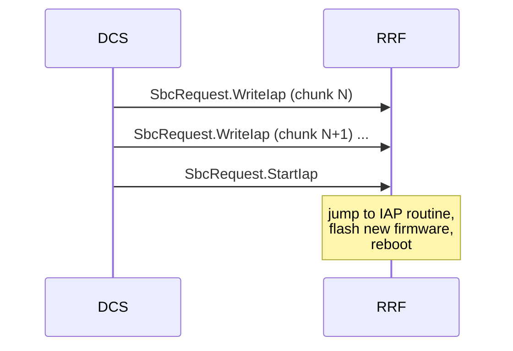

# SPI Link to RepRapFirmware

This is the DSF-side description of the SPI link to the Duet main board. It is the mirror of [RepRapFirmware/docs/devel/SBC_INTERFACE.md](https://github.com/Duet3D/RepRapFirmware/blob/3.7-docker/docs/devel/SBC_INTERFACE.md), describing the same protocol from the master side.

## 1. Component layout



| Class | Path |
|---|---|
| `LinkService` | [src/DuetControlServer/Link/LinkService.cs](../../src/DuetControlServer/Link/LinkService.cs) |
| `LinkInterface` | [src/DuetControlServer/Link/LinkInterface.cs](../../src/DuetControlServer/Link/LinkInterface.cs) |
| `Adapter.SPI` | [src/DuetControlServer/Link/Adapter/SPI.cs](../../src/DuetControlServer/Link/Adapter/SPI.cs) |
| `Adapter.USB` | [src/DuetControlServer/Link/Adapter/USB.cs](../../src/DuetControlServer/Link/Adapter/USB.cs) |
| `Channel.Manager` | [src/DuetControlServer/Link/Channel/Manager.cs](../../src/DuetControlServer/Link/Channel/Manager.cs) |
| Protocol structs | [src/DuetControlServer/Link/Protocol/](../../src/DuetControlServer/Link/Protocol) |

## 2. Physical link



- SPI device — `Settings.SpiDevice`, default `/dev/spidev0.0`.
- TransferReady GPIO — `Settings.TransferReadyPin` on `Settings.GpioChipDevice` (`/dev/gpiochip0`). RRF toggles this pin when it has data ready, and the SBC waits on a libgpiod callback (`RegisterCallbackForPinValueChangedEvent` in [SPI.cs](../../src/DuetControlServer/Link/Adapter/SPI.cs)).
- Clock frequency — `Settings.SpiFrequency`, typically 22 MHz for the Pi.

## 3. Framing

A *full transfer* is a fixed-size SPI exchange of `SbcBufferSize` bytes (default **8192**) in each direction. Both sides put a **`TransferHeader`** at offset 0, followed by zero or more **packets** with their own headers. The buffer size **must** match RRF's `SbcTransferBufferSize`.

```cpp
// shared with RRF (SbcMessageFormats.h)
struct TransferHeader {
    byte  formatCode;        // 0x5F SBC mode, 0x60 standalone, 0xC9 invalid
    byte  numPackets;
    ushort protocolVersion;  // currently 7
    ushort sequenceNumber;
    ushort dataLength;
    uint   crcData;
    uint   crcHeader;
};

struct PacketHeader {
    ushort request;          // FirmwareRequest or SbcRequest enum
    ushort id;
    ushort length;
    ushort resendPacketId;
};
```

C# representations are in [Protocol/Shared/](../../src/DuetControlServer/Link/Protocol/Shared) — they use `[StructLayout(LayoutKind.Sequential)]` so they marshal byte-identically to the C structs.

## 4. The transfer state machine

`Adapter.SPI.PerformFullTransfer` ([SPI.cs](../../src/DuetControlServer/Link/Adapter/SPI.cs)) implements one round trip:



`LinkInterface.Run` is the outer loop: connect → repeatedly run `PerformFullTransfer` → on disconnect, attempt reconnect. The link is stateful; counters of full transfers, codes, max RX/TX size, max delay are exposed via the IDiagnostics interface.

## 5. Packet types

The two enums in [`Protocol/Shared/Consts.cs`](../../src/DuetControlServer/Link/Protocol/Shared/Consts.cs) and the typed headers in [`SbcRequests/`](../../src/DuetControlServer/Link/Protocol/SbcRequests) and [`FirmwareRequests/`](../../src/DuetControlServer/Link/Protocol/FirmwareRequests) define every payload:



The full enum lists are at [`Consts.cs`](../../src/DuetControlServer/Link/Protocol/Shared/Consts.cs).

## 6. Channel manager — code routing

Every outbound code or macro action is associated with a `CodeChannel`. The [`Channel.Manager`](../../src/DuetControlServer/Link/Channel/Manager.cs) keeps a per-channel **`StackState`** that mirrors RRF's `GCodeMachineState` chain so DSF and RRF stay in lockstep about macro depth, conditional state, locks, etc.



`StackState` tracks: code buffer space available on RRF for that channel (so DSF doesn't overrun), macro depth, files open, conditional execution state, lock ownership.

## 7. File proxy

Because RRF in SBC mode has no file system, every file operation it performs is proxied to DSF. RRF emits `FirmwareRequest.OpenFile` / `ReadFile` / `WriteFile` / etc.; DSF resolves the path through [`FilePathResolver`](../../src/DuetControlServer/Files/FilePathResolver.cs), opens / reads / writes the host file, and replies with the matching `SbcRequest.*Result` packet. See [FILES.md](FILES.md).



## 8. Macro execution

When a code on the SBC channel runs `M98 P"foo.g"`, RRF issues `FirmwareRequest.ExecuteMacro` with the file name and the channel. DSF opens the file, parses the codes, and streams them as `SbcRequest.Code` packets — marked as macro codes — into the same channel. When the macro file ends, DSF emits `SbcRequest.MacroCompleted`.

This indirection means *all* file-backed G-code execution (jobs, macros, triggers, daemon, autopause, dsf-config.g) goes through DSF.

## 9. Object Model replication

`FirmwareRequest.ObjectModel` carries a JSON subtree from RRF; DSF deserialises it via the typed model in [`DuetAPI.ObjectModel`](../../src/DuetAPI/ObjectModel) and merges it into [`Model.ObjectModel`](../../src/DuetControlServer/Model/ObjectModel.cs). DSF requests subtrees with `SbcRequest.GetObjectModel` (key + flags exactly as `M409`).

The `seqs` subtree is the polling key — RRF pushes it every transfer, DSF watches for changed numbers, and only requests subtrees whose sequence number changed. See [OBJECT_MODEL.md](OBJECT_MODEL.md).

## 10. IAP — firmware update over SPI

`DuetControlServer --update` flashes the bundled `Duet3Firmware_<board>.bin` over the link:



DSF holds another DCS instance off via a lock file so the update can run on a live system without conflicting with the running daemon.

## 11. USB transport

The same packet types can travel over a USB CDC link instead of SPI on supported boards. `Adapter.USB` handles framing using `UsbTransferHeader` (no transfer-ready pin); the higher-level pipeline is unchanged. Selected by `M576`.

## 12. Diagnostics

`SPI.Diagnostics` reports:

- Full transfers / second.
- Codes / second.
- Max RX size / TX size in the last interval.
- Max wait for the transfer-ready pin.
- Number of disconnects / timeouts / pin glitches.

Useful for tuning `SbcTransferDelay`, diagnosing SBC-side scheduling jitter, or chasing electrically-noisy hardware.

## 13. Where this connects to the rest of the system

- Firmware-side mirror — [RepRapFirmware/docs/devel/SBC_INTERFACE.md](https://github.com/Duet3D/RepRapFirmware/blob/3.7-docker/docs/devel/SBC_INTERFACE.md).
- Code routing through this link — [CODE_PIPELINE.md](CODE_PIPELINE.md).
- Path resolution feeding the file proxy — [FILES.md](FILES.md).
- Object Model merging — [OBJECT_MODEL.md](OBJECT_MODEL.md).
