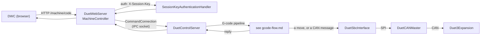

# Components

DSF is a collection of processes and libraries under `src/`. This article is a reference for each one.
For how they fit together, see the [architecture overview](intro.md#high-level-architecture).

## Core components

Two of these are processes on the SBC, one is a library inside DCS, and two are firmware on the
boards. They are grouped together because between them they are the machine.

### DuetControlServer

`src/DuetControlServer/` - the heart of DSF, and the machine controller. A long-running service that:

- owns the global [object model](object-model.md) and its read/write locking,
- runs the [G-code pipeline](gcode-flow.md) (intake, interception, internal processing),
- interprets every G/M/T-code itself, including motion, heaters, tools and probing,
- decides what each move means and hands it to the motion planner in
  [DuetSbcInterface](#duetsbcinterface),
- composes the [CAN messages](can-messages.md) that configure and drive the expansion boards,
- maps virtual SD paths to the Linux filesystem and parses G-code [file info](file-management.md),
- hosts the [IPC server](ipc.md) that every other process connects to.

Command-line options, return codes, and the link/IPC details are documented in the repository
`README.md`. The bulk of this documentation set describes DCS internals.

### DuetSbcInterface

`src/DuetSbcInterface/` - a native shared library (`libduet_sbc.so`) loaded into the DCS process,
built from C++ ported from RepRapFirmware. It holds the work that has to keep real time or has to
evaluate a motion profile:

- the **motion engine** - `MoveBuilder`'s output becomes a `DDA` in a ring, look-ahead and speed
  matching run over it, and each move becomes a per-drive segment chain,
- the **drive trackers**, which can say where any drive was at any instant - what the endstop
  wind-back is computed from ([Endstops](endstops.md)),
- the **step-clock model**, a linear fit of the controller's clock onto `CLOCK_MONOTONIC`, because
  moves are scheduled by absolute start time in the controller's timebase,
- the **SPI transfer loop** to DuetCANMaster ([Firmware link](firmware-link.md),
  [SPI transfer state machine](spi-state-machine.md)).

DCS calls into it through `Link/Native/NativeLink.cs` and receives events back through a ring buffer.
Nothing in it decides what a code means; it is handed moves and messages and reports what became of
them.

### DuetCANMaster and Duet3Expansion

`src/DuetCANMaster/` runs on the Duet 3 mainboard and `src/Duet3Expansion/` on each expansion board.
Neither is part of the .NET solution; both are cross-compiled firmware, built by
`./scripts/build.sh` alongside the rest.

- **DuetCANMaster** bridges the SPI link to the CAN bus. It carries one piece of machine knowledge and
  no more: which input stops which driver, so a move can be cut short in time
  ([Endstops](endstops.md)). Everything else it receives, it forwards.
- **Duet3Expansion** owns the pins and the drivers - it generates the steps, watches the inputs,
  drives the heaters and fans, and reports temperatures, driver status and input changes back over
  CAN.

### DuetWebServer

`src/DuetWebServer/` - an ASP.NET Core application that serves DuetWebControl (DWC) and the HTTP API.
It holds no machine state of its own; every request is proxied to DCS over the
[IPC socket](ipc.md) via [DuetAPIClient](#duetapiclient).

- **Controllers** (`Controllers/`):
  - `MachineController` - the `/machine/*` REST API (connect, disconnect, code execution, object-model
    queries, file upload/download/move/delete).
  - `RepRapFirmwareController` - the legacy RRF-compatible `rr_*` endpoints (`rr_connect`,
    `rr_disconnect`, ...), reporting `isEmulated=true` so clients know this is the SBC.
  - `WebSocketController` - upgrades `WS /machine` to a WebSocket and streams
    [object-model patches](object-model.md#observing-changes-and-patches) from a DCS subscribe
    connection.
- **Authentication** (`Authorization/`): `SessionKeyAuthenticationHandler` reads the `X-Session-Key`
  header (falling back to the client IP), and `Policies` defines the `ReadOnly` / `ReadWrite` access
  levels. Sessions live in the `SessionStorage` singleton; `SessionExpiry` reaps stale ones.
- **Middleware** (`Middleware/`): `CustomEndpointMiddleware` forwards requests that match a
  plugin-registered [HTTP endpoint](plugins.md) to the owning plugin; `FallbackMiddleware` serves
  `index.html` for client-side routes; `FixContentTypeMiddleware` normalises MIME types.
- **ModelObserver** (`Services/ModelObserver.cs`): a background subscribe connection to DCS that keeps
  the web directory path, CORS origins, and the registered HTTP-endpoint table in sync.

See [Components: HTTP request flow](#http-request-flow) below and the
[IPC article](ipc.md) for the connection mechanics.

### DuetPluginService

`src/DuetPluginService/` - manages the lifecycle and sandboxing of [plugins](plugins.md). It runs as
two systemd instances: a non-root one for ordinary plugins and a root one (disabled by default) for
plugins that declare the `SuperUser` permission. It reads plugin manifests, spawns plugin processes
for the right CPU architecture, and generates per-plugin AppArmor profiles. DCS talks to it over a
dedicated [`PluginService` IPC connection](ipc.md#connection-modes). Full detail in
[Plugins](plugins.md).

## Client libraries

### DuetAPI

`src/DuetAPI/` - the shared contract used by every process. It contains:

- the [`Code`](gcode-flow.md#the-code-object), `CodeParameter`, and `CodeChannel` types and the code
  parser,
- the [object model](object-model.md) definition (`ObjectModel/`),
- the command set (`Commands/`) and connection types (`Connection/`),
- the [`SbcPermissions`](plugins.md#permissions) flags and `RequiredPermissionsAttribute`.

A companion source generator, `src/DuetAPI.SourceGenerators/`, emits the fast JSON update / assign
code for the object model (see [Object model: serialization](object-model.md#json-serialization)).

### DuetAPIClient

`src/DuetAPIClient/` - the .NET client for the DCS [IPC socket](ipc.md). `BaseConnection` handles the
socket, the init handshake, and the JSON command/response protocol; the concrete connection classes
map one-to-one to the [connection modes](ipc.md#connection-modes):

| Class | Mode | Purpose |
| --- | --- | --- |
| `CommandConnection` | Command | Run commands and codes, query/patch the model |
| `InterceptConnection` | Intercept | Plugin code hooks (resolve/cancel/ignore/rewrite) |
| `SubscribeConnection` | Subscribe | Receive the model and its patches |
| `CodeStreamConnection` | CodeStream | Stream newline-delimited codes on a channel |
| `HttpEndpointConnection` | (helper) | Serve a plugin HTTP endpoint |

### DuetHttpClient

`src/DuetHttpClient/` - a client for talking to a Duet over **HTTP** rather than the IPC socket, so it
works against both standalone firmware and an SBC. `DuetHttpSession.ConnectAsync` tries a
`PollConnector` (legacy `rr_*` polling, used for standalone firmware) and falls back to a
`RestConnector` (the `/machine/*` REST API plus an optional model WebSocket, used for SBC mode). It
keeps a local [`ObjectModel`](object-model.md) in sync and exposes code execution and file operations.
`DuetHttpOptions` tunes passwords, timeouts, polling intervals, and keep-alive.

## Command-line tools and example plugins

These small executables under `src/` are utilities and references. Most connect to DCS through
[DuetAPIClient](#duetapiclient).

| Tool | Audience | What it does |
| --- | --- | --- |
| `CodeConsole` | End user / debugging | Interactive code console; `-c` runs a single code and exits |
| `CodeLogger` | Developer | Logs intercepted codes at the Pre/Post/Executed stages, with channel and type filters |
| `CodeStream` | Integrator | Reads codes from stdin, streams them to a channel, prints replies |
| `ModelObserver` | Developer | Streams live [object-model](object-model.md) changes as JSON, with an optional filter |
| `PluginManager` | Administrator | CLI for the [plugin](plugins.md) lifecycle (list/install/start/stop/uninstall/set-data) |
| `CustomHttpEndpoint` | Developer | Example plugin that registers a custom HTTP / WebSocket endpoint |
| `DuetPiManagementPlugin` | Built-in plugin | Implements DuetPi system M-codes (networking, RTC, firmware update) by intercepting codes on their way through the pipeline |

`CodeLogger` and `CustomHttpEndpoint` are the canonical references for writing an interception plugin
and an HTTP-endpoint plugin respectively.

## HTTP request flow

How a request from the browser reaches the machine, end to end:

The reply does not wait on the hardware unless the code says it must: a handler resolves the code
when it has done its work, and codes that have to see the machine stop first say so by flushing and
waiting for standstill.

For the WebSocket model-subscription path and the plugin HTTP-endpoint path, see
[Object model](object-model.md#observing-changes-and-patches) and [Plugins](plugins.md).
