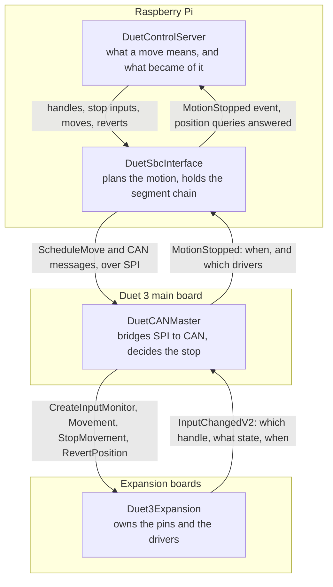
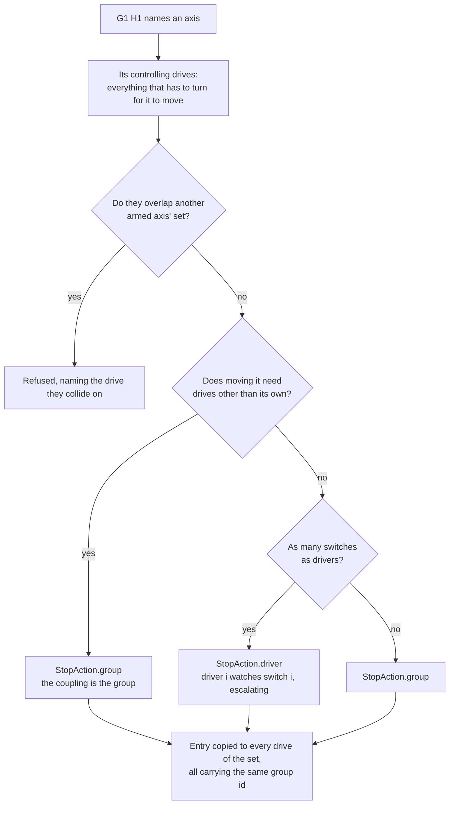
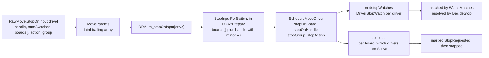
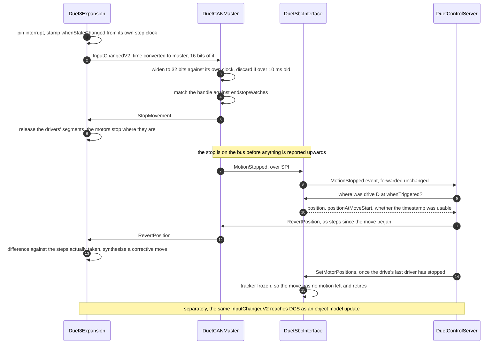
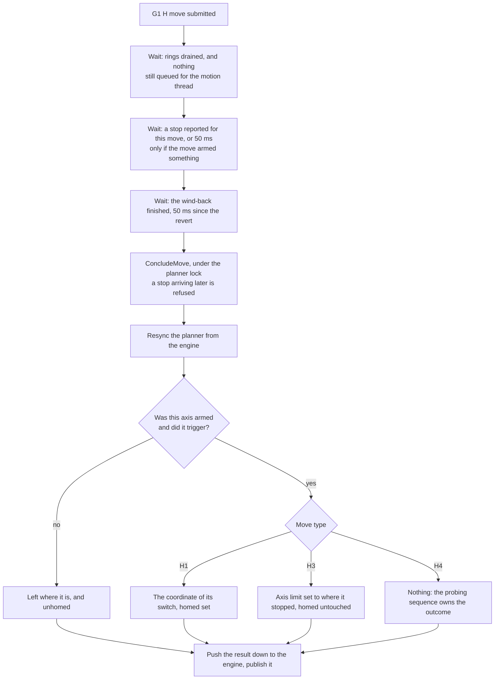

# Endstops: stopping a move short, across four programs

What happens between a switch closing and the machine believing it is somewhere, and which of the
four programs is responsible for each part of it.

RepRapFirmware does all of this on one board. It generates the steps, so it knows the instant an
endstop fired and where every drive was at that instant, and it can act on both inside a single step
interrupt. Here the work is split four ways and no component can see the whole of it:

| Program | Runs on | What it is for |
|---|---|---|
| [DuetControlServer](src/DuetControlServer) | the SBC, managed | Interprets G-code, decides what a move means and what its outcome was |
| [DuetSbcInterface](src/DuetSbcInterface) | the SBC, native | Plans motion, holds the segment chain, and can say where a drive was at any instant |
| [DuetCANMaster](src/DuetCANMaster) | the Duet main board | Bridges SPI to CAN, and is the only thing close enough to the bus to stop a move in time |
| [Duet3Expansion](src/Duet3Expansion) | each expansion board | Owns the pins and the drivers: sees the switch, generates the steps |

Everything below follows from that split. Where a decision looks oddly placed, it is almost always
because it had to be made where the information was, or where the latency allowed.

Related reading: §10 and §12 of [MCODE_MIGRATION.md](docs/devel/MCODE_MIGRATION.md) record how this
arrangement was arrived at and what was tried first; §12.9 records the faults found commissioning it
on hardware, which is the best guide to what breaks when one of the invariants below is violated.
[STALL_DETECTION.md](docs/devel/STALL_DETECTION.md) covers the stall endstop, which rides on this
path and is what forced the stop groups in §4; [Differences from RepRapFirmware](rrf-differences.md)
collects the decisions here that were departures rather than ports.

---

## 1. The shape of it

Configuration flows down, the move flows down, the trigger flows up, and the correction flows down
again. The only thing that crosses more than one boundary in a single hop is the CAN message: DCS
composes it, DuetCANMaster only puts it on the wire.

---

## 2. Naming an endstop: the handle

Three places have to agree about what a switch is called - the code that asks a board to watch it,
the move that says which drive it stops, and the receiver that turns a change back into an endstop.
They agree because the name is **derived, never allocated**, so nothing has to remember an
assignment or look one up.

[RemoteEndstops.HandleFor](src/DuetControlServer/Motion/RemoteEndstops.cs) builds a
`RemoteInputHandle` of `(type = endstop, major = axis, minor = switch index)`. An axis with one
switch uses minor zero for every driver; an axis with a switch per driver pairs port *i* with driver
*i*, which is how RepRapFirmware pairs them too.

Two other kinds share the mechanism:

| Kind | Handle | Where |
|---|---|---|
| Switch on a pin | `(endstop, axis, switch)` | [RemoteEndstops](src/DuetControlServer/Motion/RemoteEndstops.cs) |
| Z probe | `(zprobe, probe number, 0)` | [RemoteProbes](src/DuetControlServer/Motion/RemoteProbes.cs) |
| Motor stall | `(stallEndstop, 0, 0)` for every board | [RemoteEndstops.StallHandle](src/DuetControlServer/Motion/RemoteEndstops.cs) |

A stall is not an input on a pin, so there is nothing to register and nothing to name per axis: the
board reports every driver that stalled under the one handle, with the stalled drivers as a bitmap in
the field an analog input would use its reading for
([CanInterface.cpp](src/Duet3Expansion/src/CAN/CanInterface.cpp)). That is why the stall handle has no
axis in it, and why arming a stall endstop is a separate step from arming a switch.

---

## 3. Configuration: M574 asks a board to watch a pin

**DuetControlServer.** [CreateEndstopMonitorAsync](src/DuetControlServer/Codes/Handlers/MCodeHandler.Motion.cs)
sends one `CanMessageCreateInputMonitorV1` per port named by `M574`, each under the handle that
driver's moves will name. `minInterval` is **zero**, where RepRapFirmware uses 30 ms. The interval
costs no accuracy either way — the board timestamps the change in its interrupt and the drives are
corrected from that timestamp rather than from when the message arrived — so what a nonzero interval
buys is a bound on how much a chattering switch can say, and what it costs is travel that then has to
be reverted. Zero stops at the first edge and accepts the chatter.

*Why it must happen at all:* an endstop that is configured but never monitored is never reported, so
the move would run its full length with nothing to stop it. The failure is silent and looks like a
dead switch, so `M574` refuses rather than accepting a port it could not register.

A **Z probe** is registered the same way by `M558`, but with an interval that is not zero and does
not stay the same. An analog probe sitting near its threshold changes reading constantly, and a
report per change costs bus a move is sharing, so the monitor is created at 25 ms and raised to 2 ms
by [ProbeArming](src/DuetControlServer/Motion/ProbeArming.cs) for as long as the probe is being used
— a `G30` tap, or a homing move on an axis whose endstop *is* the probe.

The same message carries the trigger threshold, and so does `G31 P`. The board decides when to report
and therefore when a probing move stops, so it has to be comparing against the number DCS will judge
the result by; and because it reports a change and nothing else, a threshold it has not been told
about also leaves `sensors.probes[].value` frozen at whatever the old one last reported. `G31 P`
pushes it for that reason, as RepRapFirmware's `RemoteZProbe::HandleG31` does, and probing pushes it
again so the two cannot be out of order.

`M558 C` takes an input pin only. A `+` in the port name separates an input from a modulating output,
which is a local probe's second port; a board watches one pin per handle, so `M558` refuses it rather
than sending the pair as one pin name and letting the board report an unknown pin.

**Duet3Expansion** creates an `InputMonitor` bound to the pin and starts watching it. From here the
board owns the pin; nothing upstream reads it again.

### The reply carries the state, and it has to be believed

`InputMonitor::Create` answers with the pin's **current** state in the reply's `extra` byte, and DCS
adopts it through the same bookkeeping a change goes through.

This is not a nicety. From the moment the monitor exists the board reports only *changes*, so a
switch that was already closed when it was created never reports anything at all. Without seeding,
`sensors.endstops[].triggered` would read false until somebody moved the axis by hand - which is the
state a machine that was powered off resting on its endstop comes up in. The already-closed handling
in §4 would then not fire, the axis would not be held, and the homing move would drive into a switch
it was already sitting on. It is the same fault §4 exists to prevent, arriving through the one door
§4 cannot watch.

Z probes are seeded the same way and for the same reason: a probing move refuses to start if the
probe is already triggered, and that test is only as good as the state behind it.

`M119` reports endstop states from the same change messages the controller acts on, so what a user
sees and what stops a move come from one source.

### Reconfiguring gives the old pins back first

A board asked to watch a pin holds it until it is told otherwise. It goes on reporting an input
nobody reads, and it keeps the pin claimed, so naming that pin in a later `M950` fails.
[InputMonitors](src/DuetControlServer/Motion/InputMonitors.cs) works out what the *previous*
configuration had watched — taken under the model lock, before the new ports overwrite the old ones,
because the old port is what names the board holding it — and sends `actionDelete` for every handle
the new configuration will not ask for again.

Changing an endstop or a probe to a different pin under the **same** handle needs nothing: the board
deletes the old monitor and frees its pin before assigning the new one. What has to be dropped is a
handle that is *abandoned* — `M574 X0`, a switch changed to a stall, an endstop given fewer switches
than it had, `M558 P0`, or a port moved to a different board.

The deletes go out **before** the creates. Only handles nothing wants are dropped, so a create that
then fails cannot have cost an axis a monitor it was keeping, and the order is what makes shrinking a
multi-switch endstop work: reducing `P"1.io0.in+1.io1.in"` to `P"1.io1.in"` moves a pin from one
handle to another, and the board will not give it to the second while the first still holds it.

A board that refuses a delete is logged rather than failing the code — the pin being free is what the
*next* `M950` needs, and turning a tidy-up into a configuration error would refuse an `M574` that is
otherwise perfectly good. A board that never had the handle answers with a warning and is not worth
mentioning: DCS sends these from what it believes, and a board that restarted has already forgotten
them. An axis whose monitors cannot all be created is the one case where the code takes pins back on
its own — a switch-per-driver endstop whose second switch was refused gives up the first too, rather
than leaving a pin claimed under a handle the object model now reads differently.

---

## 4. Arming a move

Only `G1 H1`, `H3` and `H4` watch anything; `H0` and `H2` never do, which is what makes `H2` the move
to use for backing off a switch that is already closed.

**DuetControlServer** does all of this, in
[EndstopArming](src/DuetControlServer/Motion/EndstopArming.cs). Per axis the code actually
mentions - a move naming X and Y must not be stopped by Z's switch happening to be closed - it fills
in `RawMove.StopOnInput[drive]`, a `MoveStopInput` of
`{ handle, numSwitches, boards[], heldDrivers, stopAction, stopGroup }`. That is RepRapFirmware's
`SwitchEndstop` reduced to what a move needs, plus the two fields that say what a trigger stops -
which RRF decides in the moment and this has to write down, because the component that acts on it is
two programs away and gets nothing but the move.

Which kind of endstop an axis has is dispatched through
[IEndstopKind](src/DuetControlServer/Motion/EndstopKinds.cs), one seam for all four types, as
`Endstop::PrimeAxis` is one virtual in RepRapFirmware. A kind that has CAN work to do does it in
`PrepareAsync` before the move is built, and undoes it in `ReleaseAsync` however the move ends. Two
kinds have some:

- a **stall** has to tell each driver what speed to expect, because that is what it compares the
  back-EMF against
- a **Z probe standing in for the endstop** has to be raised from the idle report interval to the
  probing one, and told its threshold, exactly as a `G30` tap does — a probe left at 25 ms would stop
  a homing move up to 25 ms late. RepRapFirmware leaves this undone: its `ZProbeEndstop::PrimeAxis`
  is a comment saying a remote probe ought to be checked here, and it goes unnoticed because RRF
  creates the monitor fast and only slows it down after the first `G30`

A **switch** has nothing to send, and that is deliberate rather than unfinished — see §2.3 of the
[design differences](rrf-differences.md).

What each kind needs is read off the object model once, into the axis' `EndstopPlan`, under the model
lock. `PrepareAsync` runs outside that lock because it is a CAN round trip, and a live `Probe` read
there could be reconfigured half way through.

### The three stop actions

RepRapFirmware picks one of four `EndstopHitAction`s when an endstop fires, and which one it picks
depends on the **geometry** as much as on the endstop. Here the same decision is a `StopAction` on
each drive's entry, resolved by the controller when a trigger arrives:

| RRF action | When | `StopAction` sent |
|---|---|---|
| `none` | The axis has no endstop | No stop input is written, so nothing watches |
| `stopAxis` | The axis is independently driven, with one switch for the axis | `group` - every drive sharing this entry's `stopGroup` stops |
| `stopAll` | Moving the axis needs drives other than its own | `group` as well, because the group *is* the set of drives that have to turn together |
| `stopDriver` | The axis has as many switches as drivers | `driver` - only the matched motor stops, until it is the last of its group still running, at which point the controller escalates to `group` |

**The group is the coupling set, not the drive.** Every drive that has to turn for an axis to move
carries that axis' entry under one group id, so a trigger on any of the axis' switches stops the set
and nothing outside it. `KinematicsEngine.GetControllingDrives` is what answers which drives those
are, and it already answered it for the planner.

That is what makes the coupled case correct: on a CoreXY, holding X still needs both motors, so
stopping only "X's drivers" would leave the other running and drag the head diagonally into the
switch. It is also what lets **two axes with disjoint sets home in one move**. On a CoreXYUV,
`G1 H1 X100 U100` arms two groups: X's endstop stops `{X, Y}` and U's stops `{U, V}`, and neither
disturbs the other. RepRapFirmware accepts that move and half-homes it - both endstops get `stopAll`,
so whichever switch closes first stops every drive, U and V stop wherever they are unhomed, and no
error is reported.

Two axes whose sets *do* overlap are refused, naming the drive they collide on. A drive carries one
watch, so the second axis would overwrite the first and leave one endstop watched by nobody - and
even with somewhere to put it, the first trigger has to stop the shared motors, so the second axis
could never reach its switch in that move.

**A coupled axis keeps every switch**, not just the first. RepRapFirmware watches all of an endstop's
ports whatever the action - `PrimeAxis` primes `portsLeftToTrigger` with all of them and
`CheckTriggered` scans them all - and only the action changes. Here the switches are spread across
the drivers of the group so that each one is watched by somebody. Collapsing the axis to its first
switch instead, which is what this did until it was tested on a CoreXY with two X switches, leaves
the others armed on nothing: they do nothing, and `M119` still shows them because the state comes
from the board rather than from the move. An axis with *more* switches than drivers is the one
arrangement where the extras are still dropped - see §13.

**`stopDriver` is what squares a gantry.** An axis driven by two motors is given two switches -
`M574 Y1 S1 P"1.io1.in+1.io2.in"` - and each motor runs on until it reaches *its own* switch, so a
gantry that started skewed ends up square. Stopping both on the first trigger would preserve the
skew. RepRapFirmware chooses `stopDriver` only when the port count equals the driver count; any other
count falls back to stopping the whole axis on the first trigger, which is what makes a dual-motor
axis with one switch safe. Both rules are reproduced.

**A coupled axis' action outranks whatever its endstop asked for.** Whether an endstop stops one
motor or all of them is the endstop's business - a `M574 S4` stall watches each driver separately -
right up until the kinematics says those motors cannot move independently, at which point moving one
of them is not something the geometry can express. RepRapFirmware's `GetResult` tests the coupling
before it tests `individualMotors` for the same reason.

`StopAction.all` - stop every driver in the move, whatever it belongs to - has no user today. It
stays because RepRapFirmware makes an extruder endstop `stopAll`, which is the one case where the
answer really is the whole move rather than a set of drives.

### A switch that is already closed

The controller stops a move when an input **changes**. A switch already closed when the move starts
never changes, so nothing would arrive and the axis would drive into it until the user opened and
closed the switch by hand - a silent fault rather than a visible one.

So the state is tested where it is known. DCS holds `sensors.endstops[].triggered`, seeded from the
reply that created the monitor (§3) and updated from the change messages thereafter, and commands an
axis that is already at its switch to stay where it is, latching it as triggered so the move still
concludes correctly. RepRapFirmware reaches the same place from the
other direction: its step interrupt tests the endstop before the first step, so the move ends on the
step it began. On coupled kinematics one closed switch holds every drive.

**Except on an axis with a switch per driver**, where holding the whole axis would defeat the point
of it. That arrangement squares a gantry by letting each motor run on to its own switch, so the move
that corrects a skew is exactly the one that starts with one side already down - and stopping the
axis because one switch is closed would make it do nothing, leaving the gantry skewed and the axis
calling itself homed. Only the motors that are already on their switches are held; the rest move.

A held motor counts as stopped from the start. It is given no steps, so it never moves, so no input
changes and no stop is ever reported for it - and the drive is only finished, its position adopted
and the move ended, once every one of its motors is down. Waiting for a report that cannot arrive
would leave the move running its full planned length after the last moving motor had already
stopped.

They are held by being given no steps, which is a per-driver quantity the movement message already
has, rather than by changing what the drive is doing. `MoveStopInput.heldDrivers` carries one bit per
driver from `ApplyEndstops` to `DDA::Prepare`, which emits zero for those and the move's delta for
the others. The drive still watches all of its switches: the motors that are moving still have to be
stopped by their own, and a driver given no steps is marked inactive in the controller's stop list,
so it cannot be stopped twice.

RepRapFirmware does the same thing in the same place. `DDA::Prepare` calls `CheckEndstops(false)`
after the per-driver movements have been accumulated and before they are sent, and
`StopDriverWhenProvisional` zeroes the steps of - in the firmware's own words - "the motors
concerned". `SwitchEndstop::CheckTriggered` only escalates to stopping the whole axis once one
switch is left untriggered, which is the same rule as holding the axis here only when every switch
is closed.

The axis is deliberately **not** latched as triggered by this, nor by the first motor to reach its
switch. RepRapFirmware records an endstop as having triggered for `stopAll` and `stopAxis` and never
for `stopDriver`: an axis with switches left to reach has not finished homing. That is also where a
partly homed axis becomes visible - it stays unhomed, and `G28` reports "Failed to home axes" from
the same latch.

---

## 5. The move going out

**DuetControlServer** builds the move and hands it down as a `MoveParams` record whose third trailing
array is `stopOnInput[numDrives]` - the stop identity travels **with the move, per driver**. Per
driver rather than per move is what lets one move home several axes at once, each stopping on its own
endstop, and what stops a driver that watches nothing from being stopped by its neighbour's endstop.

**DuetSbcInterface** holds it in `DDA::m_stopOnInput[]` while the move is queued. When
[DDA::Prepare](src/DuetSbcInterface/src/Movement/DDA.cpp) emits each driver's movement it calls
`StopInputForSwitch`, which rebuilds the board-and-handle pair for that driver: with one switch every
driver gets `boards[0]` and the handle unchanged; with a switch per driver, switch *i* gets
`boards[i]` and the handle's minor field replaced by *i*. Which switch a driver gets is counted
**per group**: a move can carry several coupling sets, and a single counter across the move would
hand one set's switches to another set's drivers. `MoveFlags::SharedSwitches` is what tells this side
that an axis' switches have to be spread over more drivers than the axis has, which is the only thing
about the arming decision the native side needs told. The switches of an axis may be on **different
boards**, as they may in the firmware, because each carries its own CAN address.

A stall handle is the exception and takes no board from the list at all: a driver can only be stopped
by *its own* stall, and every board reports under the one board-wide handle, so the emitting driver's
own CAN address is what goes out. Which drive an entry ends up on is settled after the arming, so
there is no earlier point at which the right board is known.

The same `Prepare` computes each driver's steps as `m_endPoint[drive] - m_prev->m_endPoint[drive]` -
the difference between this move's endpoint and the previous move's. That is worth remembering; §8
explains why.

**DuetCANMaster** receives the move as `ScheduleMove` packets over SPI
([ScheduleFromSbc](src/DuetCANMaster/src/CAN/CanMotion.cpp)) and builds two things from them:

- `endstopWatches[]` - one `DriverStopWatch` per driver that watches something, holding the driver,
  the `(board, handle)` it watches, its group and its action. This is the whole of what the
  controller knows about endstops: it needs no notion of what an endstop *is*, because it matches an
  incoming change against these directly. The struct and the two rules that read it are declared in
  [StopRules.h](lib/DuetSpiInterface/include/DuetSpiProtocol/StopRules.h), a leaf header both builds
  compile, so the controller's own state *is* the tested type rather than a copy of it.
- `stopList` - per board, the state of each driver in the move (`Active` if it was given steps).
  Only built when the move's `CheckEndstops` flag is set.

Then it sends `CanMessageMovementLinearShaped` to each board.

**Duet3Expansion** queues the move by its absolute start time and executes it, generating the steps.

The stop identity is rebuilt once per driver on the way through, and never looked up:

---

## 6. The trigger

The whole of it, from the switch closing to the machine believing it is somewhere:

The ordering that matters is guaranteed by construction rather than by care: the controller stops the
drivers *before* it reports anything upwards, so the stop is already on the CAN bus by the time DCS
has something to react to. RepRapFirmware has to prioritise stops explicitly in `GetUrgentMessage`
for the same reason.

### Duet3Expansion sees the switch

An interrupt on the pin updates `InputMonitor::state` and stamps `whenStateChanged` from the board's
own step clock. The async sender builds a `CanMessageInputChangedV2` carrying, per handle, the state
and the time - converted to the **controller's** timebase by `StepTimer::ConvertToMasterTime`, which
subtracts the offset the board learned from `CanMessageTimeSync`. Only 16 bits of it fit in the
message.

*Why the board timestamps it:* the whole point of the timestamp is to say when the switch closed
rather than when the news arrived. Any later stamp includes the bus and the queue.

### DuetCANMaster decides the stop

[HandleInputStateChanged](src/DuetCANMaster/src/CAN/CommandProcessor.cpp) walks the handles in the
message. Only a handle that went **active** stops anything - a release is just as much a change, and
stopping on one would end the move the moment the axis backed off the endstop.

For each active handle, `CanMotion::StopDriversWatchingInput` resolves the trigger through the two
rules in `StopRules.h`:

- **`WatchMatches`** decides whether a watch is the one that fired. A switch compares
  `(board, handle)`; a **stall** also requires the driver's own bit in the message's reading, because
  every board reports every stalled driver under the one handle and the bitmap is the only thing that
  says which motor it was. Discarding it - which is what happened before the reading was read - stops
  every armed driver on the reporting board, and records an axis that never stalled as homed.
- **`DecideStop`** turns the matched watch into a set of drivers: `all` stops the whole move,
  `driver` stops that motor alone while its group has others still running, and anything else stops
  every driver sharing its group. The escalation from `driver` to `group` on the last motor still
  running is RepRapFirmware's `Acknowledge` decrementing `numDriversLeft`, and it belongs here
  because the controller is the side that knows how many are left: `stillRunning` is cleared as each
  is stopped. Without it the last motor of a gantry squaring itself stops alone and the move runs on
  with nothing to end it.

For every driver the decision names, either:

- **the move has not gone out yet** (`sbcMoveInProgress`): `StopDriverWhenProvisional` sets that
  driver's steps to zero in the message still being assembled. The drive never moves, so nothing
  needs correcting afterwards. This covers the race where a change arrives after the move was
  scheduled but before it went out.
- **the move is running**: `StopDriverWhenExecuting` marks the driver `StopRequested` in `stopList`.
  The CAN sender task picks that up in `GetUrgentMessage` and sends `CanMessageStopMovement`.

The trigger time is widened from 16 bits to 32 by
[Convert16bitReceivedTimeStampTo32bits](src/DuetCANMaster/src/CAN/CanInterface.cpp), against the
controller's own clock. 16 bits of step clock wrap in well under a second, so the value only means
anything relative to *now*, and only the controller has a *now* the boards are synchronised to. A
timestamp that comes out more than 10 ms old is discarded in favour of the present, because at that
age it is wrong rather than late.

*Why the controller and not the SBC:* an axis at 100 mm/s covers a millimetre every 10 ms. A round
trip out to DCS and back would overrun the switch visibly. The controller is the only component close
enough, which is why it carries `endstopWatches` at all.

**Duet3Expansion** handles `stopMovement` by calling `Move::StopDrivers`, which sets each named
driver's `DriveMovement` to idle and releases its remaining segments. The motor stops where it is.

### The same message has a second reader

Whether or not anything was moving, the controller also forwards the `InputChanged` message to DCS,
where [ExpansionBoardManager](src/DuetControlServer/Link/Expansion/ExpansionBoardManager.cs) updates
`sensors.endstops[].triggered` from it - major is the axis, and any switch of an axis being closed is
the axis being stopped, which is how RepRapFirmware's `SwitchEndstop::Stopped` reads it too.

That is what `M119` reports, and what the already-closed test in §4 consults. The object model has to
see the input change whether or not a move cared about it, so the stop and the state are two
independent consumers of one message rather than one path feeding the other.

### The report goes up

The controller queues a `MotionStopped` SPI packet carrying the trigger time, the id of the move it
stopped and the drivers it stopped
([SbcInterface::ReportMotionStopped](src/DuetCANMaster/src/SBC/SbcInterface.cpp)), ahead of ordinary
status traffic. **DuetSbcInterface** forwards it unchanged to DCS as an
`InboundEventType::MotionStopped` event - raw rather than a conclusion, because this side knows where
the drives were but only DCS knows what the move was for.

---

## 7. The correction

The controller stopped the drives but cannot say where they should *end up*: it never generated the
steps. Undoing the overshoot needs the position at the instant the endstop fired, which only
DuetSbcInterface can answer - it planned the motion and holds the segment chain.

[EndstopCorrection.Apply](src/DuetControlServer/Motion/EndstopCorrection.cs) is the whole of the
decision, and it runs under the planner lock:

1. **Check the report belongs to the armed move.** DCS numbers every move it queues and the
   controller quotes the id back, so a stop reported for the move before this one is dropped rather
   than applied to a move whose drives are usually the same ones. A zero on either side means the id
   could not be checked - a controller that sent none, or a move armed but not yet queued - and is
   applied, because refusing it would throw away a stop that is almost certainly this move's.
2. **Map each stopped driver to a logical drive** through `MotionParameters.DriveForDriver`. A driver
   belongs to exactly one drive; a report that maps to none, or to a drive this move did not arm, is
   refused and logged rather than acted on.
3. **Ask where it was**, via `DuetSbc_MotionGetPositionAt(drive, whenTriggered)`.
   [MotionService::GetPositionAt](src/DuetSbcInterface/src/SBC/MotionService.cpp) converts the
   timestamp into the movement timebase and evaluates the drive's segment chain at that instant. It
   reads the tracker as the motion thread last left it and does not advance it - advancing retires
   and releases segments, and the segment freelist is not thread-safe.
4. **Send the wind-back.** `CanMessageRevertPosition` says what the move should have amounted to, as
   **steps since the move began** - `position - positionAtMoveStart` - one message per board, because
   a message names drivers by their number on the board carrying them. It is sent with a reply type
   of `NoReply` and no request id.
5. **Adopt the position**, once the last driver of that drive has stopped (see below), by pushing it
   down through `SetMotorPositions` and writing it into the planner's own endpoints.
6. **Latch the axis** into `MovementState.EndstopsTriggered`, once every motor of the drive is down
   and not before. This is the only moment at which it is known, and waiting is what makes a partly
   homed axis visible: RepRapFirmware records an endstop as triggered on `stopAll` and `stopAxis`
   and never on `stopDriver`, so an axis with switches left to reach stays unhomed and `G28` then
   reports "Failed to home axes". Latching on the first motor would set the axis to the coordinate
   of a switch its other motors never arrived at, and call the move a success.

**Duet3Expansion** handles `revertPosition` statelessly
([CanInterface.cpp](src/Duet3Expansion/src/CAN/CanInterface.cpp)): it reads
`GetLastMoveStepsTaken(driver)` - `currentMotorPosition - positionAtMoveStart` - and if the driver
overshot what the message asks for, synthesises an ordinary `CanMessageMovementLinearShaped` for the
difference and queues it. `clocksAllowed` is the **duration of that corrective move**, not a window
for the message to arrive in: the board differences against the steps it actually took, so a late
revert is still a correct one.

### Why the adoption waits for the last driver

Adopting a stopped driver's position freezes the drive's tracker, and the tracker is exactly what
tells the drivers *yet* to stop where they were when their own switch fired. Freezing it on the first
trigger would revert the second motor to the first motor's position and undo the squaring `stopDriver`
exists for. So `EndstopCorrection` records which drivers of a drive have stopped and adopts only once
the last of them has, while each driver's revert still goes out as it is reported.

### Freezing the tracker is also what ends the move

`DDA::HasExpired` for an endstop move is not "has its time elapsed" but
`AreDrivesStopped(drivesMoving)` - has every drive it moves run out of pending motion. Forcing a
position discards the drive's remaining segments, so adopting the correction is what retires the DDA.
That is the port's equivalent of RepRapFirmware's move finishing once its last `DriveMovement` has
left `activeDMs`.

A move whose endstop never fires ends the ordinary way, when its segments run out.

---

## 8. Two positions that must not be left behind

A forced position has to reach **both** halves of the engine, and this is the invariant most easily
broken because breaking it is silent until the *next* move:

| What | Why |
|---|---|
| The drive trackers | Where the machine is. Feeds the reported position and what the planner resynchronises against |
| The rings' last endpoints | `DDA::Prepare` turns a move into steps as `m_endPoint - m_prev->m_endPoint`, so a position the ring never heard about is undone by the next move, which travels the gap between where the machine is and where the last move meant to leave it |

`MotionService::SetMotorPositions` does both, and there is no way to set one without the other. This
is RepRapFirmware's `Move::ChangeEndpointsAfterHoming`, which is `SetLastEndpoints` followed by
`SetMotorPositions` for exactly this reason.

It is **queued for the motion thread** rather than applied by the caller. Adopting a position
releases the drive's segments, the freelist is not thread-safe, and the endstop correction forces a
position in the middle of a move. The queue is drained at the top of `SpinOnce`, ahead of the
submissions, so a move queued after a position was forced is planned from that position.

Every code that redefines a position without moving anything has the same obligation:
`G1 H1`, `G30`, `G92`, and the M-codes that change what a microstep means (through
`MovePlanner.ReconfigureAsync`).

---

## 9. Concluding the move

[FinishSpecialMoveAsync](src/DuetControlServer/Codes/Handlers/GCodeHandler.Homing.cs) is
RepRapFirmware's `waitingForSpecialMoveToComplete`. Every `G1 H` move waits for it, not only one that
watches an endstop: it may stop short, and even an `H2` is planned in motor coordinates the
interpreter's own position knows nothing about.

Waiting means three things, and each exists because the one before it is insufficient:

1. **The rings have drained** *and* no submitted move is still queued for the motion thread.
   `SubmitMove` hands the move to a lock-free queue and returns; the ring counts it as scheduled only
   once the motion thread has taken it out. Asking the rings alone is answered "idle" about a move
   that has not started.
2. **A stop report has arrived, or 50 ms have passed.** The controller stops the drives and reports it
   afterwards, over a link the engine knows nothing about, so a report can be in flight while the move
   already looks finished. Only for a move that armed something.
3. **The wind-back has finished** - `TotalDriverPositionRevertMillis`, 50 ms. The corrective move is
   synthesised on the board, so the engine's ring counters never see it and draining them does not
   mean the machine has stopped. RepRapFirmware waits the same time in
   `CanMotion::RevertStoppedDrivers`.

Then, under the object model and planner locks:

- **`ConcludeMove`** marks the move decided. A stop arriving later is refused, because the axis has
  been given the coordinate of its switch and the next move planned from it.
- **Resynchronise** the planner from the engine, which is where the drives actually are.
- **Act on each armed axis that actually triggered** - the intersection of the axes the move armed
  with the latch. An axis whose endstop did not fire is left alone and unhomed, which is what makes a
  failed homing move visible rather than silently believed.

| Move type | What an armed, triggered axis gets |
|---|---|
| `H1` | The coordinate of its switch, from `KinematicsEngine.GetEndstopPosition`; `homed` set |
| `H3` | `axes[].max` or `min` set to where it stopped; `homed` deliberately **not** set - knowing where the end is is not knowing where the head is |
| `H4` | Nothing; a probing move's outcome belongs to the probing sequence, which needs several taps before it knows anything |

- **Push the result down** to the engine, and **publish** it. A move that queues something publishes
  where it will leave the machine as it goes; this one moved the interpreter without queueing
  anything, so nothing else will.

Which axes triggered comes from the latch, never from reading the endstops now. Reading them now
would be wrong twice over: only a switch writes `sensors.endstops[].triggered`, so a stall-homed or
probe-homed axis would never appear to have triggered at all, and by this point the drives have been
wound back to the instant the switch had *just* closed, so even a switch is being read on its own
threshold.

Homing itself knows nothing about any of this. `G28` asks the kinematics which macro comes next, runs
it, sees which axes it homed and asks again - RepRapFirmware's `homing1`/`homing2` states.

---

## 10. Four clocks

Most of the subtlety in this path is time, so it is worth stating plainly which clock is which:

| Clock | Whose | Notes |
|---|---|---|
| Board step clock | Each expansion board | What `whenStateChanged` is stamped from. Converted to master time before it goes on the wire |
| Controller step clock | DuetCANMaster | The reference. Boards are synchronised to it by `CanMessageTimeSync`; it widens the 16-bit timestamps boards send |
| The SBC's model of it | DuetSbcInterface | The SBC has no such counter. `StepTimer` fits a linear model onto `CLOCK_MONOTONIC`, disciplined by a reading in **every SPI transfer header** - the header rather than a packet, because a packet is reached after however long the packets ahead of it took, and that variation is what a linear fit cannot remove |
| The movement timebase | Shared | The raw step clock less `movementDelay`. Moves are scheduled and segments timed in this; it only ever grows, and it grows whenever any board reports it could not keep up |

The last two are where mistakes hide. A trigger timestamp is a reading of the **raw** clock; a
segment is timed in the **movement** timebase; evaluating one against the other reads the switch as
having fired `movementDelay` later than it did. And until the fit is trusted, a controller timestamp
means nothing at all on the SBC - `GetPositionAt` reports whether it used the timestamp or fell back
to where the drives are now, so the caller knows which answer it got. Falling back leaves the
overshoot the timestamp exists to remove, which is a small error; using an unsynchronised clock gives
a position with no relation to where the move stopped.

`M122` reports whether the clock is synchronised and how far the movement timebase lags, because
nothing else shows either and an unfitted clock breaks nothing until an endstop fires.

---

## 11. Invariants

Each of these has been violated at least once, and each failed silently until a machine did the wrong
thing. They are listed as invariants rather than as bugs because that is how they are best checked.

1. **A physical driver belongs to exactly one logical drive.** The reverse lookup is how a stop report
   becomes a drive. If two drives claim a driver, the correction is applied to whichever the lookup
   answers with - reverting a motor that was not moving, and leaving the one that was.
2. **A stop may only correct a drive the move armed.** The controller watches a driver because the
   move told it to, so a report resolving anywhere else means the two sides disagree.
3. **A forced position reaches the trackers and the rings.** See §8.
4. **A trigger timestamp is converted to the movement timebase before it is evaluated.** See §10.
5. **A move is not concluded before it has started, or before its stop has been heard.** See §9.
6. **A CAN message that expects no reply says `NoReply`.** The controller reads any other value as a
   reply being expected and then requires an all-ones request id placeholder to allocate over - which
   a revert has no field for, so it is dropped rather than sent, and the machine keeps its overshoot.
7. **A switch already closed holds its own motor, not the whole axis** - unless the axis has a single
   switch shared by its drivers, or is coupled, in which case there is no motor that can usefully run
   on. Holding an axis that has motors left to reach their own switches turns the move that squares a
   gantry into one that does nothing.
8. **The state a board reports when a monitor is created is adopted.** From then on it reports only
   changes, so a switch already closed at that moment is never reported at all, and every check that
   asks "is it triggered" answers no for as long as nobody touches it by hand.
9. **A position redefined without moving is published.** `move.axes[].userPosition` is written by
   `PublishCommittedPosition`, which ordinary moves call as they queue; a special move queues nothing
   after it concludes.

---

## 12. Diagnostics

Four components have to agree before a homing move ends where it should, and when the machine ends up
somewhere else none of them says which one did not play its part. `M122` reports the chain in the
order it runs, so that one homing move and one command say where it broke:

| Where | Line |
|---|---|
| DuetCANMaster | `Motion stops reported: N, dropped: N` - whether the controller told the SBC at all |
| DuetControlServer | `Step clock:` and `Movement delay:` - whether a timestamp can be interpreted |
| DuetControlServer | `Endstop stops:` - reports received, drivers named, drivers belonging to no drive, drivers the move did not arm, stops that arrived too late or named another move, positions the engine could not locate, reverts sent, positions adopted and applied |
| DuetControlServer | `Last endstop stop:` - how far into the move the switch was found, against how far the move was going to go |
| DuetControlServer | `Last special move:` - what the `G1 H` move concluded, per axis, and why it concluded nothing where it did not |

Read as a chain, each zero explains the next. The counters say the mechanism ran; they cannot say the
number it produced is any good, which is what `Last endstop stop` is for - a wind-back of a few steps
out of thousands is a trigger that was located, and one that is nearly the whole move is a trigger
that was not. Both "last" lines quote the move they describe, counted from startup, because a stop
reported for move 6 beside a move 7 that concluded nothing is the ordinary result of arming a move
that was never tripped and looks exactly like a stop that was thrown away.

---

## 13. Known limits

- **`CanMessageInputChangedV1` carries no timestamp.** Only V2 has `GetWhen`. A board on the older
  message is stopped where the message found it and keeps its overshoot. Inherent to the format.
- **A board that resets after startup loses its monitors, and nothing re-creates them.** An
  announcement refreshes the board's description in the object model and no more, so the endstops on
  a board that rebooted stop being watched and stop being reported - silently, because an endstop
  that is never reported looks exactly like one that never triggers. RepRapFirmware closes this in
  `SwitchEndstop::PrimeAxis`, which re-enables each remote handle and re-reads its state every move;
  here that is an unimplemented `PrepareAsync` on `SwitchEndstopKind` - a method waiting to be
  written rather than a code path nobody thought to add.
- **An axis with more switches than drivers keeps only its first switch.**
  `RemoteEndstops.TryGetStopInput` uses one switch per driver when the counts are equal and
  `SetShared`, which takes `boards[0]` alone, for anything else. RepRapFirmware watches every port
  and lets the first trigger stop the whole axis. Nothing in the wire format stands in the way any
  more - `StopAction.group` says exactly "stop this set" - so this is now a matter of spreading the
  extra switches over the group's drivers, as the equal-count case already does.
- **`EndstopCorrection` is not covered by tests.** It needs a link, a populated ring and a running
  motion thread, which the harness does not stand up. What is covered is the invariant underneath -
  `DdaRingTests` checks that a forced endpoint is what the next move's steps are measured from, and
  `MotionParametersTests` checks the driver-to-drive mapping the per-driver rule reads. The rest is
  verified on hardware, which is what §12 of the diagnostics above exists for.
- **Nothing sets an axis position from a stall or probe endstop's *own* end of travel.** RRF's
  `EndstopHitDetails::setAxisLow`/`setAxisHigh` are dead in the firmware too; the live mechanism -
  the kinematics' endstop position - is ported.
- **Extruder endstops are not supported.** `G1 H1` refuses a move that mentions both an axis and an
  extruder, as RepRapFirmware does, because the extruder speeds a stall endstop is validated against
  are computed from the move's total extrusion.
