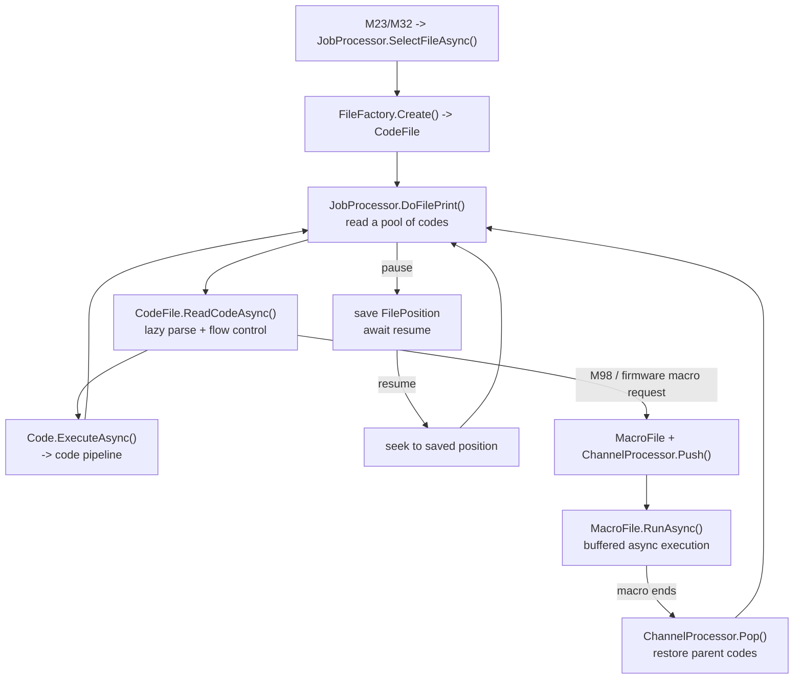

# File management

RepRapFirmware addresses files with FatFs-style virtual paths (`0:/sys/config.g`). DSF has no real SD
card - it maps those paths onto a directory on the Linux filesystem, parses G-code metadata for the
web interface, and runs print jobs and macros out of that tree.

- Path mapping: `src/DuetControlServer/Files/FilePathResolver.cs`
- Jobs and macros: `src/DuetControlServer/Files/JobProcessor.cs`, `Files/CodeFile.cs`, `Files/MacroFile.cs`
- File info: `src/DuetControlServer/Files/Parser/`
- Directory keys: `src/DuetAPI/ObjectModel/Directories/`

## Path mapping

`FilePathResolver` translates between virtual and physical paths
(`ToPhysical` / `ToVirtualAsync`):

- Drive `0:/` maps to the base directory, default `/opt/dsf/sd` (the `-b` / `--base-directory`
  option).
- Drives `1:/`, `2:/`, ... map to additional mounted [volumes](object-model.md#top-level-keys) via
  `Volumes[n].Path`.
- A leading-driveless relative path is resolved against a `FileDirectory` context (for example a macro
  name is resolved against the macros directory).

### Directory layout

The standard directories live under drive 0 and are exposed in the
[`Directories`](object-model.md#top-level-keys) model key:

| Key | Default | Holds |
| --- | --- | --- |
| `System` | `0:/sys/` | `config.g`, `config-override.g`, homing and other system macros |
| `GCodes` | `0:/gcodes/` | Print job files |
| `Macros` | `0:/macros/` | User macro files |
| `Filaments` | `0:/filaments/` | Per-filament configuration |
| `Firmware` | `0:/firmware/` | Firmware and IAP binaries |
| `Web` | `0:/www/` | DuetWebControl and plugin web assets |
| `Menu` | `0:/menu/` | 12864-display menu files (unused on the SBC) |

## Reading codes from files

A file on disk becomes codes through `CodeFile` (`Files/CodeFile.cs`), which parses lazily through a
`CodeParserBuffer` - one [`Code`](gcode-flow.md#the-code-object) at a time, tracking byte position and
line number. `CodeFile` is also where [flow control](gcode-flow.md#flow-control) (`if`/`while`/...)
lives: it keeps a stack of `CodeBlock`s and decides which lines to execute or skip based on evaluated
conditions and indentation.

### Print jobs

`JobProcessor` (`Files/JobProcessor.cs`) owns the print lifecycle. `SelectFileAsync` opens the file on
the [`File` channel](gcode-flow.md#code-channels); `DoFilePrint()` then reads codes and pushes them
into the [pipeline](gcode-flow.md#the-six-stage-code-pipeline). File position advances by
`FilePosition + Length` per code.

On **pause**, the current position is saved and the loop waits on a resume signal; on **resume** it
seeks back and continues. Note that block state is not persisted across a pause - on resume the file
seeks to the saved byte offset and re-parses any open blocks from there, so a `while` counter resets.

`M606 S1` **forks** the job (`ForkAsync`): the `CodeFile` state, including the block stack and parser
buffer, is copied onto the [`File2` channel](gcode-flow.md#code-channels) so two motion systems can
print in parallel.

## Macros

A macro is a `MacroFile` (`Files/MacroFile.cs`), a `CodeFile` that runs its codes asynchronously on
the channel that owns it. Each channel keeps a stack of macro levels; starting a macro pushes a level
and exhausting it pops one, restoring any suspended parent codes (the stack lives in the
[firmware channel processor](firmware-link.md#sending-codes-to-the-firmware)).

- A **nested macro** is started by a code - `M98`, or implicitly `config.g`, `M501`, a homing file,
  ... - and carries its start code and source connection. Its codes are flagged `IsFromMacro` (plus
  `IsNestedMacro`, `IsFromConfig`, etc. as applicable).
- A **system macro** is requested by the firmware over the [Firmware link](firmware-link.md#requests-initiated-by-the-firmware)
  with no start code.

For `config.g`, DCS injects synthetic codes (machine name, date/time) so the configuration reflects
the host environment.

## File info parsing

`Files/Parser/FileInfoParser.cs` extracts metadata from G-code files for the web interface and the
`M36` command. It scans a bounded header and footer for slicer-specific comment patterns and reports:
print time and simulated time, layer height and layer count, per-extruder filament usage, object
height, the generating slicer, user-defined custom info, and embedded thumbnails.

Thumbnails are decoded under `Files/Parser/ImageProcessing/`: `ImageParser.cs` handles PNG/JPG/QOI
thumbnails embedded as base64 between `thumbnail begin`/`thumbnail end` markers, and
`IconImageParser.cs` decodes the proprietary RGB565 icon format to PNG. `M36.1` / `M36.2` stream
thumbnail data and file fragments on demand.

## See also

- [G-code flow](gcode-flow.md) - the pipeline these files feed, and the flow-control details
- [Firmware link](firmware-link.md#requests-initiated-by-the-firmware) - firmware macro and file-I/O requests
- [Object model](object-model.md) - the `Job`, `Directories`, and `Volumes` keys
