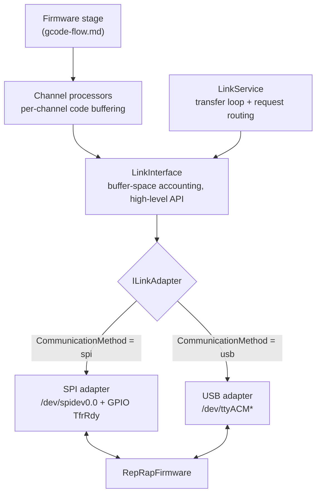
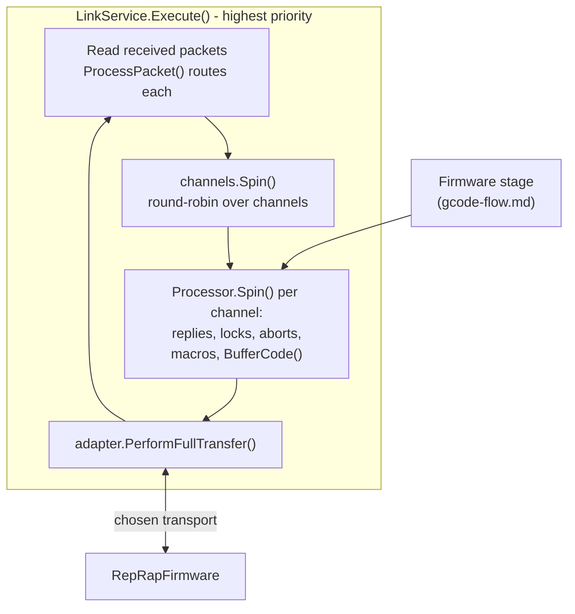
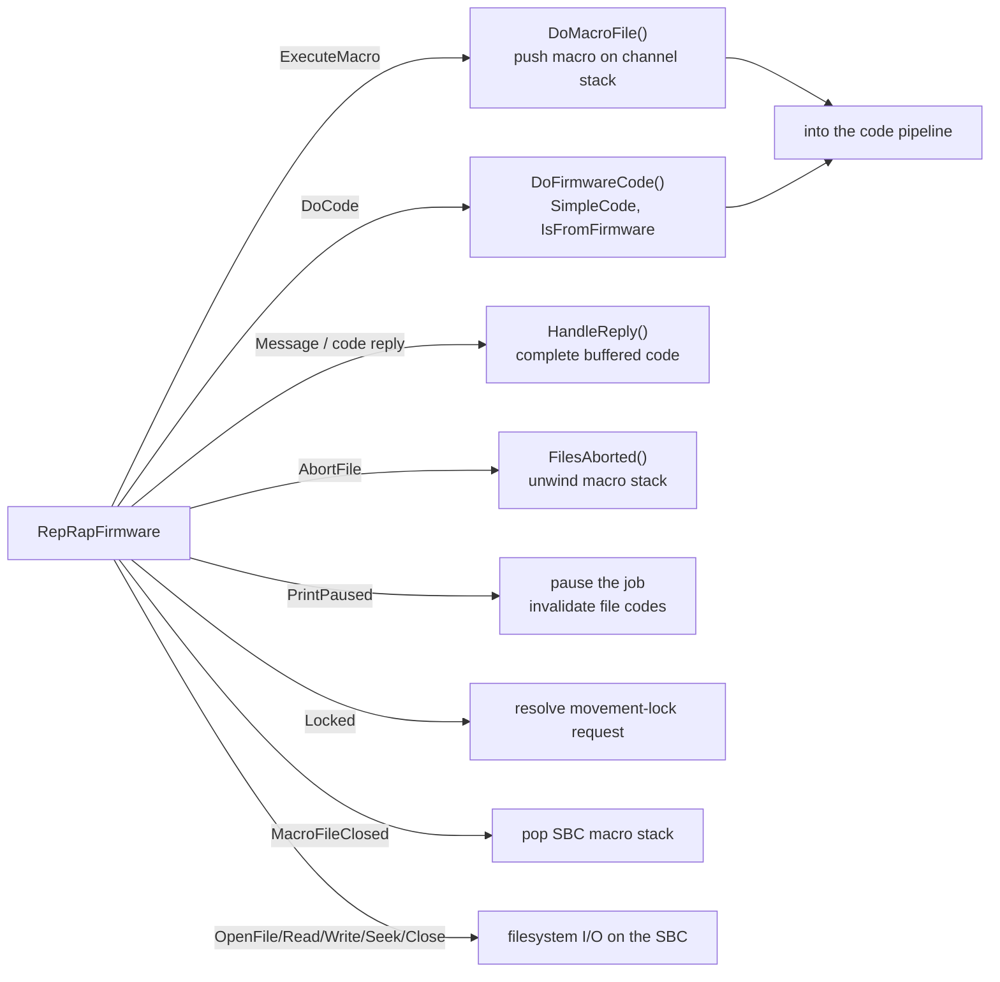

# Firmware link

DCS and RepRapFirmware (RRF) exchange data over a binary link. Every code DCS does not handle itself
crosses this link, and RRF uses the same link to ask DCS for macros, file I/O, and SBC-side code
execution. The link supports **two transports** behind a common interface:

- **SPI** - the SBC is the SPI master and a GPIO line (`TfrRdy`) signals readiness. The default.
- **USB** - a serial connection over `/dev/ttyACM*`.

The choice is made by the `CommunicationMethod` setting (`"spi"` or `"usb"`) and wired up in
`Link/Extensions.cs`. Everything above the transport - the transfer loop, per-channel buffering, the
packet protocol, and the firmware-request handlers - is shared.

- Transport interface: `src/DuetControlServer/Link/Adapter/ILinkAdapter.cs`
- Transports: `Link/Adapter/SPI.cs`, `Link/Adapter/USB.cs`
- Transfer loop and request handlers: `Link/LinkService.cs`
- Higher-level link API: `Link/LinkInterface.cs`
- Per-channel buffering: `Link/Channel/Processor.cs`, `Channel/Manager.cs`
- Wire format: `Link/Protocol/`

This article continues from the [Firmware stage of the code pipeline](gcode-flow.md#the-six-stage-code-pipeline):
once a code reaches that stage, the link layer described here transmits it.

## Layering

`ILinkAdapter` is the transport abstraction. It exposes `Connect`, `PerformFullTransfer`,
`ReadNextPacket`, and a set of typed readers for firmware requests (`ReadMacroRequest`,
`ReadMessage`, `ReadObjectModel`, `ReadCodeBufferUpdate`, ...). `LinkService`, `LinkInterface`, and the
channel processors are written entirely against this interface, so they do not care which transport is
in use.

## The transfer loop

One high-priority thread runs `LinkService.Execute()`:

Each iteration: read and route the packets RRF sent, let every [code channel](gcode-flow.md#code-channels)
buffer outgoing codes, then perform one full transfer over the active transport.

## Sending codes to the firmware

`Link/Channel/Manager.cs` visits each channel round-robin and calls `Processor.Spin()`
(`Link/Channel/Processor.cs`), which handles, in priority order: pending replies, lock/unlock
requests, abort requests, macro management, resumption of suspended codes, then buffering of new codes
via `BufferCode()`.

Each channel tracks a `BufferedCodes` list and a `BytesBuffered` counter. A code is only buffered when
it fits within `MaxBufferSpacePerChannel` **and** RRF has reported enough free space (RRF sends
`CodeBufferUpdate` packets; `LinkInterface` keeps a running `BufferSpace` figure). The code is
serialized by `Link/Protocol/Writer.cs` into a `CodeHeader` plus its parameters, wrapped in an 8-byte
`PacketHeader` of type `Code`, and copied into the transmit buffer.

## The wire format

A single transfer carries one **transfer header** followed by a sequence of packets. Each packet
begins with an 8-byte `PacketHeader` (request type, id, length, resend id) followed by a
4-byte-aligned payload. The packet layer is identical on both transports; only the transfer header and
the integrity guarantees differ:

| | SPI (`TransferHeader`) | USB (`UsbTransferHeader`) |
| --- | --- | --- |
| Header size | 16 bytes | 8 bytes |
| Format code | yes | no |
| Sequence number | yes (detects resets) | no |
| CRC | CRC32 (v4+) / CRC16 | none - USB guarantees integrity and ordering |
| Readiness signalling | GPIO `TfrRdy` line | serial flow, no GPIO |
| Direction | full-duplex (TX and RX swapped together) | serial read/write |

Both transports keep three transmit buffers so a firmware resend request can be honoured.

### SPI transport

`Link/Adapter/SPI.cs` drives `/dev/spidev0.0`. `PerformFullTransfer()`:

1. finalises the transmit header (packet count, incremented sequence number, data length, CRC),
2. `ExchangeHeader()` - waits for `TfrRdy`, swaps the 16-byte headers full-duplex, validates the CRC
   and protocol version, and acknowledges,
3. `ExchangeData()` - if either side has data, swaps the payloads full-duplex and validates the CRC,
4. rotates to the next transmit buffer and resets the pointers.

### USB transport

`Link/Adapter/USB.cs` drives a `SerialPort` on `/dev/ttyACM*` (default `/dev/ttyACM1`). Because USB
already provides reliable, ordered delivery, the `UsbTransferHeader` drops the CRC, format code, and
sequence number, and there is no GPIO handshake - the adapter simply writes the header and data and
reads the firmware's response from the serial stream. The packet protocol above it is unchanged, so
the same `LinkService` request handlers and channel buffering apply.

## Replies

When RRF returns a `Message` carrying the binary-code-reply flag, DCS routes it to the originating
channel (`Manager.HandleReply` -> `Processor.HandleReply`), pops the matching code off that channel's
`BufferedCodes` (FIFO), and attaches the text as the code's
[`Result`](gcode-flow.md#the-code-object). The code then finalises in the
[Executed stage](gcode-flow.md#the-six-stage-code-pipeline) and the reply travels back to whichever
client submitted it.

## Requests initiated by the firmware

RRF is not only a sink for codes - it drives work back into DCS. These arrive as packets and are
routed by `LinkService.ProcessPacket()`, independent of transport:

- **ExecuteMacro** - RRF asks DCS to run a macro (homing files, `config.g`, tool-change macros, ...).
  DCS resolves the [virtual path](file-management.md#path-mapping), pushes a
  [`MacroFile`](file-management.md#macros) onto the channel stack, and its codes flow through the
  normal pipeline.
- **DoCode** - RRF asks DCS to execute a code string; a `SimpleCode` flagged `IsFromFirmware` is run.
- **AbortFile / PrintPaused / MacroFileClosed** - keep DCS's per-channel macro stack and
  [job state](file-management.md#print-jobs) consistent with the firmware's.
- **Locked** - completes a pending movement-lock request so a code waiting on motion synchronisation
  can proceed.
- **File I/O** - RRF delegates file open/read/write/seek/close to the SBC, which performs the actual
  Linux filesystem access and streams data back.

The [object model](object-model.md#updates-from-the-firmware) is also kept current over this link via
`GetObjectModel` requests and `CodeBufferUpdate` packets.

## See also

- [G-code flow](gcode-flow.md) - how a code reaches the Firmware stage in the first place
- [File management](file-management.md) - macros, jobs, and the virtual paths RRF requests
- [Object model](object-model.md#updates-from-the-firmware) - the model updates carried over this link
