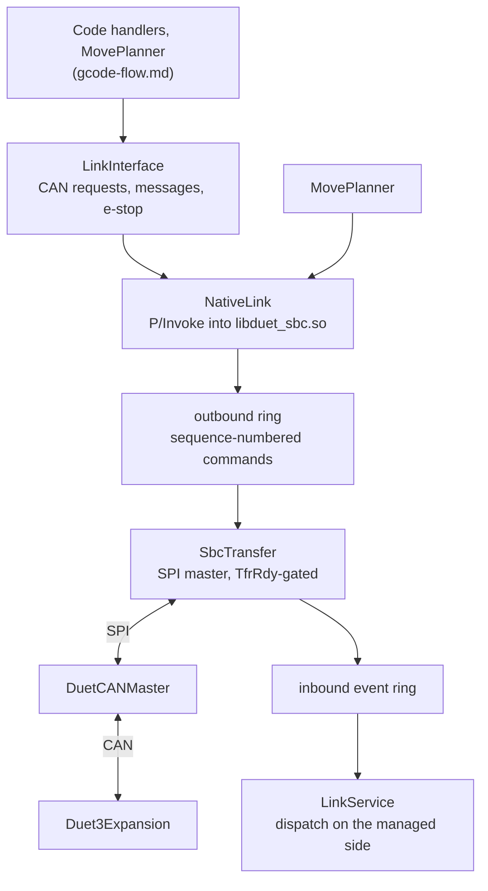

# Firmware link

The link is what connects DuetControlServer to the hardware. It has two halves that are easy to
confuse, because "the link" is used for both:

- **DCS to the native side.** [DuetSbcInterface](components.md#duetsbcinterface) is a shared library
  loaded into the DCS process. DCS calls exported functions to submit moves and queue messages, and
  reads a ring buffer of events coming back. No serialisation, no sockets - a P/Invoke and a memcpy.
- **The native side to the controller.** DuetSbcInterface's own thread runs an SPI transfer loop
  against DuetCANMaster on the Duet 3 mainboard. That is the wire, and it is SPI only: the USB
  transport is gone.

This replaced an arrangement where DCS itself drove the SPI link and RepRapFirmware sat on the other
end of it. Both the transport code and the traffic changed. What crosses the link now is moves, CAN
messages and their outcomes; what used to cross it - G-codes for another interpreter to run, macro
requests coming back, file I/O on the firmware's behalf, object model polls - has no counterpart,
because there is no second interpreter.

- Managed side of the boundary: `src/DuetControlServer/Link/Native/NativeLink.cs`,
  `Link/Native/LinkEvents.cs`
- Event dispatch and request handlers: `src/DuetControlServer/Link/LinkService.cs`
- Higher-level API (CAN requests, messages, emergency stop):
  `src/DuetControlServer/Link/LinkInterface.cs`
- Native transfer engine: `src/DuetSbcInterface/src/SBC/SbcInterface.cpp`, `SBC/SbcTransfer.cpp`
- Wire format, shared by both builds: `lib/DuetSpiInterface/include/DuetSpiProtocol/MessageFormats.h`

## Layering

Two rules shape this picture and are worth stating outright:

- **Every CAN message originates in DCS.** The native side builds no messages of its own; it stages
  what it is handed. That invariant held with one exception - the endstop wind-back - until that was
  moved up to DCS as well, taking the CANlib dependency out of DuetSbcInterface with it.
- **The transfer loop must never block on managed work.** Everything inbound is posted to a ring and
  dispatched on a managed thread, so a slow object-model write cannot stall an SPI transfer.

## What goes down

`SbcRequest` (`MessageFormats.h`) is the whole outbound vocabulary:

| Request | Sent by | Meaning |
| --- | --- | --- |
| `ScheduleMove` | `MovePlanner` via the motion engine | One planned move, per-drive: steps, extrusion, and what stops each driver |
| `SendCANMessage` | `LinkInterface.SendCanMessageAsync` | A CAN message body for the controller to put on the bus ([CAN messages](can-messages.md)) |
| `ConfigCAN` / `EnableCAN` | Startup and `M952`/`M953` | Bus timing, and turning the bus on |
| `EmergencyStop` | `M112` | Stop everything, now |
| `Reset` | `M999` | Reset the controller |
| `WriteIap` / `StartIap` | `M997` | Stream the in-application programmer and launch it |
| `Message` | `M118` and diagnostics | Text for the controller to print on its own console |

Every command entering the outbound ring is given a **monotonic sequence number**. The path is FIFO
end to end, so one number describes every command up to it: after a successful transfer the native
side posts `OutboundDelivered(seq)`, and on a drop `OutboundDropped(seq)`. That is what lets a
fire-and-forget CAN message be resolved on delivery rather than on the memcpy that queued it, at a
cost of one event per transfer rather than one per message.

## What comes back

Inbound traffic is a ring of `InboundEventType` records, dispatched by `LinkService`:

| Event | What DCS does with it |
| --- | --- |
| `Message` | Route firmware text to the message log and any listening clients |
| `CanResponse` | Match the token to a pending CAN request and reassemble it, or route it as unsolicited traffic - board announcements, status reports, input changes, events |
| `MoveCompleted` / `MoveFailed` | Retire the move in `MotionTracker`, or report why it could not run |
| `MotionStopped` | An endstop cut a move short: the trigger time, the move id and the drivers that stopped ([Endstops](endstops.md)) |
| `CanMessagesSent` | What the controller made of the CAN messages it was asked to send |
| `OutboundDelivered` / `OutboundDropped` | Resolve or fail everything up to that sequence number |
| `ConnectionLost` / `ConnectionEstablished` / `ControllerReset` | Invalidate what the link was carrying, then raise the matching event |
| `RequestCompleted` | Complete an awaited request that carried a request id |
| `Log` / `MalformedPacket` / `FatalError` | Diagnostics from the transfer loop; the last one ends the link service |
| `CodeBufferUpdate` | Reported buffer space, kept for `M122` |

Note what is *not* in that list: no `ExecuteMacro`, no `DoCode`, no `AbortFile`, no file I/O. The
controller asks DCS for nothing except to be told what to do; macros are started by DCS itself
through `MacroRunner`, and the filesystem was always the SBC's.

## When the link drops

The transfer engine reports the outage where it observes it, rather than after the fact, and DCS
reacts in a fixed order:

1. `Invalidate()` - cancel pending CAN requests, discard queued moves, drop what was staged for a
   controller that may since have rebooted. Staged data is **not** replayed: a rebooted controller has
   no state to receive it, and one that merely stalled is about to be reconfigured anyway.
2. Raise `controller_disconnect`, which runs `sys/controller-disconnect.g` if the machine has one.
   Once per outage, whether the outage was seen as a timeout or as a reset.
3. On recovery, raise `controller_reconnect`. Its default action is to run `config.g`, because a
   controller that reset has lost every setting and something has to put them back. A machine that
   provides `sys/controller-reconnect.g` takes that responsibility on instead.

Both events are DSF's own - RepRapFirmware has no equivalent because it *is* the controller. See
[Differences from RepRapFirmware](rrf-differences.md#4-events).

## The wire format

A transfer carries one `SpiTransferHeader` followed by a sequence of packets, each an 8-byte
`PacketHeader` (request type, id, length, resend id) plus a 4-byte-aligned payload. The header carries
a format code, a protocol version, a sequence number (which is how a reset is detected), and CRC32s
over the header and the data.

Two fields ride in the header rather than in a packet of their own, and for the same reason: the
**master clock** sample and the **hiccup time**. The SBC has no step clock, so it fits one to those
samples and schedules every move by absolute start time in the result. What the fit rests on is the
pairing between a tick count and the local time it was stamped with, and a packet is read after an
unknown number of others - the header arrives at a fixed point in every transfer.

Each sub-exchange is gated by the `TfrRdy` line and either side can reject one, which is a protocol in
its own right: [SPI transfer state machine](spi-state-machine.md) documents both sides of it,
including how each recovers when the other desynchronises.

## See also

- [G-code flow](gcode-flow.md) - what happens before a move or a message reaches this layer
- [CAN messages](can-messages.md) - the message bodies this link tunnels
- [Endstops](endstops.md) - the one path where the link's latency is a design constraint
- [SPI transfer state machine](spi-state-machine.md) - one transfer, in full detail
