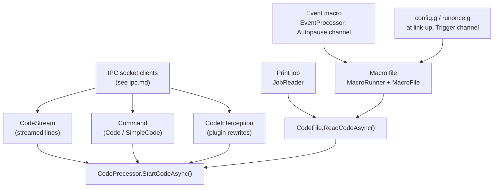
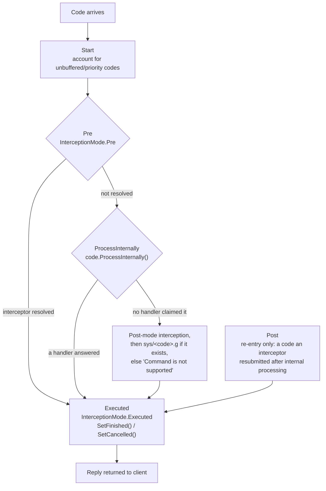
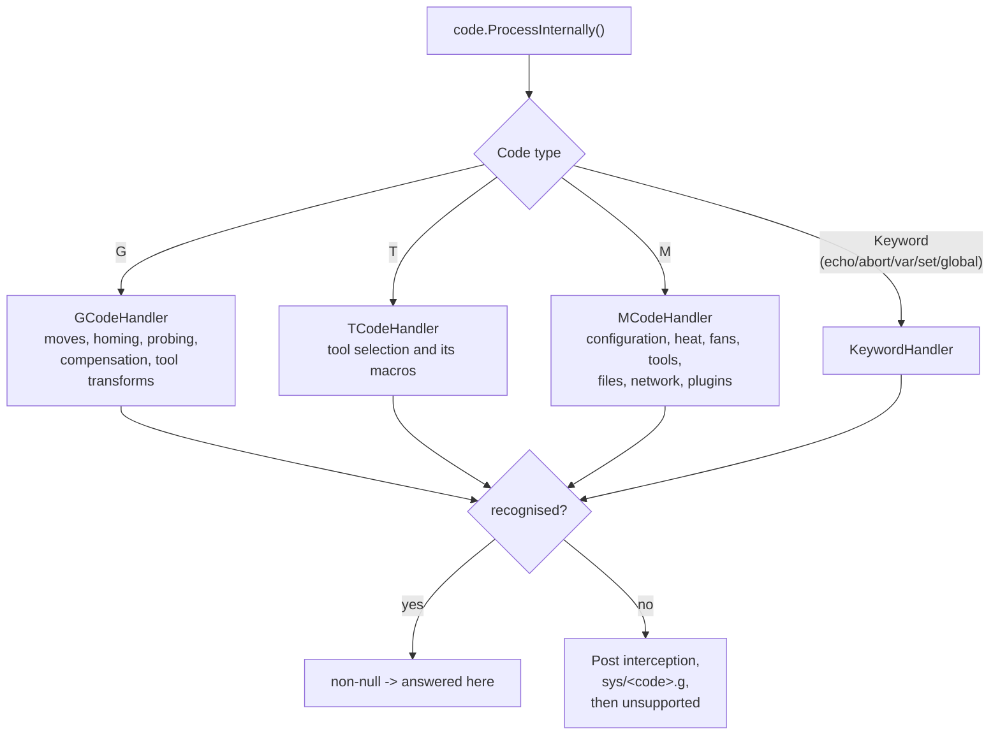

# G-code flow

This article follows a single G/M/T-code through DuetControlServer (DCS): how its source text becomes
a [`Code`](#the-code-object), how the five-stage pipeline processes it, and how its reply gets back to
the client. **Every code is executed here** - there is no other program to hand one to. What a code
does to the machine leaves DCS as a move or a CAN message, covered in
[Firmware link](firmware-link.md) and [CAN messages](can-messages.md); files and macros are in
[File management](file-management.md).

Paths are relative to the repository root; line numbers are indicative - the file and method names are
the stable references.

## The Code object

Every G/M/T-code, comment, or meta keyword is one `Code` object.

- API type: `src/DuetAPI/Commands/Code/Code.cs`
- DCS subclass with execution logic: `src/DuetControlServer/Commands/Generic/Code.cs`

Key fields:

| Field | Meaning |
| --- | --- |
| `Type` (`CodeType`) | `G`, `M`, `T`, `Comment`, or `Keyword` |
| `Channel` (`CodeChannel`) | Input channel the code belongs to (see below) |
| `MajorNumber` / `MinorNumber` | e.g. `28` / `null` for `G28`, `54` / `3` for `G54.3` |
| `Parameters` (`List<CodeParameter>`) | Parsed parameters, each with a typed value and an `IsExpression` flag |
| `Keyword` / `KeywordArgument` | For meta codes: `if`, `elif`, `else`, `while`, `break`, `continue`, `abort`, `echo`, `var`, `set`, `global` |
| `Flags` (`CodeFlags`) | `Asynchronous`, `IsFromMacro`, `IsFromSystemMacro`, `IsPrioritized`, `Unbuffered`, and the progress flags `IsPreProcessed` / `IsInternallyProcessed` / `IsPostProcessed` |
| `FilePosition` / `Length` | Byte offset and length in the source file |
| `LineNumber` / `Indent` | Source line and indentation level (indentation drives block nesting) |
| `SourceConnection` | IPC connection id that submitted the code (0 if internal) |
| `Result` (`Message?`) | Reply text and type, filled in once the code completes |

### Code channels

`src/DuetAPI/CodeChannel.cs` defines every channel a code can belong to. Each channel is processed
independently and in parallel:

| Channel | Purpose |
| --- | --- |
| `HTTP` | Codes from HTTP clients (DWC, REST API) |
| `Telnet` | Telnet session |
| `File` | Primary file print job |
| `USB` | USB serial |
| `Aux` | Serial device, e.g. PanelDue - no serial reader is wired up today |
| `Trigger` | Trigger macros and `config.g` |
| `Queue` | Code queue synced with primary motion |
| `LCD` | Auxiliary LCD device |
| `SBC` | Historically the channel for firmware-initiated codes; nothing feeds it now |
| `Daemon` | `daemon.g` background process |
| `Aux2` | Second UART |
| `Autopause` | Event macros - heater fault, driver error, link loss ([events](rrf-differences.md#4-events)) |
| `File2` | Secondary (forked) file print job |
| `Queue2` | Code queue synced with secondary motion |
| `USB2` | Secondary USB channel |

## Where codes enter the system

A code becomes a `Code` object through one of several intake points. Text is turned into structured
codes by the parser in `src/DuetAPI/Commands/Code/Parser.cs` / `ParserAsync.cs`, which uses a
`CodeParserBuffer` to retain state across reads (line number, last G-code for Fanuc-style repetition,
indentation, `G53` absolute mode).



- **IPC connections** ([ipc.md](ipc.md)): the `Command` mode runs a `Code`/`SimpleCode`; `CodeStream`
  feeds streamed lines on a channel; `Intercept` lets plugins rewrite codes in flight.
- **Print jobs and macros** ([file-management.md](file-management.md)): the job loop and macros read
  codes lazily from files on the `File`/`File2` and macro-owning channels.
- **Machine-initiated macros**: `config.g` and `runonce.g` when the link comes up, a macro named after
  an [event](rrf-differences.md#4-events) on the `Autopause` channel, and the homing, probing and
  tool-change files a code runs for itself. These all go through `MacroRunner`, which pushes a stack
  level on the owning channel so a flush inside a macro waits for the macro's own codes.

`SimpleCode` (`src/DuetControlServer/Commands/Generic/SimpleCode.cs`) parses an arbitrary text string
(possibly several codes) and runs each resulting `Code`.

## The five-stage code pipeline

Once a `Code` is handed to `CodeProcessor.StartCodeAsync()`
(`src/DuetControlServer/Codes/CodeProcessor.cs`), it flows through five ordered stages defined by the
`PipelineStage` enum (`src/DuetControlServer/Codes/Pipelines/PipelineStage.cs`):

```
Start -> Pre -> ProcessInternally -> Post -> Executed
```

There used to be a sixth, `Firmware`, where a code DCS did not handle was parked for transmission to
RepRapFirmware. It is gone along with the per-channel buffering behind it: a code is either executed
here or it is not executed at all.

Each stage is a `PipelineBase` subclass under `src/DuetControlServer/Codes/Pipelines/`. The hand-off
between stages is a bounded `System.Threading.Channel<Code>` (the `Executed` stage uses an unbounded
channel so finalisation can never deadlock). A stage finishes by calling
`ChannelProcessor.WriteCodeAsync(code, nextStage)`, which enqueues the code on the next stage's
channel. A dedicated processor task per stage reads its channel and runs `ProcessCodeAsync` one code
at a time, so ordering within a single file/macro context is preserved.



Stage by stage:

1. **Start** (`Pipelines/Start.cs`): accounts for unbuffered and prioritised codes (an `Unbuffered`
   code blocks the channel until it completes; a prioritised code may overtake), then forwards to
   **Pre**.
2. **Pre** (`Pipelines/Pre.cs`): offers the code to plugins via the
   [`Intercept` connection](ipc.md#intercept) in `Pre` mode. If a plugin *resolves* it, the code jumps
   straight to **Executed**; otherwise it proceeds to **ProcessInternally**. The `IsPreProcessed` flag
   prevents re-interception on re-entry.
3. **ProcessInternally** (`Pipelines/ProcessInternally.cs`): calls `code.ProcessInternally()`, which
   is where the per-type handlers run (see [Internal processing](#internal-processing)). If no handler
   claims the code, the same method runs `Post`-mode interception, then tries the macro named after
   the code, and only then resolves it as unsupported - so an unclaimed code leaves this stage with an
   answer either way. Sets `IsInternallyProcessed`.
4. **Post** (`Pipelines/Post.cs`): reached only on re-entry, when an interceptor resubmits a code that
   has already been processed internally. Sets `IsPostProcessed`.
5. **Executed** (`Pipelines/Executed.cs`): the terminal stage. Runs `Executed`-mode interception
   (notification only - it cannot resolve), then finalises the code with `SetFinished()` or, on
   failure/cancellation, `SetCancelled()`. The result travels back to the originating client.

### ChannelProcessor and the per-channel stack

`CodeProcessor` holds one `ChannelProcessor` per [code channel](#code-channels)
(`src/DuetControlServer/Codes/ChannelProcessor.cs`). Each `ChannelProcessor` owns the full five-stage
pipeline for that channel. To support nested files and macros, every stage keeps a
`Stack<PipelineStackItem>`: starting a macro pushes a new stack item onto all non-Executed stages at
once; ending it pops them. Each stack item has its own processor task, so a macro nested on top of a
print runs concurrently with - but logically above - the codes beneath it.

## Internal processing

`code.ProcessInternally()` (`src/DuetControlServer/Commands/Generic/Code.cs`) dispatches by code type
to one of four handlers registered through keyed DI (`Codes/Handlers/`):

- `GCodeHandler`, `MCodeHandler`, `TCodeHandler`, `KeywordHandler`, all implementing `ICodeHandler`.

A handler's `ProcessAsync` returns a `Message?`. **Non-null means the handler answered the code.**
Null used to mean "forward to RepRapFirmware"; now it means no handler recognised the code, and what
happens next is the fallback described above - `Post` interception, then `sys/<code>.g`, then
`<code>: Command is not supported` as a warning, which is RepRapFirmware's own wording for the same
situation.



- **G-codes** are interpreted here in full: `G0`/`G1` become planned moves through
  [MoveInterpreter and MovePlanner](rrf-differences.md#5-interpreter-and-move-path), `G28` runs the
  machine's homing macros, `G29`/`G30`/`G31` probe and build the height map, `G10`/`G53`/`G92` move
  the coordinate systems around.
- **T-codes**: `TCodeHandler` selects a tool and runs `tfree`/`tpre`/`tpost` around the change.
- **M-codes**: `MCodeHandler` is the largest of the four, split across a file per subsystem
  (`MCodeHandler.Motion.cs`, `.Heat.cs`, `.Fans.cs`, `.Tools.cs`, `.Probes.cs`, `.Spindles.cs`,
  `.Ports.cs`, `.Compensation.cs`, `.ConfigOverride.cs`). A configuration code writes the
  [object model](object-model.md) and, where a board needs telling, sends the matching
  [CAN message](can-messages.md).

  A sample of the range, rather than a full list -
  [MCODE_MIGRATION.md](docs/devel/MCODE_MIGRATION.md) has the complete inventory with status:

  | M-code | What it does here |
  | --- | --- |
  | M20-M39 | The virtual SD: list, select, write, delete, file info, CRC32, volume info |
  | M92/M201/M203/M350/M584/M906 | Motion configuration, then a reconfiguration of the planner at standstill |
  | M104/M109/M140/M307/M308 | Heaters and sensors, configured here and driven over CAN |
  | M106/M950 | Fans and the I/O ports everything else is built from |
  | M563/M567/M568 | Tool definition, mixing and settings |
  | M558/M574/M119 | Probes and endstops ([Endstops](endstops.md)) |
  | M500/M501/M503 | `config-override.g` - what the machine discovered about itself |
  | M111 P-1 / M122 / M929 | DCS log level, diagnostics, event logging |
  | M118 P6 / M586 | MQTT publication, network protocol and CORS configuration |
  | M606 S1 | Fork the input reader (start a second job on File2) |
  | M957 | Raise an [event](rrf-differences.md#4-events) |
  | M997/M999 | Firmware update / controller reset |

- **Keywords**: `KeywordHandler` handles only `echo`, `abort`, `var`, `set`, and `global`.
  Flow-control keywords (`if`, `elif`, `else`, `while`, `break`, `continue`) never reach a handler -
  they are resolved earlier, at the file-parsing layer ([Flow control](#flow-control)).

## Meta codes, expressions, and flow control

Meta G-code (conditionals, loops, variables, and `{ ... }` expressions) is the one area where DCS must
understand code structure rather than pass it through.

### Expression evaluation

`src/DuetControlServer/Codes/Meta/Expressions.cs` evaluates `{ ... }` expressions and expression
parameters, **entirely locally**. There is no second evaluator to defer to: `M104 S{heat.heaters[0].target + 5}`
and `{sbc.ethernet.ipAddress}` are both resolved here, against the one
[object model](object-model.md) DCS owns.

That was not always so. The evaluator used to resolve only the branches marked `[SbcProperty]` -
`network`, `sbc`, `volumes`, `plugins`, `job` - and hand everything else to RepRapFirmware. When the
firmware went, the fallback became `return null`, so `if move.axes[0].homed` silently produced
nothing. The gate is gone, and an expression that genuinely cannot be produced is now an error
(`cannot evaluate '<expression>'`) rather than a null, because a null reads as a valid answer.

The two-pass shape that remains is about *synchrony*, not ownership: `fileexists()`, `fileread()` and
`exists()` need asynchronous lookups, so the first pass evaluates everything else and the second
substitutes those as literals and re-evaluates. Expression parameters are rewritten to their evaluated
value before the code proceeds (`IsExpression` is cleared). The custom functions are registered at
startup by `Functions` / `FunctionsInitializer` (`Codes/Meta/`).

Variables (`var`, `set`, `global`, `param`) are also DCS's own, in `Codes/Meta/VariableSet.cs` and
`VariableStore.cs`: one set per file, per channel for codes without one, with RepRapFirmware's
semantics - `var` and `global` create and refuse to overwrite, `set` assigns and refuses to create,
parameters are read-only. One thing they deliberately cannot do is hold an object model reference; see
[Differences from RepRapFirmware](rrf-differences.md#6-meta-g-code-and-expressions).

### Flow control

`if`/`elif`/`else`/`while`/`break`/`continue` are handled in `CodeFile.ReadCodeAsync()`
(`src/DuetControlServer/Files/CodeFile.cs`), not in the pipeline. The file keeps a `Stack<CodeBlock>`
(`Files/CodeBlock.cs`) describing the open blocks:

- On `if`/`elif`/`while`, the condition is evaluated to `"true"`/`"false"` and stored in
  `CodeBlock.ProcessBlock`; if false, the block's codes are skipped.
- `elif`/`else` consult the previous block's `ExpectingElse` flag.
- A `while` block records its `FilePosition`; when the block ends and the loop should continue, the
  file seeks back and increments `CodeBlock.Iterations` (exposed as the `iterations` variable).
- `break`/`continue` flush the channel and set `ProcessBlock`/`ContinueLoop` on the enclosing while.
- `var`/`global`/`set` blocks track `HasLocalVariables`; locals declared inside a block are deleted
  when it ends.

Block nesting is keyed off `Indent`. Block state is not persisted across a pause - see
[File management](file-management.md#print-jobs).

## End-to-end example

A `M104 S200` typed in DWC during a print:

1. DWC posts the code; it arrives over the [IPC socket](ipc.md) and is parsed into a `Code` on the
   `HTTP` channel, then handed to `CodeProcessor.StartCodeAsync()`.
2. **Start** accounts for it and forwards to **Pre**.
3. **Pre**: no interceptor resolves it -> **ProcessInternally**.
4. **ProcessInternally**: `MCodeHandler` claims M104. It resolves which tool's heaters the code
   addresses, takes the object model's write lock, sets `heat.heaters[n].active`, and sends the
   [CAN message](can-messages.md) that tells the board carrying that heater its new setpoint.
5. The handler returns a `Message`, so the code goes straight to **Executed**.
6. **Executed**: the `Executed` interception fires, the code is finalised with `SetFinished()`, and
   the reply is returned to DWC.

The board reports the temperature it actually reaches in its periodic status report, which
`ExpansionBoardManager` writes into `heat.heaters[n].current` - a separate path, arriving whether or
not anybody asked.

Meanwhile the print continues on the `File` channel completely independently, with its own pipeline
and macro stack - the two channels never block each other, unless a code on one of them asks for
standstill.

## See also

- [Firmware link](firmware-link.md) - the link a move or a CAN message leaves over
- [CAN messages](can-messages.md) - how a handler addresses a board
- [File management](file-management.md) - jobs, macros, and the flow-control details
- [IPC](ipc.md) - the connections codes arrive on
- [Object model](object-model.md) - the state expressions read
- [Differences from RepRapFirmware](rrf-differences.md) - where the interpretation deliberately differs
