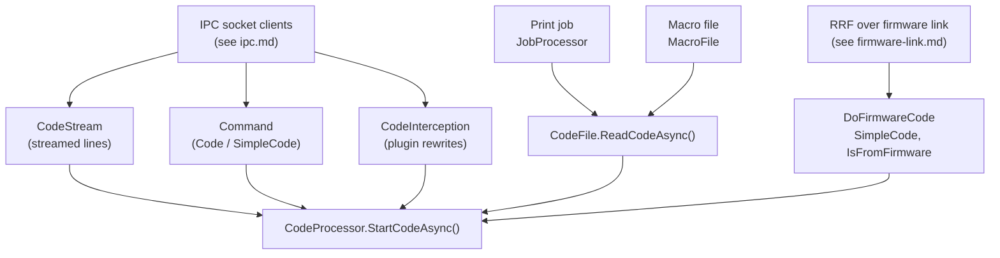
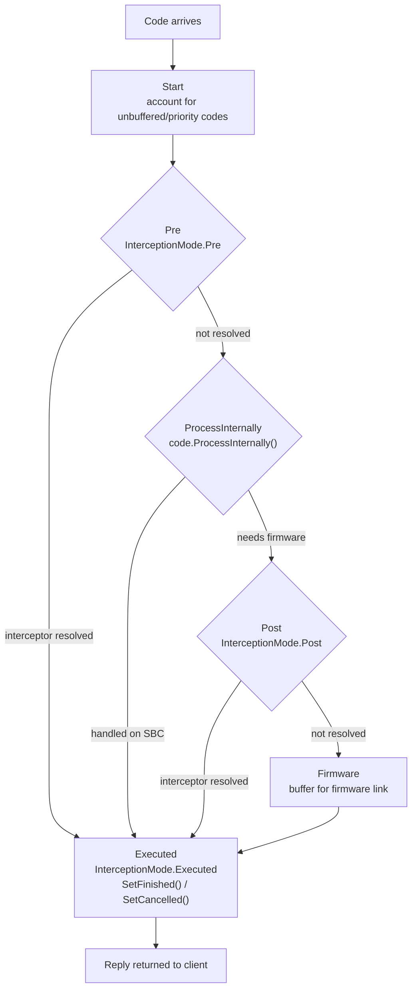
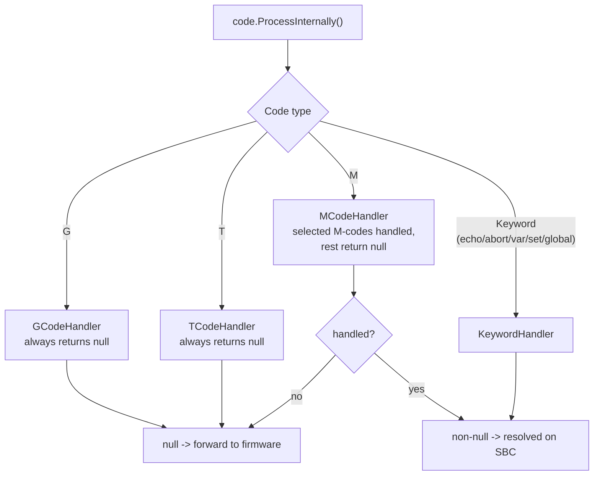

# G-code flow

This article follows a single G/M/T-code through DuetControlServer (DCS): how its source text becomes
a [`Code`](#the-code-object), how the six-stage pipeline processes it, what DCS handles itself versus
forwards to RepRapFirmware (RRF), and how its reply gets back to the client. The final hop to the
firmware is covered separately in [Firmware link](firmware-link.md); files and macros in
[File management](file-management.md).

Paths are relative to the repository root; line numbers are indicative - the file and method names are
the stable references.

## The Code object

Every G/M/T-code, comment, or meta keyword is one `Code` object.

- API type: `src/DuetAPI/Commands/Code/Code.cs`
- DCS subclass with execution logic: `src/DuetControlServer/Commands/Generic/Code.cs`

Key fields:

| Field | Meaning |
| --- | --- |
| `Type` (`CodeType`) | `G`, `M`, `T`, `Comment`, or `Keyword` |
| `Channel` (`CodeChannel`) | Input channel the code belongs to (see below) |
| `MajorNumber` / `MinorNumber` | e.g. `28` / `null` for `G28`, `54` / `3` for `G54.3` |
| `Parameters` (`List<CodeParameter>`) | Parsed parameters, each with a typed value and an `IsExpression` flag |
| `Keyword` / `KeywordArgument` | For meta codes: `if`, `elif`, `else`, `while`, `break`, `continue`, `abort`, `echo`, `var`, `set`, `global` |
| `Flags` (`CodeFlags`) | `Asynchronous`, `IsFromFirmware`, `IsFromMacro`, `IsPrioritized`, `Unbuffered`, and the progress flags `IsPreProcessed` / `IsInternallyProcessed` / `IsPostProcessed` |
| `FilePosition` / `Length` | Byte offset and length in the source file |
| `LineNumber` / `Indent` | Source line and indentation level (indentation drives block nesting) |
| `SourceConnection` | IPC connection id that submitted the code (0 if internal) |
| `Result` (`Message?`) | Reply text and type, filled in once the code completes |

### Code channels

`src/DuetAPI/CodeChannel.cs` defines every channel a code can belong to. Each channel is processed
independently and in parallel:

| Channel | Purpose |
| --- | --- |
| `HTTP` | Codes from HTTP clients (DWC, REST API) |
| `Telnet` | Telnet session |
| `File` | Primary file print job |
| `USB` | USB serial |
| `Aux` | Serial device, e.g. PanelDue |
| `Trigger` | Trigger macros and `config.g` |
| `Queue` | Code queue synced with primary motion |
| `LCD` | Auxiliary LCD device |
| `SBC` | Default channel for SPI requests from the firmware |
| `Daemon` | `daemon.g` background process |
| `Aux2` | Second UART |
| `Autopause` | Power-fail / heater-fault / filament-out macros |
| `File2` | Secondary (forked) file print job |
| `Queue2` | Code queue synced with secondary motion |
| `USB2` | Secondary USB channel |

## Where codes enter the system

A code becomes a `Code` object through one of several intake points. Text is turned into structured
codes by the parser in `src/DuetAPI/Commands/Code/Parser.cs` / `ParserAsync.cs`, which uses a
`CodeParserBuffer` to retain state across reads (line number, last G-code for Fanuc-style repetition,
indentation, `G53` absolute mode).



- **IPC connections** ([ipc.md](ipc.md)): the `Command` mode runs a `Code`/`SimpleCode`; `CodeStream`
  feeds streamed lines on a channel; `Intercept` lets plugins rewrite codes in flight.
- **Print jobs and macros** ([file-management.md](file-management.md)): the job loop and macros read
  codes lazily from files on the `File`/`File2` and macro-owning channels.
- **Firmware `DoCode`** ([firmware-link.md](firmware-link.md#requests-initiated-by-the-firmware)): RRF can ask
  the SBC to run a code; a `SimpleCode` flagged `IsFromFirmware` is built and executed.

`SimpleCode` (`src/DuetControlServer/Commands/Generic/SimpleCode.cs`) parses an arbitrary text string
(possibly several codes) and runs each resulting `Code`.

## The six-stage code pipeline

Once a `Code` is handed to `CodeProcessor.StartCodeAsync()`
(`src/DuetControlServer/Codes/CodeProcessor.cs`), it flows through six ordered stages defined by the
`PipelineStage` enum (`src/DuetControlServer/Codes/Pipelines/PipelineStage.cs`):

```
Start -> Pre -> ProcessInternally -> Post -> Firmware -> Executed
```

Each stage is a `PipelineBase` subclass under `src/DuetControlServer/Codes/Pipelines/`. The hand-off
between stages is a bounded `System.Threading.Channel<Code>` (the `Executed` stage uses an unbounded
channel so finalisation can never deadlock). A stage finishes by calling
`ChannelProcessor.WriteCodeAsync(code, nextStage)`, which enqueues the code on the next stage's
channel. A dedicated processor task per stage reads its channel and runs `ProcessCodeAsync` one code
at a time, so ordering within a single file/macro context is preserved.



Stage by stage:

1. **Start** (`Pipelines/Start.cs`): accounts for unbuffered and prioritised codes (an `Unbuffered`
   code blocks the channel until it completes; a prioritised code may overtake), then forwards to
   **Pre**.
2. **Pre** (`Pipelines/Pre.cs`): offers the code to plugins via the
   [`Intercept` connection](ipc.md#intercept) in `Pre` mode. If a plugin *resolves* it, the code jumps
   straight to **Executed**; otherwise it proceeds to **ProcessInternally**. The `IsPreProcessed` flag
   prevents re-interception on re-entry.
3. **ProcessInternally** (`Pipelines/ProcessInternally.cs`): calls `code.ProcessInternally()`. If DCS
   fully handles the code (non-null result) it goes to **Executed**; otherwise it continues to
   **Post**. Sets `IsInternallyProcessed`. This is where the per-type handlers run (see
   [Internal processing](#internal-processing-vs-forwarding-to-firmware)).
4. **Post** (`Pipelines/Post.cs`): a second interception hook, `Post` mode. Resolve -> **Executed**;
   otherwise -> **Firmware**. Sets `IsPostProcessed`.
5. **Firmware** (`Pipelines/Firmware.cs`): not a processing stage - it has no processor task. Codes
   parked here are picked up by the [firmware link layer](firmware-link.md), serialised, and transmitted to RRF.
   Its `FlushAsync` delegates to the link interface so callers can wait for the firmware to drain.
6. **Executed** (`Pipelines/Executed.cs`): the terminal stage. Runs `Executed`-mode interception
   (notification only - it cannot resolve), then finalises the code with `SetFinished()` or, on
   failure/cancellation, `SetCancelled()`. The result travels back to the originating client.

### ChannelProcessor and the per-channel stack

`CodeProcessor` holds one `ChannelProcessor` per [code channel](#code-channels)
(`src/DuetControlServer/Codes/ChannelProcessor.cs`). Each `ChannelProcessor` owns the full six-stage
pipeline for that channel. To support nested files and macros, every stage keeps a
`Stack<PipelineStackItem>`: starting a macro pushes a new stack item onto all non-Executed stages at
once; ending it pops them. Each stack item has its own processor task, so a macro nested on top of a
print runs concurrently with - but logically above - the codes beneath it.

## Internal processing vs. forwarding to firmware

`code.ProcessInternally()` (`src/DuetControlServer/Commands/Generic/Code.cs`) dispatches by code type
to one of four handlers registered through keyed DI (`Codes/Handlers/`):

- `GCodeHandler`, `MCodeHandler`, `TCodeHandler`, `KeywordHandler`, all implementing `ICodeHandler`.

The contract: a handler's `ProcessAsync` returns a `Message?`. **Non-null means the code was fully
handled on the SBC and is never sent to the firmware**; **null means "forward to the firmware"** (the
code continues to Post -> Firmware).



- **G-codes and T-codes** are always forwarded - DCS does not interpret motion or tool-change
  semantics; RRF does.
- **M-codes**: `MCodeHandler` handles the M-codes that need SBC-side resources - filesystem,
  networking, the [object model](object-model.md), plugins, firmware update - and forwards the rest.
  Notable SBC-handled M-codes:

  | M-code | SBC-side action |
  | --- | --- |
  | M0/M1/M2 | Cancel the active job (if any), then forward |
  | M20 | List an SD directory from the Linux filesystem |
  | M21/M22 | Mount/release (the virtual SD is always mounted) |
  | M23/M32/M37 | Select / start / simulate a print file |
  | M24/M26/M27 | Resume / set / report file position |
  | M28/M29/M30 | Begin / end SD write, delete file |
  | M36/M38/M39 | File info (incl. thumbnails), CRC32, SD volume info |
  | M98 | Mark a macro as pausable |
  | M111 P-1 | Set the DCS log level |
  | M112 | Emergency stop via the link interface |
  | M118 P6 | Publish over MQTT |
  | M122 "DSF" | DSF diagnostics |
  | M409 (network/plugins/sbc/volumes) | Object-model query handled on the SBC |
  | M470/M471/M472 | Create / rename / delete directory or file |
  | M503/M505/M550/M551 | Config dump, config folder, machine name, password |
  | M581.1/M586(.4) | SBC trigger config, protocol/MQTT/CORS config |
  | M606 S1 | Fork the input reader (start a second job on File2) |
  | M929 | Start/stop event logging |
  | M997/M999 | Firmware update / controller reset (stops the app) |

- **Keywords**: `KeywordHandler` handles only `echo`, `abort`, `var`, `set`, and `global`.
  Flow-control keywords (`if`, `elif`, `else`, `while`, `break`, `continue`) never reach a handler -
  they are resolved earlier, at the file-parsing layer ([Flow control](#flow-control)).

## Meta codes, expressions, and flow control

Meta G-code (conditionals, loops, variables, and `{ ... }` expressions) is the one area where DCS must
understand code structure rather than pass it through.

### Expression evaluation

`src/DuetControlServer/Codes/Meta/Expressions.cs` evaluates `{ ... }` expressions and expression
parameters, distinguishing two kinds of operand:

- **SBC fields**: [object-model](object-model.md) properties marked `[SbcProperty]` (parts of
  `network`, `sbc`, `volumes`, `plugins`), the special variables `iterations` and `line`, and the
  custom functions `exists`, `fileexists`, `fileread`. These are resolved locally.
- **Firmware fields**: everything else. DCS substitutes any SBC sub-expressions in place, then sends
  the remaining expression to RRF (`linkInterface.EvaluateExpressionAsync()`) for the actual
  arithmetic/boolean evaluation.

So `M104 S{heat.heaters[0].target + 5}` has `heat.heaters[0].target` resolved by RRF (a firmware
field), whereas `{sbc.ethernet.ipAddress}` is resolved entirely on the SBC. Expression parameters are
rewritten to their evaluated value before the code proceeds (`IsExpression` is cleared). The custom
functions are registered at startup by `Functions` / `FunctionsInitializer` (`Codes/Meta/`).

### Flow control

`if`/`elif`/`else`/`while`/`break`/`continue` are handled in `CodeFile.ReadCodeAsync()`
(`src/DuetControlServer/Files/CodeFile.cs`), not in the pipeline. The file keeps a `Stack<CodeBlock>`
(`Files/CodeBlock.cs`) describing the open blocks:

- On `if`/`elif`/`while`, the condition is evaluated to `"true"`/`"false"` and stored in
  `CodeBlock.ProcessBlock`; if false, the block's codes are skipped.
- `elif`/`else` consult the previous block's `ExpectingElse` flag.
- A `while` block records its `FilePosition`; when the block ends and the loop should continue, the
  file seeks back and increments `CodeBlock.Iterations` (exposed as the `iterations` variable).
- `break`/`continue` flush the channel and set `ProcessBlock`/`ContinueLoop` on the enclosing while.
- `var`/`global`/`set` blocks track `HasLocalVariables`; locals declared inside a block are deleted
  when it ends.

Block nesting is keyed off `Indent`. Block state is not persisted across a pause - see
[File management](file-management.md#print-jobs).

## End-to-end example

A `M104 S200` typed in DWC during a print:

1. DWC posts the code; it arrives over the [IPC socket](ipc.md) and is parsed into a `Code` on the
   `HTTP` channel, then handed to `CodeProcessor.StartCodeAsync()`.
2. **Start** accounts for it and forwards to **Pre**.
3. **Pre**: no interceptor resolves it -> **ProcessInternally**.
4. **ProcessInternally**: `MCodeHandler` does not special-case M104, returns null -> **Post**.
5. **Post**: no interceptor resolves it -> **Firmware**.
6. **Firmware**: the [Firmware link](firmware-link.md) buffers it for the `HTTP` channel and, on the next
   transfer, serialises and sends it to RRF.
7. RRF sets the tool temperature and returns a reply; DCS matches it to the buffered code and sets its
   `Result`.
8. **Executed**: the `Executed` interception fires, the code is finalised with `SetFinished()`, and
   the reply is returned to DWC.

Meanwhile the print continues on the `File` channel completely independently, with its own pipeline,
macro stack, and SPI buffer - the two channels never block each other.

## See also

- [Firmware link](firmware-link.md) - the Firmware stage and what happens once a code leaves DCS
- [File management](file-management.md) - jobs, macros, and the flow-control details
- [IPC](ipc.md) - the connections codes arrive on
- [Object model](object-model.md) - the state expressions read
