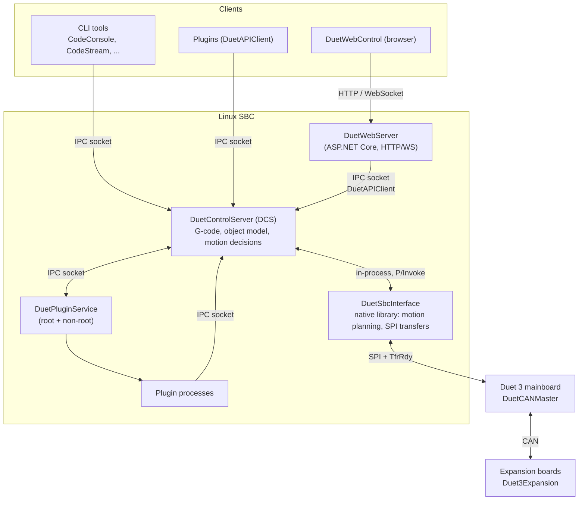

# Duet Software Framework

Duet Software Framework (DSF) is the software stack that runs on a Linux single-board computer (SBC,
typically a Raspberry Pi) attached to a Duet 3 mainboard. **DSF is the machine controller**: it parses
the G-code, holds the machine's configuration, plans the motion, and drives the expansion boards that
own the drivers, heaters and sensors. The Duet 3 mainboard runs DuetCANMaster, which bridges the SBC's
SPI link to the CAN bus.

This is a change from earlier releases, where RepRapFirmware ran on the Duet and DSF forwarded to it
everything it did not handle itself. That split is gone: there is one object model, one G-code
interpreter, and no code path that hands a code to another program to interpret. The behaviour is
still RepRapFirmware's — most of DSF's machine control is a port of it — and
[Differences from RepRapFirmware](rrf-differences.md) records where it deliberately is not.

This documentation describes how DSF is put together and how data flows through it. It complements the
auto-generated API reference (see the [DuetControlServer](../api/DuetControlServer.yml),
[DuetAPI](../api/DuetAPI.yml), [DuetAPIClient](../api/DuetAPIClient.yml) and
[DuetWebServer](../api/DuetWebServer.yml) namespaces).

## Articles

- [Components](components.md) - the processes and libraries that make up DSF
- [Object model](object-model.md) - the central machine-state data structure and how it is kept in sync
- [Inter-process communication](ipc.md) - the DCS Unix socket, connection modes, and command set
- [G-code flow](gcode-flow.md) - how a G/M/T-code is parsed, processed, and executed
- [Firmware link](firmware-link.md) - the SPI link to the controller and the events it carries
- [SPI transfer state machine](spi-state-machine.md) - both sides of one transfer, in detail
- [CAN messages](can-messages.md) - how DCS addresses the expansion boards
- [Endstops](endstops.md) - stopping a move short, across four programs
- [Differences from RepRapFirmware](rrf-differences.md) - what was deliberately changed in the port
- [File management](file-management.md) - the virtual SD card, path mapping, jobs, macros, file info
- [REST API](rest-api.md) - the HTTP endpoints exposed by DuetWebServer
- [Plugins](plugins.md) - the plugin model, the plugin service, and the permission system
- [Building from source](building.md) - prerequisites and deploying a build to an SBC

## High-level architecture

### What each piece does

- **DuetControlServer (DCS)** is the heart of DSF. It owns the [object model](object-model.md),
  runs the [G-code pipeline](gcode-flow.md), decides what every move means, maps virtual SD paths to
  the Linux filesystem ([file management](file-management.md)), exposes the [IPC socket](ipc.md) for
  every other process, and composes the [CAN messages](can-messages.md) that configure and drive the
  hardware.
- **DuetSbcInterface** is a native shared library (`libduet_sbc.so`) loaded into the DCS process. It
  owns the real-time half of the SBC's work: the motion planner and DDA ring that turn a move into a
  velocity profile, the model of the controller's step clock, and the SPI transfer loop itself. DCS
  calls into it and receives events back; see [Firmware link](firmware-link.md).
- **DuetWebServer (DWS)** is an ASP.NET Core app that serves the DuetWebControl single-page app and
  the HTTP REST API. It does not talk to the Duet directly - it proxies everything to DCS over the
  IPC socket using [DuetAPIClient](components.md#duetapiclient). See [IPC](ipc.md) and
  [Components](components.md#duetwebserver).
- **DuetPluginService (DPS)** installs, starts, stops, and sandboxes [plugins](plugins.md). It runs
  as two instances (root and non-root) so that ordinary plugins never run with elevated privileges.
- **DuetCANMaster** runs on the Duet 3 mainboard. It is a bridge rather than a controller of its own:
  it moves packets between the SPI link and the CAN bus, and holds exactly one piece of machine
  knowledge — which input stops which driver, so that a move can be cut short without a round trip to
  the SBC ([Endstops](endstops.md)).
- **Duet3Expansion** runs on each expansion board. It owns the pins and the drivers: it generates the
  steps, reads the switches, drives the heaters, and reports what it sees back over CAN.

### How the components connect

| From | To | Transport |
| --- | --- | --- |
| Browser (DWC) | DuetWebServer | HTTP + WebSocket |
| DuetWebServer | DCS | IPC Unix socket (`DuetAPIClient`) |
| CLI tools, plugins | DCS | IPC Unix socket (`DuetAPIClient`) |
| DCS | DuetPluginService | IPC Unix socket |
| DCS | DuetSbcInterface | P/Invoke into `libduet_sbc.so`, plus a ring buffer of inbound events |
| DuetSbcInterface | DuetCANMaster | SPI master + GPIO `TfrRdy` |
| DuetCANMaster | Duet3Expansion | CAN-FD |

USB is no longer a transport option: the link is SPI only.

## Where to start

If you want to understand how a command typed in the web interface reaches the motors, read
[G-code flow](gcode-flow.md) first, then [Firmware link](firmware-link.md) and
[CAN messages](can-messages.md). If you are writing a plugin or an external integration, start with
[IPC](ipc.md) and [Components](components.md#client-libraries). If you care about machine state, read
[Object model](object-model.md). If you know RepRapFirmware and want the deltas,
[Differences from RepRapFirmware](rrf-differences.md) is the shortest route.
