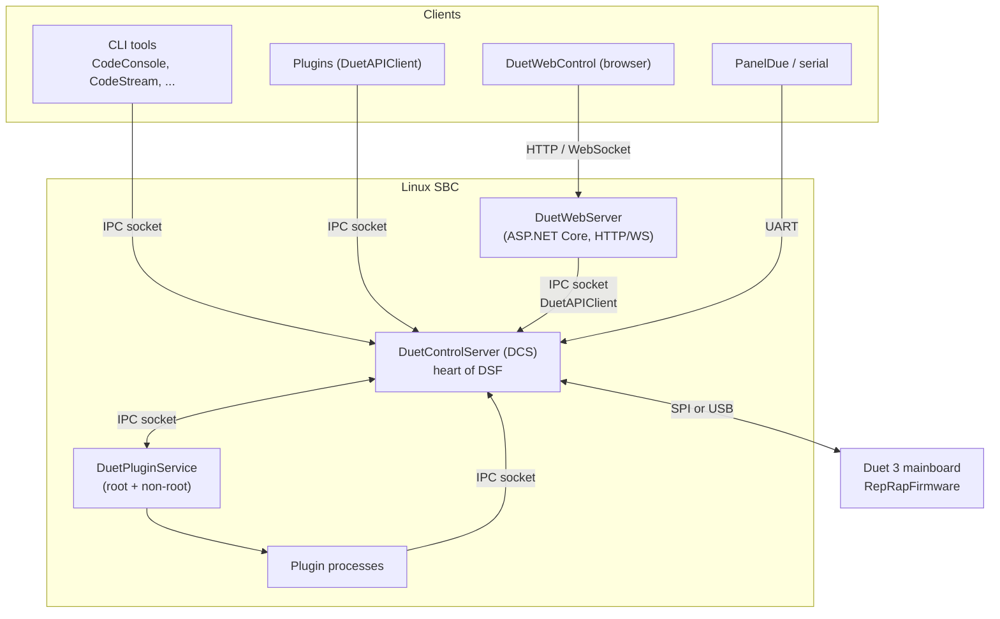

# Duet Software Framework

Duet Software Framework (DSF) is the software stack that runs on a Linux single-board computer (SBC,
typically a Raspberry Pi) attached to a Duet 3 mainboard. It replaces the firmware's own web server
and SD-card handling with a richer .NET-based environment, while RepRapFirmware (RRF) keeps doing the
real-time motion control on the Duet. The SBC and the Duet talk over a binary link, either SPI or USB.

This documentation describes how DSF is put together and how data flows through it. It complements the
auto-generated API reference (see the [DuetControlServer](../api/DuetControlServer.yml),
[DuetAPI](../api/DuetAPI.yml), [DuetAPIClient](../api/DuetAPIClient.yml) and
[DuetWebServer](../api/DuetWebServer.yml) namespaces).

## Articles

- [Components](components.md) - the processes and libraries that make up DSF
- [Object model](object-model.md) - the central machine-state data structure and how it is kept in sync
- [Inter-process communication](ipc.md) - the DCS Unix socket, connection modes, and command set
- [G-code flow](gcode-flow.md) - how a G/M/T-code is parsed, processed, and executed
- [Firmware link](firmware-link.md) - the binary protocol (SPI or USB) and firmware-initiated requests
- [File management](file-management.md) - the virtual SD card, path mapping, jobs, macros, file info
- [REST API](rest-api.md) - the HTTP endpoints exposed by DuetWebServer
- [Plugins](plugins.md) - the plugin model, the plugin service, and the permission system
- [Building from source](building.md) - prerequisites and deploying a build to an SBC

## High-level architecture

### What each piece does

- **DuetControlServer (DCS)** is the heart of DSF. It owns the [object model](object-model.md),
  runs the [G-code pipeline](gcode-flow.md), maps virtual SD paths to the Linux filesystem
  ([file management](file-management.md)), exposes the [IPC socket](ipc.md) for every other process,
  and drives the [Firmware link](firmware-link.md) to RRF.
- **DuetWebServer (DWS)** is an ASP.NET Core app that serves the DuetWebControl single-page app and
  the HTTP REST API. It does not talk to the Duet directly - it proxies everything to DCS over the
  IPC socket using [DuetAPIClient](components.md#duetapiclient). See [IPC](ipc.md) and
  [Components](components.md#duetwebserver).
- **DuetPluginService (DPS)** installs, starts, stops, and sandboxes [plugins](plugins.md). It runs
  as two instances (root and non-root) so that ordinary plugins never run with elevated privileges.
- **RepRapFirmware (RRF)** runs on the Duet and performs motion planning and real-time control. DCS
  forwards to RRF every code it does not handle itself, and RRF asks DCS for macros, file I/O, and
  SBC-side code execution over the same link.

### How the components connect

| From | To | Transport |
| --- | --- | --- |
| Browser (DWC) | DuetWebServer | HTTP + WebSocket |
| DuetWebServer | DCS | IPC Unix socket (`DuetAPIClient`) |
| CLI tools, plugins | DCS | IPC Unix socket (`DuetAPIClient`) |
| PanelDue / serial | DCS | UART |
| DCS | DuetPluginService | IPC Unix socket |
| DCS | RepRapFirmware | SPI (master + GPIO `TfrRdy`) or USB serial |

## Where to start

If you want to understand how a command typed in the web interface reaches the motors, read
[G-code flow](gcode-flow.md) first, then [Firmware link](firmware-link.md). If you are writing a plugin or an
external integration, start with [IPC](ipc.md) and [Components](components.md#client-libraries). If
you care about machine state, read [Object model](object-model.md).
