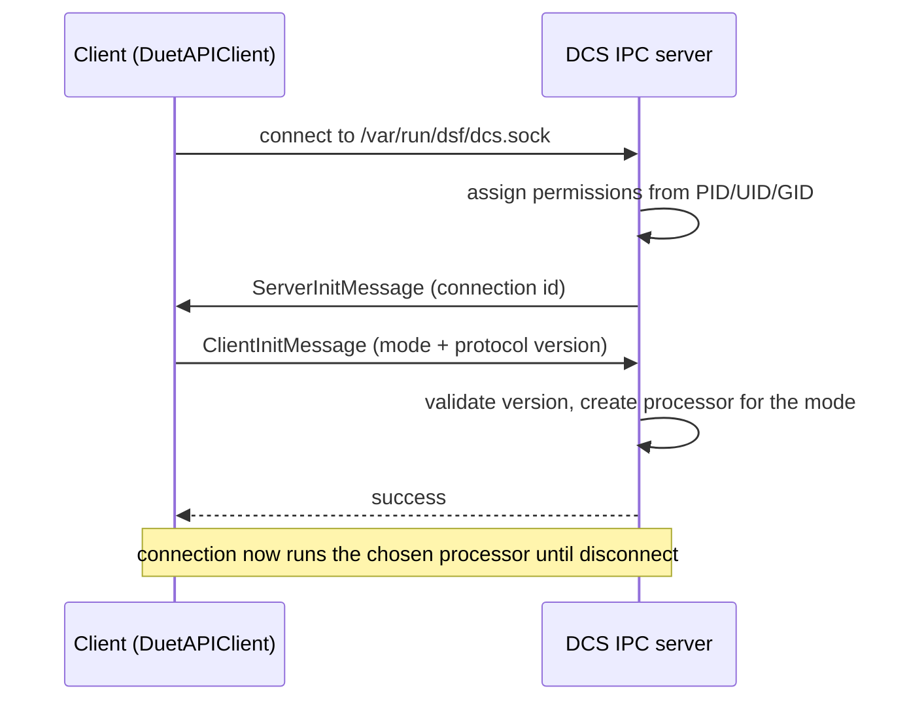

# Inter-process communication

Every process that is not RepRapFirmware reaches DCS through a single Unix domain socket, by default
`/var/run/dsf/dcs.sock`. DuetWebServer, the CLI tools, and plugins all use it through the
[DuetAPIClient](components.md#duetapiclient) library; the protocol itself is line-framed JSON.

- Server: `src/DuetControlServer/IPC/Server.cs`, `IPC/Connection.cs`
- Processors: `src/DuetControlServer/IPC/Processors/`
- Client: `src/DuetAPIClient/`

You do not have to use the .NET client. The `DuetAPI` and `DuetAPIClient` libraries are published on
NuGet (LGPL-3.0-or-later), and there is a separately maintained Python client - but any language that
can open a Unix socket and exchange JSON can speak the protocol directly, as shown below.

## Connecting



1. The client opens the socket. The server creates a `Connection` with a unique id and works out the
   client's [permissions](plugins.md#permissions) from its PID/UID/GID: root processes get everything;
   a plugin process is matched against the `Plugins` model (walking the parent-process tree) to inherit
   its manifest permissions; other external programs get everything except `SuperUser`.
2. The server sends a `ServerInitMessage`; the client replies with a `ClientInitMessage` naming the
   desired [connection mode](#connection-modes) and protocol version.
3. The server validates the version and instantiates the matching processor
   (`IPC/Processors/ProcessorFactory.cs`). From here the connection behaves according to its mode.

Permissions are enforced per command: each command type carries a `RequiredPermissionsAttribute`, and
`Connection.CheckPermissions` requires the client to hold at least one of the listed permissions
before the command runs.

### On the wire

Each message is a single JSON object terminated by a newline. The handshake and a `Command`-mode
exchange look like this (server messages prefixed `<-`, client `->`):

```text
<- {"id": 12, "version": 11}          # ServerInitMessage: connection id + protocol version
-> {"mode": "Command", "version": 11} # ClientInitMessage: chosen mode
<- {"success": true}                  # server acknowledges
-> {"command": "SimpleCode", "code": "G4 S3"}
<- {"success": true, "result": ""}    # sent once the code completes
```

The same framing carries every command and response; the `mode` chosen in the `ClientInitMessage`
decides which [processor](#connection-modes) handles the rest of the connection.

## Connection modes

The mode is chosen at connect time (`DuetAPI/Connection/Modes/ConnectionMode.cs`) and selects the
processor that drives the connection:

| Mode | Processor | Purpose |
| --- | --- | --- |
| `Command` | `Command.cs` | Run commands (including codes), query/patch the model, manage files, plugins, sessions |
| `CodeStream` | `CodeStream.cs` | Stream newline-delimited codes on a channel and read replies, no per-code JSON |
| `Intercept` | `CodeInterception.cs` | Plugin hook into the [code pipeline](gcode-flow.md#the-six-stage-code-pipeline) |
| `Subscribe` | `ModelSubscription.cs` | Receive the [object model](object-model.md) and its patches |
| `PluginService` | `PluginService.cs` | Internal channel between DCS and [DuetPluginService](plugins.md) |

### Command

The general-purpose request/response mode. The client sends a command as JSON; the processor
deserializes it, checks permissions, runs `ExecuteAsync`, and returns the result. This is what
[DuetWebServer](components.md#duetwebserver) uses for every HTTP request. The command set is grouped
under `src/DuetControlServer/Commands/`:

| Group | Examples | Permission (typical) |
| --- | --- | --- |
| Generic | `Code`, `SimpleCode`, `EvaluateExpression`, `Flush`, `WriteMessage`, `CheckPassword` | `CommandExecution` |
| Files | `GetFileInfo`, `ResolvePath` | `CommandExecution` / filesystem |
| ObjectModel | `GetObjectModel`, `QueryObjectModel`, `PatchObjectModel`, `SetWifiCountry`, `SyncObjectModel` | `ObjectModelRead` / `ObjectModelReadWrite` |
| Plugins | `InstallPlugin`, `StartPlugin(s)`, `StopPlugin(s)`, `ReloadPlugin`, `UninstallPlugin`, `SetPluginData`, `SetPluginProcess`, `NotifyPluginStarted` | `ManagePlugins` |
| HttpEndpoints | `AddHttpEndpoint`, `RemoveHttpEndpoint` | `RegisterHttpEndpoints` |
| UserSessions | `AddUserSession`, `RemoveUserSession` | `ManageUserSessions` |
| Packages | `InstallSystemPackage`, `UninstallSystemPackage` | `ManagePlugins` |

A `Code` command runs a full [`Code`](gcode-flow.md#the-code-object) object; `SimpleCode` parses one
or more codes from a text string. Both enter the [code pipeline](gcode-flow.md).

### CodeStream

A throughput-oriented mode: the client writes raw code lines to the socket's stream and reads replies
back, bound to one [code channel](gcode-flow.md#code-channels). There is no per-code JSON envelope, so
it suits feeding many codes (for example from a generator or a file) with minimal overhead.

### Intercept

Lets a plugin observe and alter codes as they pass through the pipeline. The client declares which
channels, code types, and interception stage it wants:

- **Pre** - before DCS processes the code internally,
- **Post** - after internal processing, before the code is sent to RRF,
- **Executed** - after the code has run.

For each intercepted code the plugin may `Resolve` it (supply a result and stop further processing),
`Cancel` it, `Ignore` it (let it continue untouched), or `Rewrite` it (replace it). See how these
stages sit in the pipeline in [G-code flow](gcode-flow.md#the-six-stage-code-pipeline).
`CodeLogger` and `DuetPiManagementPlugin` are working examples ([Components](components.md#command-line-tools-and-example-plugins)).

### Subscribe

Streams [object-model](object-model.md#observing-changes-and-patches) state to the client, either in
**Full** mode (the whole model after every update) or **Patch** mode (only the JSON diff). An optional
set of filter paths restricts what is sent. The [DuetWebServer WebSocket](components.md#duetwebserver)
and the `ModelObserver` tool both use this mode.

### PluginService

An internal mode used only by [DuetPluginService](plugins.md). It is bidirectional: DCS queues
commands (such as "start this plugin") for the plugin service to execute, and the plugin service uses
ordinary `Command`-mode connections back to DCS. The PID of the non-root plugin service is recorded so
plugin processes cannot impersonate it.

## Custom HTTP endpoints

A plugin with the `RegisterHttpEndpoints` [permission](plugins.md#permissions) can extend the HTTP API
served by [DuetWebServer](components.md#duetwebserver). It sends an `AddHttpEndpoint` command on a
`Command` connection:

```json
{
    "command": "AddHttpEndpoint",
    "endpointType": "GET",
    "namespace": "third-party-app",
    "path": "test",
    "uploadRequest": false
}
```

DCS replies with the path of a new Unix socket. The plugin listens on that socket; whenever a matching
request arrives at `/machine/{namespace}/{path}`, DuetWebServer's custom-endpoint middleware forwards
it there and relays the plugin's response back to the HTTP client. Setting `endpointType` to
`WebSocket` instead of an HTTP verb registers a bidirectional WebSocket endpoint. `RemoveHttpEndpoint`
unregisters it. The `CustomHttpEndpoint`
[example](components.md#command-line-tools-and-example-plugins) is a complete reference.

The forwarded request carries the transport peer's `remoteIPAddress` (null if it could not be
determined) and `remotePort`. DuetWebServer sets both from the real connection, so a remote caller
cannot spoof them - this lets an endpoint restrict actions to the local machine, e.g. by accepting a
request only when `remoteIPAddress` is a loopback address.

## See also

- [Components](components.md#client-libraries) - the client libraries that speak this protocol
- [Object model](object-model.md) - what the `Subscribe` mode streams
- [G-code flow](gcode-flow.md) - what the `Command`, `CodeStream`, and `Intercept` modes feed into
- [Plugins](plugins.md) - the permission model enforced on every command
