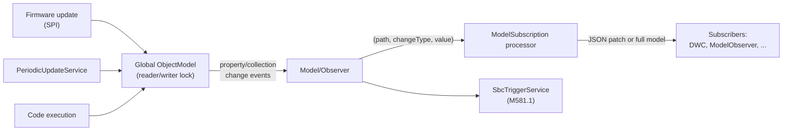

# Object model

The object model is the single structured representation of the machine's state - temperatures, axis
positions, the current job, network configuration, loaded plugins, and so on. Clients read it,
subscribe to changes to it, and reference it inside [expressions](gcode-flow.md#expression-evaluation).
It is defined once in [DuetAPI](components.md#duetapi) and maintained at runtime by DCS.

- Definition: `src/DuetAPI/ObjectModel/ObjectModel.cs` and the `ObjectModel/` subtree
- DCS provider and locking: `src/DuetControlServer/Model/ObjectModel.cs`, `Model/LockWrapper.cs`

## Top-level keys

`ObjectModel` exposes these top-level keys, each a subtree of the model:

| Key | Contents |
| --- | --- |
| `Boards` | Connected mainboard and expansion boards |
| `Directories` | Virtual directory paths (see [File management](file-management.md#directory-layout)) |
| `Fans` | Fan configurations |
| `Global` | User-defined global variables (arbitrary JSON values) |
| `Heat` | Heaters, sensors, and temperature control |
| `Inputs` | The state of each [code channel](gcode-flow.md#code-channels) |
| `Job` | The active print job (file, progress, layers, timing) |
| `LedStrips` | Addressable LED strip configurations |
| `Limits` | Machine configuration limits |
| `Messages` | Generic message log (status, errors, `M118` output) - SBC-maintained |
| `Move` | Axes, extruders, kinematics, compensation |
| `Network` | Interfaces and protocols - partly SBC-maintained |
| `Plugins` | Installed [plugins](plugins.md) - SBC-maintained |
| `Sensors` | Endstops, probes, and other sensors |
| `Spindles` | Spindle configurations |
| `State` | Machine status, message box, log level |
| `Tools` | Tool definitions |
| `Volumes` | Mass-storage volumes - SBC-maintained |

## Base types

Every node in the model derives from one of a small set of base types in
`src/DuetAPI/ObjectModel/Base/`. They all raise change notifications so the model can be observed:

- **`ModelObject`** - base class for a structured node. Implements `INotifyPropertyChanging` /
  `INotifyPropertyChanged` and updates properties through `SetPropertyValue`. Two flavours exist:
  static model objects (properties are updated in place) and dynamic ones (a property may be replaced
  with a new instance).
- **`StaticModelCollection<T>`** - an observable, typed list for fixed-schema arrays (`Tools`,
  `Boards`, `Fans`, ...). Raises granular add/remove/replace notifications.
- **`StaticModelDictionary<T>`** - a typed key/value store (`Plugins`). Keys keep their original case
  (they are not camel-cased). Supports a "null removes the item" mode.
- **`JsonModelDictionary`** - an untyped key/value store of raw JSON values, used for `Global`.

Two attributes annotate properties and drive query/merge behaviour:

- **`[SbcProperty]`** marks a property maintained by DSF rather than by the firmware. A constructor
  argument records whether it is also available in standalone mode. When firmware updates are merged
  these properties are skipped, and [expressions](gcode-flow.md#expression-evaluation) that reference
  them are evaluated on the SBC instead of being forwarded to RRF.
- **`[Live]`** marks frequently-changing properties (temperatures, positions) that are only included
  when the live query flag is set.

## JSON serialization

The model is serialized to JSON with a camelCase naming policy
(`src/DuetAPI/ObjectModel/ObjectModelContext.cs`): `State.Status` becomes `state.status`. Dictionary
keys (`Plugins`, `Global`) keep their original case. The companion source generator
(`src/DuetAPI.SourceGenerators/`) emits, for every model type, fast `UpdateFromJson` /
`UpdateFromJsonReader` and `Assign` methods used when merging firmware updates and cloning - this
avoids reflection on the hot path. The generated update code honours `[SbcProperty]` so a firmware
merge never clobbers SBC-owned state.

## Maintaining the model in DCS

### Locking

DCS holds one global `ObjectModel` instance, guarded by an async reader/writer lock
(`Model/LockWrapper.cs`, `Model/ObjectModel.cs`):

- `AccessReadOnly()` / `AccessReadOnlyAsync()` - many concurrent readers.
- `AccessReadWrite()` / `AccessReadWriteAsync()` - one exclusive writer.

The lock wrapper is disposable; releasing a write lock signals observers that the model changed.
Condition variables let callers wait for the next update (`WaitForUpdate`) or for a full firmware
update. A watchdog (`MaxMachineModelLockTime`) logs and shuts the app down if a lock is held too long,
to surface deadlocks rather than hang silently.

> Lock contention on this single model is a real failure mode: any long-running work must gather data
> outside the lock and apply it inside a short write-lock window. The periodic update service below is
> written this way.

### Updates from the firmware

`Model/UpdateService.cs` requests object-model JSON from RRF over the [Firmware link](firmware-link.md) and
merges each section with the generated `UpdateFromFirmwareJson` methods, skipping `[SbcProperty]`
fields. Per-section sequence numbers (`Seqs`) tell DCS which sections actually changed since the last
poll, so it only re-requests what moved.

Those requests do not ask RRF for null values, which would otherwise be spelled out for every unset
field on every poll. A property missing from the response is turned back into null by the generated
`UpdateFromJsonReader` methods instead: each of them tracks in a bitmask which properties the payload
contained and resets the nullable ones that were absent. Since RRF only reports a field if the query
asked for its category, the reset is guarded by a `ModelUpdateScope` that mirrors the flags of the
query the data came from - a live poll resets `[Live]` properties only, a full key query resets the
rest as well, and verbose or obsolete properties are only reset when the query asked for them.
Requests to DCS itself are unaffected: `GetObjectModel` and the subscriptions are patches, which
never reset anything.

`Model/PeriodicUpdateService.cs` fills in the host-side facts the firmware cannot know - network
interfaces, storage volumes, SBC CPU/memory/distribution info. It gathers these asynchronously
outside the lock, then applies them under a brief write lock.

### Observing changes and patches

`Model/Observer/Observer.cs` recursively subscribes to the change events of every node. When
something changes it raises `OnPropertyPathChanged` with the dotted path (e.g. `["state","status"]`),
a `PropertyChangeType` (`Property`, `Collection`, or the special `MessageCollection`), and the new
value. The [`ModelSubscription` IPC processor](ipc.md#connection-modes) turns these into JSON patches
(or sends the whole model, depending on the subscriber's mode) and pushes them to clients - this is
what drives the live DWC interface through the [DuetWebServer WebSocket](components.md#duetwebserver).

`Model/SbcTriggerService.cs` is a second observer: it re-evaluates `M581.1` external-trigger
expressions that reference SBC fields (which RRF cannot evaluate) whenever a relevant path changes,
and queues codes when a trigger fires.

## Querying by path

`Model/Filter.cs` resolves dotted paths such as `state.status` or `heat.heaters[0].current` into a
node traversal, and parses the query flags used by `M409` and the API: live-only, verbose, include
obsolete, include nulls, maximum depth, and an array start index for pagination. The same path
resolution backs SBC-side [expression evaluation](gcode-flow.md#expression-evaluation).

## See also

- [IPC](ipc.md) - the `Subscribe` connection mode and the object-model commands
- [G-code flow](gcode-flow.md#meta-codes-expressions-and-flow-control) - how expressions read the model
- [Firmware link](firmware-link.md) - where firmware updates come from
