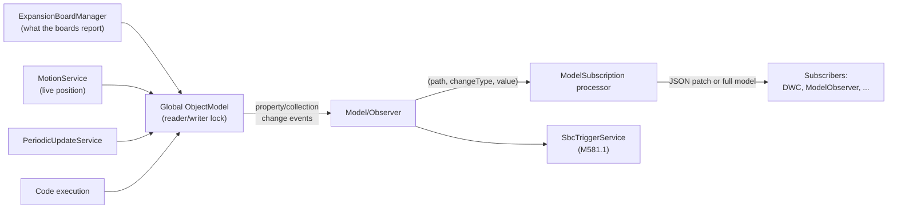

# Object model

The object model is the single structured representation of the machine's state - temperatures, axis
positions, the current job, network configuration, loaded plugins, and so on. Clients read it,
subscribe to changes to it, and reference it inside [expressions](gcode-flow.md#expression-evaluation).
It is defined once in [DuetAPI](components.md#duetapi) and maintained at runtime by DCS.

**DCS owns it outright.** There is no second copy on a firmware board to merge with, and no poll that
fetches one. A configuration code writes the model directly; the boards report readings that are
written into it; everything else derives from it. That makes the model more than a mirror of the
machine - it is the *only* description of the machine that survives a restart, so a code that
configures something is required to store it here and not merely send it over CAN. That rule, and what
it added to the model, are in [Differences from RepRapFirmware][om-rule].

[om-rule]: rrf-differences.md#3-the-object-model-has-to-be-able-to-recreate-the-machine

- Definition: `src/DuetAPI/ObjectModel/ObjectModel.cs` and the `ObjectModel/` subtree
- DCS provider and locking: `src/DuetControlServer/Model/ObjectModel.cs`, `Model/LockWrapper.cs`

## Top-level keys

`ObjectModel` exposes these top-level keys, each a subtree of the model:

| Key | Contents |
| --- | --- |
| `Boards` | Connected mainboard and expansion boards |
| `Directories` | Virtual directory paths (see [File management](file-management.md#directory-layout)) |
| `Fans` | Fan configurations |
| `Global` | User-defined global variables (arbitrary JSON values) |
| `Heat` | Heaters, sensors, and temperature control |
| `Inputs` | The state of each [code channel](gcode-flow.md#code-channels) |
| `Job` | The active print job (file, progress, layers, timing) |
| `LedStrips` | Addressable LED strip configurations |
| `Limits` | Machine configuration limits |
| `Messages` | Generic message log (status, errors, `M118` output) - SBC-maintained |
| `Move` | Axes, extruders, kinematics, compensation |
| `Network` | Interfaces and protocols - partly SBC-maintained |
| `Plugins` | Installed [plugins](plugins.md) - SBC-maintained |
| `Sensors` | Endstops, probes, and other sensors |
| `Spindles` | Spindle configurations |
| `State` | Machine status, message box, log level |
| `Tools` | Tool definitions |
| `Volumes` | Mass-storage volumes - SBC-maintained |

## Base types

Every node in the model derives from one of a small set of base types in
`src/DuetAPI/ObjectModel/Base/`. They all raise change notifications so the model can be observed:

- **`ModelObject`** - base class for a structured node. Implements `INotifyPropertyChanging` /
  `INotifyPropertyChanged` and updates properties through `SetPropertyValue`. Two flavours exist:
  static model objects (properties are updated in place) and dynamic ones (a property may be replaced
  with a new instance).
- **`StaticModelCollection<T>`** - an observable, typed list for fixed-schema arrays (`Tools`,
  `Boards`, `Fans`, ...). Raises granular add/remove/replace notifications.
- **`StaticModelDictionary<T>`** - a typed key/value store (`Plugins`). Keys keep their original case
  (they are not camel-cased). Supports a "null removes the item" mode.
- **`JsonModelDictionary`** - an untyped key/value store of raw JSON values, used for `Global`.

Two attributes annotate properties and drive query/merge behaviour:

- **`[SbcProperty]`** marks a property that exists only when DSF is present - `network`, `sbc`,
  `volumes`, `plugins`, `job` and parts of `directories` - as opposed to one a standalone Duet would
  also have. A constructor argument records whether it is available in standalone mode too. It used to
  carry a second meaning, "skip this when merging a firmware update, and evaluate it locally rather
  than forwarding the expression"; with no firmware model to merge and no expression forwarded, only
  the descriptive meaning is left.
- **`[Live]`** marks frequently-changing properties (temperatures, positions) that are only included
  when the live query flag is set.

## JSON serialization

The model is serialized to JSON with a camelCase naming policy
(`src/DuetAPI/ObjectModel/ObjectModelContext.cs`): `State.Status` becomes `state.status`. Dictionary
keys (`Plugins`, `Global`) keep their original case. The companion source generator
(`src/DuetAPI.SourceGenerators/`) emits, for every model type, fast `UpdateFromJson` /
`UpdateFromJsonReader` and `Assign` methods - this avoids reflection on the hot path when a client
patch is applied or the model is cloned for a subscriber.

## Maintaining the model in DCS

### Locking

DCS holds one global `ObjectModel` instance, guarded by an async reader/writer lock
(`Model/LockWrapper.cs`, `Model/ObjectModel.cs`):

- `AccessReadOnly()` / `AccessReadOnlyAsync()` - many concurrent readers.
- `AccessReadWrite()` / `AccessReadWriteAsync()` - one exclusive writer.

The lock wrapper is disposable; releasing a write lock signals observers that the model changed.
`WaitForUpdate` lets a caller wait for the next change. A watchdog (`MaxMachineModelLockTime`) logs
and shuts the app down if a lock is held too long, to surface deadlocks rather than hang silently.

> Lock contention on this single model is a real failure mode: any long-running work must gather data
> outside the lock and apply it inside a short write-lock window. The periodic update service below is
> written this way.

### Who writes what

There are four writers, and no polling of another program's model among them:

| Writer | Writes |
| --- | --- |
| **Code handlers** (`Codes/Handlers/`) | Everything a code configures: `move.*`, `heat.*`, `fans[]`, `tools[]`, `sensors.*`, `boards[].drivers[]`, `state.*`. Under the write lock, as part of executing the code |
| **`Link/Expansion/ExpansionBoardManager.cs`** | What the boards report: announcements into `boards[]`, temperatures into `sensors.analog[]`, heater state, fan RPM, driver status, input changes into `sensors.endstops[]` / `sensors.gpIn[]`. A bounded queue with the oldest entry dropped when full, because these are periodic reports where the newest is worth more than a backlog |
| **`Motion/MotionService.cs`** | The live position - `move.axes[].machinePosition` from the engine's snapshot, so the field means where the machine *is* rather than where the last move was planned to end |
| **`Model/PeriodicUpdateService.cs`** | Host-side facts nothing else can know: network interfaces, storage volumes, SBC CPU/memory/distribution info. Gathered asynchronously outside the lock, applied under a brief write lock |

`Model/UpdateService.cs` still exists but is compiled out: it was the service that fetched object-model
JSON from RepRapFirmware section by section, guided by per-section sequence numbers, and nothing
produces that JSON any more.

### Observing changes and patches

`Model/Observer/Observer.cs` recursively subscribes to the change events of every node. When
something changes it raises `OnPropertyPathChanged` with the dotted path (e.g. `["state","status"]`),
a `PropertyChangeType` (`Property`, `Collection`, or the special `MessageCollection`), and the new
value. The [`ModelSubscription` IPC processor](ipc.md#connection-modes) turns these into JSON patches
(or sends the whole model, depending on the subscriber's mode) and pushes them to clients - this is
what drives the live DWC interface through the [DuetWebServer WebSocket](components.md#duetwebserver).

`Model/SbcTriggerService.cs` is a second observer: it re-evaluates `M581.1` external-trigger
expressions whenever a relevant path changes, and queues codes when a trigger fires.

## Querying by path

`Model/Filter.cs` resolves dotted paths such as `state.status` or `heat.heaters[0].current` into a
node traversal, and parses the query flags used by `M409` and the API: live-only, verbose, include
obsolete, include nulls, maximum depth, and an array start index for pagination. The same path
resolution backs SBC-side [expression evaluation](gcode-flow.md#expression-evaluation).

## See also

- [IPC](ipc.md) - the `Subscribe` connection mode and the object-model commands
- [G-code flow](gcode-flow.md#meta-codes-expressions-and-flow-control) - how expressions read the model
- [CAN messages](can-messages.md) - where the readings the boards report arrive from
- [Differences from RepRapFirmware](rrf-differences.md#3-the-object-model-has-to-be-able-to-recreate-the-machine) -
  why the model has to be able to rebuild the machine
