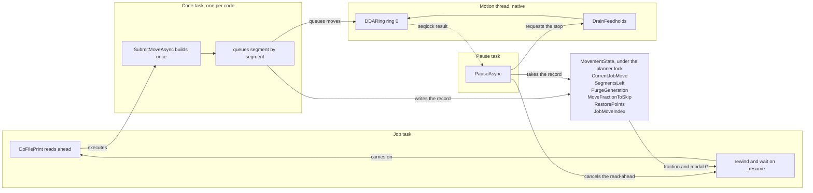
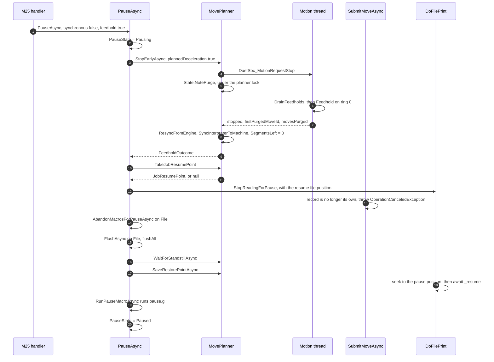
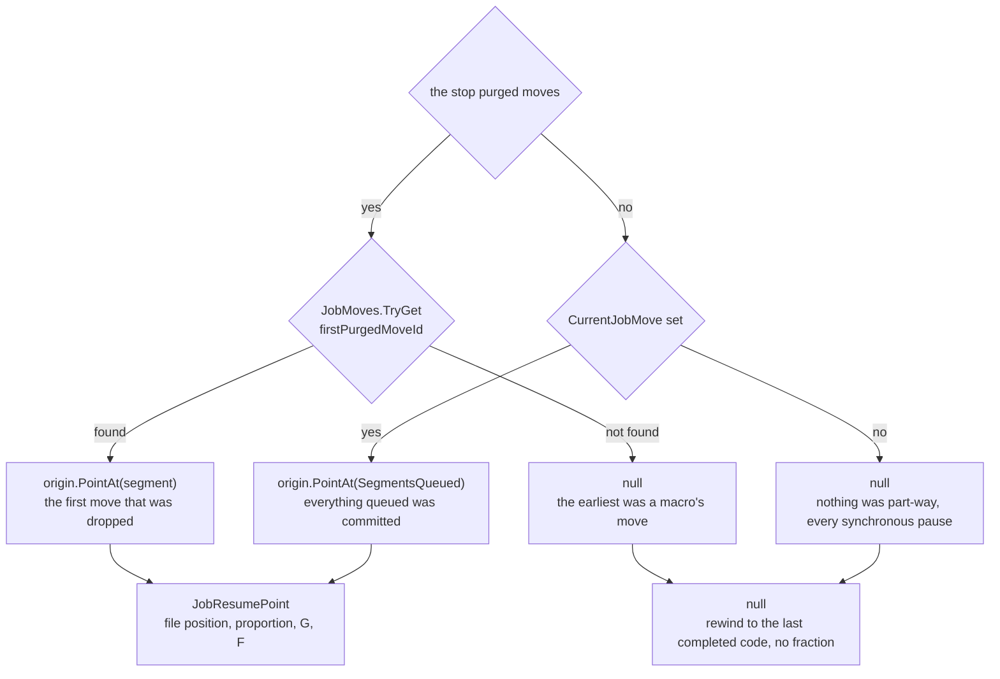
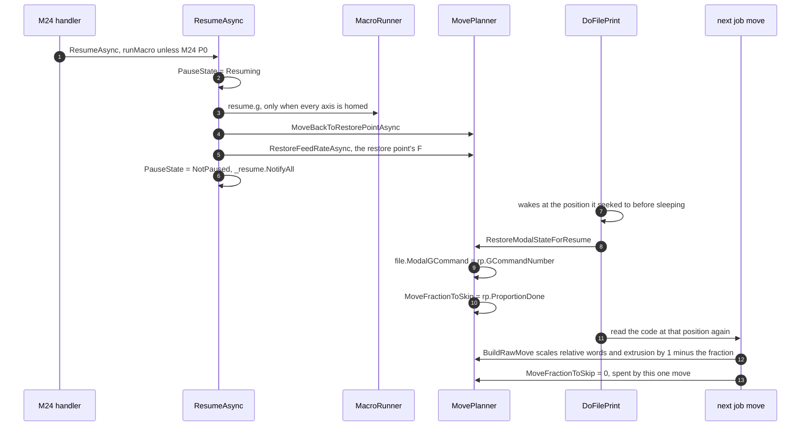
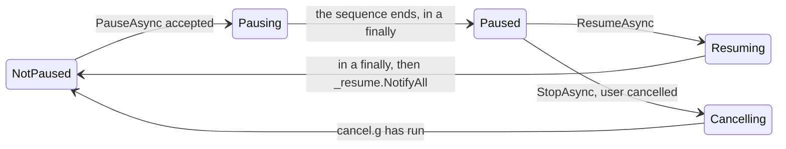

# Pausing and resuming a job

What happens between `M25` and the next segment the machine makes: where the head comes to rest, what
is recorded there, and how a line the machine is half way through is finished rather than repeated.

The parts that are unusual all come from one fact. RepRapFirmware pauses from inside the loop it is
interrupting, so the interpreter, the move queue and the pause are the same task. Here they are four
tasks that run at once, and a pause has to interrupt three of them from outside.

Related reading: [File management](file-management.md#print-jobs) covers the job loop and the seek
this hangs off; [G-Code flow](gcode-flow.md) covers the pipeline whose codes a pause cancels;
[Differences from RepRapFirmware](rrf-differences.md#8-a-pause-stops-the-machine-sooner-than-reprapfirmwares-does)
covers the one deliberate deviation, which is §3 below. The reasoning behind the design, and what is
still missing, is [JOB_LIFECYCLE.md](docs/devel/JOB_LIFECYCLE.md).

---

## 1. The shape of it

| Task | Entered from | What it owns |
|---|---|---|
| `DoFilePrint` | the job's background task | reading codes, the file position it falls back to, the seek and the wait |
| `SubmitMoveAsync` | each `G0`/`G1` on the job channel | building the move once, queueing its segments, the record while the code is in flight |
| `PauseAsync` | `M25`, `M226`/`M600`/`M601`, an event's default action | the stop, the take, the restore point, `pause.g` |
| `MotionService` loop | the native motion thread | the DDA ring, and the only code allowed to free a queued move |

The job reads far ahead of the machine, so at the instant a pause arrives the file is typically some
lines past the move the head is making, and one of those lines is usually part-way into the queue.
Everything below is about naming that line and how much of it is already behind the machine.

---

## 2. Two kinds of pause

A pause is **synchronous** when the job file has itself reached the pause point, and **asynchronous**
when something else interrupts the job. The distinction is RepRapFirmware's `DoSynchronousPause` and
`DoAsynchronousPause`, and it decides one thing: whether the moves already queued are what has to
run, or what has to be dropped.

| Entry point | Path | Stop | Macro |
|---|---|---|---|
| `M25` from a console or interface | asynchronous | feedhold | `pause.g` |
| `M25` from the job file | synchronous | none, the queue is what has to run | `pause.g` |
| `M226`, `M601` | synchronous | none | `pause.g`, or none for `M226 P0` |
| `M600` | synchronous | none | `filament-change.g`, falling back to `pause.g` |
| `heater_fault`, `filament_error` default action | asynchronous | feedhold | `pause.g` |
| `driver_error` default action | asynchronous | feedhold | none, a driver in error is not asked to move |
| Any of the above during a macro that cannot restart | deferred | whichever it becomes when it runs | as asked for |

`M226`, `M600` and `M601` are refused outside a job file with "use M226/600/601 only within a file
being printed". `M25` on the second file channel returns without doing anything: the restore point
and the interpreter state belong to the first channel, so a fork of the job neither pauses itself nor
records anything.

**A deferred pause** waits for the job to leave a macro that has not declared itself pausable
(`M98 R1` from inside the macro, and `ChannelProcessor.CanRestartMacros`, which walks the channel's
whole macro stack). Abandoning such a macro part-way would
leave whatever it had already done with no way to put it back. The request is stashed and injected by
`CheckForDeferredPauseAsync` as soon as the job is back out, which RepRapFirmware does at the same
point.

---

## 3. How the machine comes to rest

An asynchronous pause plans its own stop. This is the one deliberate deviation from RepRapFirmware in
this subsystem, and [rrf-differences §8](rrf-differences.md#8-a-pause-stops-the-machine-sooner-than-reprapfirmwares-does)
is the entry for it: RepRapFirmware searches the queue for a junction that is already slow enough to
stop at and, during a print at speed, finds none, so the whole queue runs. Here the engine takes the
earliest boundary far enough away to decelerate by, forces the end speed there to zero, re-plans
backwards to the last move it has already committed, and frees the rest.

Three parts of that order are load bearing:

- **The request and the answer are separate calls.** Freeing a move frees its segments, and only the
  motion thread may do that, so the result cannot come back from the call that asks for the stop. It
  is published through a seqlock and polled every 2 ms, which is also why `DrainFeedholds` collapses
  several requests into one stop, the strongest winning.
- **`NotePurge` runs when the stop is requested, not when it is answered.** `PurgeGeneration` says
  one thing to every channel: the ring was emptied, so anything you were part-way through is void.
  Bumping it early is what keeps a segmented move from feeding a ring that is about to be emptied.
- **The take comes before the cancellation.** It fixes how much of the interrupted code went out;
  `StopReadingForPause` would otherwise end that submission somewhere the pause had not looked.

**If the engine refuses, or reports that it did not stop**, nothing is purged and the queue drains as
it would have without the feedhold. The code that was going out is still truncated by the pause, and
still recorded, so the resume asks for the rest of that code and no more. RepRapFirmware does the same
in its own "no moves skipped, but there is a move waiting" branch.

Only ring 0 is stopped. A second motion system would need its own stopping point and its own restore
data, which is what `M596` brings into existence.

---

## 4. Where the job carries on from

A move the engine knows is one **segment**, not one line of the file: the height map and a
non-Cartesian geometry both need a line divided. So the boundary a stop lands on is usually inside a
G-code, and every segment of that code carries the same file position. Rewinding to it and reading
the line again plainly would ask for the whole line a second time.

While a job movement code is in flight the interpreter holds one record of it,
`MovementState.CurrentJobMove`: the file position, the code's length, the modal G command, the feed
rate it was read with, the fraction the build started from, its segment count, and how many segments
have gone to the ring. `JobMoveIndex` maps each queued move id to that record and to the move's own
place in it. The file position and the fraction are fields of one record, so they cannot come to
describe different lines.

`MovePlanner.TakeJobResumePoint` reads it once, under the planner lock:

Those are RepRapFirmware's three branches of `DoAsynchronousPause`, each of which fills in the file
position and the proportion together. Two cases are worth spelling out:

- **The earliest dropped move cannot be named.** It belonged to a macro. A macro's file position is
  an offset into the macro and the resume rewinds the job file, so recording one would send the job
  somewhere unrelated. The resume goes back to the last completed job code, which is the line that
  invoked the macro, and the macro runs again whole.
- **Every segment of the code reached the ring.** Nothing of that code is still owed, so the resume
  point is the code *after* it rather than its own start with all of it skipped.

The fraction is a fraction of the **whole code**, however many times the job has been stopped inside
it. A resume rebuilds only what is left, so a second stop inside the same code composes:
`fractionAtStart + (1 - fractionAtStart) x segmentsMade / segmentCount`.

### What the fraction applies to

| The line says | Owed after resuming | Why |
|---|---|---|
| an absolute axis target (G90) | the target, unscaled | the head is moved back to where it stopped, so the rest of the line is the rest of the move |
| a relative axis word (G91) | the word x `1 - proportionDone` | it is a distance to travel, and part of it has been travelled |
| extrusion, in either mode | the amount x `1 - proportionDone` | extrusion is an amount however the file expresses it |

The last row includes absolute extrusion. An axis has a start that the resume moves; an extruder does
not, because the engine carries the fraction of a step between moves, so the amount itself is what
shrinks.

Two more things travel with the fraction, because the line being resumed is one the file was already
reading rather than one it was about to start:

- **the modal G command**, since the line may be a bare `X100 Y100 E5` whose `G1` is several lines
  above the rewind point, and seeking throws the parser's modal state away;
- **the feed rate the line was read with**, unscaled by `M220`, since the line need not name `F`.
  Restoring the scaled one would fold the speed factor into the file's own feed rate on every pause.

Only the job file's own codes may spend the fraction. A macro invoked between the resume and the
job's next move runs on the same channel, and would otherwise be shortened by what the job is owed.

---

## 5. What a pause leaves behind

Once the machine has settled, `SaveRestorePointAsync` writes restore point 1, which is the pause
point (`RestorePoint.PauseNumber`; 2 is the tool change, and `G60 S<n>` writes 0 to 5):

| Field | From | Visible as |
|---|---|---|
| `Coords` | the interpreter position, put back in step with the machine by the stop | `move.motionSystems[0].restorePoints[1].coords`, and the deprecated `state.restorePoints[1]` |
| `FeedRate` | the resume point, else the channel's feed rate | `.feedRate` |
| `GCommandNumber` | the resume point | `.gCommandNumber` |
| `ToolNumber`, `FanSpeed` | the machine at the moment it stopped | `.toolNumber`, `.fanPwm` |
| `ProportionDone` | the resume point | not published: it is how to resume, not where the machine is |
| `FilePosition` | not written here: the job holds the position and seeks with it | `job.filePosition`, once the seek has happened |
| `VirtualExtruderPosition` | nothing yet, see §9 | `.extruderPos` |

Then `pause.g` runs, or `filament-change.g` for `M600` with `pause.g` as the fallback, on the channel
that asked for the pause. Neither runs unless every axis is homed: both are written to lift and park
the head, and neither is meaningful on a machine that does not know where it is. The reply is
`Printing paused at X... Y... Z...`, taken from the restore point.

The job task, meanwhile, has stopped reading, drained what it had read ahead, seeked to the pause
position, and is waiting. Block state does not survive that seek: an open `while` is re-parsed from
the rewound position, so its counter starts again ([file management](file-management.md#print-jobs)).

---

## 6. Resuming

**The head goes back in one move or two.** When it is above the pause point the resume travels across
first and descends afterwards, so the nozzle does not drag through the print; when it is at or below
the pause point every axis moves together. That is RepRapFirmware's `resuming1` and `resuming2`, and
only the single-motion-system branch of it is ported.

**Nothing is replanned.** The purged moves are not stored, re-planned or re-submitted. The file is
read again from the recorded position and the moves are rebuilt from whatever state the machine is in
after `resume.g`, which may have changed the tool, the temperatures or the position. That is the only
correct thing to do, and it is RepRapFirmware's resume path unchanged.

`M24 P0` skips `resume.g`. `M24` on a file that was selected but never started runs `start.g` instead
and begins the job, which is also what `M32` does.

---

## 7. Job states

The order matters as much as the values, and it is RepRapFirmware's:

| State | What it changes | Published as |
|---|---|---|
| `Pausing` | the job stops reading codes at once, and a second `M25` is refused with "Printing is already paused!" | `state.status` = `pausing` |
| `Paused` | `M24` resumes, `M0`/`M1`/`M2` cancel | `paused` |
| `Resuming` | a repeated `M24` is ignored rather than refused: the machine is already going where it was asked | `resuming` |
| `Cancelling` | `cancel.g` is running after the file has already been closed | `cancelling` |

Both exits settle in a `finally`. If `pause.g` or `resume.g` is aborted part-way, the machine still
reports the state it is actually in rather than reporting a transition for ever.

---

## 8. Starting part-way through a line: M26

`M26` is the same problem from the other end. `M26 S<offset>` seeks the job file, and the two
parameters that go with it describe how the line at that offset is to be read:

- `P<fraction>` is how much of the line the machine has already made,
- `C<number>` is the modal G command it was read under.

Both are held until `M24`, because that is what starts printing, and they take exactly the route a
resumed pause takes: `RestartMoveFractionDone` and `RestartGCommandNumber` become
`MoveFractionToSkip` and the file's modal command, and the first move built afterwards is scaled by
what is left. This is what a `resurrect.g` written after a power failure uses; writing that file is
not implemented (§9).

---

## 9. What is not there yet

| Gap | Effect |
|---|---|
| The virtual extruder position | The restore point publishes zero for `extruderPos`. What has to be recorded is the extruder position at the *start* of the interrupted line, since the resume rewinds the absolute-extrusion reference to it. It waits on the extrusion totals |
| Arcs, and firmware retraction | `G2`/`G3` and `G10`/`G11` are not implemented. When they land, an arc must not carry a restartable boundary except on its last segment, and a retraction must not carry one at all, or a resumed line would recompute the arc centre from the wrong start or retract twice |
| Power-fail resume | `resurrect.g`, `M911` and `M916`. `M26 P` and `C` are the half of it that exists |
| A second motion system | Only ring 0 is stopped, and only the first file channel records or spends a fraction. `M596` and `M598` widen both together |
| `M25.1` | A fraction on `M25` is accepted as `M25` rather than looked for as `sys/M25.1.g` |

[JOB_LIFECYCLE.md](docs/devel/JOB_LIFECYCLE.md) tracks all of these, along with the reasoning behind
the design above.
