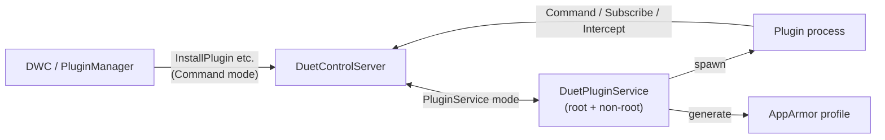

# Plugins

DSF can be extended with plugins. A plugin may ship a DuetWebControl (DWC) component (web UI),
an SBC component (a background executable on the Linux side), or both. SBC plugins connect to DCS
through the [IPC socket](ipc.md) like any other client, but their installation, lifecycle, and
sandboxing are handled by a dedicated service.

The end-user-facing packaging guide is the repository [`PLUGINS.md`](https://github.com/Duet3D/DuetSoftwareFramework/blob/v3.5-dev/PLUGINS.md).
This article covers the runtime architecture.

- Plugin service: `src/DuetPluginService/`
- Manifest and runtime types: `src/DuetAPI/ObjectModel/Plugins/`
- Permissions: `src/DuetAPI/Utility/SbcPermissions.cs`, `Utility/RequiredPermissionsAttribute.cs`
- DCS-side commands: `src/DuetControlServer/Commands/Plugins/`

## DuetPluginService

[DuetPluginService](components.md#duetpluginservice) (DPS) is a separate process - in fact two
processes:

- a **non-root** instance that runs ordinary plugins, and
- a **root** instance (disabled by default; requires `RootPluginSupport` in the DCS config) that runs
  plugins declaring the `SuperUser` permission.

Splitting privileged from unprivileged plugins keeps ordinary plugins out of root, and lets systemd
tear down a plugin's child processes cleanly when the service stops.



DCS and DPS communicate over the dedicated [`PluginService` connection mode](ipc.md#connection-modes):
DCS queues lifecycle commands for DPS to carry out, and DPS (and the plugins it spawns) use ordinary
`Command`-mode connections back to DCS.

## Lifecycle

`DuetPluginService/PluginService.cs` and the commands under `DuetPluginService/Commands/` implement:

1. **Discovery** - on startup DPS scans the plugin directory (`/opt/dsf/plugins/`) for manifest JSON
   files and loads them into an in-memory `PluginStore`.
2. **Install** (`InstallPlugin`) - extract the package, register the manifest, and generate the
   plugin's AppArmor profile.
3. **Start** (`StartPlugin`) - validate that the plugin matches the service type (`SuperUser` plugins
   only on the root instance), that its AppArmor profile exists, and that the executable is not a
   symlink (which would defeat the profile); then spawn the process for the SBC's CPU architecture
   (`arm`, `arm64`, `x86`, `x86_64`). If the manifest sets `sbcNotifyStarted`, DPS waits for the
   plugin to call `NotifyPluginStarted` before reporting it as started. The PID is written back into
   the [`Plugins` object-model key](object-model.md#top-level-keys) via `SetPluginProcess` so DCS can
   resolve the plugin's [permissions](#permissions) on future IPC connections.
4. **Stop / Reload / Uninstall** - terminate the process (SIGTERM then SIGKILL on timeout) and, for
   uninstall, remove files and the AppArmor profile.

## Package layout

A plugin is distributed as a single ZIP file with `plugin.json` in its root and up to three component
directories:

| Path in ZIP | Installed to | Holds |
| --- | --- | --- |
| `plugin.json` | manifest store | The required [manifest](#manifest) |
| `dwc/` | symlinked to `0:/www/<PluginName>` | DuetWebControl web assets |
| `dsf/` | the plugin directory under `/opt/dsf/plugins/` | SBC executable and config files |
| `sd/` | `0:/` (the [virtual SD card](file-management.md#path-mapping)) | Files seeded onto the SD tree |

For security the installer rejects packages containing path traversal (`..`) or files that would
overwrite firmware or core configuration: `sd/firmware/*`, `sd/sys/config.g`, and
`sd/sys/config-override.g`.

## Manifest

A plugin is described by a `plugin.json` manifest (`src/DuetAPI/ObjectModel/Plugins/PluginManifest.cs`).
`id`, `name`, and `author` are always required; `id` is alphanumeric (max 32 chars) and `name` allows
spaces, dashes, and underscores (max 64 chars). A minimal example:

```json
{
  "id": "DemoPluginId",
  "name": "Demo Plugin",
  "author": "Demo Author",
  "version": "1.0.0",
  "license": "LGPL-3.0-or-later",
  "dwcVersion": "3.3.0",
  "dwcDependencies": [],
  "sbcRequired": false,
  "sbcDsfVersion": null,
  "sbcExecutable": null,
  "sbcPermissions": [],
  "sbcPackageDependencies": [],
  "sbcPythonDependencies": [],
  "sbcPluginDependencies": [],
  "rrfVersion": null,
  "data": {}
}
```

Key field groups:

- **Metadata** - `id`, `name`, `author`, `version`, `license`, `homepage`, `tags`.
- **DWC part** - `dwcVersion` and `dwcDependencies` (IDs of plugins that must load first; circular
  dependencies are not supported), plus the web resources installed under `0:/www/`.
- **SBC part** - `sbcRequired`, `sbcDsfVersion`, `sbcExecutable` (+ arguments), `sbcAutoRestart`,
  `sbcNotifyStarted`, `sbcOutputRedirected`, `sbcPermissions`, and `sbcConfigFiles` (preserved across
  upgrades).
- **Version dependencies** - specify a `major.minor` version per component so DSF/DWC can refuse an
  incompatible plugin (use the full version string for beta releases).

### Dependencies

- **`sbcPluginDependencies`** - other plugins that must start first.
- **`sbcPackageDependencies`** - apt packages the plugin needs.
- **`sbcPythonDependencies`** - (DSF 3.4+) Python packages installed into a per-plugin virtual
  environment, using pip version syntax (for example `"dsf-python==3.4.5"`); DSF 3.6+ also accepts
  Git requirements.

The runtime `Plugin` type extends the manifest with state: the installed file lists, the process `Pid`
(-1 not started, 0 shutting down, >0 running), and a `Started` flag.

## Permissions

A plugin requests capabilities through `SbcPermissions` (`src/DuetAPI/Utility/SbcPermissions.cs`),
a flags enum. Permissions are additive, and a command runs if the caller holds at least one of the
permissions its `RequiredPermissionsAttribute` lists. They fall into two enforcement classes:

**DSF-enforced** - checked in DCS code when an [IPC command](ipc.md#command) is invoked:

| Permission | Grants |
| --- | --- |
| `commandExecution` | Execute generic commands and codes |
| `codeInterceptionRead` | Read codes from the [interception](ipc.md#intercept) streams without modifying them |
| `codeInterceptionReadWrite` | Read and modify intercepted codes |
| `managePlugins` | Install/load/unload/uninstall plugins (also grants filesystem access) |
| `manageUserSessions` | Add or remove user sessions |
| `objectModelRead` | Read the [object model](object-model.md) |
| `objectModelReadWrite` | Read and write the object model |
| `registerHttpEndpoints` | Register [HTTP endpoints](ipc.md#custom-http-endpoints) |

**AppArmor-enforced** - mapped to filesystem/device rules in the generated profile:

| Permission | Grants |
| --- | --- |
| `readFilaments` / `writeFilaments` | Access to `0:/filaments` |
| `readFirmware` / `writeFirmware` | Access to `0:/firmware` |
| `readGCodes` / `writeGCodes` | Access to `0:/gcodes` |
| `readMacros` / `writeMacros` | Access to `0:/macros` |
| `readSystem` / `writeSystem` | Access to `0:/sys` |
| `readWeb` / `writeWeb` | Access to `0:/www` |
| `fileSystemAccess` | Read and write all files |
| `launchProcesses` | Launch new processes |
| `networkAccess` | Stand-alone network access |
| `webcamAccess` | Access webcam devices |
| `gpioAccess` | Access GPIO (`/dev/gpiochip*`), SPI, and I2C devices |

**`superUser`** runs the plugin as root via the root DPS instance, with no AppArmor confinement.
Dangerous; off by default. A user installing a plugin from the web interface is shown the permissions
it requests and must approve them. Plugins installed outside `/opt/dsf/plugins` receive full
permissions for backward compatibility.

### AppArmor profiles

`DuetPluginService/PermissionManagers/AppArmorPermissionManager.cs` builds a per-plugin profile from a
template: it substitutes the plugin's directory, then for each AppArmor-enforced permission in the
manifest emits the corresponding rule (for example `ReadGCodes` -> read access to `0:/gcodes/**`,
`NetworkAccess` -> network and name-service rules), and loads it with `apparmor_parser`. DSF-enforced
permissions add no AppArmor rules - DCS gates those itself.

## DWC vs SBC plugins

- A **DWC plugin** is web UI only: its resources are installed under `0:/www/` and loaded by the
  browser. It needs no SBC component.
- An **SBC plugin** is a background executable that talks to DCS over the [IPC socket](ipc.md). It can
  register [HTTP endpoints](ipc.md#custom-http-endpoints), [intercept codes](ipc.md#intercept), or
  [subscribe](ipc.md#subscribe) to the model.
- A plugin may provide both for a full feature.

## Shared data

Every plugin appears in the [object model](object-model.md) under the `plugins` key, including its
`data` dictionary - arbitrary values a plugin can publish for other plugins, for the web interface, or
for [G-code expressions](gcode-flow.md#expression-evaluation) to read. A plugin with an SBC executable
sets its data with the `SetPluginData` command (which needs `objectModelReadWrite`, plus `managePlugins`
to write *another* plugin's data); a DWC-only plugin uses `PATCH /machine/plugin`
([REST API](rest-api.md#plugins)).

## See also

- [IPC](ipc.md) - how plugins connect and which commands need which permissions
- [Components](components.md#command-line-tools-and-example-plugins) - `CodeLogger`, `CustomHttpEndpoint`,
  and `PluginManager` as references
- [G-code flow](gcode-flow.md#the-six-stage-code-pipeline) - where interception plugins hook in
