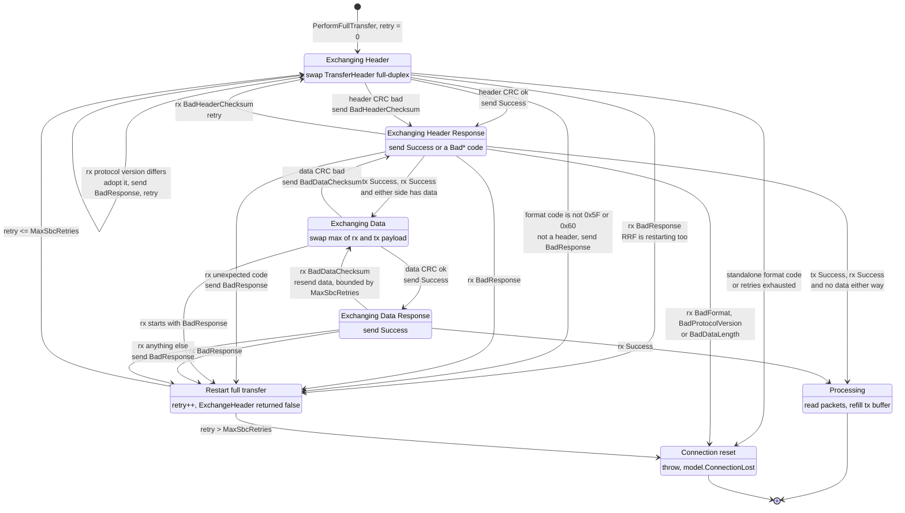
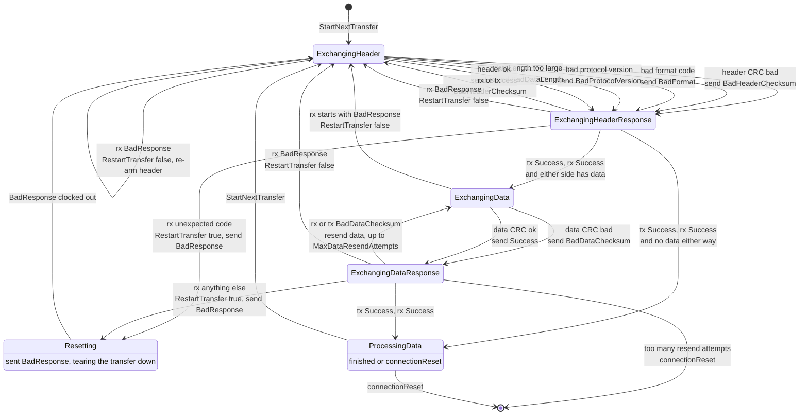
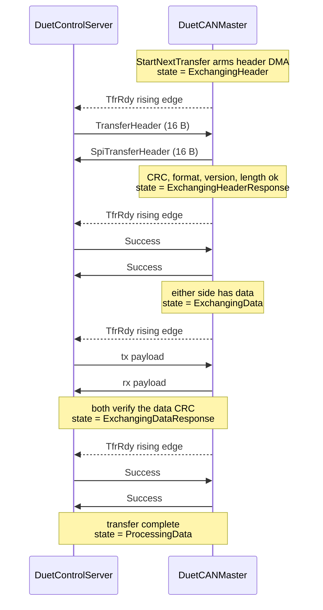
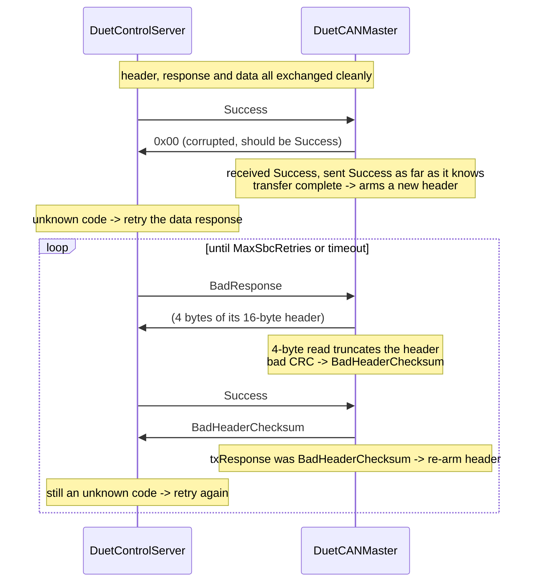

# SPI transfer state machine

This article documents the two state machines that drive one *full transfer* across the SPI link, and
what each side does when the other side desynchronises. It is the detailed companion to the
[SPI transport section](firmware-link.md#spi-transport) of the firmware link article.

- **SBC side** - `src/DuetControlServer/Link/Adapter/SPI.cs` (DuetControlServer, SPI master)
- **Controller side** - `src/DuetCANMaster/src/SBC/DataTransfer.cpp` (DuetCANMaster, SPI slave)

Throughout this article *SBC* means DuetControlServer and *RRF* means DuetCANMaster, matching the
naming used in both sources.

## The two machines are not symmetric

The most important thing to understand before reading the diagrams: **only RRF has an explicit state
machine.** `DataTransfer` stores an `InternalTransferState` enum and `DoTransfer()` is a `switch` over
it, driven by DMA completion interrupts. DCS has no state variable at all - its state is implicit in
the call stack and in nested `for` loops:

```
PerformFullTransfer()            retry loop, max MaxSbcRetries
  └─ ExchangeHeader()            retry loop, max MaxSbcRetries
       └─ ExchangeResponse()     single 4-byte exchange, no loop
  └─ ExchangeData()              retry loop, max MaxSbcRetries
       └─ ExchangeResponse()
       └─ ExchangeDataResponse() single exchange, no loop - any
                                 unexpected code restarts the transfer
```

This asymmetry explains most of the recovery behaviour below. DCS can *unwind* (return `false`, throw)
and pick up at a known point; RRF can only ever set its next state and re-arm the DMA, so it has to
encode "what should happen next" in an extra state - `Resetting` means "we are clocking out
`BadResponse`, restart afterwards".

## Wire vocabulary

A full transfer is up to four sub-exchanges, each gated by a rising edge on the `TfrRdy` pin:

| # | Sub-exchange | Size | Contents |
| - | ------------ | ---- | -------- |
| 1 | Header | 16 bytes (12 if protocol < 4) | `TransferHeader` / `SpiTransferHeader` |
| 2 | Header response | 4 bytes | `SpiTransferResponse` |
| 3 | Data | `max(rxLength, txLength)` | packets |
| 4 | Data response | 4 bytes | `SpiTransferResponse` |

Sub-exchanges 3 and 4 are skipped when neither side has data.

Response codes (`TransferResponse.cs` / `SbcMessageFormats.h` - the two definitions agree):

| Code | Value |
| ---- | ----- |
| `Success` | `1` |
| `BadFormat` | `2` |
| `BadProtocolVersion` | `3` |
| `BadDataLength` | `4` |
| `BadHeaderChecksum` | `5` |
| `BadDataChecksum` | `6` |
| `BadResponse` | `0xFEFEFEFE` |

### Detecting a truncated sub-exchange

The SBC drives the clock, so it alone decides how many bytes a sub-exchange carries. DuetCANMaster
samples the RX DMA residual in `disable_spi()`, before the channels are torn down and the count is lost,
and compares it against the length it armed for in `setup_spi()`. A non-zero residual means the SBC
clocked fewer bytes than expected: the two sides disagree about which sub-exchange this was, the DMA is
short by the difference, and the rest of the buffer is stale from the previous exchange. There is
nothing worth parsing, so `DoTransfer()` restarts instead of guessing. The count is reported by `M122`
as `short transfers`.

This is implemented for the XDMAC (SAME70), the only controller DuetCANMaster currently runs on; on
other DMA controllers the check reports nothing outstanding and stays inert.

### The `BadResponse` invariant

> **When either side sends or receives `BadResponse`, both sides restart the whole transfer from a
> header exchange.** There is no state for retrying a response after a `BadResponse`.

This is the rule that keeps the two machines in phase, and it is what most of the recovery edges below
are enforcing. It matters because the sub-exchanges are different sizes: a side that answers a
`BadResponse` with a 4-byte response while its peer has re-armed a 16-byte header will truncate that
header, get `BadHeaderChecksum` back, and repeat forever. Restarting costs one transfer; the
alternative oscillates until the retry limit.

### Headers and responses overlap in the low byte

This is the single most useful fact for reasoning about desynchronisation, because during a desync one
side is exchanging 16-byte headers while the other is exchanging 4-byte responses, and each has to
classify what it got.

Both header structs are byte-identical, starting with `formatCode` (`uint8_t`), `numPackets`
(`uint8_t`), `protocolVersion` (`uint16_t`). The protocol is **little-endian**, so a 4-byte response
code and a header's first `uint32` land on the same bits:

```
byte      0            1            2        3
        formatCode   numPackets   protocolVersion
header  0x5F         nn           07       00        -> uint32 0x0007nn5F
Success 0x01         0x00         0x00     0x00      -> uint32 0x00000001
```

Two consequences, and they are not symmetric:

- **A header can always be recognised in a response slot.** Its `uint32` is `0x0007nn5F`, whose low
  byte is the format code. No response code aliases that, so `(value & 0xFF) == FormatCode` is an exact
  test for "the peer sent a header". Both sides now simply restart on any unexpected code, which covers
  the header case without needing the test - but it is what makes that restart provably correct rather
  than a guess.
- **A response in a header slot is recognisable only by the format code.** The discriminating part of
  a response code sits in `formatCode`, and its zero upper bytes sit in `protocolVersion`. Checking
  the format code is therefore the *only* safe gate, and it must happen before any other header field
  is read - see [Finding 1](#finding-1-fixed-a-stray-response-was-accepted-as-a-header).

## SBC side (DuetControlServer)



Every transition into `ExchangingHeader`, `ExchangingData` or a response exchange first calls
`WaitForTransfer()`, which blocks on a `TfrRdy` rising edge. A timeout there throws
`OperationCanceledException`, which `PerformFullTransfer` catches and turns into `Connection reset`.
Timeouts are therefore possible from *every* state and are omitted from the diagram for clarity.

## Controller side (DuetCANMaster)



`RestartTransfer(ownRequest)` is the shared helper behind several of those edges, and it now has only
two outcomes, both of which end at `ExchangingHeader`:

- `ownRequest == true` (**we** are unhappy): always clock out `BadResponse` via `Resetting`, then
  re-arm the header. It used to do this only when data was in flight and otherwise restart silently,
  which meant the SBC could not tell a restart from a stall. Announcing every self-initiated restart is
  what lets the SBC restart in step - see [Finding 5](#finding-5-fixed-a-restart-was-not-always-announced).
- `ownRequest == false` (**the SBC** is unhappy): re-arm the header exchange, unconditionally. No
  `BadResponse` is sent, because one was just received.

`ExchangingDataResponseRetry` and `ResettingDataResponse` used to sit on those paths - the first
answered `Success` from `ExchangingHeader` to let an SBC that missed a data response see it after all,
the second resent `Success` after a `BadResponse`. Both violated the
[`BadResponse` invariant](#the-badresponse-invariant), both kept RRF on a 4-byte response while the SBC
wanted a 16-byte header, and both are gone.

## Happy path



## Transition tables

These are the per-state truth tables the diagrams are drawn from. "Peer sends" is what the *other*
side actually clocked onto the wire, which during a desync is not necessarily what this side expects.

### SBC in `ExchangingHeader`

| Peer sends | DCS does |
| ---------- | -------- |
| Header, CRC ok | send `Success` -> `ExchangingHeaderResponse` |
| Header, CRC bad | send `BadHeaderChecksum`, retry on `BadHeaderChecksum` back, else restart |
| Header, format code not `0x5F`/`0x60` | send `BadResponse`, restart the full transfer |
| `BadResponse` | restart the full transfer - RRF always follows a sent `BadResponse` with a header |
| Any other response code | its low byte is not a valid format code, so it is rejected as "not a header": send `BadResponse`, restart ([Finding 1](#finding-1-fixed-a-stray-response-was-accepted-as-a-header)) |

### SBC in `ExchangingHeaderResponse` (sent `Success`)

| Peer sends | DCS does |
| ---------- | -------- |
| `Success` | `ExchangingData`, or `Processing` if neither side has data |
| `BadHeaderChecksum` | retry the header exchange |
| `BadResponse` | restart the full transfer |
| `BadFormat`, `BadProtocolVersion`, `BadDataLength` | **throw** `Exception` - see [Finding 2](#finding-2-three-response-codes-throw-past-performfulltransfers-catch) |
| Any other code | send `BadResponse`, restart the full transfer ([Finding 5](#finding-5-fixed-a-restart-was-not-always-announced)) |

### SBC in `ExchangingData`

| Peer sends | DCS does |
| ---------- | -------- |
| Data, CRC ok | `ExchangingDataResponse` sending `Success` |
| Data, CRC bad | send `BadDataChecksum` -> retry or restart depending on the reply |
| Payload starting with `BadResponse` | restart the full transfer |

### SBC in `ExchangingDataResponse` (sent `Success`)

| Peer sends | DCS does |
| ---------- | -------- |
| `Success` | `Processing` |
| `BadDataChecksum` | resend the data, bounded by `MaxSbcRetries`, then throw |
| `BadResponse` | restart the full transfer |
| Any other code, **including a header** | send `BadResponse` and restart the full transfer. No retry: RRF has typically moved on to a header and will never answer ([Finding 0](#finding-0-fixed-the-data-response-exchange-could-live-lock)) |

### RRF in `ExchangingHeader`

| Peer sends | RRF does |
| ---------- | -------- |
| Header, CRC ok | send `Success` -> `ExchangingHeaderResponse` |
| Header, CRC bad | send `BadHeaderChecksum` |
| Header, bad format code | send `BadFormat` (only reached when the CRC passes) |
| `BadResponse` | `RestartTransfer(false)` -> re-arm the header exchange |
| Any other response code | CRC fails -> send `BadHeaderChecksum` |

### RRF in `ExchangingHeaderResponse`

| Peer sends | RRF does |
| ---------- | -------- |
| `Success` (and we sent `Success`) | `ExchangingData`, or `ProcessingData` if neither side has data |
| `BadHeaderChecksum` (either direction) | `ExchangingHeader` |
| `BadResponse` | `RestartTransfer(false)` -> `ExchangingHeader` |
| Any other code, **including a header** | `RestartTransfer(true)` -> `Resetting` -> send `BadResponse` -> `ExchangingHeader` |

### RRF in `ExchangingData`

| Peer sends | RRF does |
| ---------- | -------- |
| Data, CRC ok | send `Success` |
| Data, CRC bad | send `BadDataChecksum` |
| Payload starting with `BadResponse` | `RestartTransfer(false)` -> `ExchangingHeader` |

### RRF in `ExchangingDataResponse`

| Peer sends | RRF does |
| ---------- | -------- |
| `Success` (and we sent `Success`) | `ProcessingData` |
| `BadDataChecksum` (either direction) | `ExchangingData`, up to `MaxDataResendAttempts`, then `connectionReset` ([Finding 3](#finding-3-fixed-unbounded-data-resend-on-the-controller-side)) |
| `BadResponse` | `RestartTransfer(false)` -> `ExchangingHeader` |
| Any other code, **including a header** | `RestartTransfer(true)` -> `Resetting` -> send `BadResponse` -> `ExchangingHeader` |

## Findings

### Finding 0 (fixed): the data response exchange could live-lock

This is the failure that motivated the fixes, and it has two parts: a **phase slip** that breaks the
designed recovery, and an **oscillation** that the state machines then cannot escape.

#### The phase slip

RRF lowers `TfrRdy` from its SPI interrupt handler. If that only happens once the transfer has *ended*
(on NSS rising), interrupt latency means the pin can still read high after the peripheral has been torn
down but before it has been re-armed. The SBC, seeing a stale high level, clocks the next sub-exchange
into a peripheral that is not listening: the bytes it reads are whatever the previous exchange left
loaded, and RRF's state machine never sees the exchange at all. That **ghost exchange** consumes one
phase on the SBC side only, and from then on the two machines are one sub-exchange apart.

The pin must therefore go **high** in `setup_spi()` (that is the arming signal - lowering it there would
mean the SBC never reliably sees it) and **low as soon as the transfer starts**, which on the SAME70 is
the `TDRE`-with-CS-asserted branch of the handler. `disable_spi()` lowers it again as a backstop in case
the interrupt has not run. A truncated ghost exchange that slips through anyway is now caught directly
by the [residual DMA check](#detecting-a-truncated-sub-exchange).

This is why the recovery that *should* handle a corrupted data response does not fire. RRF completes
the transfer, arms a header, and waits; the SBC sends `BadResponse`; RRF - had it received it - would
answer `Success` and let the SBC complete the transfer too. The ghost exchange swallows that
`BadResponse`, so RRF is still arming its header when the SBC moves on, and the phases never line up
again.

#### The oscillation

Once out of phase, the old code could not recover:



The two sides resonate. DCS alternates `Success` / `BadResponse` on a 4-byte exchange; RRF alternates
"arm a 16-byte header" / "answer `BadHeaderChecksum`". Both have period two and are permanently out of
phase, so neither makes progress. It ends only when DCS exhausts `MaxSbcRetries` (3 by default) and
resets the connection.

There is a second oscillation of the same shape. RRF only ever sends `BadResponse` from
`RestartTransfer(true)`, which goes `Resetting` -> `ExchangeHeader()`: a sent `BadResponse` is *always*
followed by a 16-byte header. DCS, on reading `BadResponse` where it expected a header, used to answer
with a 4-byte data response - truncating that header, drawing `BadHeaderChecksum`, and repeating.

Both are the same bug: **a side kept exchanging 4-byte responses while its peer had moved to a 16-byte
header.** The [`BadResponse` invariant](#the-badresponse-invariant) removes the ambiguity that allowed
it. `BadResponse` now means "restart from a header" on both sides, with no exceptions, so after any
`BadResponse` both machines are exchanging headers and re-synchronise in a single step.

Concretely: DCS's `ExchangeHeader` restarts the full transfer instead of retrying the data response;
DCS's `ExchangeDataResponse` restarts on any unexpected code instead of looping (its retry loop is now
dead and gone); RRF's `RestartTransfer(false)` re-arms a header unconditionally; and RRF's
`ExchangingDataResponse` restarts rather than resending `Success`.

The cost is one lost transfer per event. The recovery that `ExchangingDataResponseRetry` used to
provide - RRF re-sending `Success` so a desynchronised SBC could still complete the transfer - is gone,
so a corrupted data response now costs a restart and, because DCS resends sequence *N* while RRF has
already recorded *N*, usually a connection reset via `IsConnectionReset()`. That is a deterministic
one-off instead of an oscillation that burns every retry and resets anyway.

### Finding 1 (fixed): a stray response was accepted as a header

`ExchangeHeader()` only rejected format codes `0x00` and `0xFF`:

```csharp
if (_rxHeader.FormatCode == 0 || _rxHeader.FormatCode == 0xFF)
```

Because a response code's discriminating byte lands in `FormatCode`, every code from `Success` (1) to
`BadDataChecksum` (6) put `0x01`..`0x06` there and sailed through as a plausible header.
(`BadResponse` = `0xFEFEFEFE` is caught earlier; the corrupted `0x00` in Finding 0 was caught here,
which is why that trace restarts rather than misparsing.)

What followed was worse than a wasted round trip. The protocol-version check runs **before** the header
CRC is verified, and a response code's upper two bytes - which land on `ProtocolVersion` - are zero:

```csharp
ushort lastProtocolVersion = _txHeader.ProtocolVersion;
if (_rxHeader.ProtocolVersion != lastProtocolVersion &&
    (_rxHeader.ProtocolVersion <= Consts.ProtocolVersion || _settings.UpdateOnly))
{
    _txHeader.ProtocolVersion = _rxHeader.ProtocolVersion;   // adopts 0, no CRC check yet
```

`0 != 7` and `0 <= 7`, so DCS downgraded **its own** TX header to protocol version 0. On the next
iteration `_txHeader.ProtocolVersion >= 4` is false, so DCS exchanged **12 bytes with CRC16** while RRF
always exchanges 16 with CRC32 - a self-inflicted downgrade that leaves the two sides disagreeing about
the size of every subsequent header, triggered by a single stray response.

The fix is to gate on the format code positively: it must be `0x5F` or `0x60`, or the buffer is not a
header and no field in it may be trusted. That is exactly what the little-endian overlap makes
possible, and it keeps version negotiation intact - the version is still read before the CRC, but now
only from something that really is a header.

### Finding 2: three response codes throw past `PerformFullTransfer`'s catch

`BadFormat`, `BadProtocolVersion` and `BadDataLength` are handled with `throw new Exception(...)`.
`PerformFullTransfer` only catches `OperationCanceledException`, so these escape the retry loop
entirely and propagate to `LinkService`. This is a hard failure, not the timeout the source table
records for this row. **Not changed** - see [open questions](#open-questions).

### Finding 3 (fixed): unbounded data resend on the controller side

RRF's `ExchangingDataResponse` re-armed `ExchangeData()` on every `BadDataChecksum` with **no retry
limit**, while DCS bounds the same loop with `MaxSbcRetries` and then resets the connection. RRF would
keep resending data to a peer that had already gone away until its own timeout fired. It now counts
consecutive resends within a transfer (`dataResendAttempts`, reset in `ExchangeHeader()`) and resets the
connection after `MaxDataResendAttempts` (5, deliberately above the SBC's 3 so the SBC's retries are
never cut short).

### Finding 4 (fixed): `RestartTransfer(true)` from `ExchangingDataResponse` had a state/DMA mismatch

```cpp
// ExchangingDataResponse, unexpected response code
RestartTransfer(true);
state = InternalTransferState::ResettingDataResponse;
```

`RestartTransfer(true)` used to branch on `rxHeader.dataLength > 0 || txPointer > 0`. The `else` branch
called `ExchangeHeader()`, which arms a 16-byte header DMA and sets `state = ExchangingHeader` - and
then the line above **overwrote that state** with `ResettingDataResponse`, leaving the state describing
a 4-byte response exchange while the DMA was armed for a 16-byte header.

Both halves are now gone: `ResettingDataResponse` no longer exists, and `RestartTransfer(true)` has no
`else` branch to disagree with. See [Finding 5](#finding-5-fixed-a-restart-was-not-always-announced).

### Finding 5 (fixed): a restart was not always announced

`RestartTransfer(true)` means "we have decided to abandon this transfer". It used to send `BadResponse`
only when data was in flight (`rxHeader.dataLength > 0 || txPointer > 0`) and otherwise restart
silently, rewinding `lastTransferNumber` first. The SBC had a matching shortcut in its header response
exchange: on an unexpected code with no data either way it rewound `_lastTransferNumber` and returned
**success**, completing a transfer whose header response the controller had just rejected.

Both are now unconditional: each side sends `BadResponse` and restarts. That makes the
[`BadResponse` invariant](#the-badresponse-invariant) hold in the header response phase as well as the
data response phase, and it removes two silent divergences - a restart the peer could not observe, and
a "success" that was not one.

The rewinds they removed were doing less than they appear to. On the controller,
`lastTransferNumber = rxHeader.sequenceNumber - 1` was a no-op on the only reachable path:
`StartNextTransfer()` sets `lastTransferNumber` to the sequence number of the *completed* transfer, so
during transfer *N* it already equals *N-1*. Its only real effect was to mask a genuine SBC sequence
jump from `IsConnectionReset()`. On the SBC, the equivalent rewind suppressed `HadReset()` for a
transfer that was reported as successful despite a bad response. Removing them makes reset detection
strictly more honest.

## Corrections to the source state table

Rows below refer to the hand-written table this article was validated against. Everything not listed
was confirmed correct against the code.

| Row | Table said | Code actually does |
| --- | ---------- | ------------------ |
| SBC `ExchangingHeader`, RRF sends a response | *Undefined* | Was deterministic but harmful; now rejected by the format code gate - see [Finding 1](#finding-1-fixed-a-stray-response-was-accepted-as-a-header) |
| SBC `ExchangingResponse`, RRF sends a response | Timeout | Depends on the code: `BadFormat`/`BadProtocolVersion`/`BadDataLength` throw ([Finding 2](#finding-2-three-response-codes-throw-past-performfulltransfers-catch)); `BadHeaderChecksum` retries; anything else now always sends `BadResponse` and restarts ([Finding 5](#finding-5-fixed-a-restart-was-not-always-announced)) |
| SBC `ExchangingResponse` `Success` / RRF `Success` | `ExchangingData` | `ExchangingData`, or `Processing` when neither side has data |
| RRF `ExchangingResponse`, SBC sends header | *Undefined*, `rxHeader` stale | Deterministic: `RestartTransfer(true)`, which now always sends `BadResponse`. `rxHeader` is **current**, not stale - it was received and validated during this transfer's header exchange |
| RRF `ExchangingResponse` `Success` / SBC `Success` | `ExchangingHeader` or `ExchangingData` | `ExchangingData`, or `ProcessingData` when neither side has data |
| SBC `ExchangingDataResponse`, RRF `BadResponse` | "unless state was `ExchangingDataResponse` then `Success`" | The old `RestartTransfer(false)` branch keyed on `state != ExchangingHeader`, so the exception was `ExchangingHeader`, not `ExchangingDataResponse`. That branch is now gone: `BadResponse` always restarts |
| RRF `ExchangingDataResponse`, SBC sends a response | ... "`ExchangingHeader` (otherwise)" | That branch was unreachable, and buggy if reached - see [Finding 4](#finding-4-fixed-restarttransfertrue-from-exchangingdataresponse-had-a-statedma-mismatch) |

The two rows marked "would be treated as a generic response" are **confirmed**, and for a stronger
reason than the table gives: a header's first `uint32` is `0x0007nn5F`, which cannot alias any response
code, so the classification is guaranteed rather than incidental. That guarantee is what both header
sniffs rely on.

## Open questions

The controller now checks that the SBC clocked as many bytes as it armed for
([residual DMA check](#detecting-a-truncated-sub-exchange)), which catches the size-distinguishable
desyncs directly. Two things are deliberately left alone:

- **[Finding 2](#finding-2-three-response-codes-throw-past-performfulltransfers-catch)** is unchanged.
  Turning those into `OperationCanceledException` would make them reset the connection and retry
  forever, which is not obviously better than failing loudly for what is a genuine incompatibility.
- **A no-data transfer can still cost a connection reset.** If the SBC's header response reaches the
  controller corrupted but the controller's reaches the SBC intact, the SBC completes transfer *N* while
  the controller restarts it. With data, the controller's `BadResponse` lands at the head of what the SBC
  thinks is a payload and both recover. Without data there is no such exchange, so the sequence numbers
  diverge by one and `IsConnectionReset()` correctly reports it. No check can prevent this - the SBC's
  information was complete and correct at the time. The controller could be taught to tolerate the skip
  (a no-data transfer carries nothing, so losing it costs nothing), at the price of weakening genuine
  reset detection in that window.

## See also

- [Firmware link](firmware-link.md) - the layer above these state machines
- `src/DuetCANMaster/docs/devel/SBC_INTERFACE.md` - controller-side interface overview
